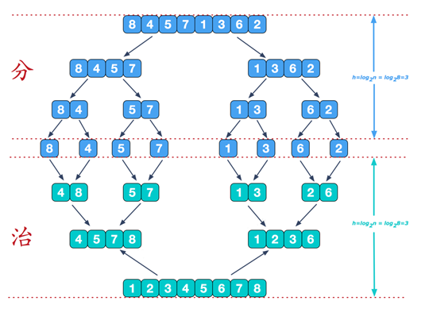
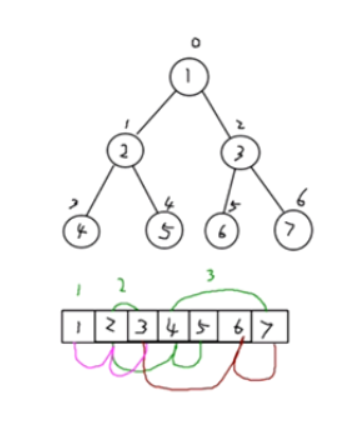
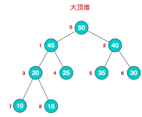
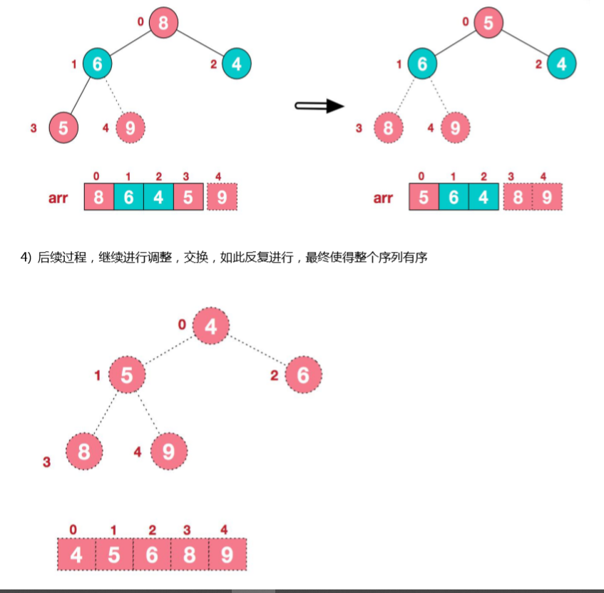

[TOC]
# 尚硅谷——Java数据结构

## 1 稀疏数组与队列

### 1.1 稀疏数组

#### 1.1.1 基本介绍

> 当一个数组中大部分元素为0，或者为相同值的一个数组时，可以使用稀疏数组来保存该数组。
>
> 稀疏数组处理方式：
>
> 1）记录数组一共有几行几列，有多少个不同的值。
>
> 2）把具有不通知的元素的行列及值记录在一个小规模数组中，从而缩小数组的规模。
>
> 
>
> 稀疏数组：稀疏数组的第一行是记录该数组的行、列和拥有的数据个数；后面的每一行都是记录的对应的数据。

#### 1.1.2 实现思路

> 二维数组转稀疏数组：
>
> 1）遍历 原始二维数组，得到有效数据的个数sum；
>
> 2）根据 sum 个数创建稀疏数组 sparseArr  int\[sum+1][3]；
>
> 3）将二维数组的有效数据存入到稀疏数组中。
>
> 稀疏数组转二维数组：
>
> 1）先读取稀疏数组的第一行，根据第一行的数据，创建原始数组， chessArr  int\[6]\[7]
>
> 2）在读取稀疏数组后几行的数据，并赋值给原始的二维数组即可。

#### 1.1.3 实现代码

```java
package com.data.structure;

public class SpareArr {

    /**
     * 创建一个二维数组
     * @return
     */
    public static int[][] createArrs() {
        int[][] arrs = new int[11][11];
        arrs[1][2] = 1;
        arrs[2][3] = 2;
        return arrs;
    }

    /**
     * 得到二维数组的长度
     * @param arrs
     * @return
     */
    public static int getNum(int[][] arrs) {
        int num = 0;
        for (int[] arr : arrs) {
            for (int i : arr) {
                if (i != 0) {
                    num++;
                }
            }
        }
        return num;
    }

    /**
     * 二维数组转换为稀疏数组
     */
    public static int[][] toParseArr() {
        int row = 1;
        int[][] arrs = createArrs();
        int num = getNum(arrs);
        int[][] sparseArrs = new int[num + 1][3];
        //为稀疏数组赋值第一行的数据
        sparseArrs[0][0] = arrs.length;
        sparseArrs[0][1] = arrs[0].length;
        sparseArrs[0][2] = num;
        //将非零数据存入到稀疏数组中进行保存
        for (int i = 0; i < arrs.length; i++) {
            for (int j = 0; j < arrs[i].length; j++) {
                if (arrs[i][j] != 0) {
                    sparseArrs[row][0] = i;
                    sparseArrs[row][1] = j;
                    sparseArrs[row][2] = arrs[i][j];
                    row++;
                }
            }
        }
        return sparseArrs;
    }

    public static int[][] tochessArr(int[][] pareseArrs) {
        int[][] arrs = new int[pareseArrs[0][0]][pareseArrs[0][1]];
        for (int i = 1; i < pareseArrs.length; i++) {
            arrs[pareseArrs[i][0]][pareseArrs[i][1]] = pareseArrs[i][2];
        }
        return arrs;
    }

    public static void main(String[] args) {
        int[][] parseArr = toParseArr();
        tochessArr(parseArr);
    }
}
```

### 1.2 队列

#### 1.2.1 基本介绍

> - 队列是一个有序列表，可以使用 `数组`或者 `链表`来实现。
> - 队列遵循 `先入先出`的原则。即：县存入队列的数据，要先取出；后存入队列的数据要后取出。

#### 1.2.2 数组模拟队列

> 创建一个Queue类，其中包含的属性有：
>
> - **`队列数组`**：用于存放队列中的数据。
> - **`maxSize`**：队列最大存放容量。
> - **`front`**：初始值为 -1，当从队列中取出数据，则对应的front数据值发生变化，对应到有队列中数据最前的前一个位置。
> - **`rear`**：初始值为 -1，当往队列中添加数据，则对应的rear数据值发生变化，对应到队列中数据最后的位置。
>
> 

```java
package com.data.structure.queue;

import java.util.Scanner;

/**
 * @author ${张世林}
 * @date 2019/06/05
 * 作用：使用数组实现队列
 */
public class ArrQueue {

    /**
     * 设置队列存放数据的默认最大值
     */
    private int maxSize;

    /**
     * 设置队列的前指针，指向的是队列中第一个元素的前一个元素
     */
    private int front;

    /**
     * 设置队列的后指针，指向的是队列中最后一个元素
     */
    private int rear;

    /**
     * 队列中的存放数据的数组
     */
    private int[] arr;

    /**
     * 创建队列构造器
     */
    public ArrQueue(int maxSize) {
        this.maxSize = maxSize;
        arr = new int[maxSize];
        front = -1;
        rear = -1;
    }

    /**
     * 判断队列是否已满
     * @return
     */
    public boolean isFull() {
        return rear == maxSize - 1;
    }

    /**
     * 当rear与front指向同一个位置，则表示队列为空
     * @return
     */
    public boolean isEmpty() {
        return rear == front;
    }

    /**
     * 添加数据
     * @param num
     */
    public void addQueue(int num) {
        if (isFull()) {
            System.out.println("队列已满，不能添加数据");
            return;
        }
        arr[++rear] = num;
    }

    /**
     * 取出数据
     */
    public int getQueue() {
        if (isEmpty()) {
            System.out.println("队列为空，无法获取数据");
            throw new RuntimeException("队列为空，无法获取数据");
        }
        //如果队列不为空，则front后移
        front++;
        return arr[front];
    }

    /**
     * 遍历Queue
     */
    public void show() {
        if (isEmpty()) {
            System.out.println("队列为空，无法遍历");
        }
        for (int i = 0; i < arr.length; i++) {
            System.out.printf("arr[%d]=%d\n",i,arr[i]);
        }
    }

    /**
     * 显示队列的头数据
     */
    public int headQueue() {
        if (isEmpty()) {
            throw new RuntimeException("队列为空，没有头信息");
        }
        return arr[front + 1];
    }

    public static void main(String[] args) {
        ArrQueue queue = new ArrQueue(3);
        char key = ' ';
        Scanner scanner = new Scanner(System.in);
        boolean loop = true;
        while (loop) {
            System.out.println("s(show)");
            System.out.println("e(exit)");
            System.out.println("a(add)");
            System.out.println("g(get)");
            System.out.println("h(head)");
            //得到输入的第一个字符
            key = scanner.next().charAt(0);
            switch (key) {
                case 's':
                    queue.show();
                    break;
                case 'a':
                    System.out.println("请输入需要加入的一个数：");
                    int val = scanner.nextInt();
                    queue.addQueue(val);
                    break;
                case 'g':
                    try {
                        System.out.println("取出的数据为："+queue.getQueue());
                    } catch (Exception e) {
                        System.out.println(e.getMessage());
                    }
                    break;
                case 'h':
                    try {
                        int headQueue = queue.headQueue();
                        System.out.println("队列头的数据是："+headQueue);
                    } catch (Exception e) {
                        System.out.println(e.getMessage());
                    }
                    break;
                case 'e':
                    scanner.close();
                    loop = false;
                    break;
                default:
                    break;
            }
        }
        System.out.println("程序退出");
    }
}
```

#### 1.2.3 数组环形队列

> 创建一个环形Queue类，其中包含的属性有：
>
> - **`队列数组`**：用于存放队列中的数据。
> - **`maxSize`**：队列最大存放容量。
> - **`front`**：初始值为0；默认指向的是数组中第一个元素的位置。
> - **`rear`**：初始值为0；默认指向的是数组汇总最后一个元素的位置的后一个位置，因为可以做出一个空间作为约定。
>
> 条件判断：
>
> - 当队列满时，条件是 **(rear + 1) % maxSize == front**。
> - 当队列空时，条件是 **rear == front**。
> - 队列中有效的数据个数为 **(rear + maxSize - front) % maxSize**。

```java
package com.data.structure.queue;

import java.util.Scanner;

/**
 * @author ${张世林}
 * @date 2019/06/05
 * 作用：使用数组实现队列
 */
public class ArrAroundQueue {

    private int maxSize;

    //指向队列中的第一个元素，默认初始值为0
    private int front;

    //指向队列中最后一个元素的后一个位置，默认初始值为0
    private int rear;

    private int[] arr;

    /**
     * 创建队列构造器
     */
    public ArrAroundQueue(int maxSize) {
        this.maxSize = maxSize;
        arr = new int[maxSize];
        front = 0;
        rear = 0;
    }

    /**
     * 验证是否已满
     *
     * @return
     */
    public boolean isFull() {
        return (rear + 1) % maxSize == front;
    }

    /**
     * 判断是否为空
     *
     * @return
     */
    public boolean isEmpty() {
        return rear == front;
    }

    /**
     * 添加数据
     *
     * @param num
     */
    public void addQueue(int num) {
        if (isFull()) {
            System.out.println("队列已满，不能添加数据");
            return;
        }
        arr[rear] = num;
        //将rear指针进行后移工作
        rear = (rear + 1) % maxSize;
    }

    /**
     * 取出数据
     */
    public int getQueue() {
        if (isEmpty()) {
            System.out.println("队列为空，无法获取数据");
            throw new RuntimeException("队列为空，无法获取数据");
        }
        //因为front指向的是队列的第一个元素，所以直接可以取出
        int num = arr[front];
        //front进行后移操作
        front = (front + 1) % maxSize;
        return num;
    }

    /**
     * 遍历Queue
     */
    public void show() {
        if (isEmpty()) {
            System.out.println("队列为空，无法遍历");
        }
        for (int i = front; i < front + size(); i++) {
            System.out.printf("arr[%d]=%d\n", (i % maxSize), arr[i % maxSize]);
        }
    }

    /**
     * 获取当前队列中有效数据的个数
     */
    public int size() {
        return (rear + maxSize - front) % maxSize;
    }

    /**
     * 显示队列的头数据
     */
    public int headQueue() {
        if (isEmpty()) {
            throw new RuntimeException("队列为空，没有头信息");
        }
        return arr[front];
    }

    public static void main(String[] args) {
        ArrAroundQueue queue = new ArrAroundQueue(3);
        char key = ' ';
        Scanner scanner = new Scanner(System.in);
        boolean loop = true;
        while (loop) {
            System.out.println("s(show)");
            System.out.println("e(exit)");
            System.out.println("a(add)");
            System.out.println("g(get)");
            System.out.println("h(head)");
            //得到输入的第一个字符
            key = scanner.next().charAt(0);
            switch (key) {
                case 's':
                    queue.show();
                    break;
                case 'a':
                    System.out.println("请输入需要加入的一个数：");
                    int val = scanner.nextInt();
                    queue.addQueue(val);
                    break;
                case 'g':
                    try {
                        System.out.println("取出的数据为：" + queue.getQueue());
                    } catch (Exception e) {
                        System.out.println(e.getMessage());
                    }
                    break;
                case 'h':
                    try {
                        int headQueue = queue.headQueue();
                        System.out.println("队列头的数据是：" + headQueue);
                    } catch (Exception e) {
                        System.out.println(e.getMessage());
                    }
                    break;
                case 'e':
                    scanner.close();
                    loop = false;
                    break;
                default:
                    break;
            }
        }
        System.out.println("程序退出");
    }

}
```

### 1.3 链表

> ​	链表（Linked list）是一种常见的基础数据结构，是一种线性表，但是并不会按线性的顺序存储数据，而是在每一个节点里存到下一个节点的指针(Pointer)。
>
> ​	使用链表结构可以克服数组链表需要预先知道数据大小的缺点，链表结构可以充分利用计算机内存空间，实现灵活的内存动态管理。但是链表失去了数组随机读取的优点，同时链表由于增加了结点的指针域，空间开销比较大。其存储结构如下：
>
> 
>
> ​	链表的特征如下：
>
> - 链表是以节点的方式进行存储,，是链式存储；
> - 每一个节点包含data域：存放数据，next域：存放下一个节点地址；
> - 链表在各个节点不一定是连续存储的操作。
> - 链表分带头结点的链表和没有带头结点的链表。

#### 1.3.1 单向、头结点单链表	

​	添加方式一：这是一个单向链表，具有头结点，添加节点是按照添加节点的时间先后顺序进行添加操作。

​	添加方式二：这是一个单向链表，具有头结点，添加节点是data域中的数据进行排序以后插入到链表中。

```java
package linked;

/**
 * @author ${张世林}
 * @date 2019/06/10
 * 作用：单向的、带有头结点的、按照添加顺序加入链表的 单链表
 */
public class LinkedListDemo {

    public static void main(String[] args) {
        HeroNode node1 = new HeroNode(1, "张世林", "林林");
        HeroNode node2 = new HeroNode(2, "田水龙", "水水");
        HeroNode node3 = new HeroNode(3, "王旭", "嘘嘘");
        HeroNode node4 = new HeroNode(4, "杨书平", "杨总");
        LinkedList linkedList = new LinkedList();
        linkedList.addByOrder(node1);
        linkedList.addByOrder(node2);
        linkedList.addByOrder(node4);
        linkedList.addByOrder(node3);
        linkedList.show();

//        linkedList.changeNode(new HeroNode(2, "tom", "house"));
        System.out.println("======================");
        linkedList.deleteNode(5);
        linkedList.show();

    }
}

/**
 * 定义一个单链表
 */
class LinkedList {
    /**
     * 先初始化一个头结点，通常情况下，头结点是不会改变的。
     */
    private HeroNode head = new HeroNode(0, "", "");

    /**
     * 添加节点方式一：直接将节点添加到链表最后位置处
     * 步骤：
     * 1. 找到当前链表的最后的一个节点
     * 2. 将最后的一个节点的next指向 新的节点
     */
    public void addByLast(HeroNode heroNode) {
        //创建一个辅助节点，用于遍历该链表
        HeroNode temp = this.head;
        //遍历链表，一直到链表的最后
        while (true) {
            //如果temp这个辅助节点一直指向了最后一个节点，则将会跳出循环。
            if (temp.next == null) {
                break;
            }
            temp = temp.next;
        }
        //将temp.next指向新的节点
        temp.next = heroNode;
    }

    /**
     * 添加节点方式二：遍历链表数据，在数据合适的位置插入该节点。
     * 步骤：
     * 1. 找到该新的节点需要在链表的对应位置处。
     * 2. 将该位置的前一个节点的next指向新节点，新节点的next指向该位置的后一个节点
     */
    public void addByOrder(HeroNode heroNode) {
        HeroNode temp = this.head;
        boolean addSuccess = false;
        while (temp.next != null) {
            if (temp.no < heroNode.no && temp.next.no >= heroNode.no) {
                heroNode.next = temp.next;
                temp.next = heroNode;
                addSuccess = true;
            }
            temp = temp.next;
        }
        if (!addSuccess) {
            temp.next = heroNode;
        }
    }

    /**
     * 判断当前链表是否为空
     * @return
     */
    public boolean isEmpty() {
        return head.next == null;
    }

    /**
     * 遍历链表数据
     */
    public void show() {
        if (isEmpty()) {
            System.out.println("链表为空，无法进行遍历");
            return;
        }
        HeroNode temp = head.next;
        while (true) {
            if (temp == null) {
                System.out.println("链表遍历完成");
                break;
            }
            //将temp输出
            System.out.println(temp);
            temp = temp.next;
        }
    }

    /**
     * 根据id删除链表中的一个节点
     */
    public void deleteNode(int no) {
        HeroNode temp = this.head;
        while (true) {
            if (temp.next == null) {
                System.out.printf("未查到no=%d的数据，删除失败。\n",no);
                break;
            }
            if (temp.next.no == no) {
                temp.next = temp.next.next;
                System.out.println("删除对应的节点成功");
                return;
            }
            temp = temp.next;
        }
    }

    /**
     * 修改一个节点的数据
     */
    public void changeNode(HeroNode newHeroNode) {
        HeroNode temp = this.head;
        while (true) {
            if (temp == null) {
                System.out.printf("未查到no=%d的数据，修改失败。\n",newHeroNode.no);
                break;
            }
            if (temp.no == newHeroNode.no) {
                temp.name = newHeroNode.name;
                temp.nickName = newHeroNode.nickName;
                System.out.printf("修改no=%d的数据成功。\n",newHeroNode.no);
                return;
            }
            temp = temp.next;
        }
    }
}

/**
 * 定义一个节点
 */
class HeroNode {
    //id
    public int no;
    //姓名
    public String name;
    //昵称
    public String nickName;
    //下一个节点
    public HeroNode next;

    //创建一个节点的构造器
    public HeroNode(int no, String name, String nickName) {
        this.name = name;
        this.no = no;
        this.nickName = nickName;
    }

    @Override
    public String toString() {
        return "HeroNode{" +
                "no=" + no +
                ", name='" + name + '\'' +
                ", nickName='" + nickName + '\'' +
                '}';
    }
}
```

#### 1.3.2 单链表面试题

##### 1.3.2.1 单链表的反转

> 实现思路：
>
> 1. 首先先定义一个节点 reverseHead = new HeroNode();
> 2. 从头到尾遍历原来的链表，每遍历一个节点，就将其取出，放置到 reverseHead 链表的最前端。
> 3. 使用  head.next = reverseHead.next;

```java
    /**
     * 单链表的反转
     *  思路：
     *      1. 首先先定义一个节点 reverseHead = new HeroNode();
     *      2. 从头到尾遍历原来的链表，每遍历一个节点，就将其取出，放置到 reverseHead 链表的最前端。
     *      3. 使用  head.next = reverseHead.next;
     */
    public void reverseLinkedList() {
        //创建一个新链表的头结点
        HeroNode reverseNode = new HeroNode(1, "", "");
        //遍历原始链表
        HeroNode temp = this.head.next;
        //创建一个节点对象，其作用是用于保存 原始链表指向的当前节点的下一个节点
        HeroNode defaultNextNode = null;
//方式一：        
        //循环遍历原始链表
        while (temp != null) {
            //首先先将原数据的下一个节点地址保存在这个变量中
            defaultNextNode = temp.next;
            //将temp的下一个节点指向新的链表的最前端
            temp.next = reverseNode.next;
            //将temp连接到新的链表中
            reverseNode.next = temp;
            //让temp继续回到原始链表
            temp = defaultNextNode;
        }
        head.next = reverseNode.next;
        
//方式二：        
//        int size = size();
//        for (int i = 0; i < size; i++) {
//            //首先先将原数据的下一个节点地址保存在这个变量中
//            defaultNextNode = temp.next;
//            //将temp的下一个节点指向新的链表的最前端
//            temp.next = reverseNode.next;
//            //将temp连接到新的链表中
//            reverseNode.next = temp;
//            //让temp继续回到原始链表
//            temp = defaultNextNode;
//        }
//        head.next = reverseNode.next;
    }

```

#### 1.3.3 双向、头结点链表

```java
package doublelinked;

/**
 * @author ${张世林}
 * @date 2019/06/11
 * 作用：
 */
public class DoubleLinkedListDemo {

    public static void main(String[] args) {
        DobuleLinkedList linkedList = new DobuleLinkedList();
        HeroNode node1 = new HeroNode(1, "张世林", "林林");
        HeroNode node2 = new HeroNode(2, "田水龙", "水水");
        HeroNode node3 = new HeroNode(3, "王旭", "嘘嘘");
        HeroNode node4 = new HeroNode(4, "杨书平", "杨总");
//        linkedList.addByLast(node1);
//        linkedList.addByLast(node2);
//        linkedList.addByLast(node3);
//        linkedList.addByLast(node4);
        linkedList.addByOrder(node1);
        linkedList.addByOrder(node2);
        linkedList.addByOrder(node4);
        linkedList.addByOrder(node3);
//        linkedList.changeNode(new HeroNode(35, "ttt","yyy"));
        linkedList.show();
//        linkedList.delNode(7);
//        linkedList.show();
    }
}

class DobuleLinkedList {

    private HeroNode head = new HeroNode(0, "", "");

    public HeroNode getHead() {
        return head;
    }

    /**
     * 在双向链表的末尾添加节点
     * @param heroNode
     */
    public void addByLast(HeroNode heroNode) {
        HeroNode temp = this.head;
        while (temp.next != null) {
            temp = temp.next;
        }
        heroNode.pre = temp;
        temp.next = heroNode;
    }

    public void addByOrder(HeroNode heroNode) {
        HeroNode temp = this.head;
        boolean addSuccess = false;
        while (temp.next != null) {
            if (heroNode.no > temp.no && heroNode.no <= temp.next.no) {
                heroNode.next = temp.next;
                heroNode.pre = temp.next.pre;
                temp.next.pre = heroNode;
                temp.next = heroNode;
                addSuccess = true;
                break;
            }
            temp = temp.next;
        }
        if (!addSuccess) {
            temp.next = heroNode;
            heroNode.pre = temp;
        }
    }

    /**
     * 修改双向链表节点信息
     */
    public void changeNode(HeroNode node) {
        if (isEmpty()) {
            System.out.println("双向链表为空，无法进行修改操作");
            return;
        }
        boolean changeSuccess = false;
        HeroNode temp = this.head;
        while (temp.next != null) {
            temp = temp.next;
            if (temp.no == node.no) {
                temp.name = node.name;
                temp.nickName = node.nickName;
                changeSuccess = true;
                break;
            }
        }
        if (!changeSuccess) {
            System.out.println("未查找到对应的节点数据");
        } else {
            System.out.println("修改节点成功");
        }
    }

    /**
     * 删除双向链表中的节点
     */
    public void delNode(int no) {
        HeroNode temp = this.head.next;
        boolean findSuccess = false;
        while (true) {
            if (temp == null) {
                break;
            }
            if (temp.no == no) {
                findSuccess = true;
                break;
            }
            temp = temp.next;
        }
        if (findSuccess) {
            temp.pre.next = temp.next;
            if (temp.next != null) {
                temp.next.pre = temp.pre;
            }
            System.out.println("删除成功");
        } else {
            System.out.println("未查找到对应的节点，删除失败");
        }
    }


    /**
     * 判断链表是否为空
     */
    public boolean isEmpty() {
        return head.next == null;
    }

    /**
     * 遍历双向链表的方法
     */
    public void show() {
        if (isEmpty()) {
            System.out.println("双向链表中不存在节点，无法进行遍历");
            return;
        }
        HeroNode temp = this.head;
        while (temp.next != null) {
            temp = temp.next;
            System.out.println(temp);
        }
    }

}

/**
 * 定义一个双向节点
 */
class HeroNode {
    //id
    public int no;
    //姓名
    public String name;
    //昵称
    public String nickName;
    //下一个节点
    public HeroNode next;
    //前一个节点
    public HeroNode pre;

    //创建一个节点的构造器
    public HeroNode(int no, String name, String nickName) {
        this.name = name;
        this.no = no;
        this.nickName = nickName;
    }

    @Override
    public String toString() {
        return "HeroNode{" +
                "no=" + no +
                ", name='" + name + '\'' +
                ", nickName='" + nickName + '\'' +
                '}';
    }
}
```

#### 1.3.4 单向环形链表——约瑟夫问题

单向环形链表：

> 构建一个环形链表思路：
>
> 1. 先创建第一个节点，让first指针指向该节点，并将其自身相连组成一个环状。
> 2. 创建一个辅助指针，用于指向该环形链表的最后添加的位置。
> 3. 后面每创建一个新的节点，就把该节点，加入到已有的环形链表中，然后变种辅助指针指向该节点。
>
> 便利环形链表：
>
> 1. 首先创建一个辅助指针，指向first位置；
> 2. 然后遍历该环形链表，直到再次到达first位置就结束遍历。

约瑟夫问题：

> 约瑟夫问题描述：
>
> ​	设编号为1，2，...n的n个人围坐一圈，约定编号为k（1 <= k <= n）的人从1开始报数，数到m的那个人出列，它的下一位又从1开始报数，数到m的那个人又出列，依次类推，直到所有的人出列为止，由此产生一个出队编号序列。
>
> 约瑟夫解决思路：
>
> ​	用一个不带头结点的循环链表来处理约瑟夫问题：先构成一个有n个节点的单循环链表，然后由k节点起开始计数，计数到m时，对应节点从链表中删除，让偶再从被删除节点的下一个节点又从1开始计数，直到最后一个节点从链表中删除。

总体代码实现：

```java
package singlecirclelinked;

/**
 * @author ${张世林}
 * @date 2019/06/11
 * 作用：单向环形链表来 解决 约瑟夫问题
 */
public class SingleCircleLinkedListDemo {

    public static void main(String[] args) {
        SingleCircleLinkedList linkedList = new SingleCircleLinkedList();
        linkedList.add(new Node(1));
        linkedList.add(new Node(2));
        linkedList.add(new Node(3));
        linkedList.add(new Node(4));
        linkedList.add(new Node(5));
        linkedList.show();
        System.out.println(linkedList.size());
        System.out.println("=============");
        linkedList.pop(2,3);
    }

}

/**
 * 创建单向环形链表
 */
class SingleCircleLinkedList {

    //创建first节点，用于指向第一个节点
    private Node first = null;
    //创建一个辅助节点，该辅助节点是用于指向最后添加的那个位置的节点
    private Node curNode = null;

    public void add(Node node) {
        if (first == null) {
            first = node;
            first.setNext(first);
            curNode = first;
        } else {
            curNode.setNext(node);
            node.setNext(first);
            curNode = node;
        }
    }

    /**
     * 解决约瑟夫问题
     *      设编号为1，2，...n的n个人围坐一圈，约定编号为k（1 <= k <= n）的人从1开始报数，
     *      数到m的那个人出列，它的下一位又从1开始报数，数到m的那个人又出列，依次类推，
     *      直到所有的人出列为止，由此产生一个出队编号序列。
     * 代码实现步骤：
     *  1. 第一步，先移动对应的节点，让first与curNode节点一起向前移动 k - 1 次
     *  1. 第二步，让first指向该被删除的下一个节点；
     *  2. 第三步，让curNode节点一直跟在first的上一个节点。
     * @param startNo:表示从第几个小孩开始数数
     * @param countNo:表示每一次数多少个数
     */
    public void pop(int startNo, int countNo) {
        //验证数据是否正常
        if (first == null || startNo < 1 || startNo > size() || countNo < 1) {
            System.out.println("链表为空，无法执行出圈操作");
            return;
        }
        //让first与curNode移动到startNO的位置
        for (int i = 0; i < startNo - 1; i++) {
            first = first.getNext();
            curNode = curNode.getNext();
        }
        //让其进行循环出圈的工作
        while (true) {
            //验证first与curNode相同的时候，说明圈中只有一个人
            if (first == curNode) {
                break;
            }
            //进行遍历，遍历完成以后，就是需要出圈的节点
            for (int i = 0; i < countNo - 1; i++) {
                first = first.getNext();
                curNode =curNode.getNext();
            }
            System.out.println("出圈的节点为："+first);
            first = first.getNext();
            curNode.setNext(first);
        }
        System.out.println("最后出圈的节点为："+first);

    }

    /**
     * 获取环形链表的大小
     * @return
     */
    public int size() {
        if (first == null) {
            System.out.println("链表为空，大小为0");
            return 0;
        }
        int num = 1;
        Node temp = this.first.getNext();
        while (true) {
            if (temp != null) {
                if (temp == first) {
                    break;
                }
                num++;
            }
            temp = temp.getNext();
        }
        return num;
    }


    /**
     * 遍历输出
     */
    public void show() {
        if (first == null) {
            System.out.println("链表为空，无法进行遍历");
        }
        Node temp = this.first;
        System.out.println(temp);
        while (temp.getNext() != first) {
            temp = temp.getNext();
            System.out.println(temp);
        }
    }

}

/**
 * 创建节点
 */
class Node {
    //编号
    private int no;
    //指向下一个节点
    private Node next;

    public int getNo() {
        return no;
    }

    public void setNo(int no) {
        this.no = no;
    }

    public Node getNext() {
        return next;
    }

    public void setNext(Node next) {
        this.next = next;
    }

    public Node(int no) {
        this.no = no;
    }

    @Override
    public String toString() {
        return "Node{" +
                "no=" + no +
                '}';
    }
}
```

## 2 栈

### 2.1 基本介绍

> - 栈的英文名称为 stack；
> - 栈是一种 **先入后出（First In Last Out）**的有序列表。
> - 栈是限制线性表中元素插入和删除只能在线性表的同一端进行的一种特殊线性表。允许插入和删除的一端，称为 **栈顶**；固定不变的一段，称为 **栈底**。
> - **最先放入栈中的元素在栈底，最后放入的元素在栈顶**；最先删除在栈顶，最后删除在栈底。

### 2.2 应用场景

> - 子程序的调用：在跳往子程序前，会先将下个指令的地址存到堆栈中，直到子程序执行完后再将地址取出，以回到原来的程序中。   
>
> - 处理递归调用：和子程序的调用类似，只是除了储存下一个指令的地址外，也将参数、区域变量等数据存入堆栈中。
>
> - 表达式的转换[中缀表达式转后缀表达式]与求值(实际解决)。
>
> - 二叉树的遍历。
>
> - 图形的深度优先(depth一first)搜索法。

### 2.3 数组栈实现

#### 2.3.1 实现思路

> - 第一步，创建数组，用于存放数据，设置栈的最大空间值 maxTop；
> - 第二步，定义一个top来表示栈顶，初始化为 -1；
> - 第三步，入栈的操作，当有数据加入到栈时，top++，stack[top]=data;
> - 第四步，出栈的操作，当有数据出栈，则 int value = stack[top];    top--;     return  value;    

#### 2.3.2 代码实现

```java
package stack;

/**
 * @author ${张世林}
 * @date 2019/06/12
 * 作用：
 */
public class ArrayStackDemo {

    public static void main(String[] args) {
        ArrayStack stack = new ArrayStack(4);
        stack.push(1);
        stack.push(2);
        stack.push(3);
        stack.push(4);
        stack.push(5);
        stack.show();
        System.out.println("==================");
        System.out.println(stack.pop());
        System.out.println(stack.pop());
        stack.push(6);
        stack.push(7);
        stack.push(8);
        System.out.println(stack.pop());
    }
}

class ArrayStack {
    /**
     * 栈的最大容量
     */
    private int maxSize;

    /**
     * 数组，用于存放数据
     */
    private int[] stack;

    /**
     * 栈顶的位置，初始值为-1；
     */
    private int top = -1;

    /**
     * 构造器
     * @param maxSize
     */
    public ArrayStack(int maxSize) {
        this.maxSize = maxSize;
        stack = new int[maxSize];
    }

    /**
     * 判断栈是否已满
     * @return
     */
    public boolean isFull() {
        return top == maxSize - 1;
    }

    /**
     * 判断栈是否为空
     * @return
     */
    public boolean isEmpty() {
        return top == -1;
    }

    /**
     * 向栈顶加入数据
     * @param value
     */
    public void push(int value) {
        if (isFull()) {
            System.out.println("栈空间已满，无法添加数据");
            return;
        }
        top++;
        stack[top] = value;
    }

    /**
     * 出栈，将栈顶的数据取出
     * @return
     */
    public int pop() {
        if (top == -1) {
            throw new RuntimeException("栈为空，无法取出数据");
        }
        return stack[top--];
    }

    /**
     * 遍历栈
     */
    public void show() {
        for (int i = top; i >= 0; i--) {
            System.out.println(stack[i]);
        }
    }
}
```

### 2.4 栈的三种表达式

> - **前缀表达式**   
>
>   - 实现方式：从右至左扫描表达式，遇到数字时，将数字压入堆栈中，当遇到运算符时，弹出栈顶的两个数，用运算符对他们做相应的计算操作，并将结果存入到栈中；重复上诉过程即可实现前缀表达式。
>
>   - 例如: (3+4)×5-6 对应的前缀表达式就是 **- × + 3 4 5** **6 ,** 针对前缀表达式求值步骤如下：
>
>     1)从**右至左扫描**，将6、5、4、3压入堆栈
>
>     2)遇到+运算符，因此弹出3和4（3为栈顶元素，4为次顶元素），计算出3+4的值，得7，再将7入栈
>
>     3)接下来是×运算符，因此弹出7和5，计算出7×5=35，将35入栈
>
>     4)最后是-运算符，计算出35-6的值，即29，由此得出最终结果
>
> - **中缀表达式**  
>
>   - 中缀表达式是常见的运算表达式，如 (3+4)*6-5;
>   - 中缀表达式的求值是我们人最熟悉的，但是对计算机来说却不好操作(前面我们讲的案例就能看的这个问题)，因此，在计算结果时，往往会将中缀表达式转成其它表达式来操作(一般转成后缀表达式.)
>
> - **后缀表达式（逆波兰表达式） ** 
>
>   - 后缀表达式又称**逆波兰表达式**,与前缀表达式相似，只是运算符位于操作数之后;
>
>   - 举例说明：(3+4)×5-6 对应的后缀表达式就是 34+5*6-
>
>     1)从左至右扫描，将3和4压入堆栈；
>
>     2)遇到+运算符，因此弹出4和3（4为栈顶元素，3为次顶元素），计算出3+4的值，得7，再将7入栈；
>
>     3)将5入栈；
>
>     4)接下来是×运算符，因此弹出5和7，计算出7×5=35，将35入栈；
>
>     5)将6入栈；
>
>     6)最后是\-运算符，计算出35-6的值，即29，由此得出最终结果

### 2.5 栈的考题

#### 2.5.1 栈实现综合计算器（中缀表达式）

> ​	使用栈来实现对应的算术表达式的计算：
>
> 

代码实现：

```java
package calculator;

/**
 * @author ${张世林}
 * @date 2019/06/14
 * 作用：计算器(计算一个字符串的表达式的值，该计算不包含括号操作)
 * 步骤：
 * 1. 创建索引index，用于遍历表达式，在创建两个栈，数栈和符号栈
 * 2. 如果发现是一个数字，则直接加入到 数栈 中。
 * 3. 如果发现扫描到时一个符号，则：
 *  3.1 如果当前 符号栈 为空，则直接入栈；
 *  3.2 如果当前 符号栈 不为空，则与栈顶符号进行比较：
 *          - 如果当前的操作符的优先级小于或者等于栈中的操作符，就从数栈中取出两个数，符号栈中取出一个数，
 *              进行运算以后将结果存入数栈中，再将当前操作如入符号栈
 *          - 如果当前的操作符的优先级大于栈顶的符号，就直接入符号栈；
 * 4. 当表达式扫描完毕，就顺序的从数栈和符号栈中取出相应的数和符号，并运行。
 * 5. 最后在数栈只有一个数字，就是表达式的结果。
 */
public class Calculator {

    public static void main(String[] args) {
        String expression = "33+20*6-2";
        int length = expression.length();
        ArrayStack numStack = new ArrayStack(10);
        ArrayStack operStack = new ArrayStack(10);
        //用于扫描表达式的位置
        int index = 0;
        //第一个数
        int num1 = 0;
        //第二个数
        int num2 = 0;
        //运算符
        int oper = 0;
        //计算的结果
        int res = 0;
        //将每次扫描得到的char保存到ch中
        char ch = ' ';
        //用于数据的多位数据
        String keepNum = "";
        while (true) {
            ch = expression.substring(index, index + 1).charAt(0);
            //如果是符号
            if (operStack.isOper(ch)) {
                //判断符号栈是否为空
                if (!operStack.isEmpty()) {
                    //栈不为空，比较优先级
                    if (operStack.priority(ch) <= operStack.priority(operStack.peek())) {
                        num1 = numStack.pop();
                        num2 = numStack.pop();
                        oper = operStack.pop();
                        res = numStack.cal(num1, num2, oper);
                        numStack.push(res);
                        operStack.push(ch);
                    } else {
                        operStack.push(ch);
                    }
                } else {
                    //栈为空，将ch存入到栈中
                    operStack.push(ch);
                }
            } else {
                //如果是数字，则直接进入到栈中
                keepNum += ch;
                //如果ch是expression已经是最后一位，则直接入栈
                if (index == length - 1) {
                    numStack.push(Integer.parseInt(keepNum));
                } else {
                    //验证expression的下一位还是符号，则简单入栈
                    if (operStack.isOper(expression.substring(index + 1, index + 2).charAt(0))) {
                        numStack.push(Integer.parseInt(keepNum));
                        keepNum = "";
                    }
                }
            }
            //让index = index + 1
            index = index +1;
            if (index >= length) {
                break;
            }
        }
        //表达式扫描完毕
        while (!operStack.isEmpty()) {
            num1 = numStack.pop();
            num2 = numStack.pop();
            oper = operStack.pop();
            res = numStack.cal(num1, num2, oper);
            numStack.push(res);
        }
        System.out.println("表达式的结果 = "+numStack.pop());
    }

}

class ArrayStack {
    /**
     * 栈的最大容量
     */
    private int maxSize;

    /**
     * 数组，用于存放数据
     */
    private int[] stack;

    /**
     * 栈顶的位置，初始值为-1；
     */
    private int top = -1;

    /**
     * 构造器
     * @param maxSize
     */
    public ArrayStack(int maxSize) {
        this.maxSize = maxSize;
        stack = new int[maxSize];
    }


    /**
     * 判断栈是否已满
     * @return
     */
    public boolean isFull() {
        return top == maxSize - 1;
    }

    /**
     * 判断栈是否为空
     * @return
     */
    public boolean isEmpty() {
        return top == -1;
    }

    /**
     * 向栈顶加入数据
     * @param value
     */
    public void push(int value) {
        if (isFull()) {
            System.out.println("栈空间已满，无法添加数据");
            return;
        }
        top++;
        stack[top] = value;
    }

    /**
     * 出栈，将栈顶的数据取出
     * @return
     */
    public int pop() {
        if (top == -1) {
            throw new RuntimeException("栈为空，无法取出数据");
        }
        return stack[top--];
    }

    /**
     * 遍历栈
     */
    public void show() {
        for (int i = top; i >= 0; i--) {
            System.out.println(stack[i]);
        }
    }

    /**
     * 返回栈顶的元素
     * @return
     */
    public int peek() {
        return stack[top];
    }

    /**
     * 返回运算符的优先级
     * 该优先级是用于确定运算符的执行顺序：可以使用数字来表示
     * 数字越大，优先级越高
     */
    public int priority(int oper) {
        if (oper == '*' || oper == '/') {
            return 1;
        } else if (oper == '+' || oper == '-') {
            return 0;
        } else {
            return -1;
        }
    }

    /**
     * 判断是不是运算符
     */
    public boolean isOper(char val) {
        return val == '+' || val == '-' || val == '*' || val == '/';
    }

    /**
     * 计算方法
     */
    public int cal(int num1, int num2, int oper) {
        int result = 0;
        switch (oper) {
            case '+':
                result = num1 + num2;
                break;
            case '-':
                result = num2 - num1;
                break;
            case '*':
                result = num1 * num2;
                break;
            case '/':
                result = num2 / num1;
                break;
            default:
                break;
        }
        return result;
    }

}
```

#### 2.5.2 逆波兰计数器--后缀表达式

> 问题描述：
>
> 1)输入一个逆波兰表达式(后缀表达式)，使用栈(Stack),计算其结果
>
> 2)支持小括号和多位数整数，因为这里我们主要讲的是数据结构，因此计算器进行简化，只支持对整数的计算。

代码实现：

```java
package poland;

import java.util.ArrayList;
import java.util.List;
import java.util.Stack;

/**
 * @author ${张世林}
 * @date 2019/06/14
 * 作用：逆波兰表达式——后缀表达式
 */
public class PolandNotation {

    public static void main(String[] args) {
        String suffixEcpression = "33 4 + 5 * 6 -";
        List<String> list = getListByString(suffixEcpression);
        int result = calculate(list);
        System.out.println("计算的结果为："+result);
    }

    /**
     * 判断是不是运算符
     */
    public static boolean isOper(String val) {
        return val.equals("+") || val.equals("-") || val.equals("*") || val.equals("/");
    }

    /**
     * 计算方法
     */
    public static int calculate(List<String> list) {
        Stack<String> stack = new Stack<String>();
        int num1 = 0;
        int num2 = 0;
        for (int i = 0; i < list.size(); i++) {
            if (isOper(list.get(i))) {
                num1 = Integer.parseInt(stack.pop());
                num2 = Integer.parseInt(stack.pop());
                int result = cal(num1, num2, list.get(i));
                stack.push(String.valueOf(result));
            } else {
                stack.push(list.get(i));
            }
        }
        return Integer.parseInt(stack.pop());
    }

    /**
     * 计算方法
     */
    public static int cal(int num1, int num2, String oper) {
        int result = 0;
        switch (oper) {
            case "+":
                result = num1 + num2;
                break;
            case "-":
                result = num2 - num1;
                break;
            case "*":
                result = num1 * num2;
                break;
            case "/":
                result = num2 / num1;
                break;
            default:
                break;
        }
        return result;
    }

    /**
     * 将逆波兰表达式，依次将其放置在ArrayList中
     */
    public static List<String> getListByString(String suffixExpression) {
        String[] split = suffixExpression.split(" ");
        List<String> list = new ArrayList<String>();
        for (String str : split) {
            list.add(str);
        }
        return list;
    }

}
```

#### 2.5.3  中缀表达式转后缀表达式

> ​	大家看到，后缀表达式适合计算式进行运算，但是人却不太容易写出来，尤其是表达式很长的情况下，因此在开发中，我们需要将 中缀表达式转成后缀表达式。
>
> 具体步骤如下:
>
> - 初始化两个栈：运算符栈s1和储存中间结果的栈s2；
>
> - 从左至右扫描中缀表达式；
>
> - 遇到操作数时，将其压s2；
>
> - 遇到运算符时，比较其与s1栈顶运算符的优先级：
>   - 如果s1为空，或栈顶运算符为左括号“(”，则直接将此运算符入栈；
>   - 否则，若优先级比栈顶运算符的高，也将运算符压入s1；
>   - 否则，将s1栈顶的运算符弹出并压入到s2中，再次转到(4-1)与s1中新的栈顶运算符相比较；
> - 遇到括号时：
>   - 如果是左括号“(”，则直接压入s1
>   - 如果是右括号“)”，则依次弹出s1栈顶的运算符，并压入s2，直到遇到左括号为止，此时将这一对括号丢弃
>
> - 重复步骤2至5，直到表达式的最右边
>
> - 将s1中剩余的运算符依次弹出并压入s2
>
> - 依次弹出s2中的元素并输出，结果的逆序即为中缀表达式对应的后缀表达式。

```java
package infixtosuffix;

import java.util.ArrayList;
import java.util.List;
import java.util.Stack;

/**
 * @author ${张世林}
 * @date 2019/06/15
 * 作用：将中缀表达式转成后缀表达式
 */
public class InfixToSuffix {

    public static void main(String[] args) {
        //将中缀表达式添加到集合中
        String infixExpression = "(3+14)*5-6";
        List<String> list = toList(infixExpression);
        List<String> calculate = calculate(list);
        System.out.println(calculate);
    }

    /**
     * 将中缀表达式数据填入到集合中
     *
     * @param s
     * @return
     */
    public static List<String> toList(String s) {
        List<String> list = new ArrayList<String>();
        String str;
        char c;
        int i = 0;
        do {
            if ((c = s.charAt(i)) < 48 || (c = s.charAt(i)) > 57) {
                list.add("" + c);
                i++;
            } else {
                str = "";
                while (i < s.length() && (c = s.charAt(i)) >= 48 && (c = s.charAt(i)) <= 57) {
                    str += c;
                    i++;
                }
                list.add(str);
            }
        } while (i < s.length());
        return list;
    }

    /**
     * 将 中缀表达式 切换为 后缀表达式
     * @param list
     * @return
     */
    public static List<String> calculate(List<String> list) {
        Stack<String> operStack = new Stack<String>();
        List<String> list2 = new ArrayList<String>();
        //扫描遍历集合
        for (String item : list) {
            //如果这个是一个数
            if (item.matches("\\d+")) {
                list2.add(item);
            } else if (item.equals("(")) {
                operStack.push(item);
            } else if (item.equals(")")) {
                while (!operStack.peek().equals("(")) {
                    list2.add(operStack.pop());
                }
                //将 ( 进行删除
                operStack.pop();
            } else {
                //当item符号的优先级小于等于operStack栈顶符号的优先级
                while (operStack.size() != 0 && Operation.getValue(operStack.peek()) >= Operation.getValue(item)) {
                    list2.add(operStack.pop());
                }
                //需要将item入栈
                operStack.push(item);
            }
        }
        //将剩下的数据放到集合中
        while (operStack.size() != 0) {
            list2.add(operStack.pop());
        }
        return list2;
    }

}

/**
 * 返回运算符对饮的优先级
 */
class Operation {
    private static int ADD = 1;
    private static int SUB = 1;
    private static int MUL = 2;
    private static int DIV = 2;

    public static int getValue(String opertaion) {
        int result = 0;
        switch (opertaion) {
            case "+":
                result = ADD;
                break;
            case "-":
                result = SUB;
                break;
            case "*":
                result = MUL;
                break;
            case "/":
                result = DIV;
                break;
            default:
                System.out.println("不存在该运算符");
                break;
        }
        return result;
    }

}

```

#### 2.5.4 完整版逆波兰表达式

```java
package reversepolishcalcase;

import java.util.ArrayList;
import java.util.Collections;
import java.util.List;
import java.util.Stack;
import java.util.regex.Pattern;

public class ReversePolishCalCase {

    /**
     * 匹配 + - * / ( ) 运算符
     */
    static final String SYMBOL = "\\+|-|\\*|/|\\(|\\)";

    static final String LEFT = "(";
    static final String RIGHT = ")";
    static final String ADD = "+";
    static final String MINUS = "-";
    static final String TIMES = "*";
    static final String DIVISION = "/";

    /**
     * 加減 + -
     */
    static final int LEVEL_01 = 1;
    /**
     * 乘除 * /
     */
    static final int LEVEL_02 = 2;

    /**
     * 括号
     */
    static final int LEVEL_HIGH = Integer.MAX_VALUE;


    static Stack<String> stack = new Stack<>();
    static List<String> data = Collections.synchronizedList(new ArrayList<String>());

    /**
     * 去除所有空白符
     *
     * @param s
     * @return
     */
    public static String replaceAllBlank(String s) {
        // \\s+ 匹配任何空白字符，包括空格、制表符、换页符等等, 等价于[ \f\n\r\t\v]
        return s.replaceAll("\\s+", "");
    }

    /**
     * 判断是不是数字 int double long float
     *
     * @param s
     * @return
     */
    public static boolean isNumber(String s) {
        Pattern pattern = Pattern.compile("^[-\\+]?[.\\d]*$");
        return pattern.matcher(s).matches();
    }

    /**
     * 判断是不是运算符
     *
     * @param s
     * @return
     */
    public static boolean isSymbol(String s) {
        return s.matches(SYMBOL);
    }

    /**
     * 匹配运算等级
     *
     * @param s
     * @return
     */
    public static int calcLevel(String s) {
        if ("+".equals(s) || "-".equals(s)) {
            return LEVEL_01;
        } else if ("*".equals(s) || "/".equals(s)) {
            return LEVEL_02;
        }
        return LEVEL_HIGH;
    }

    /**
     * 匹配
     *
     * @param s
     * @throws Exception
     */
    public static List<String> doMatch(String s) throws Exception {
        if (s == null || "".equals(s.trim())) {
            throw new RuntimeException("data is empty");
        }
        if (!isNumber(s.charAt(0) + "")) {
            throw new RuntimeException("data illeagle,start not with a number");
        }

        s = replaceAllBlank(s);

        String each;
        int start = 0;

        for (int i = 0; i < s.length(); i++) {
            if (isSymbol(s.charAt(i) + "")) {
                each = s.charAt(i) + "";
                //栈为空，(操作符，或者 操作符优先级大于栈顶优先级 && 操作符优先级不是( )的优先级 及是 ) 不能直接入栈
                if (stack.isEmpty() || LEFT.equals(each)
                        || ((calcLevel(each) > calcLevel(stack.peek())) && calcLevel(each) < LEVEL_HIGH)) {
                    stack.push(each);
                } else if (!stack.isEmpty() && calcLevel(each) <= calcLevel(stack.peek())) {
                    //栈非空，操作符优先级小于等于栈顶优先级时出栈入列，直到栈为空，或者遇到了(，最后操作符入栈
                    while (!stack.isEmpty() && calcLevel(each) <= calcLevel(stack.peek())) {
                        if (calcLevel(stack.peek()) == LEVEL_HIGH) {
                            break;
                        }
                        data.add(stack.pop());
                    }
                    stack.push(each);
                } else if (RIGHT.equals(each)) {
                    // ) 操作符，依次出栈入列直到空栈或者遇到了第一个)操作符，此时)出栈
                    while (!stack.isEmpty() && LEVEL_HIGH >= calcLevel(stack.peek())) {
                        if (LEVEL_HIGH == calcLevel(stack.peek())) {
                            stack.pop();
                            break;
                        }
                        data.add(stack.pop());
                    }
                }
                start = i;    //前一个运算符的位置
            } else if (i == s.length() - 1 || isSymbol(s.charAt(i + 1) + "")) {
                each = start == 0 ? s.substring(start, i + 1) : s.substring(start + 1, i + 1);
                if (isNumber(each)) {
                    data.add(each);
                    continue;
                }
                throw new RuntimeException("data not match number");
            }
        }
        //如果栈里还有元素，此时元素需要依次出栈入列，可以想象栈里剩下栈顶为/，栈底为+，应该依次出栈入列，可以直接翻转整个stack 添加到队列
        Collections.reverse(stack);
        data.addAll(new ArrayList<>(stack));

        System.out.println(data);
        return data;
    }

    /**
     * 算出结果
     *
     * @param list
     * @return
     */
    public static Double doCalc(List<String> list) {
        Double d = 0d;
        if (list == null || list.isEmpty()) {
            return null;
        }
        if (list.size() == 1) {
            System.out.println(list);
            d = Double.valueOf(list.get(0));
            return d;
        }
        ArrayList<String> list1 = new ArrayList<>();
        for (int i = 0; i < list.size(); i++) {
            list1.add(list.get(i));
            if (isSymbol(list.get(i))) {
                Double d1 = doTheMath(list.get(i - 2), list.get(i - 1), list.get(i));
                list1.remove(i);
                list1.remove(i - 1);
                list1.set(i - 2, d1 + "");
                list1.addAll(list.subList(i + 1, list.size()));
                break;
            }
        }
        doCalc(list1);
        return d;
    }

    /**
     * 运算
     *
     * @param s1
     * @param s2
     * @param symbol
     * @return
     */
    public static Double doTheMath(String s1, String s2, String symbol) {
        Double result;
        switch (symbol) {
            case ADD:
                result = Double.valueOf(s1) + Double.valueOf(s2);
                break;
            case MINUS:
                result = Double.valueOf(s1) - Double.valueOf(s2);
                break;
            case TIMES:
                result = Double.valueOf(s1) * Double.valueOf(s2);
                break;
            case DIVISION:
                result = Double.valueOf(s1) / Double.valueOf(s2);
                break;
            default:
                result = null;
        }
        return result;

    }

    public static void main(String[] args) {
        //String math = "9+(3-1)*3+10/2";
        String math = "12.8 + (2 - 3.55)*4+10/5.0";
        try {
            doCalc(doMatch(math));
        } catch (Exception e) {
            e.printStackTrace();
        }
    }

}

```


## 3 递归

### 3.1 基本介绍

> - 递归的思想就是在方法里面调用方 法本身。
>
> - 在使用递归策略时，必须有一个明确的递归结束条件，称为递归出口。
>
> - 递归调用的过程中系统每一层的返回点，局部变量等开辟了栈来存储。递归的次数过多的话，容易造成StackOverFlowerError（栈空间溢出）。
>
> - 执行一个方法时，就创建一个新的受保护的独立空间(栈空间)
>
> - 方法的局部变量是独立的，不会相互影响, 比如n变量
>
> - 如果方法中使用的是引用类型变量(比如数组)，就会共享该引用类型的数据.
>
> - 递归必须向退出递归的条件逼近，否则就是无限递归,出现StackOverflowError，死龟了:)
>
> - 当一个方法执行完毕，或者遇到return，就会返回，遵守谁调用，就将结果返回给谁，同时当方法执行完毕或者返回时，该方法也就执行完毕。
>
> **注意：**   
> 在做递归算法的时候，一定要把我出口，也就是做递归算法必须要有一个明确的递归结束条件，如果符合了这个条件，就结束递归的运行。

### 3.2 递归-迷宫问题

> ​	迷宫问题主要是设计迷宫策略，确定迷宫的执行路径顺序：例如可以设置为 下右上左 的顺序进行判断，如果能走通，就走通，如果无法走通，则进行其他操作。
>
> 

```java
package recursion;

/**
 * @author ${张世林}
 * @date 2019/06/17
 * 作用：迷宫
 */
public class MiGong {

    /**
     * 创建墙壁：使用数字1表示
     *
     * @param args
     */
    public static void main(String[] args) {
        //创建一个二维数组，用于表示迷宫地图
        int[][] map = new int[8][7];
        //创建地图的墙
        for (int i = 0; i < 7; i++) {
            map[0][i] = 1;
            map[7][i] = 1;
        }
        for (int i = 0; i < 8; i++) {
            map[i][0] = 1;
            map[i][6] = 1;
        }
        map[3][1] = 1;
        map[3][2] = 1;

        setWay(map, 1, 1);
        System.out.println("---------------");
        for (int i = 0; i < map.length; i++) {
            for (int j = 0; j < map[i].length; j++) {
                System.out.printf("%d  ", map[i][j]);
            }
            System.out.println();
        }

    }

    /**
     * map表示地图，（i，j）表示从地图的该位置出发
     * 如果小球能够到map的（6,5）位置，则表示找到了通路
     * 约定：当地图的（i，j）为0，则改点未被走过，
     * 当为1的时候，表示是墙，无法通过
     * 当为2的时候，表示可以通过
     * 当为3的时候，表示该位置已经走过，但是无法走通
     * 策略：下右上左
     *
     * @param map 表示地图
     * @param i   从什么位置开始找
     * @param j   从什么位置开始找
     * @return 如果找到了就返回true，否则返回false
     */
    public static boolean setWay(int[][] map, int i, int j) {
        if (map[6][5] == 2) { 
            return true;
        } else {
            if (map[i][j] == 0) { 
                map[i][j] = 2;
                if (setWay(map, i + 1, j)) {
                    //向下走
                    return true;
                } else if (setWay(map, i, j + 1)) {
                    //向右走
                    return true;
                } else if (setWay(map, i - 1, j)) {
                    //向上走
                    return true;
                } else if (setWay(map, i, j - 1)) {
                    //向左走
                    return true;
                } else {
                    map[i][j] = 3;
                    return false;
                }
            } else {
                //如果map(i)(j)!=0
                //则值 1,2,3
                return false;
            }
        }
    }


    /**
     * 策略：执行的是 上右下左  策略
     *
     * @param map
     * @param i
     * @param j
     * @return
     */
    public static boolean setWay3(int[][] map, int i, int j) {
        if (map[6][5] == 2) {
            return true;
        } else {
            if (map[i][j] == 0) {
                map[i][j] = 2;
                if (setWay3(map, i - 1, j)) {
                    return true;
                } else if (setWay3(map, i, j + 1)) {
                    return true;
                } else if (setWay3(map, i + 1, j)) {
                    return true;
                } else if (setWay3(map, i, j - 1)) {
                    return true;
                } else {// 走不通
                    map[i][j] = 3;
                    return false;
                }
            } else {
                return false;
            }
        }
    }

}

```

### 3.3 八皇后问题

> **问题描述：**
>
> ​	国际西洋棋棋手马克斯·贝瑟尔于1848年提出：在8×8格的国际象棋上摆放八个皇后，使其不能互相攻击，即：任意两个皇后都不能处于同一行、同一列或同一斜线上，问有多少种摆法。
>
> **实现过程：**
>
> 1. 第一个皇后先放第一行第一列
>
> 2. 第二个皇后放在第二行第一列、然后判断是否OK， 如果不OK，继续放在第二列、第三列、依次把所有列都放完，找到一个合适
>
> 3. 继续第三个皇后，还是第一列、第二列……直到第8个皇后也能放在一个不冲突的位置，算是找到了一个正确解
>
> 4. 当得到一个正确解时，在栈回退到上一个栈时，就会开始回溯，即将第一个皇后，放到第一列的所有正确解，全部得到.
>
> 5. 然后回头继续第一个皇后放第二列，后面继续循环执行 1,2,3,4的步骤即可。

```java
package queue8;

/**
 * @author ${张世林}
 * @date 2019/06/18
 * 作用：八皇后问题
 * 在8×8格的国际象棋上摆放八个皇后，使其不能互相攻击，
 * 即：任意两个皇后都不能处于同一行、同一列或同一斜线上，问有多少种摆法。
 */
public class Queue8 {

    /**
     * 定义有多少个皇后
     */
    int max = 8;
    /**
     * 定义一个一维数组，用于保存一次8皇后位置的各个点的位置
     */
    int[] array = new int[max];

    private static int count = 0;
    private static int judgeCount = 0;

    public static void main(String[] args) {
        Queue8 queue8 = new Queue8();
        queue8.check(0);
        System.out.println("count = "+ count);
        System.out.println("judgeCount = "+ judgeCount);
    }

    /**
     * 编写一个方法，放置第n个皇后
     *
     * @param n 放置第n个皇后
     */
    private void check(int n) {
        //因为是从0开始计数的，所以当n为max，则表示之前的数据已经放置完成
        if (n == max) {
            print();
            return;
        }
        //依次放入皇后，并判断是否冲突
        for (int i = 0; i < max; i++) {
            judgeCount++;
            //先把当前皇后放置到该行的第一列
            array[n] = i;
            //放置在该位置是否符合要求
            if (judge(n)) {
                //接着放n+1个皇后
                check(n + 1);
            }
            //如果冲突了以后，将在本行中进行后移

        }
    }

    /**
     * 当摆放了第n个皇后的时候，检测该皇后是否与前面已经摆放的皇后冲突
     * @param n 第n个皇后
     */
    private boolean judge(int n) {
        for (int i = 0; i < n; i++) {
            //验证是否在同一列 || 验证是否在同一条斜线上面
            if (array[i] == array[n] || Math.abs(n - i) == Math.abs(array[n] - array[i])) {
                return false;
            }
        }
        return true;
    }

    /**
     * 将皇后摆放的位置进行输出
     */
    private void print() {
        count++;
        for (int i = 0; i < array.length; i++) {
            System.out.print(array[i] + " ");
        }
        System.out.println();
    }


}

```

## 4 排序算法

### 4.1 基本介绍

> ​	排序是将一组数据，依指定的顺序进行排列的过程。排序主要分为：
>
> - **内部排序**：指将需要处理的所有数据都加载到内部存储器中进行排序（也就是将数据加载到内存中）。
> - **外部排序**：当数据量过大，无法将数据全部加载到内存中，所以必须借助外部存储来实现排序。
>
> 

### 4.2 算法复杂度

> - 事后统计方法：对算法的运行性能进行评判，需要在同一台机器的相同状态下运行，比较算法速度。
> - 事前估算方法：衡量一个算法的优劣，是根据算法的时间复杂度来进行判断。

#### 4.2.1 算法时间复杂度

##### 4.2.1.1 时间频度

> 基本介绍 ：一个算法话费的时间与算法种语句的执行次数成正比，哪个算法种语句执行次数多，它话费的时间就越多。**一个算法中的语句执行次数称为语句频度或者时间频度**。

##### 4.2.1.2 时间复杂度

> - 一般情况下，算法中的基本操作语句的重复执行次数是问题规模n的某个函数，用T(n)表示，若有某个辅助函数f(n)，使得当n趋近于无穷大时，T(n) / f(n) 的极限值为不等于零的常数，则称f(n)是T(n)的同数量级函数。记作 T(n)=Ｏ( f(n) )，称Ｏ( f(n) )  为算法的渐进时间复杂度，简称时间复杂度。
>
> - T(n) 不同，但时间复杂度可能相同。 如：T(n)=n²+7n+6 与 T(n)=3n²+2n+2 它们的T(n) 不同，但时间复杂度相同，都为O(n²)。
>
> - 计算时间复杂度的方法：
>
>   - 用常数1代替运行时间中的所有加法常数  T(n)=n²+7n+6  => T(n)=n²+7n+1
>
>   - 修改后的运行次数函数中，只保留最高阶项  T(n)=n²+7n+1 => T(n) = n²
>
>   - 去除最高阶项的系数 T(n) = n² => T(n) = n² => O(n²)

> 常见的时间复杂度：
>
> - 常数阶`O(1)`：无论代码执行了多少行，只要是没有循环等复杂结构，那这个代码的时间复杂度就都是O(1)
>
> - 对数阶`O(log2n)`
>
> - 线性阶`O(n)`：for循环里面的代码会执行n遍，因此它消耗的时间是随着n的变化而变化的，因此这类代码都可以用O(n)来表示它的时间复杂度
>
> - 线性对数阶`O(nlogn)`：线性对数阶O(nlogN) 其实非常容易理解，将时间复杂度为O(logn)的代码循环N遍的话，那么它的时间复杂度就是n *O(logN)，也就是了O(nlogN)
>
> - 平方阶`O(n^2)`
>
> - 立方阶`O(n^3)`
>
> - k次方阶`O(n^k)`
>
> - 指数阶`O(2^n)`
>
> 说明：
>
> ​	常见的算法时间复杂度由小到大依次为：**Ο(1)＜O(log2n) < O(n) < O(nlog2n) < O(n^2) < O(n^3) < O(n^k) < O(2^n)** ，随着问题规模n的不断增大，上述时间复杂度不断增大，算法的执行效率越低。

> 算法的时间复杂度通常采用的是最坏时间复杂度。这样子能够在任何输入实例上运行时间的界限，保证算法的运行时间不会超出该时间。
>
> | 排序法    | 平均时间 | 最差时间         | 稳定度 | 额外空间 | 备注                 |
> | --------- | -------- | ---------------- | ------ | -------- | -------------------- |
> | 冒泡排序  | O(n^2)   | O(n^2)           | 稳定   | O(1)     | n小时比较好          |
> | 交换排序  | O(n^2)   | O(n^2)           | 不稳定 | O(1)     | n小时比较好          |
> | 选择排序  | O(n^2)   | O(n^2)           | 不稳定 | O(1)     | n小时比较好          |
> | 插入排序  | O(n^2)   | O(n^2)           | 稳定   | O(1)     | 大部分已经排序时较好 |
> | 基数排序  | O(logRB) | O(logRB)         | 稳定   | O(n)     | B是真数(0-9)         |
> | Shell排序 | O(nlogn) | O(n^s) 1 < s < 2 | 不稳定 | O(1)     | s是所选分组          |
> | 快速排序  | O(nlogn) | O(n^2)           | 不稳定 | O(nlogn) | n较大时较好          |
> | 归并排序  | O(nlogn) | O(nlogn)         | 稳定   | O(1)     | n较大时较好          |
> | 堆排序    | O(nlogn) | O(nlogn)         | 不稳定 | O(1)     | n较大时较好          |
>
> 
>
> - **n**: 数据规模
> - **k**: “桶”的个数
> - **In-place**:    不占用额外内存
>
> - **Out-place**: 占用额外内存

#### 4.2.2 算法空间复杂度

> - 类似于时间复杂度的讨论，一个算法的空间复杂度(Space Complexity)定义为该算法所耗费的存储空间，它也是问题规模n的函数。
>
> - 空间复杂度(Space Complexity)是对一个算法在运行过程中临时占用存储空间大小的量度。有的算法需要占用的临时工作单元数与解决问题的规模n有关，它随着n的增大而增大，当n较大时，将占用较多的存储单元，例如快速排序和归并排序算法就属于这种情况
>
> - 在做算法分析时，**主要讨论的是时间复杂度**。从用户使用体验上看，更看重的程序执行的速度。一些缓存产品(redis, memcache)和算法(基数排序)本质就是用空间换时间.

### 4.3 冒泡排序

> **1）排序思想：**
>
> 让前面的数与后面的数相比较，进行多轮比较，如果根据需求来进行位置的调换操作。
>
> **2）实现流程：**
>
> 
>
> **3）基本概念：**
>
> ​	一共会经过数组长度n的（n-1）次；每一轮比较就会确定一个数的位置；每一轮比较的次数再逐渐的减少（第一次是比较n-1次，第二次就是比较到n-2次，一直到最后一次的比较即可）。
>
> **4）优化策略：**
>
> ​	在进行冒泡排序的过程中，如果发现有一轮未进行数据的交换操作，则表明该集合中的元素数据已经有序。所以可以设置flag用于标识该轮是否交换了数据，如果未进行数据的交换，则break循环。

```java
public class BubblingSort {

    public static void main(String[] args) {
        int[] arr = {4,2,7,5,3,1,9,6};
        int[] ints = bubblingSort(arr);
        for (int anInt : ints) {
            System.out.println(anInt);
        }
    }

    /**
     * 冒泡排序：
     * @param arr
     * @return
     */
    private static int[] bubblingSort(int[] arr) {
        for (int i = 0; i < arr.length - 1; i++) {
            int temp = 0;
            for (int j = 0; j < arr.length - 1 - i; j++) {
                if (arr[j] > arr[j + 1]) {
                    temp = arr[j];
                    arr[j] = arr[j + 1];
                    arr[j + 1] = temp;
                }
            }
        }
        return arr;
    }
}
```

### 4.4 直接选择排序

> **1）排序思想：**
>
> ​	选择排序（selectsorting）也是一种简单的排序方法。它的**基本思想**是：
>
> - 第一次从arr[0]~arr[n-1]中选取最小值，与arr[0]交换，
> - 第二次从arr[1]~arr[n-1]中选取最小值，与arr[1]交换，
> - 第三次从arr[2]~arr[n-1]中选取最小值，与arr[2]交换，
> - …，
> - 第i次从arr[i-1]~arr[n-1]中选取最小值，与arr[i-1]交换，
> - …,
> - 第n-1次从arr[n-2]~arr[n-1]中选取最小值，与arr[n-2]交换，
> - 总共通过n-1次，得到一个按排序码从小到大排列的有序序列。
>
> **`选择排序效率比冒泡排序效率更高。`**

```java
public class SelectSort {

    public static void main(String[] args) {
        int[] arr = {3,1,5,4,7,9,0};
        int[] ints = selectSort(arr);
        for (int anInt : ints) {
            System.out.println(anInt);
        }
    }

    /**
     * 选择排序
     *
     * @param arr
     * @return
     */
    public static int[] selectSort(int[] arr) {
        int min = 0;
        int index = 0;
        for (int i = 0; i < arr.length - 1; i++) {
            min = arr[i];
            index = i;
            for (int j = i + 1; j < arr.length; j++) {
                if (arr[j] < min) {
                    min = arr[j];
                    index = j;
                }
            }
            if (index != i) {
                arr[index] = arr[i];
                arr[i] = min;
            }
        }
        return arr;
    }
}
```

### 4.5 直接插入排序

> **1）排序思想：**
>
> 再要进行排序的数组中，假设前 n-1 个数据是排好序了的，现在需要将第 n 个元素
>
> **2）实现原理：**
>
> 在排序过程中，先将第一个与第二个数进行排序，变成有序序列以后，再将第三个数进行有序插入，一次向下进行插入排序。这样的排序叫做---直接插入排序。
>
> **3）流程图：**
>
> 
>
> 

```java
package insert;

import java.util.Arrays;

/**
 * @author ${张世林}
 * @date 2019/06/20
 * 作用：直接插入排序
 */
public class InsertSort {

    public static void main(String[] args) {
        int[] arr = {5,3,7,2,8,1,0,6};
        int[] ints = insertSort(arr);
        for (int anInt : ints) {
            System.out.println(anInt);
        }
        System.out.printf(Arrays.toString(ints));
    }

    /**
     * 直接插入排序
     * @param arr
     * @return
     */
    public static int[] insertSort(int[] arr) {
        int temp = 0;
        for (int i = 1; i < arr.length; i++) {
            for (int j = 0; j < i; j++) {
                if (arr[i] < arr[j]) {
                    temp =arr[i];
                    while (i > j) {
                        arr[i] = arr[--i];
                    }
                    arr[j] = temp;
                    break;
                }
            }
        }
        return arr;
    }
    
    /**
     * 方法二：直接使用双层for循环
     * @param arr
     * @return
     */
    public static int[] insertSortEasy(int[] arr) {
        int temp = 0;
        for (int i = 1; i < arr.length; i++) {
            temp = arr[i];
            int j = i;
            for (; j >0 && temp < arr[j - 1];) {
                arr[j] = arr[--j];
            }
            if (j != i) {
                arr[j] = temp;
            }
        }
        return arr;
    }

}

```

### 4.6 希尔排序

> **1）基本思想：**
>
> ​	希尔排序也是一种**插入排序**，它是简单插入排序经过改进之后的一个**更高效的版本**，也称为缩小增量排序。
>
> ​	希尔排序是把记录按下标的一定增量分组，对每组使用直接插入排序算法排序；随着增量逐渐减少，每组包含的关键词越来越多，当增量减至1时，整个文件恰被分成一组，算法便终止。也就是说：根据n的数量来进行除2分组，分组以后进行插入排序的操作；重复此过程，直到被分为1组即可。
>
> **2）流程图：**
>
> 

```java
public class ShellSort {

    public static void main(String[] args) {
        int[] arr = {8,9,1,7,2,3,5,4,6,0};
        exchangeShellSort(arr);
        moveShellSort(arr);
    }

    /**
     * 交换式希尔排序
     *	交换式是验证两个数据的大小，如果大小不同，就将两个数据进行交换的操作
     * @param arr
     * @return
     */
    public static int[] exchangeShellSort(int[] arr) {
        int groupNum = arr.length / 2;
        while (groupNum > 0) {
            int temp = 0;
            for (int i = groupNum; i < arr.length; i++) {
                for (int j = i - groupNum; j >= 0; j -= groupNum) {
                    if (arr[j] > arr[j + groupNum]) {
                        temp = arr[j];
                        arr[j] = arr[j + groupNum];
                        arr[j + groupNum] = temp;
                    }
                }
            }
            groupNum = groupNum / 2;
        }
        return arr;
    }


    /**
     * 移位式希尔排序，效率更高
     *	移位式是判断采用插入排序的方式，判断是否该放置在这个位置，如果可以放置在这个位置，才放下去
     * @param arr
     * @return
     */
    public static int[] moveShellSort(int[] arr) {
        int groupNum = arr.length / 2;
        while (groupNum > 0) {
            for (int i = groupNum; i < arr.length; i++) {
                int j = i;
                int temp = arr[j];
                while (j - groupNum >= 0 && temp < arr[j - groupNum]) {
                    arr[j] = arr[j - groupNum];
                    j -= groupNum;
                }
            }
            groupNum = groupNum / 2;
        }
        return arr;
    }
}
```

### 4.7 快速排序

> **1）基本思想：**
>
> ​	**快速排序（Quicksort）是对冒泡排序的一种改进。**设置关键字，将比关键字小的数据放在一组，比关键字大的放在另外一组中。通常是设置第一个数据为关键字。使用第一个元素作为第一次的分割对象，然后先进行右边的判断，如果右边的数据大于分割值，则 right对象减1，否则的话就行数据的交换操作。依次递归执行，知道left与right相等以后，停止递归操作，得到需要的结果。
>
> **2）示例图：**
>
> 

代码实现一：

```java
public class QuickSort {

	/**
	 * 进行排序的操作，一直到左边与右边重叠以后，停止递归，执行返回操作
	 * @param arr : 需要排序的数组
	 * @param left ：左边的位置
	 * @param right ： 右边的位置
	 * @return ： 排序完成以后的数组对象
	 */
	public static int[] quickSort(int[] arr,Integer left,int right) {
		if (left < right) {
			System.out.println(left.hashCode());
			int position = position(arr, left, right);
			quickSort(arr,left,position-1);
			quickSort(arr,position+1,right);
		}
		return arr;
	}

	/**
	 * 返回分割点，这里的作用主要是得到这个对象分割点以后，来进行排序的操作
	 * @param arr ：数组
	 * @param left ：左边的起点
	 * @param right ：右边的位置
	 * @return
	 */
	public static int position(int[] arr, Integer left, int right) {
		int midea = arr[left];

		while (left < right) {
			while (left < right && arr[right] >= midea) {
				right--;
			}
			swap(arr,left,right);

			while (left < right && arr[left] < midea) {
				left++;
			}
			swap(arr,left,right);
		}
		System.out.println("position中的left："+left.hashCode());
		return left;
	}

	/**
	 * 交换数据，将对应的两个数据进行交换
	 * @param arr
	 * @param left
	 * @param right
	 */
	public static void swap(int[] arr, int left, int right) {
		int temp = arr[right];
		arr[right] = arr[left];
		arr[left] = temp;
	}

	public static void main(String[] args) {
		int[] arr = new int[] { 12, 13, 1, 3, 9, 5, 7, 6, 11 };
		int[] ints = quickSort(arr, 0,arr.length-1);
		for (int anInt : ints) {
			System.out.println(anInt);
		}
	}

}
```

代码实现二：

```java
package quick;

import java.util.Arrays;

/**
 * @author ${张世林}
 * @date 2019/06/20
 * 作用：快速排序
 */
public class QuickSort {

    public static void main(String[] args) {
        int[] arr = {-9, 78, 0, 23, -567, 70};
        quickSort( 0, arr.length - 1,arr);
        System.out.println(Arrays.toString(arr));
    }

    /**
     * 返回分割点，用于得到分割点以后，来进行排序的操作
     *
     * @param arr   数组
     * @param left  左边的位置
     * @param right 右边的位置
     * @return
     */
    public static void quickSort(int left, int right, int[] arr) {
        int l = left;
        int r = right;
        int pivot = arr[(left + right) / 2];
        int temp = 0;
        //while循环是为了让比 pivot 小的值放到左边
        //              让比 pivot 大的值放到右边
        while (l < r) {
            //在pivot的左边一直找，直到找到一个值大于等于pivot
            while (arr[l] < pivot) {
                l += 1;
            }
            //在pivot的右边一直找，直到找到一个值小于等于pivot
            while (arr[r] > pivot) {
                r -= 1;
            }
            //如果 left >= right表明pivot两边的值，已经按照pivot来进行分界成功
            if (l >= r) {
                break;
            }
            //如果条件未满足，则进行交换的操作
            temp = arr[l];
            arr[l] = arr[r];
            arr[r] = temp;
            //如果交换完成以后，发现pivot左边的值与pivot相等，则right--
            if (arr[l] == pivot) {
                r -= 1;
            }
            //如果交换完成以后，发现pivot右边的值与pivot相等，则left++
            if (arr[r] == pivot) {
                l += 1;
            }
        }
        if (l == r) {
            l += 1;
            r -= 1;
        }
        if (left < r) {
            quickSort(left, r, arr);
        }
        if (right > l) {
            quickSort(l, right, arr);
        }
    }


    /**
     * 交换数据，将对应的两个数据进行交换
     *
     * @param arr
     * @param left
     * @param right
     */
    public static void swap(int[] arr, int left, int right) {
        int temp = arr[right];
        arr[right] = arr[left];
        arr[left] = temp;
    }

}

```

### 4.8 归并排序

> **1）基本思想**
>
> - 归并排序（Merge Sort）与快速排序思想类似：将待排序数据分成两部分，继续将两个子部分进行递归的归并排序；然后将已经有序的两个子部分进行合并，最终完成排序。
> - 其时间复杂度与快速排序均为O(nlogn)，但是归并排序除了递归调用间接使用了辅助空间栈，还需要额外的O(n)空间进行临时存储。从此角度归并排序略逊于快速排序.
> - 但是**归并排序是一种稳定的排序算法**，快速排序则不然。
> - 所谓稳定排序，表示对于具有相同值的多个元素，其间的先后顺序保持不变。对于基本数据类型而言，一个排序算法是否稳定，影响很小，但是对于结构体数组，
> - 稳定排序就十分重要。例如对于student结构体按照关键字score进行非降序排序：
>
> **2）图解：**
>
> 首先需要将对应的数据拆分，拆分完成以后再进行合并的操作。
>
> 
>
> 最后一次合并的的详细过程：
>
> 

代码实现：

```java
package merge;

import java.util.Arrays;

/**
 * @author ${张世林}
 * @date 2019/06/24
 * 作用：归并排序
 */
public class MergeSort {

    public static void main(String[] args) {
        int[] arr = {8, 4, 5, 7, 1, 3, 6, 2};
        int[] temp = new int[arr.length];
        mergeSort(arr, 0, arr.length - 1, temp);
        System.out.println(Arrays.toString(arr));
    }

    /**
     * 归并排序---分解的过程
     *
     * @param arr
     * @param left
     * @param right
     * @param temp
     */
    private static void mergeSort(int[] arr, int left, int right, int[] temp) {
        if (left < right) {
            //得到中间值
            int mid = (left + right) / 2;
            //向左递归进行分解
            mergeSort(arr, left, mid, temp);
            //向右递归进行分解
            mergeSort(arr, mid + 1, right, temp);
            //到合并的时候
            merge(arr, left, mid, right, temp);
        }
    }

    /**
     * 归并排序---合并的过程
     *
     * @param arr   排序的原始数组
     * @param left  左边有序序列的初始索引
     * @param mid   中间索引
     * @param right 右边索引
     * @param temp  中转数组
     */
    private static void merge(int[] arr, int left, int mid, int right, int[] temp) {
        //初始化 i，表示的是左边有序序列的初始索引位置
        int i = left;
        //初始化 j，表示的是右边有序序列的初始索引位置
        int j = mid + 1;
        //指向temp数组的当前索引
        int t = 0;

        //第一步：将左右两边的有序数据列表按照规则填充到temp数组中，直到有一边数据处理完毕。
        while (i <= mid && j <= right) {
            //如果左边的当前数据小于右边的当前数据，即将左边的当前数据拷贝到temp数组中
            if (arr[i] < arr[j]) {
                temp[t] = arr[i];
                t++;
                i++;
            } else {
                temp[t] = arr[j];
                j++;
                t++;
            }
        }

        //第二步：将有剩余的一边的数据依次填充到temp中
        while (i <= mid) {
            //说明左边的有序序列还有剩余的元素
            temp[t] = arr[i];
            i++;
            t++;
        }
        while (j <= right) {
            //说明右边的有序序列还有剩余的元素
            temp[t] = arr[j];
            j++;
            t++;
        }

        //第三步：将temp数组中的数据拷贝到原始数组中
        t = 0;
        int tempLeft = left;
        while (tempLeft <= right) {
            arr[tempLeft] = temp[t];
            t++;
            tempLeft++;
        }
    }

}

```

### 4.9 基数排序

> **1）基本思想**
>
> - **基数排序（radix sort）**属于 **分配式排序(disruibution sort)**，又称 **桶排序（bucket sort）**，它是通过键值的各个位的值，将要排序的元素分配到各个 **桶** 中，达到排序的作用。
> - 基数排序法属于 **稳定性排序算法**。
> - 基数排序法是 桶排序 的扩展。
> - 实现方式是**将整数按位数切割成不同的数字，然后按每个位数分别比较。**
> - 将所有待比较数值统一为同样的数位长度，数位较短的数前面补零。然后，从最低位开始，依次进行一次排序。这样从最低位排序一直到最高位排序完成以后, 数列就变成一个有序序列。
>
> **2）图解：**将数组 {53, 3, 542, 748, 14, 214} 使用基数排序, 进行升序排序。
>
> 
>
> 
>
> 

代码实现：

```java
package radix;

import java.util.*;

/**
 * @author ${张世林}
 * @date 2019/06/24
 * 作用：基数排序
 */
public class RadixSort {

    public static void main(String[] args) {
//        int[] arr = {53, 3, 542, 748, 14, 214};
//        radixSort1(arr);

        int[] arr = new int[8000000];
        for (int i = 0; i < arr.length; i++) {
            arr[i] = (int) (Math.random() * 8000000);
        }
        long before = System.currentTimeMillis();
        radixSortByArray(arr);
        long end = System.currentTimeMillis();
        System.out.println((end - before));

    }


    /**
     * 基数排序：典型的空间换时间的算法
     *  使用数组的方式
     * @param arr
     */
    private static void radixSortByArray(int[] arr) {
        int max = 0;
        for (int i = 0; i < arr.length; i++) {
            if (arr[i] > max) {
                max = arr[i];
            }
        }
        //得到最大的一个数的长度
        int length = String.valueOf(max).length();
        //创建一个二维数组，来作为桶
        int[][] bucket = new int[10][arr.length];
        //创建一个一维数组，拥于保存对应的二维数组每个桶的长度
        int[] indexArr = new int[10];

        //循环遍历最长的那个数据的长度
        for (int i = 0, div = 1; i < length; i++, div *= 10) {
            //将数据存放到桶中
            for (int j = 0; j < arr.length; j++) {
                int val = arr[j] / div % 10;
                bucket[val][indexArr[val]] = arr[j];
                indexArr[val] += 1;
            }

            //将数据从桶中取出
            int index = 0;
            for (int j = 0; j < indexArr.length; j++) {
                if (indexArr[j] != 0) {
                    for (int k = 0; k < indexArr[j]; k++) {
                        arr[index++] = bucket[j][k];
                    }
                }
                //将数据清空
                indexArr[j] = 0;
            }
        }
    }

    /**
     * 基数排序，使用集合的方式
     * @param arr
     */
    private static void radixSort1(int[] arr) {
        //根据最大数据来确定循环几次，排序
        //得到数组中最大的一个数据，先假设最大的数是第一个数
        int max = 0;
        for (int i = 0; i < arr.length; i++) {
            if (max < arr[i]) {
                max = arr[i];
            }
        }
        int length = String.valueOf(max).length();

        for (int i = 0, div = 1; i < length; i++, div *= 10) {
            Map<Integer, List<Integer>> map = new HashMap<Integer, List<Integer>>(10);
            for (int j = 0; j < arr.length; j++) {
                //取出每一个元素的个位数
                Integer integer = Integer.valueOf(arr[j] / div % 10);
                if (!map.containsKey(integer)) {
                    List<Integer> list = new ArrayList<Integer>();
                    list.add(arr[j]);
                    map.put(integer, list);
                } else {
                    List<Integer> list = map.get(integer);
                    list.add(arr[j]);
                }
            }

            int index = 0;
            for (Integer integer : map.keySet()) {
                List<Integer> list = map.get(integer);
                for (int p = 0; p < list.size(); p++) {
                    arr[index++] = list.get(p);
                }
            }
        }
    }
}
```

### 4.10 排序算法总结

> 排序算法的时间复杂度、稳定性、空间复杂度等对比图；
>
> 
>
> 专业术语：
>
> - **稳定**：当a在b之前，且a=b，如果排序之后两者之间的位置没有发生改变，则是稳定排序算法；
> - **内排序**：所有的数据都是在内存中进行排序；
> - **外排序**：由于数据量太大，内存无法容纳，则需要使用外部排序算法，通过磁盘与内存间的交互来计算；
> - **时间复杂度**：一个算法执行所需要的时间；
> - **空间复杂度**：运行完一个程序所占用的内存大小；
> - **n**：数据规模；
> - **k**：“桶”的个数；
> - **in-place**：不占用额外内存；
> - **out-place**：占用额外内存；


## 5. 查找算法

### 5.1 顺序(线性)查找

> **基本思想：**
>
> ​	线性查找算法，是直接根据顺序向下进行查询，如果查询到对应的值，则直接返回该值对应的索引位置；
>
> ​	线性查找也称顺序查找；

代码实现：

```java
//从一个数组中查询对应的数据
/**
 * @author ${张世林}
 * @date 2020/05/04
 * 作用：线性查找算法
 */
public class LineFind {

    public static void main(String[] args) {
        int[] arr = {3, 6, 7, 4, 1, 9, 7};
        int index = seqSearch(7, arr);
        if (index == -1) {
            System.out.println("没有找到对应数据");
        } else {
            System.out.println("i = " + index + ",arr = " + arr[index]);
        }
    }

    /**
     * 线性查找算法，如果查找到了，就直接返回 ,如果没有，则返回 -1
     * @param target
     * @param arr
     * @return
     */
    public static int seqSearch(int target, int[] arr) {
        for (int i = 0; i < arr.length; i++) {
            if (arr[i] == target) {
                return i;
            }
        }
        return -1;
    }

}
```

### 5.2 二分查找

> **基本思想：**
>
> ​	二分查找是 **在一个<span style='color:red'>有序数组</span>中查找对应的数据**；
>
> ​	二分查找算法采用 **递归算法** 或者 **非递归**算法，通常使用递归进行计算；
>
> **思路分析**
>
> - 第一步：首先确定该数组中间的下标；通常情况下 `mid = (left + right) / 2`；
> - 第二步：让需要查找的数据与`arr[mid]`进行比较，如果：
>   - 查找的数据大于`arr[mid]`，则需要向右边进行递归比较；
>   - 查找的数据小于`arr[mid]`，则需要向左边进行递归比较；
>   - 查找的数据等于`arr[mid]`，则直接返回该数据，结束递归；
> - 第三步：结束递归：
>   - 如果一直没有找到匹配的数据，则需要找到递归结束条件；**当进行递归过程中，左边比右边的索引位置更大，则需要结束递归；**

代码实现：

```java
/**
 * @author ${张世林}
 * @date 2020/05/04
 * 作用：二分查找算法
 */
public class binarySearch {

    /**
     * 二分查找算法首先需要对数组进行排序，得到一个有序的序列
     * 在调用二分查找算法，查找对应的数据
     * @param args
     */
    public static void main(String[] args) {
        int[] arr = {45, 67, 34, 2, 85, 133, 45, 55, 35, 89, 4, 83, 54, 88};
        bubblingSort(arr);

        int i = binarySearch(45, 0, arr.length - 1, arr);
        if (i == -1) {
            System.out.println(i + "暂无该数据");
        } else {
            System.out.println(i + "  " + arr[i]);
        }

        List<Integer> list = binarySearch2(45, 0, arr.length - 1, arr);
        if (list.size() == 0) {
            System.out.println(i + "暂无该数据");
        } else {
            for (Integer integer : list) {
                System.out.println(integer + "   " + arr[integer]);
            }
        }
    }

    /**
     * 先用冒泡算法将数据进行排序
     * @param arr
     */
    public static void bubblingSort(int[] arr) {
        for (int i = 0; i < arr.length - 1; i++) {
            int temp = 0;
            boolean flag = false;
            for (int j = 0; j < arr.length - 1 - i; j++) {
                if (arr[j] > arr[j + 1]) {
                    temp = arr[j + 1];
                    arr[j + 1] = arr[j];
                    arr[j] = temp;
                    flag = true;
                }
            }
            if (!flag) {
                break;
            }
        }
        System.out.println(Arrays.toString(arr));
    }


    /**
     * 二分查找算法查询数据
     * @param target
     * @param arr
     * @return
     */
    public static int binarySearch(int target, int left, int right, int[] arr) {
        if (left > right) {
            return -1;
        }
        int mid = (left + right) / 2;
        if (target == arr[mid]) {
            return mid;
        } else if (target < arr[mid]) {
            return binarySearch(target, left, mid - 1, arr);
        } else {
            return binarySearch(target, mid + 1, right, arr);
        }
    }

    /**
     * 二分查找算法查询数据，查找到所有的该数据
     * @param target
     * @param arr
     * @return
     */
    public static List<Integer> binarySearch2(int target, int left, int right, int[] arr) {
        if (left > right) {
            return new ArrayList<>();
        }
        int mid = (left + right) / 2;
         if (target < arr[mid]) {
            return binarySearch2(target, left, mid - 1, arr);
         } else if (target > arr[mid]) {
             return binarySearch2(target, mid + 1, right, arr);
         } else {
             List<Integer> list = new ArrayList<Integer>();

             int temp = mid - 1;
             while (true) {
                 if (temp < 0 || arr[temp] != target) {
                     break;
                 }
                 list.add(temp);
                 temp--;
             }

             list.add(mid);

             temp = mid + 1;
             while (true) {
                 if (temp > arr.length - 1 || arr[temp] != target) {
                     break;
                 }
                 list.add(temp);
                 temp++;
             }
             return list;
         }
    }
}

```


## 6. Hash（散列）表

### 6.1 基本原理

> **散列表(Hash Table，也称哈希表)，**是根据关键码值(Key/Value)而直接进行访问的数据结构；它通过将关键码值映射到表中一个位置来访问记录，以加快查找速度；这个映射函数称为 **散列函数**，存放记录的数组叫做 **散列表**；

> 通常情况下，哈希表主要有三部分组成：
>
> - HashTable类
>   - 包含了一个散列函数，用于映射散列地址；
>   - 包含了LinkedList的数组
> - LinkedList类
>   - 包含了一个链表的头节点
>   - 包含了对链表的增删改查
> - Node类
>   - 包含了存储的对象的信息
>
> 

### 6.2 代码实现

- 需要创建链表的节点类

```java
package hash;

/**
 * @author ${张世林}
 * @date 2020/05/04
 * 作用：哈希表中的一个链表节点
 */
public class LinkedNode {

    public LinkedNode() {
    }

    public LinkedNode(int id, String name) {
        this.id = id;
        this.name = name;
    }

    public int id;
    public String name;
    public LinkedNode next;

    @Override
    public String toString() {
        return "LinkedNode{" +
                "id=" + id +
                ", name='" + name + '\'' +
                ", next=" + next +
                '}';
    }
}

```

- 创建链表类

```java
package hash;

/**
 * @author ${张世林}
 * @date 2020/05/04
 * 作用：
 */
public class LinkedList {

    public LinkedNode head;

    /**
     * 添加节点
     * @param node
     */
    public void add(LinkedNode node) {
        if (head == null) {
            head = node;
            return;
        }
        LinkedNode temp = head;
        while (true) {
            if (temp.next == null) {
                break;
            }
            temp = temp.next;
        }
        temp.next = node;
    }

    /**
     * 遍历链表
     */
    public void list() {
        if (head == null) {
            System.out.println("链表为空");
            return;
        }
        LinkedNode temp = head;
        while (true) {
            System.out.println(temp);
            temp = temp.next;
            if (temp == null) {
                break;
            }
        }
    }

    /**
     * 根据id查询对象
     * @param id
     * @return
     */
    public LinkedNode findById(int id) {
        if (head == null) {
            System.out.println("链表为空=====");
            return null;
        }
        LinkedNode temp = head;
        while (true) {
            if (temp.id == id) {
                return temp;
            }
            if (temp.next == null) {
                break;
            }
            temp = temp.next;
        }
        return null;
    }

}

```

- 创建hashtable对象；

```java
package hash;

/**
 * @author ${张世林}
 * @date 2020/05/04
 * 作用：
 */
public class HashTable {

    public static void main(String[] args) {
        HashTable table = new HashTable(9);
        table.add(new LinkedNode(2,"zsl"));
        table.add(new LinkedNode(11,"wx"));
        table.list();
        System.out.println(table.findById(11));
    }

    LinkedList[] linkedLists;

    public HashTable(int size) {
        this.linkedLists = new LinkedList[size];
        for (int i = 0; i < size; i++) {
            this.linkedLists[i] = new LinkedList();
        }
    }

    /**
     * 添加链表节点
     */
    public void add(LinkedNode node) {
        int hash = hash(node.id);
        linkedLists[hash].add(node);
    }

    public void list() {
        for (LinkedList list : linkedLists) {
            list.list();
        }
    }

    /**
     * 根据节点的id使用hash计算得到需要的链表节点
     * @param id
     * @return
     */
    public int hash(int id) {
        return id % linkedLists.length;
    }

    /**
     * 根据id查询对象
     * @param id
     * @return
     */
    public LinkedNode findById(int id) {
        int hash = hash(id);
        LinkedNode node = linkedLists[hash].findById(id);
        return node;
    }
}

```

## 7. 树

### 7.1 二叉树

#### 7.1.1 存储数据结构比较

> - 数组存储方式分析：
>   - 优势：数组可以通过下标凡是访问元素，速度快；对于有序数组，还可以使用二分法查找提高检索效率；
>   - 劣势：如果需要具体检索某一个值，或者插入一个值，则会需要将后面的值进行整体移动，效率较低；
> - 链式存储方式分析：
>   - 优势：在一定程度上对数组存储方式有优化，插入、删除数据节点，能够更加高效的进行操作；
>   - 劣势：进行数据检索时，效率较低；
> - 树存储方式分析：
>   - 能够提高数据存储、读取效率，比如利用 **二叉排序树(Binary Sort Tree)** ，既可以保证数据检索速度，同时也可以保证数据的插入、删除、修改速度；

#### 7.1.2 树常用术语

> - 节点：所有的节点都是节点
>   - 根节点：最顶端的节点
>   - 父节点：存在子节点的节点，就是父节点
>   - 子节点：存在父节点的节点，就是子节点
>   - 叶子节点：没有子节点的节点，也就是最底端的节点
> - 节点的权：也就是节点的值
> - 路径：从根节点找到该节点的路径
> - 层：节点是一层一层向下扩展的，所以会分为不同的层
> - 子树：
> - 树的高度：也就是最大的层数；
> - 森林：多颗子树构成森林；

#### 7.1.3 二叉树

> - 二叉树，是每个节点最多只能存在两个子节点；
> - 如果二叉树 **所有的叶子节点都在最后一层，并且节点总数满足 `sum = 2^n - 1`， n为层数，则称为 满二叉树；**
> - 入股二叉树的所有叶子节点都在最后一层或者倒数第二层，而且最后一层的叶子节点在左边连续，倒数第二层的叶子节点都是在右边连续，则称为 **完全二叉树**；

### 7.2 二叉树遍历

#### 7.2.1 遍历原理

> - 前序遍历：先输出父节点，再遍历左子树和右子树；
> - 中序遍历：先遍历左子树，再输出父节点，再遍历右子树；
> - 后序遍历：先遍历左子树，再遍历右子树，最后输出父节点；
>
> 二叉树的遍历是指 **从根节点出发，按照某种次序一次访问二叉树中的所有节点，使得每个节点被访问一次且仅被访问一次；**

#### 7.2.2 前序遍历

> 遍历顺序：先输出当前节点的数据，再依次遍历输出左节点和右节点；


```
遍历过程(括号里代表该节点的子节点，  每次把遍历节点放再子节点的左右节点之前)
A  (B,C)  
A   B (D)   C (E)   F
A  B   D  G  H  C  E(I)  F

最终结果   A B D G H C E I F
```


#### 7.2.3 中序遍历

> 遍历顺序： 先遍历输出左结点，再输出当前结点的数据，再遍历输出右结点


```
遍历过程(括号里代表该节点的子节点，  每次把遍历节点放再子节点的左右节点中间)
A (B,C)
B(D)  A  C(E,F)
D(G,H)  B  A C(E,F)
G D H  B  A C(E,F)
G D H  B  A  E(I)  C F
G D H  B  A  E  I  C  F

最终结果：   G D H B A E I C F
```


#### 7.2.4 后序遍历

> 遍历顺序： 先遍历输出左结点，再遍历输出右结点，最后输出当前结点的数据；


```
遍历过程(括号里代表该节点的子节点，  每次把遍历节点放再子节点的左右节点之后):
A (B,C)
B(D)  C(E,F)  A
D(G,H)  B   C(E,F)  A
G H D B C(E,F)  A
G H D B E（I） F C  A
G H D B I E F C  A

最终结果： G H D B I E F C A 
```

#### 7.2.5 代码实现

- 首先，需要创建Node节点，节点中包含左节点和右节点的指针；

```java
package tree;

/**
 * 节点
 */
public class Node {

    public int id;
    public String name;
    public Node left;
    public Node right;

    public Node(int id, String name) {
        this.id = id;
        this.name = name;
    }

    /**
     * 前序递归遍历
     * @param node
     */
    public void preOrder(Node node) {
        if (node == null) {
            return;
        }
        System.out.print(node.name + " ");
        preOrder(node.left);
        preOrder(node.right);
    }

    /**
     * 中序递归遍历
     * @param node
     */
    public void infixOrder(Node node) {
        if (node == null) {
            return;
        }
        infixOrder(node.left);
        System.out.print(node.name + " ");
        infixOrder(node.right);
    }

    /**
     * 后序递归遍历
     * @param node
     */
    public void suffixOrder(Node node) {
        if (node == null) {
            return;
        }
        suffixOrder(node.left);
        suffixOrder(node.right);
        System.out.print(node.name + " ");
    }

    @Override
    public String toString() {
        return "Node{" +
                "id=" + id +
                ", name='" + name + '\'' +
                ", left=" + left +
                ", right=" + right +
                '}';
    }
}

```

- 创建二叉树对象，里面只需要一个root节点属性，以及调用前中后序遍历的方法；

```java
public class BinaryTree {

    public Node root;

    /**
     * 前序遍历
     */
    public void preOrder() {
        this.root.preOrder(root);
    }

    /**
     * 中序遍历
     */
    public void infixOrder() {
        this.root.infixOrder(root);
    }

    /**
     * 后序遍历
     */
    public void suffixOrder() {
        this.root.suffixOrder(root);
    }
}
```

- 创建二叉树树，并进行遍历；

```java
    public static void main(String[] args) {
        //先创建一棵二叉树
        BinaryTree binaryTree = new BinaryTree();
        Node root = new Node(0, "A");
        Node nodeB = new Node(1, "B");
        Node nodeC = new Node(2, "C");
        Node nodeD = new Node(3, "D");
        Node nodeE = new Node(4, "E");
        Node nodeF = new Node(5, "F");
        Node nodeG = new Node(6, "G");
        Node nodeH = new Node(7, "H");
        Node nodeI = new Node(8, "I");

        //手动创建二叉树
        binaryTree.root = root;
        root.left = nodeB;
        root.right = nodeC;
        nodeB.left = nodeD;
        nodeD.left = nodeG;
        nodeD.right = nodeH;
        nodeC.left = nodeE;
        nodeC.right = nodeF;
        nodeE.right = nodeI;

        binaryTree.preOrder();
        System.out.println();
        binaryTree.infixOrder();
        System.out.println();
        binaryTree.suffixOrder();
    }

```

### 7.3 二叉树-查找节点

> 查询二叉树中的节点，主要可以采用前中后序遍历查找的方式进行查找；

```java
public class Node {

    public int id;
    public String name;
    public Node left;
    public Node right;   

   /**
     * 根据前序查找方式进行查找数据
     *  首先，当前对象的id是否相等，如果相等，则直接返回
     *  其次，进行左递归操作，如果当前对象的left不为空，则使用当前对象的left对象继续向下调用，如果temp变量不为空，则直接返回
     *  最后，进行右递归操作，如果temp不为空，则直接返回即可；
     * @param id
     * @return
     */
    public Node preFind(int id) {
        System.out.println("pre");
        //验证当前节点是否匹配
        if (this.id == id) {
            return this;
        }

        Node temp = null;
        if (this.left != null) {
            temp = this.left.preFind(id);
        }
        if (temp != null) {
            return temp;
        }

        if (this.right != null) {
            temp = this.right.preFind(id);
        }
        if (temp != null) {
            return temp;
        }
        return null;
    }


    /**
     * 中序遍历查找
     *
     * @param id
     * @return
     */
    public Node infixFind(int id) {
        Node temp = null;
        if (this.left != null) {
            temp = this.left.infixFind(id);
        }
        if (temp != null) {
            return temp;
        }
        System.out.println("infix");

        //验证当前节点是否匹配
        if (this.id == id) {
            return this;
        }

        if (this.right != null) {
            temp = this.right.infixFind(id);
        }
        if (temp != null) {
            return temp;
        }
        return null;
    }

    /**
     * 后序遍历查找
     * @param id
     * @return
     */
    public Node suffixFind(int id) {
        Node temp = null;
        if (this.left != null) {
            temp = this.left.suffixFind(id);
        }
        if (temp != null) {
            return temp;
        }

        if (this.right != null) {
            temp = this.right.suffixFind(id);
        }
        if (temp != null) {
            return temp;
        }
        System.out.println("suffix");

        //验证当前节点是否匹配
        if (this.id == id) {
            return this;
        }
        return null;
    }
}
```

### 7.4 二叉树-删除节点

#### 7.4.1 删除规则一

> 删除规则：
>
> - 如果找到该节点，并且该节点是叶子节点，则直接删除该节点；
> - 如果找到该节点不是叶子节点，则直接删除该子树；
>
> 删除思路：
>
> - 由于二叉树的特性，是只能从上往下进行一层一层的查找，如果当我们将指针指向了需要删除的节点，那么就已然无法将其删除（因为需要在它上一层的节点中将该节点的引用置为空）；
> - 所以，需要使用节点的左右指针对象来进行判断，如果符合条件，直接将该指针置空；

> 实现流程：
>
> - 第一步：在BinaryTree中验证一下root节点是否是为空，或者root节点的id是否相等，如果相等，则直接置空root节点；
> - 第二步：在Node节点中编写删除节点方法，首先验证左节点不为空的话，是否是需要删除的对象，如果不是的话，直接验证右节点不为空，且是否需要删除；
> - 如果上述不符合，则直接进行递归，进入下一层循环；
> - 最终直到遍历删除成功或者遍历结束即可；

```java
/**
 * 二叉树遍历
 */
public class BinaryTree {
	/**
     * 删除节点，首先先判断root节点是不是需要删除的对象，如果是的，则直接将root置空
     * @param id
     */
    public void deleteNode(int id) {
        if (this.root == null || this.root.id == id) {
            root = null;
            return;
        }
        //如果不是root节点，则直接进行查看左右子节点是否匹配了
        root.deleteNode(id);

    }
}
```

```java
public class Node {

    public int id;
    public String name;
    public Node left;
    public Node right;

	/**
     * 根据id删除节点，如果是叶子节点，则直接删除该节点，如果不是，则删除该子树
     *  需要使用节点的左右指针来进行判断，因为这样才能够在匹配成功以后，进行指针的置空
     * 实现步骤：
     *  1.如果左子树不为空且左子树的id == id，则直接置空左子树；
     *  2.如果左子树未成功，则查看右子树，同上一部操作
     *  3.如果上诉都未成功，则继续进行递归，验证是否存在id相同的节点
     * @param id
     */
    public void deleteNode(int id) {
        if (this.left != null && this.left.id == id) {
            System.out.println("删除成功");
            this.left = null;
        }

        if (this.right != null && this.right.id == id) {
            System.out.println("删除成功");
            this.right = null;
        }

        if (this.left != null) {
            this.left.deleteNode(id);
        }

        if (this.right != null) {
            this.right.deleteNode(id);
        }
    }
}
```

### 7.5 顺序存储二叉树

#### 7.5.1 需求分析

> 需求：如果将一个二叉树使用数组来进行存储，但是执行遍历数组的时候，还是需要使用前中后序得到遍历方式输出数据，则需要使用**顺序二叉树**，<span style='color:red'>也称：顺序存储二叉树</span>；例如：将上面的二叉树使用数组来进行存放；
>
> 
>
> 顺序存储二叉树特点：
>
> - 顺序二叉树通常只考虑完全二叉树；
> - 从数组中的维度来看，第n个元素的左子节点所在位置：`2 * n + 1`
> - 从数组中的维度来看，第n个元素的右子节点所在位置：`2 * n + 2`
> - n表示二叉树中的第几个元素，下标从0开始；

#### 7.5.2 代码实现

```java
package tree;

/**
 * @author ${张世林}
 * @date 2020/05/06
 * 需求：使用顺醋存储二叉树，实现读取树转换为数组中的数据，，但是输出的结果是使用前序方式输出的；
 */
public class ArrayBinaryTree {

    public static void main(String[] args) {
        int[] arr = {1, 2, 3, 4, 5, 6, 7};
        ArrayBinaryTree tree = new ArrayBinaryTree(arr);
        tree.preOrder(0);
    }

    /**
     * 存储二叉树节点的数据数组
     */
    int[] arr;

    public ArrayBinaryTree(int[] arr) {
        this.arr = arr;
    }

    /**
     * 完成前序遍历数组中的数据
     *
     * @param index 表示数组中的下标
     */
    public void preOrder(int index) {
        int length = arr.length;
        if (arr == null || length == 0) {
            System.out.println("数组为空");
        }
        if (index > length - 1) {
            return;
        }
        System.out.print(arr[index] + " ");
        preOrder(2 * index + 1);
        preOrder(2 * index + 2);
    }

}

```

### 7.6 线索化二叉树

#### 7.6.1 基本思路

> ​	由7.5章节引出的 **顺序存储二叉树**，在二叉树的存储结构中，还有一种 **链表二叉树**；
>
> ​	线索化二叉树：因为在二叉链表的存储结构中，会存在大量的空指针域，如果能够充分利用此空指针域，则能够极大的提高效率；由此，引申出来 <span style='color:red'>线索二叉树</span>；如图所示：所有 **^** 符号都是空的，均可作为线索；
>
> 
>
> ​	对于一个有n个节点的二叉链表，每个节点有指向左右节点的2个指针域，整个二叉链表存在2n个指针域。而n个节点的二叉链表有n-1条分支线，那么空指针域的个数=2n-(n-1) = n+1个空指针域，从存储空间的角度来看，这n+1个空指针域浪费了内存资源。
>
> ​	从另外一个角度来分析，如果我们想知道按中序方式遍历二叉链表时B节点的前驱节点或者后继节点时，必须要按中序方式遍历二叉链表才能够知道结果，每次需要结果时都需要进行一次遍历；可以通过充分利用二叉链表中的空指针域，存放节点在某种遍历方式下的前驱和后继节点的指针；
>
> ​	**把这种指向前驱和后继的指针成为线索，加上线索的二叉链表成为线索链表，对应的二叉树就成为“线索二叉树(Threaded Binary Tree)”** ；

#### 7.6.2 构建线索二叉树流程

> ​	**线索化二叉树是采用前中后序遍历方式进行；**
>
> - 第一步：按照中序遍历过程，将所有为空的right子节点指向其后继节点；最后一个空子节点指向null；
>
> 
>
> - 第二步：按照中序遍历过程，将所有为空的left子节点指向其前继节点；第一个left空子节点指向null；
>
> 
>
> - 第三步：根据左右线索，连成的一个线索二叉树；
>
> 
>
> - 第四步：使用中序遍历方式，能够将一颗二叉树转变为 **特殊的双向链表**，实现能够快速增删改查的双向链表结构；
>
> 
>
> 

#### 7.6.3 代码实现

- 首先，创建线索化节点，添加leftType与rightType属性；

```java
package tree.clue;

/**
 * @author ${张世林}
 * @date 2020/05/09
 * 作用：线索化二叉树节点，增加了两个变量
 */
public class ClueNode {

    public int id;
    public String name;
    public ClueNode left;
    public ClueNode right;

    //如果leftType==0，则表示指向左子树，  如果leftType==1，则表示指向前驱节点
    public int leftType;
    //如果leftType==0，则表示指向右子树，  如果leftType==1，则表示指向后驱节点
    public int rightType;

    public ClueNode(int id, String name) {
        this.id = id;
        this.name = name;
    }

    /**
     * 根据id删除节点，如果是叶子节点，则直接删除该节点，如果不是，则删除该子树
     *  需要使用节点的左右指针来进行判断，因为这样才能够在匹配成功以后，进行指针的置空
     * 实现步骤：
     *  1.如果左子树不为空且左子树的id == id，则直接置空左子树；
     *  2.如果左子树未成功，则查看右子树，同上一部操作
     *  3.如果上诉都未成功，则继续进行递归，验证是否存在id相同的节点
     * @param id
     */
    public void deleteNode(int id) {
        if (this.left != null && this.left.id == id) {
            System.out.println("删除成功");
            this.left = null;
        }

        if (this.right != null && this.right.id == id) {
            System.out.println("删除成功");
            this.right = null;
        }

        if (this.left != null) {
            this.left.deleteNode(id);
        }

        if (this.right != null) {
            this.right.deleteNode(id);
        }
    }

    /**
     * 前序递归遍历
     * @param node
     */
    public void preOrder(ClueNode node) {
        if (node == null) {
            return;
        }
        System.out.print(node.name + " ");
        preOrder(node.left);
        preOrder(node.right);
    }

    /**
     * 中序递归遍历
     * @param node
     */
    public void infixOrder(ClueNode node) {
        if (node == null) {
            return;
        }
        infixOrder(node.left);
        System.out.print(node.name + " ");
        infixOrder(node.right);
    }

    /**
     * 后序递归遍历
     * @param node
     */
    public void suffixOrder(ClueNode node) {
        if (node == null) {
            return;
        }
        suffixOrder(node.left);
        suffixOrder(node.right);
        System.out.print(node.name + " ");
    }

    @Override
    public String toString() {
        return "ClueNode{" +
                "id=" + id +
                ", name='" + name + '\'' +
                '}';
    }

    /**
     * 根据前序查找方式进行查找数据
     *  首先，当前对象的id是否相等，如果相等，则直接返回
     *  其次，进行左递归操作，如果当前对象的left不为空，则使用当前对象的left对象继续向下调用，如果temp变量不为空，则直接返回
     *  最后，进行右递归操作，如果temp不为空，则直接返回即可；
     * @param id
     * @return
     */
    public ClueNode preFind(int id) {
        System.out.println("pre");
        //验证当前节点是否匹配
        if (this.id == id) {
            return this;
        }

        ClueNode temp = null;
        if (this.left != null) {
            temp = this.left.preFind(id);
        }
        if (temp != null) {
            return temp;
        }

        if (this.right != null) {
            temp = this.right.preFind(id);
        }
        if (temp != null) {
            return temp;
        }
        return null;
    }


    /**
     * 中序遍历查找
     *
     * @param id
     * @return
     */
    public ClueNode infixFind(int id) {
        ClueNode temp = null;
        if (this.left != null) {
            temp = this.left.infixFind(id);
        }
        if (temp != null) {
            return temp;
        }
        System.out.println("infix");

        //验证当前节点是否匹配
        if (this.id == id) {
            return this;
        }

        if (this.right != null) {
            temp = this.right.infixFind(id);
        }
        if (temp != null) {
            return temp;
        }
        return null;
    }

    /**
     * 后序遍历查找
     * @param id
     * @return
     */
    public ClueNode suffixFind(int id) {
        ClueNode temp = null;
        if (this.left != null) {
            temp = this.left.suffixFind(id);
        }
        if (temp != null) {
            return temp;
        }

        if (this.right != null) {
            temp = this.right.suffixFind(id);
        }
        if (temp != null) {
            return temp;
        }
        System.out.println("suffix");

        //验证当前节点是否匹配
        if (this.id == id) {
            return this;
        }
        return null;
    }
}

```

- 编写线索化二叉树，主要是将二叉树线索化、遍历线索化二叉树即可；

```java
package tree.clue;

import tree.Node;

import java.util.Objects;

/**
 * @author ${张世林}
 * @date 2020/05/09
 * 作用：线索化二叉树
 */
public class ClueBinaryTree {


    public ClueNode root;

    /**
     * 用于记录线索化过程中的前驱节点
     */
    public ClueNode preTemp = null;

    public void threadedNodes() {
        threadedNodes(this.root);
    }

    /**
     * 将二叉树进行线索化
     * @param node
     */
    public void threadedNodes(ClueNode node) {
        //如果node==null, 不能线索化
        if(node == null) {
            return;
        }

        //(一)先线索化左子树
        threadedNodes(node.left);
        //(二)线索化当前结点[有难度]

        //处理当前结点的前驱结点
        //以8结点来理解
        //8结点的.left = null , 8结点的.leftType = 1
        if(node.left == null) {
            //让当前结点的左指针指向前驱结点
            node.left = (preTemp);
            //修改当前结点的左指针的类型,指向前驱结点
            node.leftType = (1);
        }

        //处理后继结点
        if (preTemp != null && preTemp.right == null) {
            //让前驱结点的右指针指向当前结点
            preTemp.right = (node);
            //修改前驱结点的右指针类型
            preTemp.rightType = (1);
        }
        //!!! 每处理一个结点后，让当前结点是下一个结点的前驱结点
        preTemp = node;

        //(三)在线索化右子树
        threadedNodes(node.right);
    }

    /**
     * 遍历线索化二叉树
     */
    public void clueEachNodes() {
        ClueNode node = root;
        while (node != null) {
            //首先，需要找到第一个leftType = 1 的节点， 用于找到线索化二叉树的第一个节点
            while (node.leftType == 0) {
                node = node.left;
            }
            //将该节点进行打印
            System.out.println(node);

            //寻找右边后续节点，根据rightType
            while (node.rightType == 1) {
                node = node.right;
                System.out.println(node);
            }
            //将下一个节点赋值给遍历的节点上
            node = node.right;
        }
    }
}
```

- 编写线索化二叉树的用例

```java
package tree.clue;

import tree.BinaryTree;
import tree.Node;

/**
 * @author ${张世林}
 * @date 2020/05/09
 * 作用：
 */
public class ClueBinaryTreeTest {

    public static void main(String[] args) {
        ClueBinaryTree binaryTree = new ClueBinaryTree();
        ClueNode root = new ClueNode(0, "A");
        ClueNode nodeB = new ClueNode(1, "B");
        ClueNode nodeC = new ClueNode(2, "C");
        ClueNode nodeD = new ClueNode(3, "D");
        ClueNode nodeE = new ClueNode(4, "E");
        ClueNode nodeF = new ClueNode(5, "F");
        ClueNode nodeG = new ClueNode(6, "G");
        ClueNode nodeH = new ClueNode(7, "H");
        ClueNode nodeI = new ClueNode(8, "I");

        //手动创建二叉树
        binaryTree.root = root;
        root.left = nodeB;
        root.right = nodeC;
        nodeB.left = nodeD;
        nodeD.left = nodeG;
        nodeD.right = nodeH;
        nodeC.left = nodeE;
        nodeC.right = nodeF;
        nodeE.right = nodeI;

        binaryTree.threadedNodes(root);
        binaryTree.clueEachNodes();
    }

}

```

### 7. 7 堆排序

#### 7.7.1 堆排序基本介绍

> - 堆排序是利用 **堆** 这种数据结构而设计的一种排序算法，堆排序是一种选择排序，它最好、最坏、平均时间的复杂度均为`O(longn)`，是一种**不稳定排序**；
>
> -  堆是 **完全二叉树结构**，具有如下性质：
>
>   - 每个节点的值都大于等于其左右孩子的值，称为 **大顶堆**；（注意：未限制左右孩子节点值的规律）
>
>   
>
>   - 将上图进行下标编号放置到数组中，则结果为：
>
>   
>
>   - 规律：**arr[i] >= arr[2 * i + 1]  && arr[i] >= arr[2 * i + 2]**
>
>   - 每个节点的值都小于等于其左右孩子的值，称为 **小顶堆**；
>
>     
>
>   - 规律：**arr[i] <= arr[2 * i + 1]  && arr[i] <= arr[2 * i + 2]**

#### 7.7.2 堆排序基本思想

> - 第一步：将待排序序列构造成一个大顶堆（也就是使用一个数组来存放）；
> - 第二步：此时，整个序列的最大值就是堆顶的根节点；
> - 第三步：将其与末尾元素进行交换，此时末尾元素就是最大值；
> - 第四步：将末尾元素取出；
> - 第五步：再重新将剩余n-1个元素构造成一个大顶堆，反复执行上诉操作即可；
>
> - 第六步：最终就输出了一个升序数组；
>
> **通常情况下， 输出升序序列采用大顶堆，输出降序序列采用小顶堆；**

> 图解过程：
>
> - 第一步：原始数组 [4,6,8,5,9]，其结构如下：
>
> 
>
> - 第二步：构造一个大顶堆，此时从最后一个非叶子节点开始，从左至右，从下至上进行调整，将最大值放置到该叶子节点；
>
> 
>
> - 第三步：继续向上找到第二个非叶子节点，判断其左右子节点的值，找到最大值，并赋值该节点；
>
>   
>
> - 第四步：执行第二次及其后面更多非叶子节点数据交互过程中，可能会导致子树出现了不符合大顶堆的情况，需要继续将子树中的最大值找出来进行赋值；
>
> 
>
> - 第五步，堆顶部得到了一个最大值，将最大值与大顶堆中的最后一个值进行交换，便能够得到一个最大值，并将该最大值取出；
>
> 
>
> - 第六步：将最大值取出之后，需要重新调整结构，时其满足大顶堆的规则；
>
> 
>
> - 第七步：在重复上诉过程，对剩下的n-1个数进行上诉操作，重复的获取到最大值数据并取出；
>
> 

> 思路总结：
>
> - 第一步：将无序序列构造成一个堆，根据升降序规则来构造堆结构；
>   - 升序：大顶堆
>   - 降序：小顶堆
> - 第二步：将堆顶元素与末尾元素进行交换，将堆顶元素放到最后；
> - 第三步：重新调整结构，使n-1个数据满足堆结构，并重复执行上诉过程，得到一个有序序列；

#### 7.7.3 堆排序代码实现

```java
package tree.heap;

import jdk.nashorn.internal.ir.IfNode;

import javax.swing.*;
import java.util.Arrays;

/**
 * @author ${张世林}
 * @date 2020/05/10
 * 作用：
 */
public class HeapSort {

    public void heapSort(int[] arr) {
        System.out.println("开始执行堆排序");
        int temp = 0;
        //完成我们最终代码
        //将无序序列构建成一个堆，根据升序降序需求选择大顶堆或小顶堆
        for (int i = arr.length / 2 - 1; i >= 0; i--) {
            adjustHeap(arr, i, arr.length);
        }

		/*
		 * 2).将堆顶元素与末尾元素交换，将最大元素"沉"到数组末端;
　　			3).重新调整结构，使其满足堆定义，然后继续交换堆顶元素与当前末尾元素，反复执行调整+交换步骤，直到整个序列有序。
		 */
        for (int j = arr.length - 1; j > 0; j--) {
            //交换
            temp = arr[j];
            arr[j] = arr[0];
            arr[0] = temp;
            adjustHeap(arr, 0, j);
        }
        System.out.println(Arrays.toString(arr));
    }

    /**
     * 将一个数组（也就是一个二叉树嘛），调整成一个大顶堆
     * 举例：int arr = [4,6,8,5,9] ， =》 i = 1 =》 adjustHeap方法 =》 得到 [4,9,8,5,6]
     * 如果再次调用 addjustHeap方法，传入的就是 i = 0， 得到 [4,9,8,5,6]  然后需要将子节点调整，得到 [9,6,8,5,4]
     * * @param arr
     *
     * @param i         表示非叶子节点在数组中的节点
     * @param arrLength 表示对多少个元素进行调整为大顶堆，由于每次都是会减少一次，所以需要有个长度标识
     */
    public void adjustHeap(int arr[], int i, int length) {

        int temp = arr[i];//先取出当前元素的值，保存在临时变量
        //开始调整
        //说明
        //1. k = i * 2 + 1 k 是 i结点的左子结点
        for (int k = i * 2 + 1; k < length; k = k * 2 + 1) {
            if (k + 1 < length && arr[k] < arr[k + 1]) { //说明左子结点的值小于右子结点的值
                k++; // k 指向右子结点
            }
            if (arr[k] > temp) { //如果子结点大于父结点
                arr[i] = arr[k]; //把较大的值赋给当前结点
                i = k; //!!! i 指向 k,继续循环比较
            } else {
                break;//!
            }
        }
        //当for 循环结束后，我们已经将以i 为父结点的树的最大值，放在了 最顶(局部)
        arr[i] = temp;//将temp值放到调整后的位置
    }
    
}

```

### 7.8 赫夫曼树

#### 7.8.1 基本介绍

> ​	给定n个权值作为n个叶子节点，构造成一颗二叉树，若该树的**带权路径长度(wpl)**达到最小，这样的二叉树称为 **最优二叉树**，也称 **赫夫曼树**；
>
> ​	**赫夫曼树是怠权路径长度最短的树，实现该树的条件是：权值越大的节点离根节点越近**；

> 赫夫曼树中的几大概念：
>
> - **路径**：从一个节点往下可以到达的孩子或者孙子节点之间的通路，称为路径；
> - **路径长度**：通路中分支的数目称为路径长度；若：规定根节点的层数为1，则到达第L层节点的路径长度为 n - 1；
> - **节点的权**：将树中节点赋给一个有着某种含义的数值，则这个数值称为该节点的权；
> - **带权路径长度**：从根节点到该节点之间的路径长度与该节点的权的乘积；
>   - 公式： 带权路径长度 = 路径长度(n - 1) * 节点的权；
> - **树的带权路径长度**：树的带权路径长度规定为所有**叶子节点**的带权路径长度之和，记为：**`WPL(weighted path length)`**；权值越大的节点离根节点越近的树，才是 **最优二叉树**；
> - `WPL`最小的树就是赫夫曼树；

#### 7.8.2 实现步骤

> - 第一步：将数组的每一个数据组装成一个个Node节点；
> - 第二步：将Node节点的数值按照从小到大进行排序，然后将每一个节点都看做为一颗最简单的树；
> - 第三步：取出根节点权值最小的两颗二叉树； 
> - 第四步：组装成一颗新的二叉树，该新的二叉树的根节点的权值是前面两颗二叉树根节点权值之和；
> - 第五步：再将这颗二叉树，以根节点的权值大小再次排序，不断重复 第二~第五步，直到数列中所有的数据都被处理到，就得到了一颗赫夫曼树；

> 例如：将{13， 7， 8， 3， 29， 6， 1}进行排序，得到结果集{1,3,6,7,8,13,29}，然后再根据顺序进行组装二叉树，最终所有的叶子节点就是数组中的数据，从而实现赫夫曼树；
>
> 

#### 7.8.3 代码实现

```java
package com.huffmantree;

import com.sun.scenario.effect.impl.prism.ps.PPSBlend_MULTIPLYPeer;

import java.util.ArrayList;
import java.util.Collections;
import java.util.List;

/**
 * @author ${张世林}
 * @date 2020/05/18
 * 作用：
 */
public class HuffManTree {

    public static void main(String[] args) {
        int[] arr = {13, 7, 8, 3, 29, 6, 1};
        Node huffManTree = createHuffManTree(arr);

        //遍历赫夫曼树
        preList(huffManTree);
    }

    /**
     * 前序遍历
     */
    public static void preList(Node root) {
        if (root != null) {
            root.preOrder(root);
        }
    }

    /**
     * 创建赫夫曼树
     * @param arr
     * @return
     */
    public static Node createHuffManTree(int[] arr) {
        //首先， 将数组组装成Node节点，相当于是每个节点都是一颗最简单的二叉树
        List<Node> list = new ArrayList<Node>();
        for (int item : arr) {
            list.add(new Node(item));
        }

        //赫夫曼树最终是需要将集合中的数据只剩下一个，那么久表示根节点找到了，停止循环
        while (list.size() > 1) {
            //将所有的节点进行排序，实现一个从小到大的排序结构
            Collections.sort(list);
            System.out.println(list);

            //第二步：取出根节点最小的两个二叉树，也就是最小的两个节点，也就是第一个与第二个节点
            Node left = list.get(0);
            Node right = list.get(1);
            //第三步：将其构建微一颗新的二叉树，需要创建一个父节点，分别指向左右节点
            Node parent = new Node(left.value + right.value);
            parent.left = left;
            parent.right = right;

            //由于已经存在了该对象，所以先将集合中的左节点和右节点从集合中移除
            list.remove(left);
            list.remove(right);

            //将parent对象加入到集合中
            list.add(parent);
        }
        //最终，将返回创建的赫夫曼树的头结点
        return list.get(0);

    }

}

/**
 * 节点类
 */
class Node implements Comparable<Node> {
    public int value;

    /**
     * 指向左子节点
     */
    public Node left;

    /**
     * 指向右子节点
     */
    public Node right;

    public Node(int value) {
        this.value = value;
    }

    @Override
    public int compareTo(Node o) {
        return this.value - o.value;
    }

    @Override
    public String toString() {
        return "Node{" +
                "value=" + value +
                '}';
    }

    public void preOrder(Node node) {
        if (node == null) {
            return;
        }
        System.out.print(node.value + " ");
        preOrder(node.left);
        preOrder(node.right);
    }
}

```

###  7.9 赫夫曼编码

> - 赫夫曼编码也翻译为 ：**哈夫曼编码(Huffman Coding)**，又称：赫夫曼编码；是一种编码方式，属于一种程序算法；
> - 赫夫曼编码是赫夫曼树在电信通讯中的经典应用之一；
> - 赫夫曼编码广泛应用于数据文件压缩，压缩效率通常在20%——90%之间；
> - 赫夫曼码是可变字长编码(`VLC`)的一种，也称为 最佳编码；

#### 7.9.1 原理剖析


#### 7.9.2 哈夫曼编解码

赫夫曼编解码过程，是针对赫夫曼树来实现的；

- 第一步：首先需要创建赫夫曼树，并将头结点返回；
- 第二步：将赫夫曼编码与字符串的对应关系放置到一个map对象中进行存储；
- 第三步：使用赫夫曼编码来对数据进行压缩，将所有的数据变成二进制字符串，再调用编码map映射成一个一个的字节，返回字节数组；即可压缩成功；
- 第四步：对压缩数据进行解压：
  - 将返回的压缩数据数组转换为二进制字符串；
  - 将哈夫曼树映射关系的key与value交换；
  - 解析二进制字符串，根据新的映射关系，进行解码即可；

#### 7.9.3 代码实现

```java
package com.huffmantree.code;

import java.util.*;

/**
 * @author ${张世林}
 * @date 2020/05/19
 * 作用：赫夫曼编码代码实现
 */
public class HuffManCode {
    public static void main(String[] args) {
        String msg = "i like like like java do you like a java";
        byte[] contentBytes = msg.getBytes();
        //得到所有节点
        List<Node> list = getList(contentBytes);
        //创建赫夫曼树，并返回头节点
        Node huffManTree = createHuffManTree(list);
        //前序遍历
        preOrder(huffManTree);
        //获取Huffman树编码的对应关系 32=01, 97=100, 100=11000, 117=11001, 101=1110, 118=11011,，，，
        Map<Byte, String> codes = createHuffManCodeTable(huffManTree, "", new StringBuilder(), new HashMap<>());
        System.out.println(codes);

        //对数据根据哈夫曼编码进行压缩衣
        byte[] zip = zip(contentBytes, codes);

        //对数据进行解压
        String decode = decode(codes, zip);
        System.out.println(decode);

    }

    /**
     * 对压缩的数据进行解码
     * @param codes 编码解码对应关系
     * @param zip 压缩的数据字节
     * @return
     */
    private static String decode(Map<Byte, String> codes, byte[] zip) {
        //先将byte数组转换为二进制字符串
        StringBuilder builder = new StringBuilder();
        for (int i = 0; i < zip.length; i++) {
            String str;
            if (i == zip.length - 1) {
                str = byteToBitStr(false, zip[i]);
            } else {
                str = byteToBitStr(true, zip[i]);
            }
            builder.append(str);
        }
        String binaryStr = builder.toString();

        //获取Huffman编码表的反向映射规则
        HashMap<String, Byte> map = new HashMap<>();
        for (Map.Entry<Byte, String> entry : codes.entrySet()) {
            map.put(entry.getValue(), entry.getKey());
        }

        List<Byte> result = new ArrayList<>();
        for (int i = 0; i < binaryStr.length();) {
            boolean flag = true;
            Byte b = null;
            int count = 1;
            while (flag) {
                String substring = binaryStr.substring(i, i + count);
                b = map.get(substring);
                if (b == null) {
                    count++;
                } else {
                    flag = false;
                }
            }
            result.add(b);
            i += count;
        }

        byte[] bytes = new byte[result.size()];
        for (int i = 0; i < result.size(); i++) {
            bytes[i] = result.get(i);
        }

        return new String(bytes);
    }

    /**
     * 将byte数据转换为二进制数的字符串
     * @return
     */
    private static String byteToBitStr(boolean flag, byte b) {
        int temp = b;
        //如果是正数，需要补高位
        if (flag) {
            temp |= 256;
        }

        String str = Integer.toBinaryString(temp);//返回的是二进制对应的补码
        if (flag) {
            return str.substring(str.length() - 8);
        }
        return str;
    }

    /**
     * 根据Huffman编码表规则，对所有byte字段进行编码，得到一串想要传输的二进制数据
     *
     * @param bytes
     * @param codes
     * @return
     */
    private static byte[] zip(byte[] bytes, Map<Byte, String> codes) {
        StringBuilder stringBuilder = new StringBuilder();
        for (byte aByte : bytes) {
            stringBuilder.append(codes.get(aByte));
        }
        String content2 = stringBuilder.toString();
        System.out.println(content2);

        int len = (content2.length() + 7) / 8;
        byte[] result = new byte[len];
        int idx = 0;
        for (int i = 0; i < content2.length(); i += 8) {
            String substring;
            if (i + 8 < content2.length()) {
                substring = content2.substring(i, i + 8);
            } else {
                substring = content2.substring(i);
            }
            result[idx++] = (byte) Integer.parseInt(substring, 2);
        }
        return result;
    }

    /**
     * 将生成的huffman树对应的Huffman编码表整理出来
     *
     * @param node    将传入的node节点的所有叶子节点的赫夫曼编码存放到map中
     * @param code    路径 左子节点是0，右子节点1
     * @param builder 用于拼接路径
     */
    private static Map<Byte, String> createHuffManCodeTable(Node node, String code, StringBuilder builder, Map<Byte, String> codes) {
        StringBuilder builder1 = new StringBuilder();
        builder1.append(builder).append(code);
        if (node != null) {
            //判断当前节点是否是叶子节点，如下是非叶子节点
            if (node.data == (byte) 0) {
                //向左递归，向右递归，向左递归，则在数据中拼接0 ，右递归的话拼接1
                createHuffManCodeTable(node.left, "0", builder1, codes);
                createHuffManCodeTable(node.right, "1", builder1, codes);
            } else {
                //已经到达了叶子节点，
                codes.put(node.data, builder1.toString());
            }
        }
        return codes;
    }

    /**
     * 前序遍历
     *
     * @param root
     */
    private static void preOrder(Node root) {
        if (root != null) {
            root.preOrder(root);
        }
    }

    /**
     * 创建赫夫曼树
     *
     * @param list
     * @return
     */
    private static Node createHuffManTree(List<Node> list) {
        while (list.size() > 1) {
            Collections.sort(list);
            Node left = list.get(0);
            Node right = list.get(1);
            Node parent = new Node((byte) 0, left.wight + right.wight);
            parent.left = left;
            parent.right = right;
            list.remove(left);
            list.remove(right);
            list.add(parent);
        }
        return list.get(0);
    }

    /**
     * 返回Node对象集合
     *
     * @param bytes
     * @return
     */
    private static List<Node> getList(byte[] bytes) {
        List<Node> list = new ArrayList<Node>();
        HashMap<Byte, Integer> map = new HashMap<>();
        for (byte aByte : bytes) {
            if (map.containsKey(aByte)) {
                int i = map.get(aByte) + 1;
                map.put(aByte, i);
            } else {
                map.put(aByte, 1);
            }
        }

        for (Map.Entry<Byte, Integer> entry : map.entrySet()) {
            Byte data = entry.getKey();
            Integer weight = entry.getValue();
            Node node = new Node(data, weight);
            list.add(node);
        }
        return list;
    }
}

/**
 * 节点类
 */
class Node implements Comparable<Node> {
    /**
     * 权重值，表示此次传输的数据中该data字段出现的次数
     */
    public int wight;

    /**
     * 表示对应的字符
     */
    public byte data;

    /**
     * 指向左子节点
     */
    public Node left;

    /**
     * 指向右子节点
     */
    public Node right;

    public Node(byte data, int weight) {
        this.data = data;
        this.wight = weight;
    }

    @Override
    public int compareTo(Node o) {
        return this.wight - o.wight;
    }

    @Override
    public String toString() {
        return "Node{" +
                "wight=" + wight + "," +
                "data=" + data +
                '}';
    }

    public void preOrder(Node node) {
        if (node == null) {
            return;
        }
        System.out.println(node + " ");
        preOrder(node.left);
        preOrder(node.right);
    }
}
```

### 7.10 文件压缩与解压

> ​	赫夫曼编码，是一个能够将对象经过编码之后，体积变小的一个过程；可以将字符串使用赫夫曼编码后进行网络传递，也可以针对文件进行压缩与解压操作；因为java中对文件的操作也是对字节流的操作而已；文件压缩步骤：
>
> - 第一步：创建赫夫曼树
> - 第二步：根据赫夫曼树，创建赫夫曼编码的一个映射关系表；
> - 第三步：根据映射编码表，对数据进行压缩；
> - 第四步：将压缩的数据以及编码表，以ObjectOutputStream的方式进行写入到文件中；
> - 第五步：解压文件的时候，首先使用ObjectInputStream方式读入编码表以及字节数据，再根据编码表的反向映射关系，得到解压数据集；重新写入到其他文件即可；

代码实现：

```java
package com.huffmantree.code;

import java.io.*;
import java.util.*;

/**
 * @author ${张世林}
 * @date 2020/05/19
 * 作用：赫夫曼编码代码实现
 */
public class HuffManCode {
    public static void main(String[] args) {
//        String msg = "i like like like java do you like a java";
//        byte[] contentBytes = msg.getBytes();
        //得到所有节点
//        List<Node> list = getList(contentBytes);
        //创建赫夫曼树，并返回头节点
//        Node huffManTree = createHuffManTree(list);
        //前序遍历
//        preOrder(huffManTree);
        //获取Huffman树编码的对应关系 32=01, 97=100, 100=11000, 117=11001, 101=1110, 118=11011,，，，
//        Map<Byte, String> codes = createHuffManCodeTable(huffManTree, "", new StringBuilder(), new HashMap<>());
//        System.out.println(codes);

        //对数据根据哈夫曼编码进行压缩衣
//        byte[] zip = zip(contentBytes, codes);

        //对数据进行解压
//        String decode = decode(codes, zip);
//        System.out.println(decode);

//        zipFile("E:\\QMDownload\\SoftMgr\\GamePatch\\1\\1125904202006536\\version.list", "E:\\QMDownload\\SoftMgr\\GamePatch\\1\\1125904202006536\\version.zip");
        unzipFile("E:\\QMDownload\\SoftMgr\\GamePatch\\1\\1125904202006536\\version.zip","E:\\QMDownload\\SoftMgr\\GamePatch\\1\\1125904202006536\\version1.list");
    }

    /**
     * 解压文件
     * @param sourceFileName
     * @param targetFileName
     */
    private static void unzipFile(String sourceFileName, String targetFileName) {
        FileInputStream fileInputStream = null;
        ObjectInputStream objectInputStream = null;
        FileOutputStream fileOutputStream = null;
        try {
            fileInputStream = new FileInputStream(new File(sourceFileName));
            objectInputStream = new ObjectInputStream(fileInputStream);
            Map<Byte, String> codeTable = (Map<Byte, String>) objectInputStream.readObject();
            byte[] bytes = (byte[]) objectInputStream.readObject();

            String decode = decode(codeTable, bytes);
            fileOutputStream = new FileOutputStream(new File(targetFileName));
            fileOutputStream.write(decode.getBytes());
        } catch (FileNotFoundException e) {
            e.printStackTrace();
        } catch (IOException e) {
            e.printStackTrace();
        } catch (ClassNotFoundException e) {
            e.printStackTrace();
        } finally {
            try {
                fileInputStream.close();
                objectInputStream.close();
                fileOutputStream.close();
            } catch (IOException e) {
                e.printStackTrace();
            }
        }
    }

    /**
     * 对文件进行压缩
     * @param fileName 需要压缩的文件名
     * @param targetZipFileName 最终输出的流
     */
    private static void zipFile(String fileName, String targetZipFileName) {
        File file = new File(fileName);
        FileInputStream inputStream = null;
        FileOutputStream fileOutputStream = null;
        ObjectOutputStream objectOutputStream = null;
        try {
            //得到文件流
            inputStream = new FileInputStream(file);
            byte[] bytes = new byte[inputStream.available()];
            inputStream.read(bytes);

            List<Node> list = getList(bytes);
            Node huffManTree = createHuffManTree(list);
            Map<Byte, String> codeTable = createHuffManCodeTable(huffManTree, "", new StringBuilder(), new HashMap<>());
            byte[] zip = zip(bytes, codeTable);
            fileOutputStream = new FileOutputStream(new File(targetZipFileName));
            objectOutputStream = new ObjectOutputStream(fileOutputStream);
            objectOutputStream.writeObject(codeTable);
            objectOutputStream.writeObject(zip);
        } catch (FileNotFoundException e) {
            e.printStackTrace();
        } catch (IOException e) {
            e.printStackTrace();
        } finally {
            if (inputStream != null) {
                try {
                    inputStream.close();
                } catch (IOException e) {
                    e.printStackTrace();
                }
            }
            if (fileOutputStream != null) {
                try {
                    fileOutputStream.close();
                } catch (IOException e) {
                    e.printStackTrace();
                }
            }
            if (objectOutputStream != null) {
                try {
                    objectOutputStream.close();
                } catch (IOException e) {
                    e.printStackTrace();
                }
            }
        }
    }


    /**
     * 对压缩的数据进行解码
     * @param codes 编码解码对应关系
     * @param zip 压缩的数据字节
     * @return
     */
    private static String decode(Map<Byte, String> codes, byte[] zip) {
        //先将byte数组转换为二进制字符串
        StringBuilder builder = new StringBuilder();
        for (int i = 0; i < zip.length; i++) {
            String str;
            if (i == zip.length - 1) {
                str = byteToBitStr(false, zip[i]);
            } else {
                str = byteToBitStr(true, zip[i]);
            }
            builder.append(str);
        }
        String binaryStr = builder.toString();

        //获取Huffman编码表的反向映射规则
        HashMap<String, Byte> map = new HashMap<>();
        for (Map.Entry<Byte, String> entry : codes.entrySet()) {
            map.put(entry.getValue(), entry.getKey());
        }

        List<Byte> result = new ArrayList<>();
        for (int i = 0; i < binaryStr.length();) {
            boolean flag = true;
            Byte b = null;
            int count = 1;
            while (flag) {
                String substring = binaryStr.substring(i, i + count);
                b = map.get(substring);
                if (b == null) {
                    count++;
                } else {
                    flag = false;
                }
            }
            result.add(b);
            i += count;
        }

        byte[] bytes = new byte[result.size()];
        for (int i = 0; i < result.size(); i++) {
            bytes[i] = result.get(i);
        }

        return new String(bytes);
    }

    /**
     * 将byte数据转换为二进制数的字符串
     * @return
     */
    private static String byteToBitStr(boolean flag, byte b) {
        int temp = b;
        //如果是正数，需要补高位
        if (flag) {
            temp |= 256;
        }

        String str = Integer.toBinaryString(temp);//返回的是二进制对应的补码
        if (flag) {
            return str.substring(str.length() - 8);
        }
        return str;
    }

    /**
     * 根据Huffman编码表规则，对所有byte字段进行编码，得到一串想要传输的二进制数据
     *
     * @param bytes
     * @param codes
     * @return
     */
    private static byte[] zip(byte[] bytes, Map<Byte, String> codes) {
        StringBuilder stringBuilder = new StringBuilder();
        for (byte aByte : bytes) {
            stringBuilder.append(codes.get(aByte));
        }
        String content2 = stringBuilder.toString();
//        System.out.println(content2);

        int len = (content2.length() + 7) / 8;
        byte[] result = new byte[len];
        int idx = 0;
        for (int i = 0; i < content2.length(); i += 8) {
            String substring;
            if (i + 8 < content2.length()) {
                substring = content2.substring(i, i + 8);
            } else {
                substring = content2.substring(i);
            }
            result[idx++] = (byte) Integer.parseInt(substring, 2);
        }
        return result;
    }

    /**
     * 将生成的huffman树对应的Huffman编码表整理出来
     *
     * @param node    将传入的node节点的所有叶子节点的赫夫曼编码存放到map中
     * @param code    路径 左子节点是0，右子节点1
     * @param builder 用于拼接路径
     */
    private static Map<Byte, String> createHuffManCodeTable(Node node, String code, StringBuilder builder, Map<Byte, String> codes) {
        StringBuilder builder1 = new StringBuilder();
        builder1.append(builder).append(code);
        if (node != null) {
            //判断当前节点是否是叶子节点，如下是非叶子节点
            if (node.data == (byte) 0) {
                //向左递归，向右递归，向左递归，则在数据中拼接0 ，右递归的话拼接1
                createHuffManCodeTable(node.left, "0", builder1, codes);
                createHuffManCodeTable(node.right, "1", builder1, codes);
            } else {
                //已经到达了叶子节点，
                codes.put(node.data, builder1.toString());
            }
        }
        return codes;
    }

    /**
     * 前序遍历
     *
     * @param root
     */
    private static void preOrder(Node root) {
        if (root != null) {
            root.preOrder(root);
        }
    }

    /**
     * 创建赫夫曼树
     *
     * @param list
     * @return
     */
    private static Node createHuffManTree(List<Node> list) {
        while (list.size() > 1) {
            Collections.sort(list);
            Node left = list.get(0);
            Node right = list.get(1);
            Node parent = new Node((byte) 0, left.wight + right.wight);
            parent.left = left;
            parent.right = right;
            list.remove(left);
            list.remove(right);
            list.add(parent);
        }
        return list.get(0);
    }

    /**
     * 返回Node对象集合
     *
     * @param bytes
     * @return
     */
    private static List<Node> getList(byte[] bytes) {
        List<Node> list = new ArrayList<Node>();
        HashMap<Byte, Integer> map = new HashMap<>();
        for (byte aByte : bytes) {
            if (map.containsKey(aByte)) {
                int i = map.get(aByte) + 1;
                map.put(aByte, i);
            } else {
                map.put(aByte, 1);
            }
        }

        for (Map.Entry<Byte, Integer> entry : map.entrySet()) {
            Byte data = entry.getKey();
            Integer weight = entry.getValue();
            Node node = new Node(data, weight);
            list.add(node);
        }
        return list;
    }
}

/**
 * 节点类
 */
class Node implements Comparable<Node> {
    /**
     * 权重值，表示此次传输的数据中该data字段出现的次数
     */
    public int wight;

    /**
     * 表示对应的字符
     */
    public byte data;

    /**
     * 指向左子节点
     */
    public Node left;

    /**
     * 指向右子节点
     */
    public Node right;

    public Node(byte data, int weight) {
        this.data = data;
        this.wight = weight;
    }

    @Override
    public int compareTo(Node o) {
        return this.wight - o.wight;
    }

    @Override
    public String toString() {
        return "Node{" +
                "wight=" + wight + "," +
                "data=" + data +
                '}';
    }

    public void preOrder(Node node) {
        if (node == null) {
            return;
        }
//        System.out.println(node + " ");
        preOrder(node.left);
        preOrder(node.right);
    }
}
```

### 7.11 二叉排序树

> ​	二叉排序树(**BST: Binary Sort Tree**)，对于二叉排序树的任何一个非叶子节点，要求左子节点的值比当前节点的值小，右子节点的值比当前节点的值大；
>
> 注意：如果存在相同的值，则可以将该节点放在左子节点或者右子节点；
>
> 实例：
>
> 

