# `Netty学习笔记

[TOC]

## 一. Netty简介

### 1. Netty基本介绍

​	Netty是一个 异步的、基于事件驱动的、网络 框架。用于快速开发可维护的高性能协议服务器和客户端。

​	Netty是一个基于NIO客户端、服务端的框架，它支持协议服务器以及网考应用程序的轻松开发。Netty极大地简化了基于TCP、UDP套接字服务器等网络编程。Netty是根据许多协议（如FTP、SMTP、HTTP等）设计而成的。Netty是一种无需妥协就可以轻松实现开发、性能、稳定性和灵活性的方法。

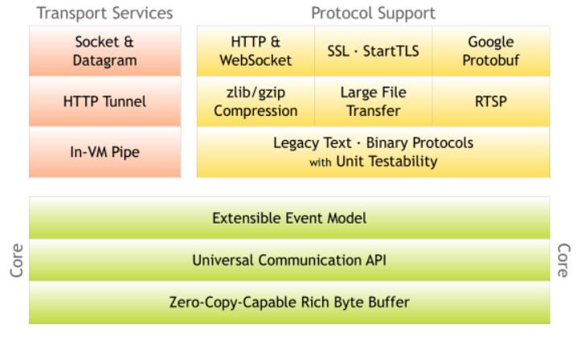

- Core模块：netty的核心模块。
  - Extensible Event Model：可扩展的事件驱动模型.
  - UNiversal Communication API：统一的通信的API。
  - Zero-CopyCapable Rich Byte Buffer：零拷贝的Byte Buffer。

- Transport Services模块：传输模块，主要是包含了各种传输机制。

- Protocol Support模块：协议模块，主要是包含了各种协议。

### 2. Netty特性

#### 1.1 设计

- 用于各种传输类型的统一API---阻塞与非阻塞套接字。
- 基于灵活和可扩展的事件模型，允许清晰的分离关注点。
- 高度的可定制的线程模型，可以提供单个、多个线程以及线程池。

#### 2.2 性能

- Netty具有更好地贪图量，更低的延迟。
- Netty能够减少资源消耗。
- Netty能够实现最小化的内存复制。
- Netty完成了SSL/TLS和StartTLS的支持，极大地保证了安全。

### 3. 线程模型基本介绍

> - 不同过的线程模式，对程序的性能有很大的影响；
>
> - 目前存在的线程模型包括：
>   - 传统阻塞I/O模型
>   - Reactor模型
> - 根据Reactor的数据量和处理资源池线程数的数量不同，有三种典型的实现：
>   - 单Reactor单线程
>   - 单Reactor多线程
>   - 主从Reactor多线程
> - **Netty线程模式：`基于主从Reactor多线程模型`做了一定的改进，其中主从Reactor 多线程模型有多个Reactor；**

#### 3.1 Reactor模式

> - 基于I/O复用模型：多个连接公用一个阻塞对象，应用程序只需要在一个阻塞对象等待，无需阻塞等待多有连接。当某个链接有新的数据可以处理时，操作系统通知应用程序，线程从阻塞状态返回，开始进行业务处理；简单示意图如下：（多个客户端，统一请求Service Handler，Service Handler统一将请求进行调度，发送到对应的工作线程中进行执行，客户端只需要阻塞Service Handler线程即可）
>
>   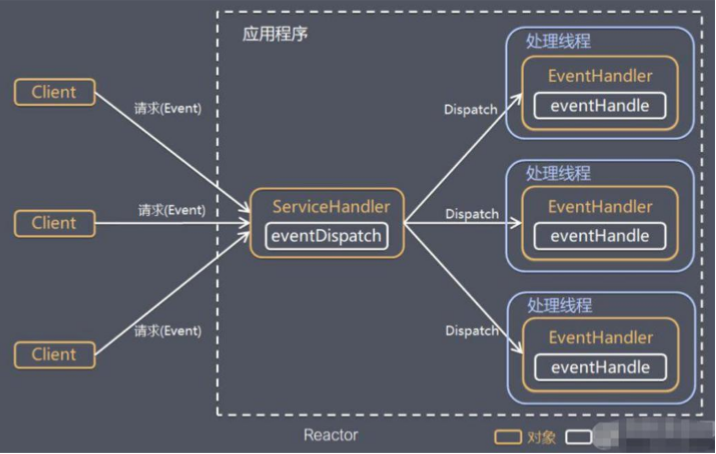
>
> - Reactor对应中文翻译：
>
>   - 反应器模式
>   - 分发着模式（Dispatcher）
>   - 通知着模式（notifier）
>
> - 基于线程池复用线程资源：不必再为每个链接创建线程，将连接完成后的业务处理任务分配给线程进行执行，一个线程亦可以处理多个连接的业务；

### 3.2 单Reactor单线程

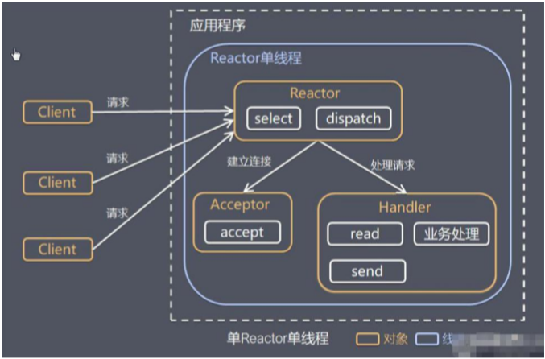

#### 3.2.1 实现步骤

> - Select是前面I/O复用模型介绍的标准网络编程API，可以实现应用程序通过一个阻塞对象监听多路连接请求；
> - Reactor对象通过Select监控客户端请求事件，收到事件后通过Dispatch进行分发；
> - 如果建立的是连接请求事件，则有Acceptor对象通过Accept处理连接请求，然后创建一个Handler对象处理连接完成后的业务；
> - 如果不是建立连接事件，则Reactor会分发调用连接对应的Handler来进行响应；
> - Handler对象完成的工作是 `Read -> 业务处理 -> Send` 的完成业务流程；

#### 3.2.2 方案优缺点

> **优点**：
>
> - 模型简单，没有多线程、进程通信、竞争等问题，全部都在一个线程中进行完成；
>
> **缺点**：
>
> - 性能问题：单线程，性能问题较差，无法发挥多核CPU特性，易到达性能瓶颈；
> - 可靠性问题：由于是单线程模式，线程以外终止或者进入死循环，则会导致系统通信模块异常不可用；

#### 3.2.3 使用场景

> 适用于客户端的数量有限、业务处理非常快速的场景；

### 3.3 单Reactor多线程

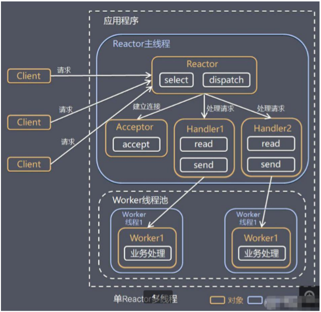

#### 3.3.1 实现步骤

> - Reactor 对象通过select 监控客户端请求
>    事件, 收到事件后，通过dispatch进行分发
>
> - 如果建立连接请求, 则右Acceptor 通过
>    accept 处理连接请求, 然后创建一个Handler对象处理完成连接后的各种事件
>
> - 如果不是连接请求，则由reactor分发调用连接对应的handler 来处理
>
> - handler 只负责响应事件，不做具体的业务处理, 通过read 读取数据后，会分发给后面的worker线程池的某个线程处理业务
>
> - worker 线程池会分配独立线程完成真正的业务，并将结果返回给handler
>
> - handler收到响应后，通过send 将结果返回给client

#### 3.3.2 方案优缺点

> **优点**：
>
> - 可以充分的利用多核cpu 的处理能力
>
> **缺点**：
>
> - 多线程数据共享和访问比较复杂， reactor 处理所有的事件的监听和响应，在单线程运行， 在高并发场景容易出现性能瓶颈.

### 3.4 主从Reactor多线程

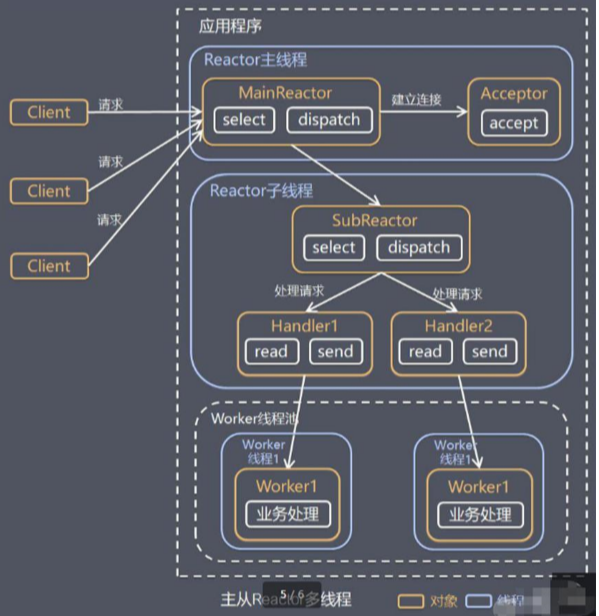

#### 3.4.1 实现步骤

> - Reactor主线程 MainReactor 对象通过select 监听连接事件, 收到事件后，通过Acceptor 处理连接事件
>
> - 当 Acceptor  处理连接事件后，MainReactor 将连接分配给SubReactor 
>
> - subreactor 将连接加入到连接队列进行监听,并创建handler进行各种事件处理
>
> - 当有新事件发生时， subreactor 就会调用对应的handler处理
>
> - handler 通过read 读取数据，分发给后面的worker 线程处理
>
> - worker 线程池分配独立的worker 线程进行业务处理，并返回结果
>
> - handler 收到响应的结果后，再通过send 将结果返回给client
>
> - Reactor 主线程可以对应多个Reactor 子线程, 即MainRecator 可以关联多个SubReactor

#### 3.4.2 方案优缺点

> **优点**：
>
> - 父线程与子线程的数据交互简单职责明确，父线程只需要接收新连接，子线程完成后续的业务处理
> - 父线程与子线程的数据交互简单，Reactor主线程只需要把新连接传给子线程，子线程无需返回数据
> - 编程复杂度较高

### 3.5 Reactor模式生活案例

> - 单 Reactor 单线程，前台接待员和服务员是同一个人，全程为顾客服
>
> - 单 Reactor 多线程，1 个前台接待员，多个服务员，接待员只负责接待
>
> - 主从 Reactor 多线程，多个前台接待员，多个服务生

###  3.6 Reactor模式特性

> - 响应快，不必为单个同步时间所阻塞，虽然 Reactor 本身依然是同步的
>
> - 可以最大程度的避免复杂的多线程及同步问题，并且避免了多线程/进程的切换开销
>
> - 扩展性好，可以方便的通过增加 Reactor 实例个数来充分利用 CPU 资源
>
> - 复用性好，Reactor 模型本身与具体事件处理逻辑无关，具有很高的复用性

### 3.7 netty模型

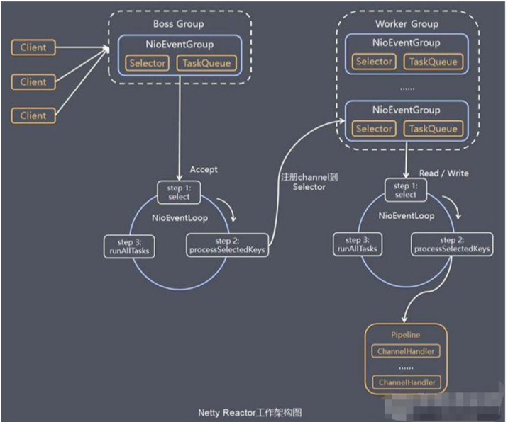

> - `Netty`抽象出两组线程池 `BossGroup` 专门负责接收客户端的连接, `WorkerGroup `专门负责网络的读写
>
> - `BossGroup` 和 `WorkerGroup` 类型都是 `NioEventLoopGroup`
>
> - `NioEventLoopGroup` 相当于一个事件循环组, 这个组中含有多个事件循环 ，每一个事件循环是 `NioEventLoop`
>
> - `NioEventLoop `表示一个不断循环的执行处理任务的线程， 每个`NioEventLoop `都有一个`selector` , 用于监听绑定在其上的socket的网络通讯
>
> - `NioEventLoopGroup` 可以有多个线程, 即可以含有多个`NioEventLoop`
>
> - 每个`Boss NioEventLoop `循环执行的步骤有3步
>   - 轮询`accept `事件
>   - 处理`accept `事件 , 与`client`建立连接 , 生成`NioScocketChannel `, 并将其注册到某个`worker NIOEventLoop `上的` selector `
>   - 处理任务队列的任务 ， 即 `runAllTasks`
>
> - 每个` Worker NIOEventLoop `循环执行的步骤
>   - 轮询`read`,` write `事件
>   - 处理i/o事件， 即`read` ,` write `事件，在对应`NioScocketChannel `处理
>   - 处理任务队列的任务 ， 即 `runAllTasks`
>
> - 每个`Worker NIOEventLoop`  处理业务时，会使用`pipeline(管道)`, `pipeline` 中包含了` channel `, 即通过`pipeline `可以获取到对应通道, 管道中维护了很多的 处理器;

> Netty模型对应的对象主要是包括：
>
> - `BossGroup`：负责接收客户端的连接组，接收到客户端的连接以后，将创建NioScocketChannel对象，交于WorkerGroup对象；
> - `WorkerGroup`：负责执行I/O的read、write操作，将真正需要执行的业务逻辑，交于pipeline对象执行；
> - `NioEventLoopGroup`：事件驱动组
> - `NioEventLoop`：事件驱动
> - `NioScocketChannel`：BossGroup创建的客户端连接对象
> - `pipeline`：执行客户端与服务端交互的handler对象

> **重要**
>
> - `Netty`抽象出两组**线程池**，`BossGroup`专门负责接收客户端连接，`WorkerGroup`专门负责网络读写操作；
> - `NioEventLoop`表示一个不断循环执行处理任务的线程，每个`NioEventLoop`都有一个`selector`，用于监听绑定在其上的`socket`网络通道；
> - `NioEventLoop`内部采用串行化设计，从消息的**读取->解码->处理->编码->发送**，始终是由IO线程`NioEventLoop`负责执行；
>
> **包含关系**
>
> - `NioEventLoopGroup`下包含多个`NioEventLoop`；
> - 每个`NioEventLoop`中包含有一个`Selector`，一个`TaskQueue`；
> - 每个`NioEventLoop`的`Selector`上可以注册监听多个`NioChannel`；
> - 每个`NIOChannel`只会绑定在唯一的`NioEventLoop`中；
> - 每个`NIOChannel`都绑定有一个自己的`ChannelPipiLine`；

### 3.8 netty案例

> 实现了一个基本的netty服务器端、客户端之间的通信代码功能；

服务器端代码：

```java
package com.zsl.netty.simple;

import io.netty.bootstrap.ServerBootstrap;
import io.netty.channel.ChannelFuture;
import io.netty.channel.ChannelInitializer;
import io.netty.channel.ChannelOption;
import io.netty.channel.EventLoopGroup;
import io.netty.channel.nio.NioEventLoopGroup;
import io.netty.channel.socket.SocketChannel;
import io.netty.channel.socket.nio.NioServerSocketChannel;

/**
 * @author ${张世林}
 * @date 2020/01/30
 * 作用：
 */
public class NettyServer {

    public static void main(String[] args) throws InterruptedException {
        //创建BossGroup，处理连接请求，连接请求完成以后交于workerGroup，无限循环
        //NioEventLoopGroup对象中的子线程 NIOEventLoop 根据机器 CPU核数 * 2 个
        EventLoopGroup bossGroup = new NioEventLoopGroup();
        //创建WorkerGroup，真正和客户端进行业务处理，无限循环
        EventLoopGroup workerGroup = new NioEventLoopGroup();

        //创建服务器端的启动对象，配置参数
        ServerBootstrap bootstrap = new ServerBootstrap();
        //使用连式编程来进行设置
        //设置两个线程组
        try {
            bootstrap.group(bossGroup, workerGroup)
                    //使用nio来作为服务器端的channel
                    .channel(NioServerSocketChannel.class)
                    //设置线程队列，等待连接的个数
                    .option(ChannelOption.SO_BACKLOG, 128)
                    //设置保持活动连接状态
                    .childOption(ChannelOption.SO_KEEPALIVE, true)
                    //给我们的workerGroup的EventLoop设置处理器，可以使用netty提供的，以及自定义
                    .childHandler(new ChannelInitializer<SocketChannel>() {
                        //给pipeline设置处理器
                        @Override
                        protected void initChannel(SocketChannel ch) {
                            ch.pipeline().addLast(new NettyServerHandler());
                        }
                    });
            System.out.println("-------------server is ready------------");

            //绑定一个端口，并且同步
            ChannelFuture channelFuture = bootstrap.bind(8888).sync();

            //对关闭通道进行监听,当有关闭这个通道的事件的时候，会执行这里
            channelFuture.channel().closeFuture().sync();
        } catch (Exception e) {
            e.printStackTrace();
        } finally {
            bossGroup.shutdownGracefully();
            workerGroup.shutdownGracefully();
        }
    }

}
```

服务器端handler：

```java
package com.zsl.netty.simple;

import io.netty.buffer.ByteBuf;
import io.netty.buffer.Unpooled;
import io.netty.channel.Channel;
import io.netty.channel.ChannelHandlerContext;
import io.netty.channel.ChannelInboundHandlerAdapter;
import io.netty.channel.ChannelPipeline;
import io.netty.util.CharsetUtil;

import java.nio.charset.Charset;

/**
 * @author ${张世林}
 * @date 2020/01/30
 * 作用：自定义一个Handler，需要继续netty规定好的某个handlerAdapter
 * 这时我们自定义一个handler，才能成为handler
 */
public class NettyServerHandler extends ChannelInboundHandlerAdapter {

    /**
     * 读取数据，可以读取客户端发送过来的消息
     *
     * @param ctx：上下文对象，包括管道pipeline，通道channel，地址
     * @param msg：客户端发送的数据，默认为object对象
     * @throws Exception
     */
    @Override
    public void channelRead(ChannelHandlerContext ctx, Object msg) throws Exception {
        System.out.println("server ctx = " + ctx);
        System.out.println("服务器读取线程：" + Thread.currentThread().getName());
        System.out.println("channel与pipeline之间的关系");
        Channel channel = ctx.channel();
        //底层是一个双向链表
        ChannelPipeline pipeline = ctx.pipeline();
        //将msg转换成ByteBuf
        ByteBuf buf = (ByteBuf) msg;
        System.out.println("客户端发送的消息是：" + buf.toString(CharsetUtil.UTF_8));
        System.out.println("客户端地址：" + ctx.channel().remoteAddress());
    }

    /**
     * 数据读取完毕
     *
     * @param ctx
     * @throws Exception
     */
    @Override
    public void channelReadComplete(ChannelHandlerContext ctx) throws Exception {
        //writeAndFlush = write + flush
        //将数据写入到缓存，并刷新；通常情况下我们需要对发送的数据设定编码
        ctx.writeAndFlush(Unpooled.copiedBuffer("hello， client~~", CharsetUtil.UTF_8));
    }

    /**
     * 如果发生异常，一般是需要对通道进行关闭
     * @param ctx
     * @param cause
     * @throws Exception
     */
    @Override
    public void exceptionCaught(ChannelHandlerContext ctx, Throwable cause) throws Exception {
        try {
            ctx.close();
        } catch (Exception e) {
            e.printStackTrace();
        }
    }
}

```

客户端代码：

```java
package com.zsl.netty.simple;

import io.netty.bootstrap.Bootstrap;
import io.netty.channel.ChannelFuture;
import io.netty.channel.ChannelInitializer;
import io.netty.channel.nio.NioEventLoopGroup;
import io.netty.channel.socket.SocketChannel;
import io.netty.channel.socket.nio.NioSocketChannel;

/**
 * @author ${张世林}
 * @date 2020/01/31
 * 作用：netty客戶端
 */
public class NettyClient {

    public static void main(String[] args) throws InterruptedException {
        //需要创建一个事件循环组
        NioEventLoopGroup eventLoopGroup = new NioEventLoopGroup();
        //创建客户端启动对象
        Bootstrap bootstrap = new Bootstrap();
        //设置客户端相关参数
        try {
            // 设置线程组
            bootstrap.group(eventLoopGroup)
                    //设置客户端通道的实现类
                    .channel(NioSocketChannel.class)
                    //设置客户端处理器
                    .handler(new ChannelInitializer<SocketChannel>() {
                        @Override
                        protected void initChannel(SocketChannel ch) throws Exception {
                            ch.pipeline().addLast(new NettyClientHandler());
                        }
                    });
            System.out.println("client has success");
            //连接服务器端
            ChannelFuture channelFuture = bootstrap.connect("127.0.0.1", 8888).sync();
            channelFuture.channel().closeFuture().sync();
        } catch (Exception e) {
            e.printStackTrace();
        } finally {
            eventLoopGroup.shutdownGracefully();
        }
    }

}

```

客户端handler代码：

```java
package com.zsl.netty.simple;

import io.netty.buffer.ByteBuf;
import io.netty.buffer.Unpooled;
import io.netty.channel.ChannelHandlerContext;
import io.netty.channel.ChannelInboundHandlerAdapter;
import io.netty.util.CharsetUtil;

/**
 * @author ${张世林}
 * @date 2020/01/31
 * 作用：客户端的handler
 */
public class NettyClientHandler extends ChannelInboundHandlerAdapter {

    /**
     * 当通道准备完成以后就会触发
     * @param ctx
     * @throws Exception
     */
    @Override
    public void channelActive(ChannelHandlerContext ctx) throws Exception {
        System.out.println("client " + ctx);
        ctx.writeAndFlush(Unpooled.copiedBuffer("hello， server~~", CharsetUtil.UTF_8));
    }

    /**
     * 当通道存在读取事件时，会触发
     * @param ctx
     * @param msg
     * @throws Exception
     */
    @Override
    public void channelRead(ChannelHandlerContext ctx, Object msg) throws Exception {
        ByteBuf buf = (ByteBuf) msg;
        System.out.println("服务器端发送的消息是：" + buf.toString(CharsetUtil.UTF_8));
        System.out.println("服务器端端地址：" + ctx.channel().remoteAddress());
    }

    @Override
    public void exceptionCaught(ChannelHandlerContext ctx, Throwable cause) throws Exception {
        ctx.close();
    }
}

```

### 3.9 任务队列TaskQueue

> **原理模型：**
>
> ​	Netty模型中存在着`pipeline`管道处理任务时间较长，则会导致资源占用，所以为了解决这个为题，在`WorkGroup`对象中存在`TaskQueue`对象，用于执行如下场景的业务：
>
> - 用户程序自定义的普通任务；
>
> - 用户自定义定时任务；
>
> - 非当前Reactor线程调用Channel的各种方法；
>
>   例如：在推送系统的业务线程里面，根据用户的标识（也就是客户端），找到对应的Channel引用，然后调用Write类方法想改用户推送消息，就会进入到这种场景，最终的Write会提交到任务队列中后异步消费；

> **实现方式：**
>
> ​	采用的是直接获取当前客户端的channel，也就是对应着该channel的NioEventLoop的TaskQueue中；

```java
package com.zsl.netty.simple;

import io.netty.buffer.ByteBuf;
import io.netty.buffer.Unpooled;
import io.netty.channel.Channel;
import io.netty.channel.ChannelHandlerContext;
import io.netty.channel.ChannelInboundHandlerAdapter;
import io.netty.channel.ChannelPipeline;
import io.netty.util.CharsetUtil;

import java.nio.charset.Charset;
import java.util.concurrent.TimeUnit;

/**
 * @author ${张世林}
 * @date 2020/01/30
 * 作用：自定义一个Handler，需要继续netty规定好的某个handlerAdapter
 * 这时我们自定义一个handler，才能成为handler
 */
public class NettyServerHandler extends ChannelInboundHandlerAdapter {

    /**
     * 读取数据，可以读取客户端发送过来的消息
     *
     * @param ctx：上下文对象，包括管道pipeline，通道channel，地址
     * @param msg：客户端发送的数据，默认为object对象
     * @throws Exception
     */
    @Override
    public void channelRead(ChannelHandlerContext ctx, Object msg) throws Exception {
//        System.out.println("server ctx = " + ctx);
//        System.out.println("服务器读取线程：" + Thread.currentThread().getName());
//        System.out.println("channel与pipeline之间的关系");
//        Channel channel = ctx.channel();
//        //底层是一个双向链表
//        ChannelPipeline pipeline = ctx.pipeline();
//        //将msg转换成ByteBuf
//        ByteBuf buf = (ByteBuf) msg;
//        System.out.println("客户端发送的消息是：" + buf.toString(CharsetUtil.UTF_8));
//        System.out.println("客户端地址：" + ctx.channel().remoteAddress());

        ctx.channel().eventLoop().execute(() -> {
            try {
                TimeUnit.SECONDS.sleep(10);
                System.out.println("开始执行runable1");
                ctx.writeAndFlush(Unpooled.copiedBuffer("hello， client1~~", CharsetUtil.UTF_8));
            } catch (InterruptedException e) {
                e.printStackTrace();
            }
        });

        ctx.channel().eventLoop().execute(() -> {
            try {
                TimeUnit.SECONDS.sleep(10);
                System.out.println("开始执行runable2");
                ctx.writeAndFlush(Unpooled.copiedBuffer("hello， client2~~", CharsetUtil.UTF_8));
            } catch (InterruptedException e) {
                e.printStackTrace();
            }
        });
        System.out.println("go on----");
    }

    /**
     * 数据读取完毕
     *
     * @param ctx
     * @throws Exception
     */
    @Override
    public void channelReadComplete(ChannelHandlerContext ctx) throws Exception {
        //writeAndFlush = write + flush
        //将数据写入到缓存，并刷新；通常情况下我们需要对发送的数据设定编码
        System.out.println("complete");
    }

    /**
     * 如果发生异常，一般是需要对通道进行关闭
     * @param ctx
     * @param cause
     * @throws Exception
     */
    @Override
    public void exceptionCaught(ChannelHandlerContext ctx, Throwable cause) throws Exception {
        try {
            ctx.close();
        } catch (Exception e) {
            e.printStackTrace();
        }
    }
}

```


## 4. Netty异步模型

> - 异步的概念和同步相对；一个异步过程调用发出后，调用者不能立刻得到结果；实际处理这个调用的组件在完成后，通过状态、通知、回调来通知调用者；
> - `Netty`中的I/O操作是异步的，包括`Bind`、`Write`、`Connect`等操作会简单的返回一个`ChannelFuture`对象；
> - 调用者并不能立刻得到结果，而是通过`Future-Listener`机制，用户可以方便的**主动获取**或者通过**通知机制**获得I/O操作结果；
> - `Netty`的异步模型是建立在`future`和`callback`的基础之上的；callback就是回调；其核心思想是：针对一个函数`function`，计算过程可能非常好使，等待函数`function`返回结果不合适，那么可以直接先返回一个`Future`对象，后续可以通过`Future`对象去监控函数`function`的处理过程，也就是`Future-Lisntener`机制；

### 4.1 Future-Listener机制

> - 当`Future`对象刚刚创建的时候，处于非完成状态，调用者可以通过返回的`ChannelFuture`来获取操作执行的状态，注册监听函数来执行完成后的操作；
> - 常见操作：
>   - 通过`isDone`方法来判断当前操作是否完成；
>   - 通过`isSuccess`方法来判断已完成的当前操作是否成功；
>   - 通过`getCause`方法来获取已完成的当前操作失败的原因；
>   - 通过`isCancelled`方法来判断已完成的当前操作是否被取消；
>   - 通过`addListener`方法来注册监听器，当操作已完成（`isDone`方法返回完成），将会通知指定的监听器；如果`Future`对象已完成，则通知指定的监听器；

简单实例：

```java
serverBootstrap.bind(port).addListener(future -> {
       if(future.isSuccess()) {
           System.out.println(newDate() + ": 端口["+ port + "]绑定成功!");
       } else{
           System.err.println("端口["+ port + "]绑定失败!");
       }
   });

```

> 相较于传统I/O操作，执行I/O操作之后线程会被阻塞，直到线程完成；异步处理的好处是不会造成线程阻塞，线程在I/O操作期间可以执行别的程序，在高并发情形下会有更稳定和更高的吞吐量；

```java
package com.zsl.netty.simple;

import io.netty.bootstrap.ServerBootstrap;
import io.netty.channel.ChannelFuture;
import io.netty.channel.ChannelInitializer;
import io.netty.channel.ChannelOption;
import io.netty.channel.EventLoopGroup;
import io.netty.channel.nio.NioEventLoopGroup;
import io.netty.channel.socket.SocketChannel;
import io.netty.channel.socket.nio.NioServerSocketChannel;

/**
 * @author ${张世林}
 * @date 2020/01/30
 * 作用：
 */
public class NettyServer {

    public static void main(String[] args) throws InterruptedException {
        //创建BossGroup，处理连接请求，连接请求完成以后交于workerGroup，无限循环
        //NioEventLoopGroup对象中的子线程 NIOEventLoop 根据机器 CPU核数 * 2 个
        EventLoopGroup bossGroup = new NioEventLoopGroup();
        //创建WorkerGroup，真正和客户端进行业务处理，无限循环
        EventLoopGroup workerGroup = new NioEventLoopGroup();

        //创建服务器端的启动对象，配置参数
        ServerBootstrap bootstrap = new ServerBootstrap();
        //使用连式编程来进行设置
        //设置两个线程组
        try {
            bootstrap.group(bossGroup, workerGroup)
                    //使用nio来作为服务器端的channel
                    .channel(NioServerSocketChannel.class)
                    //设置线程队列，等待连接的个数
                    .option(ChannelOption.SO_BACKLOG, 128)
                    //设置保持活动连接状态
                    .childOption(ChannelOption.SO_KEEPALIVE, true)
                    //给我们的workerGroup的EventLoop设置处理器，可以使用netty提供的，以及自定义
                    .childHandler(new ChannelInitializer<SocketChannel>() {
                        //给pipeline设置处理器
                        @Override
                        protected void initChannel(SocketChannel ch) {
                            ch.pipeline().addLast(new NettyServerHandler());
                        }
                    });
            System.out.println("-------------server is ready------------");

            //绑定一个端口，并且同步
            ChannelFuture channelFuture = bootstrap.bind(8888).sync();
            //监听机制，用于监听服务器端的Future的回调
            channelFuture.addListener(future -> {
                if (channelFuture.isSuccess()) {
                    System.out.println("监听端口8888成功");
                } else {
                    System.out.println("监听端口8888失败");
                }
            });

            //对关闭通道进行监听,当有关闭这个通道的事件的时候，会执行这里
            channelFuture.channel().closeFuture().sync();
        } catch (Exception e) {
            e.printStackTrace();
        } finally {
            bossGroup.shutdownGracefully();
            workerGroup.shutdownGracefully();
        }
    }

}

```

## 5. Netty核心模块组件

### 5.1 Bootstrap、ServerBootstrap

> ​	`Bootstrap`意思是引导，一个`Netty`应用通常用一个`Bootstrap`开始，主要作用是配置整个Netty程序，串联各个组件；
>
> - `Bootstrap`：该类是客户端程序的启动引导类；
> - `ServerBootstrap`：该类是服务器端程序启动引导类；
>
> 常见方法：
>
> - `public ServerBootstrap group(EventLoopGroup parentGroup, EventLoopGroup childGroup)`    服务器端用于设定两个EventLoop；
> - `public B group(EventLoopGroup group) ` 客户端设置一个EventLoopGroup；
> - `public B channel(Class<? extends C> channelClass) `  该方法用来设置一个服务器端的通道实现;
> - `public <T> B option(ChannelOption<T> option, T value)` 用来给 ServerChannel 添加配置;
> - `public <T> ServerBootstrap childOption(ChannelOption<T> childOption, T value)` 用来给接收到的通道添加配置；
> - `public ServerBootstrap childHandler(ChannelHandler childHandler)` 该方法用来设置业务处理类（自定义的 handler）；
> - `public ChannelFuture bind(int inetPort) ` 该方法用于服务器端，用来设置占用的端口号；
> - `public ChannelFuture connect(String inetHost, int inetPort) ` 该方法用于客户端，用来连接服务器端；

### 5.2 Future、ChannelFuture

>  	`Netty `中所有的 `IO` 操作都是异步的，不能立刻得知消息是否被正确处理。但是可以过一会等它执行完成或者直接注册一个监听，具体的实现就是通过 `Future `和 `ChannelFutures`，他们可以注册一个监听，当操作执行成功或失败时监听会自动触发注册的监听事件
>
> **常见的方法有**
>
> - `Channel channel()`，返回当前正在进行 IO 操作的通道
>
> - `ChannelFuture sync()`，等待异步操作执行完毕

### 5.3 Channel

> - `Netty `网络通信的组件，能够用于执行网络 `I/O `操作；
>
> - 通过`Channel `可获得当前网络连接的通道的状态；
>
> - 通过`Channel `可获得 网络连接的配置参数 （例如接收缓冲区大小）；
>
> - `Channel `提供异步的网络 `I/O `操作(如建立连接，读写，绑定端口)，异步调用意味着任何` I/O `调用都将立即返回，并且不保证在调用结束时所请求的` I/O `操作已完成；
>
> - 调用立即返回一个 `ChannelFuture` 实例，通过注册监听器到 `ChannelFuture` 上，可以` I/O `操作成功、失败或取消时回调通知调用方；
> - 支持关联` I/O `操作与对应的处理程序；
> - 不同协议、不同的阻塞类型的连接都有不同的 `Channel `类型与之对应，常用的` Channel `类型：
>   - `NioSocketChannel.class`，异步的客户端 TCP Socket 连接。
>   - `NioServerSocketChannel.class`，异步的服务器端 TCP Socket 连接。
>   - `NioDatagramChannel.class`，异步的 UDP 连接。
>   - `NioSctpChannel.class`，异步的客户端 Sctp 连接。
>   - `NioSctpServerChannel.class`，异步的 Sctp 服务器端连接，这些通道涵盖了 UDP 和 TCP 网络 IO 以及文件 IO。

### 5.4 Selector

> - `Netty `基于 `Selector` 对象实现` I/O `多路复用，通过 `Selector `一个线程可以监听多个连接的 `Channel `事件。
>
> - 当向一个 `Selector `中注册 `Channel `后，`Selector `内部的机制就可以自动不断地查询(`Select`) 这些注册的 `Channel `是否有已就绪的` I/O `事件（例如可读，可写，网络连接完成等），这样程序就可以很简单地使用一个线程高效地管理多个` Channel `;

### 5.5 ChannelHandler及其实现类

> - `ChannelHandler `是一个接口，处理` I/O `事件或拦截 `I/O `操作，并将其转发到其 `ChannelPipeline`(业务处理链)中的下一个处理程序。
>
> - `ChannelHandler` 本身并没有提供很多方法，因为这个接口有许多的方法需要实现，方便使用期间，可以继承它的子类
>
> - `ChannelHandler `及其实现类一览图：
>   - `ChannelInboundHandler` 用于处理入站 I/O 事件。
>   - `ChannelOutboundHandler `用于处理出站 I/O 操作。
>   - 适配器
>     - `ChannelInboundHandlerAdapter `用于处理入站 I/O 事件。
>     - `ChannelOutboundHandlerAdapter `用于处理出站 I/O 操作。
>     - `ChannelDuplexHandler `用于处理入站和出站事件。
>
> 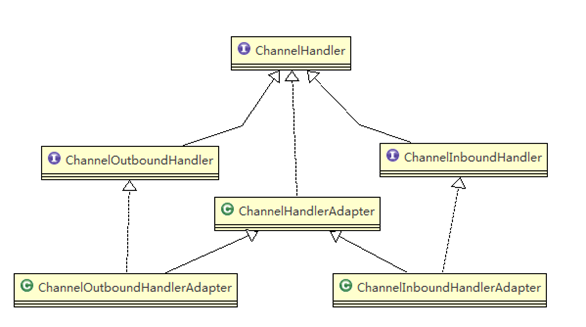
>
> - 我们经常需要自定义一个 `Handler`类去继承 `ChannelInboundHandlerAdapter`，然后通过重写相应方法实现业务逻辑；重写的方法可以有：
>   - SimpleChannelInboundHandler
>   - SimpleChannelInboundHandler
>   - SimpleChannelInboundHandler
>   - SimpleChannelInboundHandler
>   - acceptInboundMessage
>   - channelRead
>   - channelRead0

### 5.6 Pipeline、ChannelPipeline

> **`ChannelPipeline`**：
>
> - `ChannelPipeline`是一个`Handler`的集合，它负责处理和拦截`inbound`或者`outbound`的事件和操作，相当于贯穿`Netty`链（`ChannelPipeline`是保存`ChannelHandler`的`list`集合，用于处理或者拦截`Channel`的入栈事件和出栈操作）。
> - `ChannelPipeline`实现了一种高级形式的拦击过滤模式，使用户可以完全控制事件的处理方式，以及`Channel`中各个的`ChannelHandler`如何相互交互；
>
> - 在`Netty`中每个`Channel`都有且只有一个`ChannelPipeline`与之对应，关系如下：
>   - 一个`Channel`中包含了一个`ChannelPipeline`，而`ChannelPipeline`中又维护了一个由`ChannelHandlerContext`组成的双向链表，并且每个`ChannelHandlerContext`中又关联着一个`ChannelHandler`；
>   - 入栈事件和出栈事件在一个双向链表中，入栈事件会从链表`head`往后传递到最后一个入栈的`handler`，出栈事件会从链表tail往前传递到最前一个出栈的`handler`，两种类型的`handler`互不干扰；
>
> 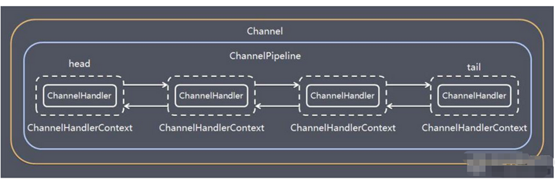
>
> - 常用方法：
>   - `ChannelPipeline addFirst(ChannelHandler... handlers)`，把一个业务处理类（handler）添加到链中的第一个位置；
>   - `ChannelPipeline addLast(ChannelHandler... handlers)`，把一个业务处理类（handler）添加到链中的最后一个位置；

### 5.7 ChannelHandlerContext

> - 保存`Channel`相关的所有上下文信息，同时关联一个`ChannelHandler`对象；
> - `ChannelHandlerContext中`包含一个具体的事件处理器`ChannelHandler`，同时`ChannelHandlerContext`中也绑定了对应的`pipeline`和`Channel`信息，方便对`ChannelHandler`进行调用；
> - 常用方法：
>   - `ChannelFuture close()`，关闭通道
>   - `ChannelOutboundInvoker flush()`，刷新
>   - `ChannelFuture writeAndFlush(Object msg) `， 将 数 据 写 到 `ChannelPipeline `中 当 前
>   - `ChannelHandler `的下一个 `ChannelHandler` 开始处理（出站）

### 5.8 ChannelOption

> - `Netty`在创建`Channel`实例后，一般都需要设置`ChannelOption`参数；
> - `ChannelOption`参数如下：
>   - **`ChannelOption.SO_BACKLOG`** ：对应 `TCP/IP `协议` listen `函数中的 `backlog `参数，用来初始化服务器可连接队列大小。服务端处理客户端连接请求是顺序处理的，所以同一时间只能处理一个客户端连接。多个客户端来的时候，服务端将不能处理的客户端连接请求放在队列中等待处理，`backlog `参数指定了队列的大小。
>   - **`ChannelOption.SO_KEEPALIVE`** ：一直保持连接活动状态

### 5.9 EventLoopGroup接口 和 NIOEventLoopGroup实现类

> - `EventLoopGroup`是一组`EventLoop`的抽象，`Netty`为了更好的利用多核CPU资源，一般会有多个`EventLoop`同时工作，每个`EventLoop`维护者一个`Selector`实例；
>
> - `EventLoopGroup`提供`next`接口，可以从组里面按照一定规则获取其中一个`EventLoop`来处理任务；通常情况下， 会使用量`EventLoopGroup`，例如：`BossEventLoopGroup`和`WorkerEventLoopGroup`；
>
> - 通常情况下一个服务端口即一个`ServerSocketChannel`对应一个`Selector`和一个`EventLoop`线程；通常采用`BossEventLoop`负责接收客户端的连接并将`SocketChannel`交给`WorkerEventLoopGroup`来进行`IO`处理；
>
>   - `BossEventLoopGroup `通常是一个单线程的`EventLoop`，`EventLoop`维护者一个注册了`ServerSocketChannel`的`Selector`实例，`BossEventLoop`不断轮循`Selector`将连接事件分离出来；
>   - 通常`OP_ACCEPT`事件，然后将接收到的`SocketChannel`交给`WorkerEventLoopGroup`，在`WorkerEventLoopGroup`中会有`next`选择其中一个`EventLoop`来将这个`SocketChannel`注册到其维护的`Selector`并对其后续的`IO`事件进行处理；
>
>   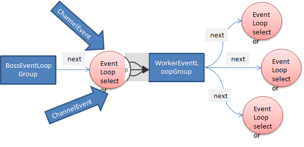
>
>   常用方法：
>
>   - `public NioEventLoopGroup()`，构造方法
>
>   - `public Future<?> shutdownGracefully()`，断开连接，关闭线程

### 5.10 Unpooled类

> 简介：
>
> - `Netty`提供的一个专门用于操作缓冲区（即Netty的数据容器）的工具类；
>
> 常用方法：
>
> - `public static ByteBuf copiedBuffer(CharSequence string, Charset charset) ` 通过给定的数据和字符编码返回一个 ByteBuf 对象；
>

```java
    public static void main(String[] args) {
        ByteBuf buffer = Unpooled.buffer(10);
        for (int i = 0; i < 10; i++) {
            buffer.writeByte(i);
        }

        System.out.println("capacity = " + buffer.capacity());

        for (int i = 0; i < buffer.capacity(); i++) {
            System.out.println(buffer.getByte(i));
        }
    }
```

## 6. 案例分享

### 6.1 群聊系统

> 群聊系统中主要使用到netty的handler包括：
>
> - StringDecoder：字符串类型的解码器
> - StringEncoder：字符串类型的编码器

- 服务器端：

```java
package com.zsl.group.chat;

import io.netty.bootstrap.ServerBootstrap;
import io.netty.channel.ChannelFuture;
import io.netty.channel.ChannelInitializer;
import io.netty.channel.ChannelOption;
import io.netty.channel.ChannelPipeline;
import io.netty.channel.nio.NioEventLoopGroup;
import io.netty.channel.socket.SocketChannel;
import io.netty.channel.socket.nio.NioServerSocketChannel;
import io.netty.handler.codec.string.StringDecoder;
import io.netty.handler.codec.string.StringEncoder;

/**
 * @author ${张世林}
 * @date 2020/02/15
 * 作用：服务器
 */
public class GroupChatServer {

    private Integer port;

    public GroupChatServer(Integer port) {
        this.port = port;
    }

    public void run() throws InterruptedException {
        NioEventLoopGroup bossGroup = new NioEventLoopGroup(1);
        NioEventLoopGroup workerGroup = new NioEventLoopGroup(8);
        ServerBootstrap bootstrap = new ServerBootstrap();
        bootstrap.group(bossGroup, workerGroup)
                .channel(NioServerSocketChannel.class)
                .option(ChannelOption.SO_BACKLOG, 128)
                .childOption(ChannelOption.SO_KEEPALIVE, true)
                .childHandler(new ChannelInitializer<SocketChannel>() {
                    @Override
                    protected void initChannel(SocketChannel ch) throws Exception {
                        //首先获取到pipeline
                        ChannelPipeline pipeline = ch.pipeline();
                        //向pipeline中添加一个解码器
                        pipeline.addLast("decoder", new StringDecoder());
                        //向pipeline中添加一个编码器
                        pipeline.addLast("encoder", new StringEncoder());
                        //向pipeline中添加我们自己业务的处理器
                        pipeline.addLast(new GroupChatServerHandler());
                    }
                });
        System.out.println("服务器启动成功");
        ChannelFuture channelFuture = bootstrap.bind(port).sync();

        //监听channel的关闭事件
        channelFuture.channel().closeFuture().sync();
        bossGroup.shutdownGracefully();
        workerGroup.shutdownGracefully();
    }

    public static void main(String[] args) throws InterruptedException {
        new GroupChatServer(7000).run();
    }

}

```

- 服务器端的业务处理器handler

```java
package com.zsl.group.chat;

import io.netty.channel.Channel;
import io.netty.channel.ChannelHandlerContext;
import io.netty.channel.SimpleChannelInboundHandler;
import io.netty.channel.group.ChannelGroup;
import io.netty.channel.group.DefaultChannelGroup;
import io.netty.util.concurrent.GlobalEventExecutor;

/**
 * @author ${张世林}
 * @date 2020/02/15
 * 作用：
 */
public class GroupChatServerHandler extends SimpleChannelInboundHandler<String> {

    /**
     * 定义一个channel，管理所有的channel
     *  GlobalEventExecutor.INSTANCE  表示是一个全局的执行器，返回的是所有客户端连接的集合
     */
    private static ChannelGroup channelGroup = new DefaultChannelGroup(GlobalEventExecutor.INSTANCE);

    /**
     * 表示连接建立，一旦连接，第一个被执行  可以将当前channel加入到channelGroup中
     * @param ctx
     * @throws Exception
     */
    @Override
    public void handlerAdded(ChannelHandlerContext ctx) throws Exception {
        Channel channel = ctx.channel();
        channelGroup.add(channel);
        //将该客户加入聊天室的信息推送给其他在线的客户
        channelGroup.writeAndFlush("[客户端] " + channel.remoteAddress() + " 加入了聊天室\n");
    }

    /**
     * channel活动的时候
     * @param ctx
     * @throws Exception
     */
    @Override
    public void channelActive(ChannelHandlerContext ctx) throws Exception {
        System.out.println(ctx.channel().remoteAddress() + "客户端已上线");
    }

    /**
     * channel没有活动的时候
     * @param ctx
     * @throws Exception
     */
    @Override
    public void channelInactive(ChannelHandlerContext ctx) throws Exception {
        System.out.println(ctx.channel().remoteAddress() + "客户端已离线");
    }

    /**
     * 断开连接会被触发
     * @param ctx
     * @throws Exception
     */
    @Override
    public void handlerRemoved(ChannelHandlerContext ctx) throws Exception {
        channelGroup.writeAndFlush("[客户端]" + ctx.channel().remoteAddress() + "用户已下线");
        System.out.println("当前连接数的大小：" + channelGroup.size());
    }

    /**
     * 读取客户端数据，并转发
     * @param ctx
     * @param msg
     * @throws Exception
     */
    @Override
    protected void channelRead0(ChannelHandlerContext ctx, String msg) throws Exception {
        Channel channel = ctx.channel();
        channelGroup.forEach(ch -> {
            if (ch != channel) {
                ch.writeAndFlush("[客户]" + ch.remoteAddress() + "发送的消息：" + msg + "\n");
            }
        });
    }

    /**
     * 出现异常，则关闭通道
     * @param ctx
     * @param cause
     * @throws Exception
     */
    @Override
    public void exceptionCaught(ChannelHandlerContext ctx, Throwable cause) throws Exception {
        ctx.close();
    }
}

```

- 客户端

```java
package com.zsl.group.chat;

import io.netty.bootstrap.Bootstrap;
import io.netty.channel.Channel;
import io.netty.channel.ChannelFuture;
import io.netty.channel.ChannelInitializer;
import io.netty.channel.ChannelPipeline;
import io.netty.channel.nio.NioEventLoopGroup;
import io.netty.channel.socket.SocketChannel;
import io.netty.channel.socket.nio.NioSocketChannel;
import io.netty.handler.codec.string.StringDecoder;
import io.netty.handler.codec.string.StringEncoder;

import java.util.Scanner;

/**
 * @author ${张世林}
 * @date 2020/02/15
 * 作用：
 */
public class GroupChatClient {

    private final String host;
    private final int port;

    public GroupChatClient(String host, int port) {
        this.host = host;
        this.port = port;
    }

    public void run() throws InterruptedException {
        NioEventLoopGroup eventExecutors = new NioEventLoopGroup();
        Bootstrap bootstrap = new Bootstrap();
        bootstrap.group(eventExecutors)
                .channel(NioSocketChannel.class)
                .handler(new ChannelInitializer<SocketChannel>() {
                    @Override
                    protected void initChannel(SocketChannel ch) throws Exception {
                        //首先获取到pipeline
                        ChannelPipeline pipeline = ch.pipeline();
                        //向pipeline中添加一个解码器
                        pipeline.addLast("decoder", new StringDecoder());
                        //向pipeline中添加一个编码器
                        pipeline.addLast("encoder", new StringEncoder());
                        //向pipeline中添加我们自己业务的处理器
                        pipeline.addLast("myhandler", new GroupChatClientHandler());
                    }
                });
        ChannelFuture channelFuture = bootstrap.connect(host, port).sync();
        //得到channel
        Channel channel = channelFuture.channel();
        System.out.println("-------" + channel.localAddress() + "------------");
        //客户端输入信息，并发送给服务器
        Scanner scanner = new Scanner(System.in);
        while (scanner.hasNext()) {
            String msg = scanner.nextLine();
            channel.writeAndFlush(msg + "\r\n");
        }
        eventExecutors.shutdownGracefully();
    }

    public static void main(String[] args) throws InterruptedException {
        new GroupChatClient("127.0.0.1", 7000).run();
    }

}

```

- 客户端处理器

```java
package com.zsl.group.chat;

import io.netty.channel.ChannelHandlerContext;
import io.netty.channel.SimpleChannelInboundHandler;

/**
 * @author ${张世林}
 * @date 2020/02/15
 * 作用：
 */
public class GroupChatClientHandler extends SimpleChannelInboundHandler<String> {
    @Override
    protected void channelRead0(ChannelHandlerContext ctx, String msg) throws Exception {
        System.out.println(msg.trim());
    }
}

```

### 6.2 心跳检测系统

> ​	心跳检测使用的是 `IdleStateEvent` 的处理器handler，将其加入到pipeline中，可以检测客户端的连接是否正常；`IdleStateEvent`执行检测的时候，是调用跟随在它后面的这个处理器的`userEventTriggered`方法；

```java
package com.zsl.heart.beat;

import io.netty.bootstrap.ServerBootstrap;
import io.netty.channel.*;
import io.netty.channel.nio.NioEventLoopGroup;
import io.netty.channel.socket.SocketChannel;
import io.netty.channel.socket.nio.NioServerSocketChannel;
import io.netty.handler.logging.LoggingHandler;
import io.netty.handler.timeout.IdleStateEvent;
import io.netty.handler.timeout.IdleStateHandler;

import java.util.concurrent.TimeUnit;

/**
 * @author ${张世林}
 * @date 2020/02/16
 * 作用：
 */
public class HeartBeatServer {

    public static void main(String[] args) {
        EventLoopGroup bossGroup = new NioEventLoopGroup(1);
        EventLoopGroup workerGroup = new NioEventLoopGroup();

        try {
            ServerBootstrap bootstrap = new ServerBootstrap();
            bootstrap.group(bossGroup, workerGroup)
                    .channel(NioServerSocketChannel.class)
                    .handler(new LoggingHandler())
                    .childHandler(new ChannelInitializer<SocketChannel>() {
                        @Override
                        protected void initChannel(SocketChannel ch) throws Exception {
                            //首先获取pipeline
                            ChannelPipeline pipeline = ch.pipeline();
                            //使用netty提供的 IdleStateHandler
                            /**
                             * 第一个参数：表示多长时间没有读, 就会发送一个心跳检测包检测是否连接
                             * 第二个参数：表示多长时间没有写, 就会发送一个心跳检测包检测是否连接
                             * 第三个参数：表示多长时间没有读写, 就会发送一个心跳检测包检测是否连接
                             * 四个参数：指定发送心跳检测包的时间
                             * 当 IdleStateEvent 触发后 , 就会传递给管道 的下一个handler去处理
                             *     通过调用(触发)下一个handler 的 userEventTiggered , 在该方法中去处理 IdleStateEvent(读空闲，写空闲，读写空闲)
                             */
                            pipeline.addLast(new IdleStateHandler(3, 5, 7, TimeUnit.SECONDS));
                            pipeline.addLast(new HeartBeatHandler());
                        }
                    });
            ChannelFuture channelFuture = bootstrap.bind(7000).sync();
            channelFuture.channel().closeFuture().sync();
        } catch (Exception ex) {
            ex.printStackTrace();
        } finally {
            bossGroup.shutdownGracefully();
            workerGroup.shutdownGracefully();
        }
    }
}

class HeartBeatHandler extends ChannelInboundHandlerAdapter {

    @Override
    public void exceptionCaught(ChannelHandlerContext ctx, Throwable cause) throws Exception {
        System.out.println(ctx.channel().remoteAddress() + "远程连接关闭");
    }

    @Override
    public void userEventTriggered(ChannelHandlerContext ctx, Object evt) throws Exception {
        if (evt instanceof IdleStateEvent) {
            IdleStateEvent event = (IdleStateEvent) evt;
            switch (event.state()) {
                case READER_IDLE:
                    System.out.println(ctx.channel().remoteAddress() + "读心跳检测");
                    break;
                case WRITER_IDLE:
                    System.out.println(ctx.channel().remoteAddress() + "写心跳检测");
                    break;
                case ALL_IDLE:
                    System.out.println(ctx.channel().remoteAddress() + "读写心跳检测");
                    break;
                default:
                    System.out.println(ctx.channel().remoteAddress() + "暂无");
                    break;
            }
        }
    }
}

```

### 6.3 Netty使用WebSocket编程实现服务器和客户端长连接

- 开发服务端代码

```java
package com.zsl.web.socket;

import io.netty.bootstrap.ServerBootstrap;
import io.netty.channel.*;
import io.netty.channel.nio.NioEventLoopGroup;
import io.netty.channel.socket.SocketChannel;
import io.netty.channel.socket.nio.NioServerSocketChannel;
import io.netty.handler.codec.http.HttpObjectAggregator;
import io.netty.handler.codec.http.HttpServerCodec;
import io.netty.handler.codec.http.websocketx.TextWebSocketFrame;
import io.netty.handler.codec.http.websocketx.WebSocketServerProtocolHandler;
import io.netty.handler.logging.LoggingHandler;
import io.netty.handler.stream.ChunkedWriteHandler;

import java.time.LocalDateTime;

/**
 * @author ${张世林}
 * @date 2020/02/16
 * 作用：
 */
public class WebSocketServer {

    public static void main(String[] args) {
        EventLoopGroup bossGroup = new NioEventLoopGroup(1);
        EventLoopGroup workerGroup = new NioEventLoopGroup();

        try {
            ServerBootstrap bootstrap = new ServerBootstrap();
            bootstrap.group(bossGroup, workerGroup)
                    .channel(NioServerSocketChannel.class)
                    .handler(new LoggingHandler())
                    .childHandler(new ChannelInitializer<SocketChannel>() {
                        @Override
                        protected void initChannel(SocketChannel ch) throws Exception {
                            ChannelPipeline pipeline = ch.pipeline();
                            //基于http协议的编解码器
                            pipeline.addLast(new HttpServerCodec());
                            //由于是以块的方式写，则需要添加 ChunkedWriteHandler 处理器
                            pipeline.addLast(new ChunkedWriteHandler());
                            //由于数据在http传输过程中是分段传输的，则需要使用对应的handler将其进行聚合
                            pipeline.addLast(new HttpObjectAggregator(8192));
                            /*
                            说明
                            1. 对应websocket ，它的数据是以 帧(frame) 形式传递
                            2. 可以看到WebSocketFrame 下面有六个子类
                            3. 浏览器请求时 ws://localhost:7000/hello 表示请求的uri
                            4. WebSocketServerProtocolHandler 核心功能是将 http协议升级为 ws协议 , 保持长连接
                            5. 是通过一个 状态码 101
                             */
                            pipeline.addLast(new WebSocketServerProtocolHandler("/hello"));
                            //自己处理业务的handler
                            pipeline.addLast(new WebSocketFrameHandler());
                        }
                    });
            ChannelFuture channelFuture = bootstrap.bind(7000).sync();
            channelFuture.channel().closeFuture().sync();
        } catch (Exception ex) {
            ex.printStackTrace();
        } finally {
            bossGroup.shutdownGracefully();
            workerGroup.shutdownGracefully();
        }
    }
}

/**
 * 泛型：TextWebSocketFrame  表示一个文本帧，用于接收客户端的数据
 */
class WebSocketFrameHandler extends SimpleChannelInboundHandler<TextWebSocketFrame> {

    @Override
    protected void channelRead0(ChannelHandlerContext ctx, TextWebSocketFrame msg) throws Exception {
        System.out.println("服务器端接收到的消息：" + msg.text());
        TextWebSocketFrame frame = new TextWebSocketFrame("服务器已经收到到了消息" + LocalDateTime.now().toString() + msg.text());
        ctx.channel().writeAndFlush(frame);
    }

    /**
     * 当客户端连接以后，触发该方法
     * @param ctx
     * @throws Exception
     */
    @Override
    public void handlerAdded(ChannelHandlerContext ctx) throws Exception {
        System.out.println("调用handlerAdded ： " + ctx.channel().id().asLongText());
    }

    /**
     * 当客户端断开连接以后，触发该方法
     * @param ctx
     * @throws Exception
     */
    @Override
    public void handlerRemoved(ChannelHandlerContext ctx) throws Exception {
        System.out.println("调用handlerRemoved ： " + ctx.channel().id().asLongText());
    }

    @Override
    public void exceptionCaught(ChannelHandlerContext ctx, Throwable cause) throws Exception {
        System.out.println(ctx.channel().remoteAddress() + "远程连接关闭");
    }


}
```

- 开发界面

```html
<!DOCTYPE html>
<html lang="en">
<head>
    <meta charset="UTF-8">
    <title>WebSocket</title>
</head>
<body>

<script>
    var socket;
    if (window.WebSocket) {
        socket = new WebSocket("ws://127.0.0.1:7000/hello");
        socket.onmessage = function (ev) {
            var element = document.getElementById("return_msg");
            element.value = element.value + "\n" + ev.data
        }

        /**
         * 开启连接
         * @param ev
         */
        socket.onopen = function (ev) {
            var element = document.getElementById("return_msg");
            element.value = element.value + "连接开启"
        }

        /**
         * 连接关闭
         * @param ev
         */
        socket.onclose = function (ev) {
            var element = document.getElementById("return_msg");
            element.value = element.value + "\n" +"连接关闭"
        }

    }

    function send() {
        if (window.socket) {
            if (window.socket.readyState === WebSocket.OPEN) {
                var msg = document.getElementById("msg").value
                socket.send(msg);
            }
        } else {
            alert("连接异常")
        }
    }
</script>

<form onsubmit="return false">
    <textarea name="message" id="msg" cols="30" rows="10"></textarea>
    <input type="button" value="提交" onclick="send()">
    <textarea name="data" id="return_msg" cols="30" rows="10"></textarea>
    <input type="button" value="清空" onclick="document.getElementById('return_msg').value=''">

</form>
</body>
</html>
```

## 7. Netty编解码器

> ​	编写网络应用程序时，因为数据在网络中传输的都是二进制字节码数据，在发送数据时需要对数据进行编码，接收数据时需要进行数据解码；
>
> ​	`Netty`提供的编解码器（`codec`）由：
>
> - `decoder`（解码器）：负责将字节码数据转换为业务数据；
>   - `StringDecoder,` 对字符串数据进行解码
>   - `ObjectDecoder`，对 Java 对象进行解码
> - `encoder`（编码器）：负责把业务数据转换为字节码数据；
>   - `StringEncoder`，对字符串数据进行编码
>   - `ObjectEncoder`，对 Java 对象进行编码
>
> `Netty`本身自带的`ObjectDecoder`与`ObjectEncoder`可以用来实现`POJO`对象或者各种业务对象的编码和解码，底层使用的是java序列化技术；但是：java序列化技术本身效率低下， 存在如下问题：
>
> - `java`序列化机制无法跨语言；
> - `java`序列化后的提及太大，是二进制编码的5倍；
> - `java`序列化性能太低；
>
> 由于`java`序列化性能问题，引出了`Google的 ProtoBuf`；

### 7.1 ProtoBuf

> ProtoBuf全称：Google Protocol Buffers是Google提出的一种轻便高效的结构化数据存储格式，可以用于结构化数据串行化，或者说是序列化；能够很好的做数据存储或者RPC；
>
> Protobuf支持跨平台、跨语言，即客户端和服务器端可以是不同的语言编写的；

### 7.2 使用方式

> - 首先，下载protoc-3.9.0-win64文件，并解压；
> - idea下载protobuf  supports插件；
> - 编写.proto文件，并使用protoc.exe进行编译，转换为java文件；
> - 将生成的java文件放置到需要使用的项目中，即可对其进行使用；

### 7.3 案例分享

#### 7.3.1 案例分享一-单个类的生成

- 首先，先编写Student.proto文件

```protobuf
//使用proto协议的版本
syntax = "proto3";
//使用protobuf生成的java文件的名称
option java_outer_classname = "StudentPOJO";
//使用protobuf使用message管理数据
message Student { //会在生成的StudentPOJO外部类中生成一个内部类，他是真正发送的POJO对象
    //类型为 int32  对应的java是long类型，名称为 id    序号为1
    int32 id = 1;
    string name = 2;
}
```

- 其次，使用protoc.exe编译，生成java文件；将Student.proto文件放到protoc.exe文件的目录下，输入命令：

```protobuf
protoc.exe --java-out=. Student.proto
```

- 然后，将生成的java文件复制到项目中即可进行使用；

  - Netty使用proto，需要加入jar包；

  ```xml
          <dependency>
              <groupId>com.google.protobuf</groupId>
              <artifactId>protobuf-java</artifactId>
              <version>3.9.0</version>
          </dependency>
  ```

  - Netty需要在客户端加入proto的编码器handler

  ```java
  package com.zsl.codec;
  
  import io.netty.bootstrap.Bootstrap;
  import io.netty.channel.ChannelFuture;
  import io.netty.channel.ChannelInitializer;
  import io.netty.channel.nio.NioEventLoopGroup;
  import io.netty.channel.socket.SocketChannel;
  import io.netty.channel.socket.nio.NioSocketChannel;
  import io.netty.handler.codec.protobuf.ProtobufEncoder;
  
  /**
   * @author ${张世林}
   * @date 2020/01/31
   * 作用：netty客戶端
   */
  public class NettyClient {
  
      public static void main(String[] args) throws InterruptedException {
          //需要创建一个事件循环组
          NioEventLoopGroup eventLoopGroup = new NioEventLoopGroup();
          //创建客户端启动对象
          Bootstrap bootstrap = new Bootstrap();
          //设置客户端相关参数
          try {
              // 设置线程组
              bootstrap.group(eventLoopGroup)
                      //设置客户端通道的实现类
                      .channel(NioSocketChannel.class)
                      //设置客户端处理器
                      .handler(new ChannelInitializer<SocketChannel>() {
                          @Override
                          protected void initChannel(SocketChannel ch) throws Exception {
                              //加入ProtoBufEncoder编码器
                              ch.pipeline().addLast(new ProtobufEncoder());
                              ch.pipeline().addLast(new NettyClientHandler());
                          }
                      });
              System.out.println("client has success");
              //连接服务器端
              ChannelFuture channelFuture = bootstrap.connect("127.0.0.1", 8888).sync();
              channelFuture.channel().closeFuture().sync();
          } catch (Exception e) {
              e.printStackTrace();
          } finally {
              eventLoopGroup.shutdownGracefully();
          }
      }
  
  }
  
  ```

  ```java
  package com.zsl.codec;
  
  import io.netty.buffer.ByteBuf;
  import io.netty.buffer.Unpooled;
  import io.netty.channel.ChannelHandlerContext;
  import io.netty.channel.ChannelInboundHandlerAdapter;
  import io.netty.util.CharsetUtil;
  
  /**
   * @author ${张世林}
   * @date 2020/01/31
   * 作用：客户端的handler
   */
  public class NettyClientHandler extends ChannelInboundHandlerAdapter {
  
      /**
       * 当通道准备完成以后就会触发  将使用protobuf的方式序列化，发送至服务器
       * @param ctx
       * @throws Exception
       */
      @Override
      public void channelActive(ChannelHandlerContext ctx) throws Exception {
          StudentPOJO.Student student = StudentPOJO.Student.newBuilder().setId(4).setName("张世林").build();
          ctx.writeAndFlush(student);
      }
  
      /**
       * 当通道存在读取事件时，会触发
       * @param ctx
       * @param msg
       * @throws Exception
       */
      @Override
      public void channelRead(ChannelHandlerContext ctx, Object msg) throws Exception {
          ByteBuf buf = (ByteBuf) msg;
          System.out.println("服务器端发送的消息是：" + buf.toString(CharsetUtil.UTF_8));
          System.out.println("服务器端端地址：" + ctx.channel().remoteAddress());
      }
  
      @Override
      public void exceptionCaught(ChannelHandlerContext ctx, Throwable cause) throws Exception {
          ctx.close();
      }
  }
  
  ```

  - Netty需要在服务器端加入proto的解码器

  ```java
  package com.zsl.codec;
  
  import io.netty.bootstrap.ServerBootstrap;
  import io.netty.channel.ChannelFuture;
  import io.netty.channel.ChannelInitializer;
  import io.netty.channel.ChannelOption;
  import io.netty.channel.EventLoopGroup;
  import io.netty.channel.nio.NioEventLoopGroup;
  import io.netty.channel.socket.SocketChannel;
  import io.netty.channel.socket.nio.NioServerSocketChannel;
  import io.netty.handler.codec.protobuf.ProtobufDecoder;
  
  /**
   * @author ${张世林}
   * @date 2020/01/30
   * 作用：
   */
  public class NettyServer {
  
      @SuppressWarnings("all")
      public static void main(String[] args) throws InterruptedException {
          //创建BossGroup，处理连接请求，连接请求完成以后交于workerGroup，无限循环
          //NioEventLoopGroup对象中的子线程 NIOEventLoop 根据机器 CPU核数 * 2 个
          EventLoopGroup bossGroup = new NioEventLoopGroup();
          //创建WorkerGroup，真正和客户端进行业务处理，无限循环
          EventLoopGroup workerGroup = new NioEventLoopGroup();
  
          //创建服务器端的启动对象，配置参数
          ServerBootstrap bootstrap = new ServerBootstrap();
          //使用连式编程来进行设置
          //设置两个线程组
          try {
              bootstrap.group(bossGroup, workerGroup)
                      //使用nio来作为服务器端的channel
                      .channel(NioServerSocketChannel.class)
                      //设置线程队列，等待连接的个数
                      .option(ChannelOption.SO_BACKLOG, 128)
                      //设置保持活动连接状态
                      .childOption(ChannelOption.SO_KEEPALIVE, true)
                      //给我们的workerGroup的EventLoop设置处理器，可以使用netty提供的，以及自定义
                      .childHandler(new ChannelInitializer<SocketChannel>() {
                          //给pipeline设置处理器
                          @Override
                          protected void initChannel(SocketChannel ch) {
                              //加入protobuf解码器,需要指定对哪个对象进行解码
                              ch.pipeline().addLast(new ProtobufDecoder(StudentPOJO.Student.getDefaultInstance()));
                              ch.pipeline().addLast(new NettyServerHandler());
                          }
                      });
              System.out.println("-------------server is ready------------");
  
              ChannelFuture channelFuture = bootstrap.bind(8888).sync();
              channelFuture.addListener(future -> {
                  if (channelFuture.isSuccess()) {
                      System.out.println("监听端口8888成功");
                  } else {
                      System.out.println("监听端口8888失败");
                  }
              });
  
              channelFuture.channel().closeFuture().sync();
          } catch (Exception e) {
              e.printStackTrace();
          } finally {
              bossGroup.shutdownGracefully();
              workerGroup.shutdownGracefully();
          }
      }
  
  }
  
  ```

  ```java
  package com.zsl.codec;
  
  import io.netty.buffer.Unpooled;
  import io.netty.channel.ChannelHandlerContext;
  import io.netty.channel.ChannelInboundHandlerAdapter;
  import io.netty.util.CharsetUtil;
  
  import java.util.concurrent.TimeUnit;
  
  /**
   * @author ${张世林}
   * @date 2020/01/30
   * 作用：自定义一个Handler，需要继续netty规定好的某个handlerAdapter
   * 这时我们自定义一个handler，才能成为handler
   */
  public class NettyServerHandler extends ChannelInboundHandlerAdapter {
  
      /**
       * 读取数据，可以读取客户端发送过来的消息
       *
       * @param ctx：上下文对象，包括管道pipeline，通道channel，地址
       * @param msg：客户端发送的数据，默认为object对象
       * @throws Exception
       */
      @Override
      public void channelRead(ChannelHandlerContext ctx, Object msg) throws Exception {
          StudentPOJO.Student student = (StudentPOJO.Student) msg;
          System.out.println("客户端发送的数据：id=" + student.getId() + ", name=" + student.getName());
      }
  
      /**
       * 如果发生异常，一般是需要对通道进行关闭
       * @param ctx
       * @param cause
       * @throws Exception
       */
      @Override
      public void exceptionCaught(ChannelHandlerContext ctx, Throwable cause) throws Exception {
          try {
              ctx.close();
          } catch (Exception e) {
              e.printStackTrace();
          }
      }
  }
  
  ```

  

  #### 7.3.2 案例分享二-多个类的生成

- 编写proto文件；

```protobuf
syntax = "proto3";
//加快解析
option optimize_for = SPEED;
//指定生成到哪个包下
option java_package = "com.zsl.codec2.gen";
//外部类名称
option java_outer_classname = "MyDataInfo";

//proto可以使用message管理其他的message
message MyMessage {
    //定义一个枚举类型
    enum DataType {
        //在proto3中，要求enumeration编号从0开始
        StudentType = 0;
        WorkerType = 1;
    }

    //用data_type来标识传递的是哪一个枚举类型
    DataType data_type = 1;

    //表示每次枚举类型最多只能出现 Student 或者 Worker其中一个，节省空间
    oneof dataBody {
        Student student = 2;
        Worker worker = 3;
    }
}

message Student {
    int32 id = 1;
    string name = 2;
    int32 age = 3;
}

message Worker {
    string name = 1;
    int32 idCard = 2;
}
```

- 编写客户端

```java
package com.zsl.codec2;

import io.netty.bootstrap.Bootstrap;
import io.netty.channel.ChannelFuture;
import io.netty.channel.ChannelInitializer;
import io.netty.channel.nio.NioEventLoopGroup;
import io.netty.channel.socket.SocketChannel;
import io.netty.channel.socket.nio.NioSocketChannel;
import io.netty.handler.codec.protobuf.ProtobufEncoder;

/**
 * @author ${张世林}
 * @date 2020/01/31
 * 作用：netty客戶端
 */
public class NettyClient {

    @SuppressWarnings("all")
    public static void main(String[] args) throws InterruptedException {
        //需要创建一个事件循环组
        NioEventLoopGroup eventLoopGroup = new NioEventLoopGroup();
        //创建客户端启动对象
        Bootstrap bootstrap = new Bootstrap();
        //设置客户端相关参数
        try {
            // 设置线程组
            bootstrap.group(eventLoopGroup)
                    //设置客户端通道的实现类
                    .channel(NioSocketChannel.class)
                    //设置客户端处理器
                    .handler(new ChannelInitializer<SocketChannel>() {
                        @Override
                        protected void initChannel(SocketChannel ch) throws Exception {
                            //加入ProtoBufEncoder编码器
                            ch.pipeline().addLast(new ProtobufEncoder());
                            ch.pipeline().addLast(new NettyClientHandler());
                        }
                    });
            System.out.println("client has success");
            //连接服务器端
            ChannelFuture channelFuture = bootstrap.connect("127.0.0.1", 8888).sync();
            channelFuture.channel().closeFuture().sync();
        } catch (Exception e) {
            e.printStackTrace();
        } finally {
            eventLoopGroup.shutdownGracefully();
        }
    }

}

```

```java
package com.zsl.codec2;

import com.zsl.codec.StudentPOJO;
import com.zsl.codec2.gen.MyDataInfo;
import io.netty.buffer.ByteBuf;
import io.netty.channel.ChannelHandlerContext;
import io.netty.channel.ChannelInboundHandlerAdapter;
import io.netty.util.CharsetUtil;

import java.util.Random;

/**
 * @author ${张世林}
 * @date 2020/01/31
 * 作用：客户端的handler
 */
public class NettyClientHandler extends ChannelInboundHandlerAdapter {

    /**
     * 当通道准备完成以后就会触发  将使用protobuf的方式序列化，发送至服务器
     * @param ctx
     * @throws Exception
     */
    @Override
    public void channelActive(ChannelHandlerContext ctx) throws Exception {
        int random = 4;
        MyDataInfo.MyMessage myMessage = null;
        if (random == 0) {
            myMessage = MyDataInfo.MyMessage.newBuilder().setDataType(MyDataInfo.MyMessage.DataType.StudentType).setStudent(MyDataInfo.Student.newBuilder().setId(23).setName("ttt").setAge(33).build()).build();
        } else {
            myMessage = MyDataInfo.MyMessage.newBuilder().setDataType(MyDataInfo.MyMessage.DataType.WorkerType).setWorker(MyDataInfo.Worker.newBuilder().setName("yyy").setIdCard(4444).build()).build();
        }
        ctx.writeAndFlush(myMessage);
    }

    /**
     * 当通道存在读取事件时，会触发
     * @param ctx
     * @param msg
     * @throws Exception
     */
    @Override
    public void channelRead(ChannelHandlerContext ctx, Object msg) throws Exception {
        ByteBuf buf = (ByteBuf) msg;
        System.out.println("服务器端发送的消息是：" + buf.toString(CharsetUtil.UTF_8));
        System.out.println("服务器端端地址：" + ctx.channel().remoteAddress());
    }

    @Override
    public void exceptionCaught(ChannelHandlerContext ctx, Throwable cause) throws Exception {
        ctx.close();
    }
}

```

- 编写服务器端：

```java
package com.zsl.codec2;

import com.zsl.codec2.gen.MyDataInfo;
import io.netty.bootstrap.ServerBootstrap;
import io.netty.channel.ChannelFuture;
import io.netty.channel.ChannelInitializer;
import io.netty.channel.ChannelOption;
import io.netty.channel.EventLoopGroup;
import io.netty.channel.nio.NioEventLoopGroup;
import io.netty.channel.socket.SocketChannel;
import io.netty.channel.socket.nio.NioServerSocketChannel;
import io.netty.handler.codec.protobuf.ProtobufDecoder;

/**
 * @author ${张世林}
 * @date 2020/01/30
 * 作用：
 */
public class NettyServer {

    @SuppressWarnings("all")
    public static void main(String[] args) throws InterruptedException {
        //创建BossGroup，处理连接请求，连接请求完成以后交于workerGroup，无限循环
        //NioEventLoopGroup对象中的子线程 NIOEventLoop 根据机器 CPU核数 * 2 个
        EventLoopGroup bossGroup = new NioEventLoopGroup();
        //创建WorkerGroup，真正和客户端进行业务处理，无限循环
        EventLoopGroup workerGroup = new NioEventLoopGroup();

        //创建服务器端的启动对象，配置参数
        ServerBootstrap bootstrap = new ServerBootstrap();
        //使用连式编程来进行设置
        //设置两个线程组
        try {
            bootstrap.group(bossGroup, workerGroup)
                    //使用nio来作为服务器端的channel
                    .channel(NioServerSocketChannel.class)
                    //设置线程队列，等待连接的个数
                    .option(ChannelOption.SO_BACKLOG, 128)
                    //设置保持活动连接状态
                    .childOption(ChannelOption.SO_KEEPALIVE, true)
                    //给我们的workerGroup的EventLoop设置处理器，可以使用netty提供的，以及自定义
                    .childHandler(new ChannelInitializer<SocketChannel>() {
                        //给pipeline设置处理器
                        @Override
                        protected void initChannel(SocketChannel ch) {
                            //加入protobuf解码器,需要指定对哪个对象进行解码
                            ch.pipeline().addLast(new ProtobufDecoder(MyDataInfo.MyMessage.getDefaultInstance()));
                            ch.pipeline().addLast(new NettyServerHandler());
                        }
                    });
            System.out.println("-------------server is ready------------");

            ChannelFuture channelFuture = bootstrap.bind(8888).sync();
            channelFuture.addListener(future -> {
                if (channelFuture.isSuccess()) {
                    System.out.println("监听端口8888成功");
                } else {
                    System.out.println("监听端口8888失败");
                }
            });

            channelFuture.channel().closeFuture().sync();
        } catch (Exception e) {
            e.printStackTrace();
        } finally {
            bossGroup.shutdownGracefully();
            workerGroup.shutdownGracefully();
        }
    }

}

```

```java
package com.zsl.codec2;

import com.zsl.codec.StudentPOJO;
import com.zsl.codec2.gen.MyDataInfo;
import io.netty.channel.ChannelHandlerContext;
import io.netty.channel.ChannelInboundHandlerAdapter;
import io.netty.channel.SimpleChannelInboundHandler;

/**
 * @author ${张世林}
 * @date 2020/01/30
 * 作用：自定义一个Handler，需要继续netty规定好的某个handlerAdapter
 * 这时我们自定义一个handler，才能成为handler
 */
public class NettyServerHandler extends SimpleChannelInboundHandler<MyDataInfo.MyMessage> {

    /**
     * 读取数据，可以读取客户端发送过来的消息
     *
     * @param ctx：上下文对象，包括管道pipeline，通道channel，地址
     * @param msg：客户端发送的数据，默认为object对象
     * @throws Exception
     */
    @Override
    public void channelRead0(ChannelHandlerContext ctx, MyDataInfo.MyMessage msg) throws Exception {
        MyDataInfo.MyMessage.DataType dataType = msg.getDataType();
        if (dataType == MyDataInfo.MyMessage.DataType.StudentType) {
            System.out.print("学生： ");
            System.out.println(msg.getStudent().toString());
        } else if (dataType == MyDataInfo.MyMessage.DataType.WorkerType) {
            System.out.print("工人： ");
            System.out.println(msg.getWorker().toString());
        } else {
            System.out.println("传输类型异常");
        }
    }

    @Override
    public void exceptionCaught(ChannelHandlerContext ctx, Throwable cause) throws Exception {
        ctx.channel().close();
    }
}

```

### 8. ChannelHandler处理器与编码解码器

### 8.1 ChannelHandler

> `ChannelHandler`充当了处理入栈和出站数据的应用程序逻辑的容器；例如：实现`ChannelInboundHandler`接口(或者`ChannelInboundHandlerAdapter`)，就能够接收入栈事件和数据，对入栈数据进行业务逻辑处理；当需要进行响应的时候，可以使用`ChannelInboundHandler`冲刷数据；业务逻辑通常卸载一个或者多个`ChannelInboundHandler`中。处理出栈数据，使用的是`ChannelOutboundHandler`原理一致；

> 在`ChannelPipeline`中提供了`ChannelHandler`的链式容器；以客户端应用程序为例，如果事件的运动方向是从客户端到服务器端的，那么我们称这些事件为出栈事件， 即：客户端发送给服务器端的数据会通过pipeline中的一系列`ChannleOutboundHandler`并被这些Handler处理，反之称为入栈；
>
> 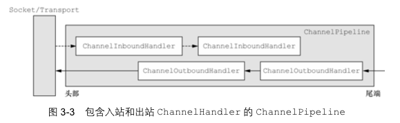

### 8.2 编码解码器

> - 当Netty发送或者接手一个消息的时候，就会发生一次数据转换；入栈消息会被进行解码：**将Socket中的字节码转换为另一种格式，比如java对象**；如果是出栈消息，就会将对象转换成字节码，传递给Socket发送给客户端；
> - Netty提供的一系列使用的编码解码器，都实现了ChannelInboundHander或者ChannelOutboundHandler接口；在这些类中，channelRead方法已经被重写完成；以入栈为例，对于每个从入栈Channel读取的消息，这个方法都会被调用；随后，将会调用解码器所提供的decode()方法进行解码，并将已经解码的字节转发给ChannelPipeline中的下一个ChannelInboundHandler；

#### 8.2.1 解码器-ByteToMessageDecoder

> 解码器就是用于对字节数据进行解码；类继承关系如下：
>
> 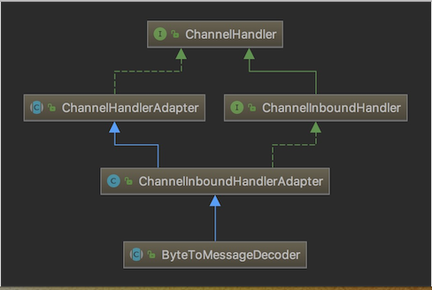

自定义一个解码器ToIntegerDecoder；

```java
/**
* 这个例子，每次入站从ByteBuf中读取4字节，将其解码为一个int，然后将它添加到下一个List中。当没* 有更多元素可以被添加到该List中时，它的内容将会被发送给下一个ChannelInboundHandler。int在 * 被添加到List中时，会被自动装箱为Integer。在调用readInt()方法前必须验证所输入的ByteBuf是否* 具有足够的数据
*/
public class ToIntegerDecoder extends ByteToMessageDecoder {
    @Override
    protected void decode(ChannelHandlerContext ctx, ByteBuf in, List<Object> out) throws Exception {
        if (in.readableBytes() >= 4) {
            out.add(in.readInt());
        }
    }
}

```

#### 8.2.2 编码器-MessageToByteEncoder

```java
class ClientToLongEecoder extends MessageToByteEncoder<Long> {

    @Override
    protected void encode(ChannelHandlerContext ctx, Long msg, ByteBuf out) throws Exception {
        System.out.println("客户端的encode方法被调用");
        System.out.println("客户端的encode的msg=" + msg);
        out.writeLong(msg);
    }
}
```

#### 8.2.3 编解码器案例

- 服务器端：

```java
package com.zsl.inoutbound;

import io.netty.bootstrap.ServerBootstrap;
import io.netty.buffer.ByteBuf;
import io.netty.channel.*;
import io.netty.channel.nio.NioEventLoopGroup;
import io.netty.channel.socket.SocketChannel;
import io.netty.channel.socket.nio.NioServerSocketChannel;
import io.netty.handler.codec.ByteToMessageDecoder;
import io.netty.handler.codec.MessageToByteEncoder;

import java.util.List;

/**
 * @author ${张世林}
 * @date 2020/02/22
 * 作用：
 */
public class MyServer {

    public static void main(String[] args) {
        NioEventLoopGroup bossGroup = new NioEventLoopGroup(1);
        NioEventLoopGroup workerGroup = new NioEventLoopGroup(8);
        try {
            ServerBootstrap bootstrap = new ServerBootstrap();
            bootstrap.group(bossGroup, workerGroup)
                    .channel(NioServerSocketChannel.class)
                    .childHandler(new MyServerInitializer());
            ChannelFuture channelFuture = bootstrap.bind(7000).sync();
            channelFuture.channel().closeFuture().sync();


        } catch (Exception e) {
            e.printStackTrace();
        } finally {
            bossGroup.shutdownGracefully();
            workerGroup.shutdownGracefully();
        }

    }
}

class MyServerInitializer extends ChannelInitializer<SocketChannel> {
    @Override
    protected void initChannel(SocketChannel ch) throws Exception {
        ChannelPipeline pipeline = ch.pipeline();
        /**
         * 服务器端解码器放在最前面
         * 然后再添加处理业务的handler
         * 然后再添加服务器端的编码器，业务处理完成以后，再经过编码器进行编码
         */
        pipeline.addLast(new ServerToLongDecoder());
        pipeline.addLast(new MyServerHandler());
        pipeline.addLast(new ServerToLongEecoder());
    }
}

/**
 * 自定义解码器，用于将数据转换为long类型的数据，并传递给下一个handler
 */
class ServerToLongDecoder extends ByteToMessageDecoder {
    /**
     *
     * @param ctx 上下文容器
     * @param in 入栈的bytebuf数据
     * @param out 将解码后的数据，传递给下一个handler
     * @throws Exception
     */
    @Override
    protected void decode(ChannelHandlerContext ctx, ByteBuf in, List<Object> out) throws Exception {
        System.out.println("服务器端解码器被调用");
        if (in.readableBytes() >= 8) {
            out.add(in.readLong());
        }
    }
}

/**
 * 客户端编码器
 */
class ServerToLongEecoder extends MessageToByteEncoder<Long> {

    @Override
    protected void encode(ChannelHandlerContext ctx, Long msg, ByteBuf out) throws Exception {
        System.out.println("服务器的encode方法被调用");
        System.out.println("服务器的encode的msg=" + msg);
        out.writeLong(msg);
    }
}

/**
 * 自定义业务的处理器
 */
class MyServerHandler extends SimpleChannelInboundHandler<Long> {
    @Override
    protected void channelRead0(ChannelHandlerContext ctx, Long msg) throws Exception {
        System.out.println("服务器端将数据进行解码，得到的数据：" + msg);
        ctx.channel().writeAndFlush(6666L);
    }
}
```

- 客户端：

```java
package com.zsl.inoutbound;

import io.netty.bootstrap.Bootstrap;
import io.netty.buffer.ByteBuf;
import io.netty.buffer.Unpooled;
import io.netty.channel.*;
import io.netty.channel.nio.NioEventLoopGroup;
import io.netty.channel.socket.SocketChannel;
import io.netty.channel.socket.nio.NioSocketChannel;
import io.netty.handler.codec.ByteToMessageDecoder;
import io.netty.handler.codec.MessageToByteEncoder;
import io.netty.util.CharsetUtil;

import java.util.List;

/**
 * @author ${张世林}
 * @date 2020/02/22
 * 作用：
 */
public class MyClient {

    public static void main(String[] args) {
        NioEventLoopGroup group = new NioEventLoopGroup();
        try {
            Bootstrap bootstrap = new Bootstrap();
            bootstrap.group(group)
                    .channel(NioSocketChannel.class)
                    .handler(new MyClientInitializer());
            ChannelFuture channelFuture = bootstrap.connect("127.0.0.1", 7000).sync();
            channelFuture.channel().closeFuture().sync();
        } catch (Exception e) {
            e.printStackTrace();
        } finally {
            group.shutdownGracefully();
        }
    }
}

class MyClientInitializer extends ChannelInitializer<SocketChannel> {
    @Override
    protected void initChannel(SocketChannel ch) throws Exception {
        ChannelPipeline pipeline = ch.pipeline();
        /**
         * 客户端的链式处理，是从后往前的，所以链表最前面是编码器
         * 其次是处理客户端业务的handler
         * 然后是解码器
         * 最后是接收数据的handler
         */
        pipeline.addLast(new ClientToLongEecoder());
        pipeline.addLast(new ClientHandler());
        pipeline.addLast(new ClientToLongDecoder());
        pipeline.addLast(new ClientAcceptHandler());
    }
}

/**
 * 客户端编码器
 */
class ClientToLongEecoder extends MessageToByteEncoder<Long> {

    @Override
    protected void encode(ChannelHandlerContext ctx, Long msg, ByteBuf out) throws Exception {
        System.out.println("客户端的encode方法被调用");
        System.out.println("客户端的encode的msg=" + msg);
        out.writeLong(msg);
    }
}

/**
 * 客户端解码器
 */
class ClientToLongDecoder extends ByteToMessageDecoder {
    @Override
    protected void decode(ChannelHandlerContext ctx, ByteBuf in, List<Object> out) throws Exception {
        System.out.println("客户端解码器被调用");
        if (in.readableBytes() >= 8) {
            out.add(in.readLong());
        }
    }
}

/**
 * 自定义客户端处理器
 */
class ClientHandler extends SimpleChannelInboundHandler<Long> {
    @Override
    protected void channelRead0(ChannelHandlerContext ctx, Long msg) throws Exception {
        System.out.println("客户端接收到消息：" + msg);
    }

    @Override
    public void channelActive(ChannelHandlerContext ctx) throws Exception {
        Long msg = 2345L;
        System.out.println("客户端发送数据：" + msg);
        ctx.writeAndFlush(msg);
    }
}

class ClientAcceptHandler extends SimpleChannelInboundHandler<Long> {
    @Override
    protected void channelRead0(ChannelHandlerContext ctx, Long msg) throws Exception {
        System.out.println("客户端接收到消息：" + msg);
    }

}
```

## 9. Netty协议传输

### 9.1 TCP粘包拆包

> ​	**由于TCP是面向连接、面向流的，提供高可靠性服务；收发两端（客户端和服务器端）都要有意义成对的socket；因此，发送端为了将多个发送给接收端的数据包，跟有效的发送给对方，使用了优化算法（Nagle算法），将多次间隔较小且数据量小的数据，合并成一个大的数据块，然后进行封包；接收端进行拆包的时候，是以包为单位，所以可能会导致接收端指向接收一个个小的数据，而不是一次性接收一个较大的数据块；**例如：假设客户端分别发送了两个数据包D1和D2给服务端，由于服务端一次读取到字节数是不确定的，故可能存在以下四种情况：
>
> - 服务器端分两次读取了两个独立的数据包，分别是D1与D2，没有粘包和拆包；
> - 服务器端一次接收到了两个数据包，D1与D2粘在了一起，称之为TCP粘包；
> - 服务器端第一次读取了D2的一部分，第二次读取了D1的全部与D2的一部分，称为拆包；
> - 服务器端第一次读取了D1的一部分，第二次读取了D2的全部与D1的一部分，称为拆包；
>
> 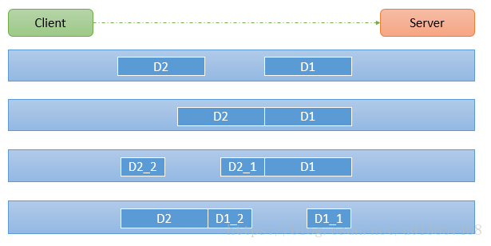

### 9.2 粘包拆包实例

- 服务器端：接收客户端发送过来的数据，并会送UUID；

```java
package com.zsl.tcp;

import io.netty.bootstrap.ServerBootstrap;
import io.netty.buffer.ByteBuf;
import io.netty.buffer.Unpooled;
import io.netty.channel.*;
import io.netty.channel.nio.NioEventLoopGroup;
import io.netty.channel.socket.SocketChannel;
import io.netty.channel.socket.nio.NioServerSocketChannel;
import io.netty.util.CharsetUtil;

import java.util.UUID;

/**
 * @author ${张世林}
 * @date 2020/02/22
 * 作用：
 */
@SuppressWarnings("all")
public class MyServer {

    public static void main(String[] args) {
        NioEventLoopGroup bossGroup = new NioEventLoopGroup(1);
        NioEventLoopGroup workerGroup = new NioEventLoopGroup(8);
        try {
            ServerBootstrap bootstrap = new ServerBootstrap();
            bootstrap.group(bossGroup, workerGroup)
                    .channel(NioServerSocketChannel.class)
                    .childHandler(new MyServerInitializer());
            ChannelFuture channelFuture = bootstrap.bind(7000).sync();
            channelFuture.channel().closeFuture().sync();


        } catch (Exception e) {
            e.printStackTrace();
        } finally {
            bossGroup.shutdownGracefully();
            workerGroup.shutdownGracefully();
        }

    }
}

class MyServerInitializer extends ChannelInitializer<SocketChannel> {
    @Override
    protected void initChannel(SocketChannel ch) throws Exception {
        ChannelPipeline pipeline = ch.pipeline();
        pipeline.addLast(new MyServerHandler());
    }
}

/**
 * 自定义业务的处理器
 */
class MyServerHandler extends SimpleChannelInboundHandler<ByteBuf> {
    private int count;
    @Override
    protected void channelRead0(ChannelHandlerContext ctx, ByteBuf msg) throws Exception {
        byte[] buffer = new byte[msg.readableBytes()];
        msg.readBytes(buffer);
        String str = new String(buffer, CharsetUtil.UTF_8);
        System.out.println("服务器端接收到的数据：" + str);
        System.out.println("服务器接收到消息量：" + (++this.count));

        ctx.writeAndFlush(Unpooled.copiedBuffer(UUID.randomUUID().toString(), CharsetUtil.UTF_8));
    }

    @Override
    public void exceptionCaught(ChannelHandlerContext ctx, Throwable cause) throws Exception {
        ctx.close();
    }
}
```

- 客户端：发送数据，发送十次，会导致粘包拆包现象；

```java
package com.zsl.tcp;

import io.netty.bootstrap.Bootstrap;
import io.netty.buffer.ByteBuf;
import io.netty.buffer.Unpooled;
import io.netty.channel.*;
import io.netty.channel.nio.NioEventLoopGroup;
import io.netty.channel.socket.SocketChannel;
import io.netty.channel.socket.nio.NioSocketChannel;
import io.netty.util.CharsetUtil;

/**
 * @author ${张世林}
 * @date 2020/02/22
 * 作用：
 */
@SuppressWarnings("all")
public class MyClient {

    public static void main(String[] args) {
        NioEventLoopGroup group = new NioEventLoopGroup();
        try {
            Bootstrap bootstrap = new Bootstrap();
            bootstrap.group(group)
                    .channel(NioSocketChannel.class)
                    .handler(new MyClientInitializer());
            ChannelFuture channelFuture = bootstrap.connect("127.0.0.1", 7000).sync();
            channelFuture.channel().closeFuture().sync();
        } catch (Exception e) {
            e.printStackTrace();
        } finally {
            group.shutdownGracefully();
        }
    }
}

class MyClientInitializer extends ChannelInitializer<SocketChannel> {
    @Override
    protected void initChannel(SocketChannel ch) throws Exception {
        ChannelPipeline pipeline = ch.pipeline();
        pipeline.addLast(new ClientHandler());
    }
}


/**
 * 自定义客户端处理器
 */
class ClientHandler extends SimpleChannelInboundHandler<ByteBuf> {
    private int count;
    @Override
    protected void channelRead0(ChannelHandlerContext ctx, ByteBuf msg) throws Exception {
        byte[] buffer = new byte[msg.readableBytes()];
        msg.readBytes(buffer);
        String str = new String(buffer, CharsetUtil.UTF_8);
        System.out.println("客户端接收到消息：" + str);
        System.out.println("客户端接收消息数量：" + (++this.count));
    }

    @Override
    public void channelActive(ChannelHandlerContext ctx) throws Exception {
        for (int i = 0; i < 10; i++) {
            ByteBuf byteBuf = Unpooled.copiedBuffer("hello,server" + i, CharsetUtil.UTF_8);
            ctx.writeAndFlush(byteBuf);
        }
    }
}

```

### 9.3 自定义TCP-Protocol

> ​	自定义TCP的传输协议Protocol，能够很好的处理消息发送的格式，避免发送消息出现的粘包、拆包问题；自定义Protocol，会涉及到自定义编解码器；

#### 9.3.1 自定义Protocol实例

- 创建协议数据疯转对象

```java
package com.zsl.tcp.protocol;

import lombok.AllArgsConstructor;
import lombok.Data;
import lombok.NoArgsConstructor;

/**
 * @author ${张世林}
 * @date 2020/02/23
 * 作用：
 */
@Data
@AllArgsConstructor
@NoArgsConstructor
public class MessageProtocol {
    private Integer len;
    private byte[] content;
}

```

- 客户端：客户端自定义MessageProtocol，使用MessageProtocol来对需要传输的数据进行封装；

```java
package com.zsl.tcp.protocol;

import io.netty.bootstrap.Bootstrap;
import io.netty.buffer.ByteBuf;
import io.netty.buffer.Unpooled;
import io.netty.channel.*;
import io.netty.channel.nio.NioEventLoopGroup;
import io.netty.channel.socket.SocketChannel;
import io.netty.channel.socket.nio.NioSocketChannel;
import io.netty.handler.codec.MessageToByteEncoder;
import io.netty.util.CharsetUtil;

/**
 * @author ${张世林}
 * @date 2020/02/22
 * 作用：
 */
@SuppressWarnings("all")
public class MyClient {

    public static void main(String[] args) {
        NioEventLoopGroup group = new NioEventLoopGroup();
        try {
            Bootstrap bootstrap = new Bootstrap();
            bootstrap.group(group)
                    .channel(NioSocketChannel.class)
                    .handler(new MyClientInitializer());
            ChannelFuture channelFuture = bootstrap.connect("127.0.0.1", 7000).sync();
            channelFuture.channel().closeFuture().sync();
        } catch (Exception e) {
            e.printStackTrace();
        } finally {
            group.shutdownGracefully();
        }
    }
}

class MyClientInitializer extends ChannelInitializer<SocketChannel> {
    @Override
    protected void initChannel(SocketChannel ch) throws Exception {
        ChannelPipeline pipeline = ch.pipeline();
        pipeline.addLast(new MyMessageEncoder());
        pipeline.addLast(new MyMessageEncoder());
        pipeline.addLast(new ClientHandler());
    }
}


/**
 * 自定义客户端处理器
 */
class ClientHandler extends SimpleChannelInboundHandler<MessageProtocol> {
    /**
     * 使用客户端发送十条数据，自定义协议，让服务器实现拆包分包
     * @param ctx
     * @param msg
     * @throws Exception
     */
    @Override
    protected void channelRead0(ChannelHandlerContext ctx, MessageProtocol msg) throws Exception {
        byte[] content = msg.getContent();
        System.out.println("客户端接收消息：" + new String(content, CharsetUtil.UTF_8) + "，消息长度：" + content.length);
    }

    @Override
    public void channelActive(ChannelHandlerContext ctx) throws Exception {
        for (int i = 0; i < 10; i++) {
            String str = "今天天气好" + i;
            byte[] content = str.getBytes(CharsetUtil.UTF_8);
            int length = content.length;
            //创建协议对象
            MessageProtocol protocol = new MessageProtocol();
            protocol.setLen(length);
            protocol.setContent(content);
            ctx.writeAndFlush(protocol);
        }
    }
}

class MyMessageEncoder extends MessageToByteEncoder<MessageProtocol> {

    @Override
    protected void encode(ChannelHandlerContext ctx, MessageProtocol msg, ByteBuf out) throws Exception {
        System.out.println("编码器被调用");
        out.writeInt(msg.getLen());
        out.writeBytes(msg.getContent());
    }
}

```

- 服务器端：编写解码器，对传递的数据进行解码，解码成MessageProtocol对象；

```java
package com.zsl.tcp.protocol;

import io.netty.bootstrap.ServerBootstrap;
import io.netty.buffer.ByteBuf;
import io.netty.buffer.Unpooled;
import io.netty.channel.*;
import io.netty.channel.nio.NioEventLoopGroup;
import io.netty.channel.socket.SocketChannel;
import io.netty.channel.socket.nio.NioServerSocketChannel;
import io.netty.handler.codec.ReplayingDecoder;
import io.netty.util.CharsetUtil;
import sun.plugin2.message.Message;

import java.util.List;
import java.util.UUID;

/**
 * @author ${张世林}
 * @date 2020/02/22
 * 作用：
 */
@SuppressWarnings("all")
public class MyServer {

    public static void main(String[] args) {
        NioEventLoopGroup bossGroup = new NioEventLoopGroup(1);
        NioEventLoopGroup workerGroup = new NioEventLoopGroup(8);
        try {
            ServerBootstrap bootstrap = new ServerBootstrap();
            bootstrap.group(bossGroup, workerGroup)
                    .channel(NioServerSocketChannel.class)
                    .childHandler(new MyServerInitializer());
            ChannelFuture channelFuture = bootstrap.bind(7000).sync();
            channelFuture.channel().closeFuture().sync();


        } catch (Exception e) {
            e.printStackTrace();
        } finally {
            bossGroup.shutdownGracefully();
            workerGroup.shutdownGracefully();
        }

    }
}

class MyServerInitializer extends ChannelInitializer<SocketChannel> {
    @Override
    protected void initChannel(SocketChannel ch) throws Exception {
        ChannelPipeline pipeline = ch.pipeline();
        pipeline.addLast(new MyMessageDecoder());
        pipeline.addLast(new MyMessageEncoder());
        pipeline.addLast(new MyServerHandler());
    }
}

/**
 * 自定义业务的处理器
 */

@SuppressWarnings("all")
class MyServerHandler extends SimpleChannelInboundHandler<MessageProtocol> {

    @Override
    protected void channelRead0(ChannelHandlerContext ctx, MessageProtocol msg) throws Exception {
        String str = new String(msg.getContent(), CharsetUtil.UTF_8);
        System.out.println("服务器端接收到的数据：" + str + "，长度" + msg.getLen());
        byte[] response = UUID.randomUUID().toString().getBytes(CharsetUtil.UTF_8);
        MessageProtocol protocol = new MessageProtocol();
        protocol.setLen(response.length);
        protocol.setContent(response);
        ctx.writeAndFlush(protocol);
    }

    @Override
    public void exceptionCaught(ChannelHandlerContext ctx, Throwable cause) throws Exception {
        ctx.close();
    }
}

/**
 * 自定义解码器
 */
class MyMessageDecoder extends ReplayingDecoder<Void> {
    @Override
    protected void decode(ChannelHandlerContext ctx, ByteBuf in, List<Object> out) throws Exception {
        System.out.println("解码器被调用");
        int length = in.readInt();
        byte[] content = new byte[length];
        in.readBytes(content);

        //封装成MessageProtocol对象，传递给handler
        MessageProtocol protocol = new MessageProtocol();
        protocol.setContent(content);
        protocol.setLen(length);
        out.add(protocol);
    }
}
```

## 10. Netty实现RPC框架


