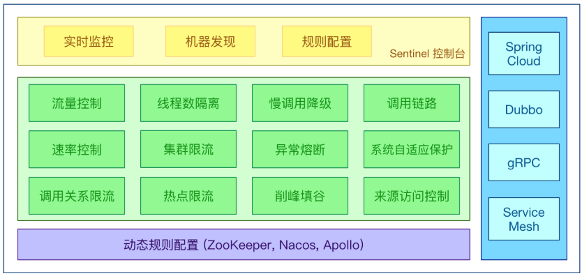

[TOC]

# SpringCloud

## 1.SpringCloud架构

### 1.1 SpringCloud网站

> - https://cloud.spring.io/spring-cloud-static/Hoxton.SR1/reference/htmlsingle/  SpringCloud官网
> - https://www.bookstack.cn/read/spring-cloud-docs/docs-index.md   中文文档
> - https://docs.spring.io/spring-boot/docs/2.2.2.RELEASE/reference/htmlsingle/  SpringBoot官网

### 1.2 SpringCloud技术选型

> - 服务注册中心：
>   - `Zookeeper`
>   - `Console`
>   - `Nacos`（推荐）
>   - `Eureka`（不推荐）
> - 服务调用：
>   - `Ribbon`（不推荐）
>   - `LoadBalancer`
> - 服务调用：
>   - `Feign`
>   - `OpenFeign`（推荐）
> - 服务降级：
>   - `Hystrix`（不推荐）
>   - `resilence4j`（国外使用数多）
>   - `alibaba Sentinel`（推荐使用）
> - 服务网关：
>   - `Zuul`（不推荐）
>   - `gateway`（推荐）
> - 服务配置：
>   - `Config`（不推荐）
>   - `Nacos`（推荐）
>   - `apollo`（推荐）
> - 服务主线：
>   - `Bus`（不推荐）
>   - `Nacos`（推荐）

### 1.3 SpringCloud pom.xml

```xml
<?xml version="1.0" encoding="UTF-8"?>

<project xmlns="http://maven.apache.org/POM/4.0.0" xmlns:xsi="http://www.w3.org/2001/XMLSchema-instance"
  xsi:schemaLocation="http://maven.apache.org/POM/4.0.0 http://maven.apache.org/xsd/maven-4.0.0.xsd">
  <modelVersion>4.0.0</modelVersion>

  <groupId>com.zsl.spring.cloud</groupId>
  <artifactId>springcloud2020</artifactId>
  <version>1.0-SNAPSHOT</version>
  <packaging>pom</packaging>

  <!--统一管理jar包版本-->
  <properties>
    <project.build.sourceEncoding>UTF-8</project.build.sourceEncoding>
    <maven.compiler.source>1.8</maven.compiler.source>
    <maven.compiler.target>1.8</maven.compiler.target>
    <junit.version>4.12</junit.version>
    <log4j.version>1.2.17</log4j.version>
    <lombok.version>1.16.18</lombok.version>
    <mysql.version>8.0.19</mysql.version>
    <druid.version>1.1.16</druid.version>
    <spring.boot.version>2.2.2.RELEASE</spring.boot.version>
    <spring.cloud.version>Hoxton.SR1</spring.cloud.version>
    <spring.cloud.alibaba.version>2.1.0.RELEASE</spring.cloud.alibaba.version>
    <mybatis.spring.boot.version>1.3.0</mybatis.spring.boot.version>
    <mysql.version>5.1.47</mysql.version>
  </properties>

  <!--子模块继承后,提供作用:锁定版本+子module不用groupId和version-->
  <dependencyManagement>
    <dependencies>
      <!--springboot 2.2.2-->
      <dependency>
        <groupId>org.springframework.boot</groupId>
        <artifactId>spring-boot-dependencies</artifactId>
        <version>${spring.boot.version}</version>
        <type>pom</type>
        <scope>import</scope>
      </dependency>
      <!--Spring cloud Hoxton.SR1-->
      <dependency>
        <groupId>org.springframework.cloud</groupId>
        <artifactId>spring-cloud-dependencies</artifactId>
        <version>${spring.cloud.version}</version>
        <type>pom</type>
        <scope>import</scope>
      </dependency>
      <!--Spring cloud alibaba 2.1.0.RELEASE-->
      <dependency>
        <groupId>com.alibaba.cloud</groupId>
        <artifactId>spring-cloud-alibaba-dependencies</artifactId>
        <version>${spring.cloud.alibaba.version}</version>
        <type>pom</type>
        <scope>import</scope>
      </dependency>
      <dependency>
        <groupId>mysql</groupId>
        <artifactId>mysql-connector-java</artifactId>
        <version>${mysql.version}</version>
      </dependency>
      <dependency>
        <groupId>com.alibaba</groupId>
        <artifactId>druid</artifactId>
        <version>${druid.version}</version>
      </dependency>
      <dependency>
        <groupId>org.projectlombok</groupId>
        <artifactId>lombok</artifactId>
      </dependency>
    </dependencies>
  </dependencyManagement>

  <build>
    <plugins>
      <plugin>
        <groupId>org.springframework.boot</groupId>
        <artifactId>spring-boot-maven-plugin</artifactId>
        <configuration>
          <fork>true</fork>
          <addResources>true</addResources>
        </configuration>
      </plugin>
    </plugins>
  </build>

  <!--第三方maven私服-->
  <repositories>
    <repository>
      <id>nexus-aliyun</id>
      <name>Nexus aliyun</name>
      <url>http://maven.aliyun.com/nexus/content/groups/public</url>
      <releases>
        <enabled>true</enabled>
      </releases>
      <snapshots>
        <enabled>false</enabled>
      </snapshots>
    </repository>
  </repositories>
</project>
```

## 2. 注册中心

### 2.1 Eureka注册中心

#### 2.1.1 Eureka基本介绍

> - `Eureka`是`Netflix`公司封装的来实现服务治理的框架；
>
> - `Eureka`采用的是C/S架构设计模式，`Eureka Server`作为服务注册功能的服务器，也就是注册中心；
>
> - `Eureka`使用客户端连接到`Eureka Server`并维持心跳连接；可通过运维界面查看`Eureka Client`是否正常注册、运行；
> - 在服务的注册与发现中，存在一个注册中心，会把当前服务器的信息（比如通讯端口、地址等）以别名的方式注册到注册中心；消费者从注册中心获取服务器信息，然后通过RPC实现远程服务调用；
>
> 

#### 2.1.2 Eureka架构

> `Eureka`包含：
>
> - `Eureka Server`：提供服务注册服务；哥哥微服务节点通过配置启动以后，会在`EurekaServer`中进行注册，这样`EurekaServer`中的服务注册表中将会存储所有可用服务节点的信息，服务节点的信息可以在界面中直观查看；
> - `Eureka Client`：是一个java客户端，用于简化Eureka Server的交互；客户端同时也具备一个内置的、使用轮循(`random-robin`)负载算法的负载均衡器；将会向`Eureka Server`发送心跳（默认周期为30s）；如果`Eureka Server`在多个心跳周期内没有接收到某个节点的心跳，`Eureka Server`将会从服务注册表中把这个服务节点移除；

#### 2.1.3 单机版Eureka Server

##### 2.3.1.1 Eureka Server

- 加入jar包；

```xml
    <dependencies>
        <dependency>
            <groupId>com.zsl.spring.cloud</groupId>
            <artifactId>cloud-api-commons</artifactId>
            <version>1.0-SNAPSHOT</version>
        </dependency>
        <dependency>
            <groupId>org.springframework.boot</groupId>
            <artifactId>spring-boot-starter-web</artifactId>
        </dependency>
        <dependency>
            <groupId>org.springframework.boot</groupId>
            <artifactId>spring-boot-starter-actuator</artifactId>
        </dependency>
        <dependency>
            <groupId>org.springframework.cloud</groupId>
            <artifactId>spring-cloud-starter-netflix-eureka-server</artifactId>
        </dependency>
        <dependency>
            <groupId>org.springframework.boot</groupId>
            <artifactId>spring-boot-devtools</artifactId>
            <scope>runtime</scope>
            <optional>true</optional>
        </dependency>
    </dependencies>
```

- 编写application.yml

```yml
server:
  port: 7001
eureka:
  instance:
    hostname: 127.0.0.1
  client:
#    false表示不需要向注册中心注册自己
    register-with-eureka: false
#    false表示自己就是注册中心，不需要去检索服务
    fetch-registry: false
#    eureka注册地址
    service-url:
      defaultZone: http://${eureka.instance.hostname}:${server.port}/eureka/
```

- 编写启动类

```java
@EnableEurekaServer
@SpringBootApplication
public class Eureka7001 {

    public static void main(String[] args) {
        SpringApplication.run(Eureka7001.class, args);
    }

}
```

##### 2.3.1.2 Eureka Client

- 加入依赖

```xml
        <dependency>
            <groupId>org.springframework.cloud</groupId>
            <artifactId>spring-cloud-starter-netflix-eureka-client</artifactId>
        </dependency>
```

- 开启Eureka Client

```java
@EnableEurekaClient
@SpringBootApplication
public class PaymentMain8001 {

    public static void main(String[] args) {
        SpringApplication.run(PaymentMain8001.class, args);
    }

}
```

- 编写application.yml

```yaml
eureka:
  client:
    register-with-eureka: true
    fetch-registry: true
    service-url:
      defaultZone: http://localhost:7001/eureka
```

##### 2.1.4 集群版Eureka Server

> 集群版`Eureka Server`需要相互注册，也就是在注册位置处编写集群中其他机器的地址；

- Eureka Server 7001机器的application.yml

```yaml
server:
  port: 7001
eureka:
  instance:
    hostname: eureka7001.com
  client:
#    false表示不需要向注册中心注册自己
    register-with-eureka: false
#    false表示自己就是注册中心，不需要去检索服务
    fetch-registry: false
#    eureka注册地址
    service-url:
      defaultZone: http://eureka7002.com:7002/eureka/

```

- Eureka Server 7002机器的application.yml

```yaml
server:
  port: 7002
eureka:
  instance:
    hostname: eureka7002.com
  client:
#    false表示不需要向注册中心注册自己
    register-with-eureka: false
#    false表示自己就是注册中心，不需要去检索服务
    fetch-registry: false
#    eureka注册地址
    service-url:
      defaultZone: http://eureka7001.com:7001/eureka/

```

#### 2.1.5 Eureka更多配置

```yaml
eureka:
  client:
    register-with-eureka: true
    fetch-registry: true
    service-url:
      defaultZone: http://localhost:7001/eureka,http://localhost:7002/eureka
  instance:
    instance-id: payment8002
#    访问路径可以显示ip
    prefer-ip-address: true
```

### 2.2 Discovary 服务发现

> 服务发现，主要作用是服务提供者`Provider`提供的服务信息，可能需要在代码中进行获取，在注册中心里面注册的所有服务，则需要使用Discovery；

- 用于获取注册中心的服务的对象`DiscoveryClient`；

```java
    /**
     * 服务发现的作用：主要是用于provider提供的服务信息，暴露出去，
     *  让客户端的人能够查看到你提供的服务
     */
    @Autowired
    private DiscoveryClient discoveryClient;
```

- 开启`Discovery`服务发现模式；

```java
@EnableDiscoveryClient   //开启服务发现
@EnableEurekaClient
@SpringBootApplication
public class PaymentMain8001 {

    public static void main(String[] args) {
        SpringApplication.run(PaymentMain8001.class, args);
    }

}
```

- 使用`DiscoveryClient`从注册中心拉取注册的信息

```java
    @GetMapping(value = "payment/discovery")
    public Object disCovery() {
        //得到服务清单列表
        List<String> list = discoveryClient.getServices();

        List<ServiceInstance> instances = discoveryClient.getInstances("CLOUD-PAYMENT-SERVICE");
        for (ServiceInstance instance : instances) {
            log.info(instance.getInstanceId() + "\t" + instance.getHost() + "\t" + instance.getPort() + "\t" + instance.getUri());
        }
        HashMap<Object, Object> map = new HashMap<>();
        map.put("list", list);
        map.put("instances", instances);
        map.put("discoveryClient", discoveryClient);
        return list;
    }
```


### 2.2 Zookeeper注册中心

#### 2.2.1 单机版Zookeeper

> 使用Zookeeper作为注册中心，首先需要启动Zookeeper；
>
> `./zkServer start`
>
> SpringCloud使用Zookeeper作为注册中心，Consumer与Provider都是加入相同的jar即可；
>
> 使用`@EnableDiscovery`注解来开启服务注册与发现功能；

- 第一步：加入jar包，如果启动报错，则可能是Zookeeper与服务器版本不一致，所以需要将版本替换；

```xml
      <dependency>
            <groupId>org.springframework.cloud</groupId>
            <artifactId>spring-cloud-starter-zookeeper-discovery</artifactId>
            <exclusions>
                <exclusion>
                    <groupId>org.apache.zookeeper</groupId>
                    <artifactId>zookeeper</artifactId>
                </exclusion>
            </exclusions>
        </dependency>
        <dependency>
            <groupId>org.apache.zookeeper</groupId>
            <artifactId>zookeeper</artifactId>
            <version>3.4.11</version>
        </dependency>
```

- 第二步：编写application.yml文件，Provider与Consumer编写方式一致；注册到Zookeeper，就是以项目名作为节点的；使用的是 **临时节点**；

```yaml
spring:
  application:
#    项目名称
    name: cloud-payment-service
  cloud:
    zookeeper:
      connect-string: localhost:2181
```

- 第三步：开启服务注册与发现；Provider与Consumer都是一致的开启方式；

```java
@EnableDiscoveryClient  //使用Consoul或者Zookeeper为注册中心，则都使用该注解
@SpringBootApplication
public class PaymentMain8004 {

    public static void main(String[] args) {
        SpringApplication.run(PaymentMain8004.class, args);
    }

}
```

- 第四步：根据Provider服务名称，调用对应的服务；

```java
    /**
     * 指定注册在Zookeeper上面的服务名
     */
    public static final String PAYMENT_URL = "http://cloud-payment-service";

    @Autowired
    private RestTemplate restTemplate;

    @GetMapping(value = "consumer/payment/get/{id}")
    public CommonResult get(@PathVariable("id") long id) {
        CommonResult result = restTemplate.getForObject(PAYMENT_URL + "/payment/get/" + id, CommonResult.class);
        return result;
    }
```

#### 2.2.2 集群版Zookeeper

```
spring:
  application:
#    项目名称
    name: cloud-payment-service
  cloud:
    zookeeper:
      connect-string: localhost:2181
```

### 2.3 Consul注册中心

> 官网：https://www.consul.io/intro/index.html
>
> SpringCloud整合Consul：https://www.springcloud.cc/spring-cloud-consul.html
>
> 下载地址：https://www.consul.io/downloads.html
>
> windows下启动Consul：
>
> - 进入consul文件夹，找到consul.exe所在目录；
> - 进入cmd界面，输入命令 `consul  agent -dev` 启动即可；
> - 进入浏览器，输入 `localhost:8500`进入运维界面；
>
> docker启动Consul：
>
> - `docker pull consul`
> - `mkdir -p /data/consul/{conf,data}`
> - `docker run --name consul -p 8500:8500 -v /data/consul/conf/:/consul/conf -v /data/consul/data/:/consul/data/ -d consul`

#### 2.3.1 单机版Consul

> 使用`@EnableDiscovery`注解来开启服务注册与发现功能；

- 第一步：加入jar包，

```xml
      <dependency>
            <groupId>org.springframework.cloud</groupId>
            <artifactId>spring-cloud-starter-consul-discovery</artifactId>
        </dependency>
```

- 第二步：编写application.yml文件，Provider与Consumer编写方式一致；

```yaml
spring:
  application:
#    项目名称
    name: cloud-payment-service
  cloud:
    consul:
      host: localhost
      port: 8500
      discovery: 
        service-name: ${spring.application.name}
```

- 第三步：开启服务注册与发现；Provider与Consumer都是一致的开启方式；

```java
@EnableDiscoveryClient  //使用Consoul或者Zookeeper为注册中心，则都使用该注解
@SpringBootApplication
public class PaymentMain8004 {

    public static void main(String[] args) {
        SpringApplication.run(PaymentMain8004.class, args);
    }

}
```

- 第四步：根据Provider服务名称，调用对应的服务；

```java
    /**
     * 指定注册在Consul上面的服务名
     */
    public static final String PAYMENT_URL = "http://cloud-payment-service";

    @Autowired
    private RestTemplate restTemplate;

    @GetMapping(value = "consumer/payment/get/{id}")
    public CommonResult get(@PathVariable("id") long id) {
        CommonResult result = restTemplate.getForObject(PAYMENT_URL + "/payment/get/" + id, CommonResult.class);
        return result;
    }
```

### 2.4 三大注册中心异同

| 组件名    | 编写语言 | 服务健康检查 | 对外暴露接口 | 与SpringCloud集成 |
| --------- | -------- | ------------ | ------------ | ----------------- |
| Eureka    | java     | 可赔支持     | HTTP         | 支持              |
| Consul    | Go       | 支持         | HTTP/DNS     | 支持              |
| Zookeeper | java     | 支持         | 客户端       | 支持              |

## 3. Ribbon负载均衡--服务调用

> `Robbin`是一种负载均衡LoadBalance策略，用于将客户端请求根据策略平摊到多个服务上，从而达到系统的HA高可用；
>
> `Nginx`是服务器负载均衡，客户端所有请求都会交给`Nginx`，然后由`Nginx`实现请求转发，即负载均衡是由服务器端实现的；
>
> `Ribbon`本地负载均衡，在调用微服务接口的时候，会在注册中心上获取注册信息服务列表之后缓存到JVM中，从而在本地实现RPC远程调用技术；

> 集中式LB：在服务的消费方和提供者之间使用独立的LB设备，比如F5或者Nginx等，由该设备负责将访问请求通过某种策略发送至服务的提供方；
>
> 进程内LB：**将LB集成在消费者端**，消费者从服务注册中心获取有哪些服务提供方的地址可用，然后再根据LB策略进行对应地址的访问；`Ribbon`是输入进程内`LB `，它是一个类库，集成于消费方进程，消费方通过它来获取到服务提供方的地址；

### 3.1 使用方式

> Ribbon对应的jar：
>
> ```xml
>         <dependency>
>             <groupId>org.springframework.cloud</groupId>
>             <artifactId>spring-cloud-starter-netflix-ribbon</artifactId>
>         </dependency>
> ```
>
> **Ribbon是消费者端集成的负载均衡工具，所以只需要在Consumer端加入指定jar即可；**
>
> **在SpringCloud-Eureka、SpringCloud-Zookeeper等pom中都已经将Ribbon集成进去了的；**

> `Ribbon`是与`RestTemplate`结合一起使用；可以不用搭配`Feign`，主要是用于指定LB；所以可以给RestTemplate指定LB负载均衡策略；
>
> 使用`Ribbon`对RestTemplate设置了LB策略之后，LB策略会按照设定的方式去调用Provider；

```
@Bean
@LoadBalanced
public RestTemplate restTemplate() {
	return new RestTemplate();
}
```

### 3.2 Ribbon负载规则

> - `com.netflix.loadbalancer.RoundRobinRule`  轮循算法
> - `com.netflix.loadbalancer.RandomRule`  随机算法
> - `com.netflix.loadbalancer.RetryRule`  先按照`RoundRobinRule`策略获取服务，如果获取服务失败，则在指定时间内进行重试，获取可用的服务；
> - `com.netflix.loadbalancer.WeightedResponseTimeRule`  对`RoundRobinRule`的扩展，响应速度越快的实例，选择权重越大，越容易选择；
> - `com.netflix.loadbalancer.BestAvailableRule`  会先过滤掉由于多次访问故障而处于断路器跳闸状态的服务，然后选择一个并发量最小的服务；
> - `com.netflix.loadbalancer.AvailabilityFilteringRule`  先过滤掉故障实例，然后在选择并发较小的实例；
> - `com.netflix.loadbalancer.ZoneAvoidanceRule`  默认规则，复合判断server所在区域的性能和server的可用性选择服务器；

### 3.3 使用案例

​	指定Ribbon自定义策略时，不能将该类放置在`@ComponentScan`注解所扫描到的包中；

```java
@EnableEurekaClient
@SpringBootApplication
@RibbonClient(name = "CLOUD-PAYMENT-SERVICE", configuration = MyRibbon.class)
public class PaymentMain80 {

    public static void main(String[] args) {
        SpringApplication.run(PaymentMain80.class, args);
    }

}
```

```java

@Configuration
public class BeanConfiguration {
    /**
     * 开启负载均衡机制
     * @return
     */
    @Bean
    @LoadBalanced
    public RestTemplate restTemplate() {
        return new RestTemplate();
    }
}
```

```java
@Configuration
public class MyRibbon {

    @Bean
    public IRule myRule() {
        // 定义为随机
        return new RandomRule();
    }
}

```

### 3.4 Ribbon参数设置

> - `ribbon.ReadTimeout=1000`  //处理请求的超时时间，默认为1s
> - `ribbon.ConnectTimeout=1000`  //连接建立的超时时长，默认为1s
> - `ribbon.MaxAutoRetries=1` //同一台实例的最大重试次数，但是不包括首次调用，默认为1次
> - `ribbon.MaxAutoRetriesNextServer=0` //重试负载均衡其他实例的最大重试次数，不包括首次调用，默认为0次
> - `ribbon.OkToRetryOnAllOperations=false` //是否对所有操作都重试，默认false

## 4. OpenFeign--服务调用

### 4.1 基础介绍

> `SpringCloud`提供了`Ribbon + RestTemplate` 的方式来进行服务调用，但是往往一个客户端涉及多个服务端的调用工作，使用该方法会导致部分代码冗余；
>
> `Feign`是使用注解的方式，将服务定义、服务依赖编写到注解中，自动封装为一个接口，实现Client端代码调用；
>
> `Feign`是对Ribbon的包装，实现服务的LoadBalance以及调用，所以在`Feign`的pom中存在`Ribbon`的依赖；

### 4.2 Feign与OpenFeign

> - `Feign`：是SpringCloud组件中的一个轻量级`Restful`的HTTP服务；内置了`Ribbon`，用于负载均衡；
> - `OpenFeign`：是 spring cloud 在 feign 的基础上支持 spring mvc 注解 ，如 @RequestMapping 等等，OpenFeign 的 @FeignClient 可以解析Spring MVC 的 @RequestMapping 注解下的接口，并通过动态代理的方式生产实现类 ，实现类中做负载均衡并且调用其他服务。


### 4.3 OpenFeign使用案例

- 在消费者端加入jar；

```xml
        <dependency>
            <groupId>org.springframework.cloud</groupId>
            <artifactId>spring-cloud-starter-openfeign</artifactId>
        </dependency>
```

- 在启动类开启OpenFeign；

```java
@EnableFeignClients  //开启OpenFeign
@SpringBootApplication
public class OrderPaymentFeign80 {

    public static void main(String[] args) {
        SpringApplication.run(OrderPaymentFeign80.class, args);
    }

}
```

- 编写Feign的接口，添加FeignClient注解；

```java
@Component
@FeignClient(value = "CLOUD-PAYMENT-SERVICE")
public interface PaymentFeignService {

    @PostMapping(value = "payment/create")
    public CommonResult create(@RequestBody Payment payment);

    @GetMapping(value = "payment/get/{id}")
    public CommonResult<Payment> getPaymentById(@PathVariable("id") Long id);
}
```

- 编写Consumer的Controller，直接调用Feign的接口即可；

```java
  @Autowired
    private PaymentFeignService paymentFeignService;

    @PostMapping(value = "consumer/payment/create")
    public CommonResult create(@RequestBody Payment payment) {
        return paymentFeignService.create(payment);
    }

    @GetMapping(value = "consumer/payment/get/{id}")
    public CommonResult<Payment> getPaymentById(@PathVariable("id") Long id) {
        return paymentFeignService.getPaymentById(id);
    }
```

- 如果需要开启Feign的DEBUG日志，则：

```java
@Configuration
public class FeignConfig {

    @Bean
    Logger.Level feignLoggerLevel() {
        return Logger.Level.FULL;
    }
}
```

```yaml
logging:
  level:
    com.zsl.spring.cloud.service.PaymentFeignService: debug
```

### 4.4 Feign参数配置

> - `feign.hystrix.enabled=false` //Feign是否启用断路器,默认为false
> - `feign.client.config.default.connectTimeout=10000` //Feign的连接建立超时时间，默认为10秒
> - `feign.client.config.default.readTimeout=60000` //Feign的请求处理超时时间，默认为60
> - `feign.client.config.default.retryer=feign.Retryer.Default` //Feign使用默认的超时配置，在该类源码中可见，默认单次请求最大时长1秒，重试5次

## 5. Hystrix--断路器

> `Hystrix`是一个用于分布式系统的**延迟和容错**的开源库，在分布式系统里，许多依赖不可避免的会调用失败，出现超时等情况；**`Histrix`不会导致整体服务失败，避免级联故障，以提高分布式系统弹性；**
>
> `Hystrix`本身就是一种开关装置，当某个服务单元出现异常，通过断路器的故障监控，**向调用方返回一个符合预期的、可处理的备选响应(FallBack)，而不是长时间的等待或者抛出调用方无法处理的异常；**，这样就能够保证服务调用方的线程不会被长时间、不必要地占用，从而避免了故障在分布式系统中蔓延、雪崩；

> `Histrix`主要提供的功能：
>
> - 服务降级
> - 服务熔断
> - 服务限流
> - 服务监控

### 5.1 服务降级

> ​	**Hystrix通常情况下是在Consumer端配置**，也可以使用在Provider端；

#### 5.1 方法级别的Provider、Consumer服务降级

> ​	服务端使用Hystrix服务降级功能，能够保证服务的正常运行而不至于大量请求压垮该服务器；
>
> ​	消费者端使用Hystrix进行服务降级，也能够很好地进行自我保护，避免服务崩溃；（例如：provider异常，如果不使用服务降级，则大量请求一直等待，导致consumer异常；或者大量请求直接请求consumer，consumer响应速度慢，也可以使用Hystrix服务降级）；
>
> 使用的注解主要包括：
>
> - `@HystrixCommand`：为方法开启hystrix服务降级功能，可以使用`@HystrixProperty`注解设置需要进行降级的异常内容；
>   - `fallbackMethod`：执行hystrix服务降级所进入的方法；
>   - `commandProperties`：执行执行降级功能的properties对象；
> - `@HystrixProperty`：设置不同类型的异常，需要走降级的流程；
> - `@EnableCircuitBreaker`：开启hystrix服务降级功能；加载到启动类中；

```java
@HystrixCommand(fallbackMethod = "paymentInofTimeOutFallback", commandProperties = {
    //如果执行该方法超过三秒，则调用hystrix方法
    @HystrixProperty(name = "execution.isolation.thread.timeoutInMilliseconds", value = "3000")
})
public String paymentInofTimeOut(int id) {
    int timeUnm = 5;
    try {
        TimeUnit.SECONDS.sleep(timeUnm);
    } catch (InterruptedException e) {
        e.printStackTrace();
    }
    return "线程池" + Thread.currentThread().getName() + "  paymentInofTimeOut, id = " + id + "  ,超时方法耗时" + timeUnm;
}


public String paymentInofTimeOutFallback(int id) {
    try {
        log.info("服务降级方法被调用");
        return "已经超时了";
    } catch (Exception e) {
        return "已经超时了";
    }
}
```

```java
@EnableEurekaClient
@SpringBootApplication
@EnableCircuitBreaker
@EnableHystrix
public class PaymentHystrixMain8001 {
    public static void main(String[] args) {
        SpringApplication.run(PaymentHystrixMain8001.class, args);
    }
}
```

#### 5.1.2 DefaultProperties

> ​	针对方法级别的`@HystrixCommand`会导致大量代码冗余，所以需要配置默认执行的Hystrix；

- 在类级别上添加注解`@DefaultProperties`，配置全局默认的hystrix处理方法；

```java
@DefaultProperties(defaultFallback = "defaultGlobalFallBackMethod")
```

- 编写配置的方法；

```java
    public String defaultGlobalFallBackMethod() {
        return "全局的Hystrix异常处理";
    }
```

- 在需要执行Hystrix的地方添加`@HystrixCommond`注解；

#### 5.1.3 Feign整合Hystrix

> ​	在Consumer端的`Feign`中对服务配置服务降级，能够实现业务也服务降级代码解耦功能；

- 编写Feign接口的实现类，用于执行Feign的hystrix；

```java
@Component
public class PaymentFallBackService implements PaymentFeignService {
    @Override
    public String paymentInofOk(int id) {
        return "feign中的hystrix，中执行的paymentInofOk方法降级";
    }

    @Override
    public String paymentInofTimeOut(int id) {
        return "feign中的hystrix，中执行的paymentInofTimeOut方法降级";
    }
}
```

- 在@FeignClient注解中添加fallback，将该实现类加入进feign中；

```java
@FeignClient(value = "CLOUD-HYSTRIX-PAYMENT-SERVICE",fallback = PaymentFallBackService.class)
```

- 在`application.yml`中开启feign的hystrix功能；

```yaml
feign:
  hystrix:
    # 开启feign中的hystrix功能
    enabled: true
```

- 即可针对所有方法实现服务降级；

### 5.2 服务熔断

> ​	熔断机制是应对雪崩效应的一种微服务链路保护机制；当扇出链路的某个微服务出错不可用或者响应时间太长，会进行服务降级，进而熔断该节点微服务的调用，快速返回错误的响应信息；
>
> ​	**当服务检测到该节点微服务调用响应正常以后，恢复调用链路；**
>
> ​	在SpringCloud中使用的是Hystrix进行熔断；Hystrix会监控微服务间调用的状况，当失败的调用到达一定阈值，缺省是5秒内20次调用失败，就会启动熔断机制；
>
> ​	**熔断机制采用的是`@HystrixCommod`注解；**

> 熔断恢复过程：
>
> - 熔断打开：请求不在进行调用当前服务，内部设置时钟一般为MTTR（平均故障处理时间），当到达该时长，则进入半熔断状态；
> - 熔断关闭：熔断关闭不会对服务进行熔断；
> - 熔断半开：部分请求分步规则调用当前服务，如果请求成功且符合规则，认为当前服务恢复正常，关闭熔断；

> 熔断涉及参数：**快照时间窗、请求总数阈值、错误百分比阈值**；
>
> - **快照时间窗**：断路器确定是否打开需要统计一些请求和错误数据，而统计的时间范围就是快照的时间窗，默认为10s；
> - **请求总数阈值**：在快照时间窗内，必须满足请求总数阈值才有资格熔断；默认值为20次；意味着在10s内，调用该链路的请求次数未超过20次，即是全部失败也不会执行熔断；
> - **错误百分比阈值**：默认值为50%；当请求总数的快照时间窗内超过了请求总数阈值，且失败率超过50%，则执行熔断操作；
> - **半开状态时间**：默认是5s；在执行服务熔断以后，会在默认5s内处于熔断状态，5s之后处于半开状态，会让其中一个请求去调用该链路，如果成功，则断路器关闭，如果失败，则断路器重新开启；

```java
/**
     * 服务熔断
     */
@HystrixCommand(fallbackMethod = "paymentCircuitBreaker_fallback", commandProperties = {
    //下面就是： 开启断路器，在10秒钟内10次请求中，失败次数达到了60%，就会执行断路器
    @HystrixProperty(name = "circuitBreaker.enabled", value = "true"),  //是否开启断路器
    @HystrixProperty(name = "circuitBreaker.requestVolumeThreshold", value = "10"),  //请求次数
    @HystrixProperty(name = "circuitBreaker.sleepWindowInMilliseconds", value = "10000"),  //时间窗口器
    @HystrixProperty(name = "circuitBreaker.errorThresholdPercentage", value = "60")  //失败率达到多少
})
public String paymentCircuitBreaker(int id) {
    if (id < 0) {
        throw new ArithmeticException("id不能为负数");
    }
    String uuid = IdUtil.simpleUUID();
    return Thread.currentThread().getName() + "\t" + "调用成功，流水号：" + uuid;
}

public String paymentCircuitBreaker_fallback(int id) {
    return "服务熔断方法被调用，";
}
```

## 6. Gateway--服务网关

### 6.1 基本介绍

> SpringCloud Gateway 使用的 Webflux 中的 reactor-netty 响应式组件，底层采用了netty 通讯框架；
>
> Spring Cloud Gateway 建立在 Spring Framework5、 Project Reactor 和Spring Boot 2之上，使用非阻塞 API；
>
> Spring Cloud Gateway 还支持 websocket ， 并且与 Spring 紧密集成拥有更好的开发体验。

#### 6.1.1 GateWay核心概念

> - `Route(路由)`：路由是构建网关的基本模块，它由id、目标rul、一些列的断言Predicate和过滤器Filter组成；如果Predicate断言为true，则进行该路由的匹配；
> - `Predicate（断言）`：主要是用于验证参数；
> - `Filter(过滤)`：使用的是Spring框架中的`GateFilter`实例，使用过滤器，能够在请求被路由前以及路由后进行特定操作；

#### 6.1.2 Gateway工作流程

> - 执行路由匹配转发；
> - 在路由转发之前进行过滤链的Filter操作；
> - 在路由转发之后进行过滤链的Filter操作；

### 6.2 Gateway案例

- 添加对应的pom，需要将`spring-boot-starter-web`删除；

```xml
<dependency>
    <groupId>org.springframework.cloud</groupId>
    <artifactId>spring-cloud-starter-gateway</artifactId>
</dependency>
```

- 添加启动该类；

```java
@SpringBootApplication
@EnableEurekaClient
public class GatewayMain9527 {

    public static void main(String[] args) {
        SpringApplication.run(GatewayMain9527.class, args);
    }

}
```

- 添加`application.yml`文件

```yaml
server:
  port: 9527

spring:
  application:
    name: gateway-service
  cloud:
    gateway:
      routes:
        # payment_routh 路由ID ， 没有固定的规则但是要求唯一，建议配合服务名
        - id: payment_routh
          # 匹配提供服务的路由地址
#          uri: http://127.0.0.1:8001
#          使用服务名的方式来进行配置
          uri: lb://CLOUD-PAYMENT-SERVICE
          predicates:
            - Path=/payment/get/**

        # payment_routh 路由ID ， 没有固定的规则但是要求唯一，建议配合服务名
        - id: payment_routh2
          # 匹配提供服务的路由地址
#          uri: http://127.0.0.1:8001
#          使用服务名的方式来进行配置
          uri: lb://CLOUD-PAYMENT-SERVICE
          predicates:
            # 断言，路径相匹配的进行路由
            - Path=/payment/lb/**
      discovery:
        locator:
#          开启负载均衡
          enabled: true


eureka:
  instance:
    instance-id: gateway-9527
    prefer-ip-address: true
  client:
    # 表示是否将自己注册进 EurekaServer 默认为 true
    register-with-eureka: true
    # 是否从 EurekaServer 抓取已有的注册信息，默认为 true. 单节点无所谓，集群必须设置为 true，才能配置 ribbon 使用负载均衡
    fetch-registry: true
    service-url:
      defaultZone: http://eureka7001.com:7001/eureka/

```

### 6.3 Gateway Filter

> 过滤器是在Gateway进行请求转发的时候，执行的一个过滤操作；需要实现`GlobalFilter`接口；
>
> 过滤器Filter能够实现的功能：
>
> - 全局日志记录
> - 鉴权
> - 请求限制等

```java
import lombok.extern.slf4j.Slf4j;
import org.apache.commons.lang.StringUtils;
import org.springframework.cloud.gateway.filter.GatewayFilterChain;
import org.springframework.core.Ordered;
import org.springframework.http.HttpStatus;
import org.springframework.http.server.reactive.ServerHttpRequest;
import org.springframework.stereotype.Component;
import org.springframework.web.server.ServerWebExchange;
import reactor.core.publisher.Mono;

/**
 * @author ${张世林}
 * @date 2020/03/17
 * 作用：
 */
@Component
@Slf4j
public class GlobalFilter implements org.springframework.cloud.gateway.filter.GlobalFilter, Ordered {
    @Override
    public Mono<Void> filter(ServerWebExchange exchange, GatewayFilterChain chain) {
        log.info("全局过滤器 come in");
        ServerHttpRequest request = exchange.getRequest();
        String uname = request.getQueryParams().getFirst("uname");
        if (StringUtils.isEmpty(uname)) {
            log.info("uname is not null");
            exchange.getResponse().setStatusCode(HttpStatus.NOT_ACCEPTABLE);
            return exchange.getResponse().setComplete();
        }
        return chain.filter(exchange);
    }

    @Override
    public int getOrder() {
        return 0;
    }
}

```

## 7. Config--配置中心

> ​	分布式配置中心，会针对每一个微服务有对应的配置文件，将会导致配置项的冗余以及出现大量的配置文件；所以需要一套 **集中式、动态的配置管理设施**；分布式配置中心选型：
>
> - SpringCloud Config + SpringCloud + Bus
> - SpringCloud alibaba Necos
> - Apollo

> ​	`SpringCloud Config`为微服务架构中的微服务提供几种化的外部配置支持，配置服务器为各个不同微服务应用的所有环境提供一个中心化的外部配置；
>
> ​	`SpringCloud Config`分为服务器端与客户端两部分；
>
> - 服务器端：也称分布式配置中心，是一个独立的微服务应用，用于连接配置服务器并为客户端体用获取配置信息，加密/解码信息等访问接口；
> - 客户端：通过指定的配置中心来管理应用资源，以及与业务相关的配置内容；并在启动的时候从配置中心获取和加载配置信息；配置服务器默认采用git来存储配置信息，这样有助于环境配置进行版本控制，并且可以通过git客户端工具来方便的管理和访问配置内容；

### 7.1 Server端

- 添加config-server的pom；

```xml
        <dependency>
            <groupId>org.springframework.cloud</groupId>
            <artifactId>spring-cloud-config-server</artifactId>
        </dependency>
```

- 编写启动类，开启configServer；

```java
@EnableEurekaClient
@SpringBootApplication
@EnableConfigServer
public class ConfigCenterMAin3344 {

    public static void main(String[] args) {
        SpringApplication.run(ConfigCenterMAin3344.class, args);
    }

}
```

- 编写`application.yml`文件，指定github对应的仓库；

```yaml
server:
  port: 3344
spring:
  application:
    name: cloud-config-center
  cloud:
    config:
      server:
        git:
          uri: git@github.com:zslzxy/cloud-config.git
#          指定搜索的目录
          search-paths:
            - cloud-config
#     指定读取的分支
      label: master


eureka:
  client:
    register-with-eureka: true
    fetch-registry: true
    service-url:
      #      defaultZone: http://localhost:7001/eureka,http://localhost:7002/eureka
      defaultZone: http://localhost:7001/eureka
  instance:
    instance-id: cloud-config-center
    #    访问路径可以显示ip
    prefer-ip-address: true
```

- 修改hosts文件

```
127.0.0.1 config-3344.com
```

- 直接通过浏览器，调用Server获取github中的配置文件；

```http
http://config-3344.com:3344/master/config-dev.yml
```

- 如果拉取到了数据，则表示Config-Server启动成功；

### 7.2 Client端

> ​	需要使用`bootstrap.yml`来设置Config；
>
> - application.yml 是应用级资源配置项
>
> - bootstarp.yml 是系统级，优先级更高
>
>
>   Spring Cloud 会创建一个 “Bootstrap Context” , 作为Spring 应用的 “Application Context” 的父上下文， 初始化的时候，“Bootstrap Context&quot; 负责从外部源加载配置属性并解析配置。这两个上下文共享一个从外部获取的 ”Environment“
>
>   ”Bootstarp“ 属性有高优先级， 默认情况下，他们不会被本地配置覆盖。 ”Bootstrap context“ 有着不同的约定， 所以新增了一个 ”bootstarp.yml“ 文件，保证”Bootstrap Context “ 和 ”Application  Context“ 配置的分离
>
>   要将 Client 模块下的 application.yml 文件修改为 bootstrap.yml 这是很关键的。
>
>   因为 bootstrap.yml 是比 application.yml 先加载的 。bootstrap.yml 优先级高于 application.yml

- 添加config-client的pom

```xml
        <dependency>
            <groupId>org.springframework.cloud</groupId>
            <artifactId>spring-cloud-starter-config</artifactId>
        </dependency>
```

- 编写`bootstrap.yml`文件；

```yaml
server:
  port: 3355
spring:
  application:
    name: config-client3355
  cloud:
    config:
#      下面的配置，相当于从config服务器端，获取master分支config-dev.yml文件
      label: master
      name: config
      profile: dev
      uri: http://localhost:3344


eureka:
  client:
    register-with-eureka: true
    fetch-registry: true
    service-url:
      #      defaultZone: http://localhost:7001/eureka,http://localhost:7002/eureka
      defaultZone: http://localhost:7001/eureka
  instance:
    instance-id: cloud-config-center
    #    访问路径可以显示ip
    prefer-ip-address: true
```

- 编写启动类；

```java
@SpringBootApplication
@EnableEurekaClient
public class ConfigClientMain3355 {
    public static void main(String[] args) {
        SpringApplication.run(ConfigClientMain3355.class, args);
    }
}
```

- 直接在代码中使用`@Value`的方式获取配置数据；

```java

@RestController
public class ConfigController {

    @Value("${version}")
    private String configInfo;

    @GetMapping("/get/version")
    public String getConfigInfo() {
        return this.configInfo;
    }
}
```

### 7.3 手动刷新Client端配置

> 在`SpringCloud Config`的Client端，是启动项目的时候，从`Server`端拉取对应的配置信息，加载到JVM中并使用；但是在Client运行时，当在github中修改了配置文件，不会手动同步到Client端，**所以需要同步配置细信息**；

操作流程：

- 在Server端的`application.yml`添加内容：

```yaml
management:
  endpoints:
    web:
      exposure:
        include: "*"
```

- 在Client端使用`@Value`注解的类上添加`@RefreshScope`；

  添加`@RefreshScope`注解，也就是让该类具有了刷新属性的功能；

```java
@RefreshScope
@RestController
public class ConfigController {

    @Value("${version}")
    private String configInfo;

    @GetMapping("/get/version")
    public String getConfigInfo() {
        return this.configInfo;
    }
}
```

- 手动调用刷新Client端配置信息的接口，实现对应客户端的配置信息更改；

```http
curl -X POST "http://localhost:3355/actuator/refresh"
```

## 8. Bus-分布式配置刷新

> ​	在`SpringCloud-config`中，当git中的参数修改了以后，需要运维工程师手动调用同步接口，将该参数刷新至Client端；由于操作较为麻烦，**所以使用`SpringCloud Bus`来实现分布式配置自动同步功能**；

> ​	`SpringCloud Bus`支持的消息代理是`RabbitMQ`、`Kafka`；

> **消息总线**：在微服务架构的系统中，通常使用 **轻量级的消息代理** 来构建一个 **公用的消息主题**，并让系统所有微服务实例都连接到该消息主题中；由于该主题中产生的消息会被所有实例监听和消费，所以称之为**消息总线**；总线上的各个实例，都可以方便的广播一些需要让其他连接在该主题上的实例都知道的消息；
>
> **基本原理**：Client客户端实例都监听MQ中同一个topic（`SpringCloud Bus`），当一个服务刷新数据的时候，它会将该消息放置到Top次中，这样其监听同一TOPIC的服务就能够得到通知，然后去更新自身的配置；


## 9. Stream-消息驱动

> ​	在`Spring-cloud-stream`中，专注于屏蔽底层消息中间件的差异，降低切换成本，统一消息编程模型；也就是说：`stream`将各大消息中间件整合成一个统一的入口，微服务直接调用该入口即可操作不同的消息中间件；

> ​	`Spring-cloud-stream`是一个构建消息驱动微服务的框架；
>
> ​	应用程序通过`inputs`或者`outputs`来与`spring-cloud-stream`中的`binder`对象交互；通过配置来`binging`，与`spring-cloud-stream`的`binder`对象负责与消息中间件交互；
>
> ​	`spring-cloud-stream`使用`spring-intergration`来连接消息代理中间件以实现消息事件驱动；
>
> ​	`spring-cloud-stream`为一些供应商的消息中间件产品提供了个性化的自动化配置实现，引用了发布-订阅、消费组、分区的三个概念；
>
> ​	`spring-cloud-steam`目前只支持`RabbitMQ`、`Kafka`；


## 10. Sleuth-链路跟踪

> ​	在微服务框架中，一个由客户端发起的请求在后端系统中会经过多个不同的服务节点调用来协同产生最后的请求结果；每一个前段请求都会形成一条复杂的分布式服务链路调用，链路汇总的任何一个环节出现高延时或者错误，都会引起整个请求最后的失败；

> ​	`Spring-cloud-sleuth`提供了一套完整的服务跟踪的解决方案，并且在分布式系统中只支持了zipkin；

### 10.1 zipkin搭建环境

> <http://dl.bintray.com/openzipkin/maven/io/zipkin/java/zipkin-server/>   zipkin-server下载地址；

> 运行zipkin步骤：
>
> - 下载 zipkin-server-2.12.9-exec.jar文件；
> - 输入命令：  java -jar  zipkin-server-2.12.9-exec.jar
> - 界面展示：http://localhost:8411

### 10.2 Sleuth整合zipkin

- 添加jar

```xml
        <dependency>
            <groupId>org.springframework.cloud</groupId>
            <artifactId>spring-cloud-starter-zipkin</artifactId>
        </dependency>
```

- 修改需要开启zipkin的application.yml；

```yaml
  zipkin:
    base-url: localhost:9411
  sleuth:
    sampler:
      # 监控采样，，通常是0.5，采集范围为 0-1
      probability: 1

```

- 在zipkin界面即可访问；


## 11.alibaba-nacos

### 11.1 nacos简介

> ​	`nacos`能够实现多项功能：
>
> - 注册中心；
> - 配置中心；

### 11.2 nacos安装

> - 第一步：从github下载nacos；<https://github.com/alibaba/nacos/releases>
> - 第二步：解压，进入bin目录，运行nacos；
> - 第三步：在浏览器数据地址 ip:8848/nacos 即可；
> - 第四步：输入账号：nacos   秘密：nacos   即可；

### 11.3 nacos注册中心

> ​	`nacos`注册中心，是可作用于多项领域的注册中心，可以将dubbo+zookeeper替换为nacos+dubbo，eureka替换为nacos等；
>
> 
>
> ​	`nacos`默认是AP模型，但是支持AP与CP模型切换能力；

#### 11.3.1 nacos-provider、nacos-consumer基本配置

> ​	使用`nacos`作为服务注册中心，首先对provider进行配置；
>
> ​	`nacos`在服务器端与客户端的操作是一致的，客户端调用也是可以使用RestTemplate直接调用provider的服务名，即可实现服务调用；
>
> ​	**`nacos`默认就是多实例的，也就是说相同名的微服务是同一个微服务模块；**
>
> ​	**`nacos`默认是集成rabbin的，也就是默认支持负载均衡操作；**
>
> 

- 添加nacos的pom；

```xml
        <dependency>
            <groupId>com.alibaba.cloud</groupId>
            <artifactId>spring-cloud-starter-alibaba-nacos-discovery</artifactId>
        </dependency>
```

- 修改application.yml文件；

```yaml
spring:
  application:
    name: payment-alibaba-provider
  cloud:
#    配置nacos
    nacos:
      discovery:
        server-addr: localhost:8848

management:
  endpoints:
    web:
      exposure:
        include: "*"
```

- 启动注册中心；

```java
@EnableDiscoveryClient
@SpringBootApplication
public class AlibabaPaymentProviderMain9002 {

    public static void main(String[] args) {
        SpringApplication.run(AlibabaPaymentProviderMain9002.class, args);
    }

}
```

> 最后，在`nacos`界面，能够在服务列表中查看到注册的服务信息；

### 11.4 nacos配置中心

> ​	使用`nacos`作为配置中心；使用`Spring Cloud Alibaba Nacos Config`可基于`Spring Cloud`的编程模型快速访问`Nacos`配置管理功能。
>
> ​	`Nacos`作为配置中心，需要在对应的compoent组件中添加`@RefreshScope`注解，实现服务配置动态刷新功能；例如：

```java
@RestController
@RequestMapping("/config")
@RefreshScope
public class ConfigController {

    @Value("${useLocalCache:false}")
    private boolean useLocalCache;

    @RequestMapping("/get")
    public boolean get() {
        return useLocalCache;
    }
}
```

#### 11.4.1 nacos-config客户端

> ​	首先，需要在nacos界面的 **配置列表** 中新建配置；新建配置需要创建配置文件的名称，以及设置配置文件所属组；
>
> ​	在`springcloud`从配置中心nacos中读取数据的过程中，首先会根据`spring-cloud-application`中的运行参数来获取对应的配置文件名；默认公式：`${prefix}-${spring.profile.active}.${file-extension}`
>
> - prefix ：prefix默认为`spring.application.name`的值，也可以通过配置项`spring.cloud.nacos.config.prefix`参数来配置；
>
> - spring.profile.active：默认为`application`系统运行的profile；**当`spring.profile.active`为空时，对应的连接符也会不存在，相当于公式变为`${prefix}.${file-extension}`**
>
> - file-extension：文件扩展名；通常情况下是使用yaml作为扩展名；可以通过`spring.cloud.nacos.config.file-extension`来代替；
>
>   由于`${prefix}-${spring.profile.active}.${file-extension}`存在上述对应关系，所以可以替换为：`${spring.application.name}-${spring.profile.active}.${spring.cloud.nacos.config.file-extension}`
>
>   

- 添加pom依赖；

```xml
       <dependency>
            <groupId>com.alibaba.cloud</groupId>
            <artifactId>spring-cloud-starter-alibaba-nacos-config</artifactId>
        </dependency>
```

- 配置主启动类；

```java
@EnableDiscoveryClient
@SpringBootApplication
public class AlibabaNacosConfigClient3377 {

    public static void main(String[] args) {
        SpringApplication.run(AlibabaNacosConfigClient3377.class, args);
    }

}
```

- 配置`bootstrap.yml`文件；

```yaml
server:
  port: 3377

spring:
  profiles:
    active: dev

  application:
    name: alibaba-config-nacos-client
    
  cloud:
    #    配置nacos
    nacos:
      discovery:
        server-addr: localhost:8848
      config:
        server-addr: localhost:8848
#        指定yaml配置文件
        file-extension: yaml
        # 指定分组
        group:  DEV_GROUP
#        指定命名空间
        namespace: 2edabf89-1a18-4a8b-bfce-2cdb65b663ce

# ${spring.application.name}-${spring.profile.active}.${spring.cloud.nacos.config.file-extension}
# 默认找的nacos对应的 alibaba-config-nacos-client-dev.yaml 文件


management:
  endpoints:
    web:
      exposure:
        include: "*"
```

- controller中进行引用；

```java
// 开启动态发现功能 实现动态更新配置中心的数据
@RefreshScope
@RestController
public class NacosConfigController {

    @Value("${config.info}")
    private String configInfo;

    @RequestMapping("client/nacos/config/info")
    public String getConfigInfo() {
        return configInfo;
    }
}
```

### 11.5 nacos数据持久化切换

> `nacos`默认使用的内置数据库，如果需要使用数据一致性与数据持久化，需要将数据库进行切换，切换成mysql数据库；`nacos`支持的只是mysql数据库；

- 第一步：进入nacos的conf目录，复制nacos-mysql.sql文件；
- 第二步：创建nacos_config数据库；
- 第三步：运行nacos-mysql.sql文件；
- 第四步：修改application.properties文件；在最后面添加：

```properties
spring.datasource.platform=mysql

db.num=1
db.url.0=jdbc:mysql://127.0.0.1:3306/nacos_config?useUnicode=true&characterEncoding=utf-8&useSSL=false
db.user=root
db.password=123456
```

- 第五步：重新启动即可；

## 12.alibaba-sentinal

> https://github.com/alibaba/Sentinel/releases/download/1.7.0/sentinel-dashboard-1.7.0.jar  下载地址；

> ​	`Sentinal`是以流量为切入点，从流量控制、熔断降级、系统负载保护等多个维度保护服务的稳定性；特征如下：
>
> - **丰富的应用场景**，能够支持大流量场景的流量控制、实时熔断等技术；
> - **完备的实时监控**，能够体用实时系统监控功能；
> - **广泛的生态开源**，Sentinel能够与SpringCloud、Dubbo、GRPC框架整合；
> - **完备的SPI扩展点**，Sentinel提供简单易用、完善的SPI扩展接口；通过实现扩展Sentinal来自定义业务逻辑；
>
> 

> `Sentinal`主要分为两部分：
>
> - 核心库（Java客户端）不依赖任何框架、类库，能够云星宇所有java运行时环境，同时对Dubbo/SpringCloud实现良好支持；
> - 控制台（DashBoard）基于SpringBoot开发，打包后可以直接运行，对Sentinal系统进行监控；

### 12.1 sentinel-server运行

> 启动sentinel：`java -jar sentinel-dashboard-1.7.1.jar`
>
> 占用端口号： 8080
>
> 账户密码： sentinel    sentinel

### 12.2 sentinel-client

> sentinel客户端是java项目，在项目中添加对应的sentinel配置即可；

- 添加pom文件；

```xml
<dependency>
    <groupId>com.alibaba.cloud</groupId>
    <artifactId>spring-cloud-starter-alibaba-nacos-discovery</artifactId>
</dependency>
<!--如果使用nacos与sentinel，则可以使用该jar对sentinel进行持久化-->
<dependency>
    <groupId>com.alibaba.csp</groupId>
    <artifactId>sentinel-datasource-nacos</artifactId>
</dependency>
<!--sentinel-->
<dependency>
    <groupId>com.alibaba.cloud</groupId>
    <artifactId>spring-cloud-starter-alibaba-sentinel</artifactId>
</dependency>
```

- 配置application.yml文件，主要包含nacos与sentinel；

```yaml
server:
  port: 8401

spring:
  application:
    name: cloud-alibaba-sentinel-service
  cloud:
    nacos:
      discovery:
        server-addr: localhost:8848
    sentinel:
      transport:
        # 配置Sentinel DashBoard的地址
        dashboard: localhost:8080
        # sentinel 默认会使用8719端口，该端口被占用，则会被累加更新为其他端口
        port: 8719

management:
  endpoints:
    web:
      exposure:
        include: "*"
```

- 启动项目，无需开启任何其他注解；
- 调用接口后，就能够在sentinel控制台得到服务实时监控；

### 12.3 sentinel流控规则

> `QPS`：每秒请求数量；

> 点击 **簇点链路**，选择对应的请求接口，点击 **流控**，输入QPS值，打开高级选项，选择对应规则，点击新增，即可在**流控规则**中查看该接口对应的规则；
>
> 

> 最终实现结果：如果定义了QPS为1，则在一秒内该接口只能请求一次，无法请求多次；如果请求多次，则会报错；

> 簇点链路中 **限流** 配置详解：
>
> - 资源名：为一名清，默认为请求的接口路径；
> - 针对来源：sentinel可以针对调用者进行限流，填写的是微服务名，默认为default，不区分来源；
> - 阈值类型/单机阈值：
>   - QPS：每秒钟的请求数量，当调用该api的QPS达到阈值之后，进行限流（直接给超过该阈值的线程返回失败）；
>   - 线程数：当调用该api的线程数达到阈值的时候，进行限流（请求阻塞，请求数据量太大直接返回失败）；
> - 是否集群：不需要集群；
> - 流控模式：
>   - 直接：api达到限流条件的时候，直接限流
>   - 关联：当关联的资源达到阈值时，就限流自己
>   - 链路：只记录指定链路上的流量（指定资源从入口资源进来的流量，如果达到阈值，则进行限流）；
> - 流控效果：
>   - 快速失败：直接失败，抛出异常；
>   - Warm Up：根据codeFactor（冷加载因子，默认3）的值，从阈值/codeFactor，经过预热时长，才达到设置的QPS阈值；
>   - 排队等待：请求一直排队等待，当超过了QPS，则需要进行等待；

### 12.4 sentinel降级规则

> 降级规则通常采用的是如下三种：
>
> - 平均响应时间 (`DEGRADE_GRADE_RT`)：当 1s 内持续进入 5 个请求，对应时刻的平均响应时间（秒级）均超过阈值（`count`，以 ms 为单位），那么在接下的时间窗口（`DegradeRule` 中的 `timeWindow`，以 s 为单位）之内，对这个方法的调用都会自动地熔断（抛出 `DegradeException`）。注意 Sentinel 默认统计的 RT 上限是 4900 ms，**超出此阈值的都会算作 4900 ms**，若需要变更此上限可以通过启动配置项 `-Dcsp.sentinel.statistic.max.rt=xxx` 来配置。
>   - 规则详述：首先，在一秒钟内进入了5个请求，且每个请求的平均响应时间超过了4900ms，则将会触发断路器，实现服务的降级；然后在规定的时间窗口期结束以后，关闭服务降级策略；
> - 异常比例 (`DEGRADE_GRADE_EXCEPTION_RATIO`)：当资源的每秒请求量 >= 5，并且每秒异常总数占通过量的比值超过阈值（`DegradeRule` 中的 `count`）之后，资源进入降级状态，即在接下的时间窗口（`DegradeRule` 中的 `timeWindow`，以 s 为单位）之内，对这个方法的调用都会自动地返回。异常比率的阈值范围是 `[0.0, 1.0]`，代表 0% - 100%。
> - 异常数 (`DEGRADE_GRADE_EXCEPTION_COUNT`)：当资源近 1 分钟的异常数目超过阈值之后会进行熔断。注意由于统计时间窗口是分钟级别的，若 `timeWindow` 小于 60s，则结束熔断状态后仍可能再进入熔断状态。

> ​	点击**降级规则**，点击 **新增降级规则**，实现规则的创建；
>
> 

### 12.5 sentinel热点规则

> 热点参数限流，是用于请求方法中，针对请求参数的索引来进行限流；比如第一个参数索引位置进行限流，则会对相同值的该参数设置阈值；