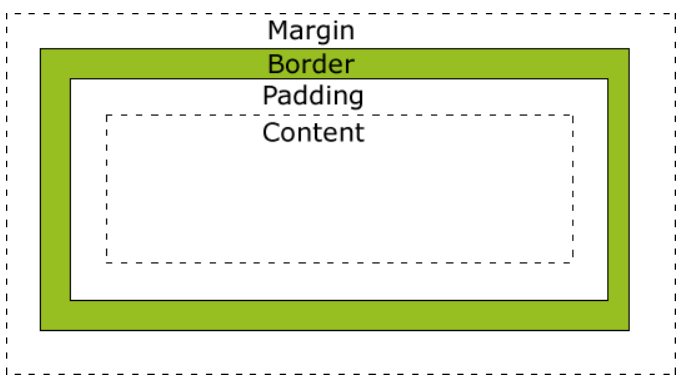
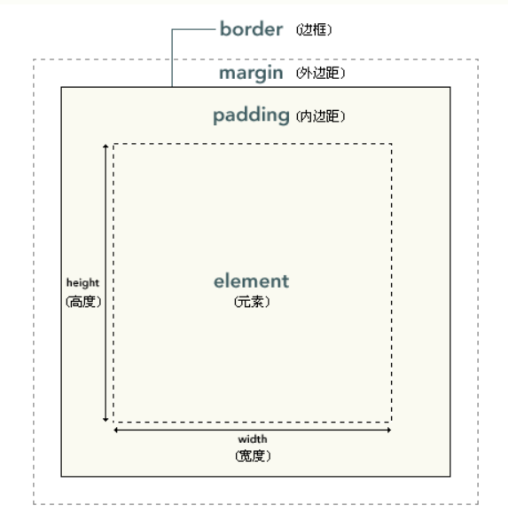

[TOC]

# HTML基础

## 1. 标签

> - `<html></html> `   网页跟标签
> - `<head></head>`    网页头标签，head中的内容不会再网页中出现，主要用于帮助浏览器或者搜索引擎来解析网页；
> - `<title></title>`  网页标题标签，会在网页头部的标题栏进行显示，搜索引擎会通过title中的内容来判断网页的主要内容；
> - `<body></body> `   网页内容标签
> - `<blockquote></blockquote>`   网页中的**长引用**标签，也就是引用别人说的话的标签；存在一定的缩进，**会换行**；
> - `<q></q>`   网页中的**短引用**标签，**不会换行，会自动添加引号**；
> - ` <strong></strong>`  网页中表示强调标签，加粗，凸显内容；

### 1.1 自结束标签

> - ``  标签
> - `<input>`  标签
> - `<meta>`  标签，用于设置网页的元数据，也就是网页的一些底层数据；

### 1.2 属性标签

> 属性标签是写在标签中的一些属性；例如：`<font color='red'>测试</font>`   color就是属性；
>
> 属性类型有：
>
> - `color=“red”`：设置标签颜色的属性；
> - `size=“3”`：设置标签大小的属性；

### 1.3 文档申明

> 文档申明是用于设置网页语法格式，用于标识网页是HTML5或者其他HTML版本；
>
> - `HTML5`写法：`<!DOCTYPE HTML>`  或者 `<!doctype html>`    不会区分大小写，写在网页头部；

### 1.4 meta标签

> meta标签用于设定网页元数据的信息，主要包括如下属性：
>
> - **charset**属性：用于设置网页的字符集，避免乱码问题；例如：`<meta charset="utf-8">`
> - **name、content**属性：用于设置网页中指定的数据的名称与值；例如：`<meta name="viewport" content="width=device-width, initial-scale=1.0">`

### 1.5 HTML纠正

> 在开发HTML代码的时候，有时可能会有块元素被包含在了行元素中，例如：<h1>标签被包含在了<q>标签中，这就是错误语法，浏览器在解析HTML代码的时候，会对其进行修正；
>
> - 块元素被包含在了行元素，会执行修正操作；
> - 元素卸载了<html></html>外面去了，浏览器会自动将其加载到该标签内；

### 1.6 布局标签

> 布局标签也是结构化语义标签，主要是用于界面布局；
>
> - `<header></header>`  网页头部标签
> - `<main></main>`  网页主题标签
> - `<footer></footer>`  网页脚部标签
> - `<nav></anv>`  网页导航标签
> - `<article></article>`  网页文章标签
> - `<aside></aside>`  网页侧边栏标签
> - `<section></section>`   表示一个独立的区块，如果上面的标签无法使用，则就使用section
> - `<div></div>`  块级元素，无含义
> - `<span></span>`   行内元素，用于标识网页文字信息

### 1.7 超链接

> 超链接是<a>标签，默认情况下是打开新页面；其中存在`target`属性，用于指定打开新界面的方式：
>
> - `<a href="www.baidu.com" target="_blank">打开一个新窗口</a>`  
> - `<a href="www.baidu.com" target="_self">打开一个新页面</a>`
>
> 跳转到界面顶部：
>
> - `<a href="#">去顶部</a>`

### 1.8 img图片标签

> img是一个自结束标签，是一种替换元素，介于块和行内元素之间，具有两种元素的特征；属性包括：
>
> - `src`：引用图片的路径
> - `alt`：
>   - 当图片无法正常显示的时候，浏览器会自动显示alt里面的内容；
>   - 搜索引擎使用该内容来进行搜索图片；
> - `width`：图片宽度，默认有单位px，无需手动添加单位；
> - `height`：图片高度，默认有单位px，无需手动添加单位；
>   - 宽度和高度如果只变化一个属性，则另一个属性会根据图片比例进行变化；
>
> 图片格式：
>
> - jpeg（jpg）：支持颜色比较丰富，不支持透明效果，不支持动态图片，一般用于显示图片；
> - gif：支持颜色较少，支持简单透明效果，支持动态效果；
> - png：支持颜色丰富，支持复杂透明，不支持动态效果（专为网页而生）；
> - webp：谷歌新推出的专门用于表述网页中的图片的一种格式，具备所有图片的优点（兼容性较差）；
> - base64：将图片使用base64编码格式，直接放在src标签中即可展示；

### 1.9 iframe内联框架

> iframe是一个内联框架，用于向当前页面引入一个其他页面；
>
> `<iframe src="https://www.baidu.com" width="800" height="600" frameborder="0"></iframe>`

## 2. CSS样式

### 2.1 CSS样式位置

> - **内联样式**：直接写在标签中的style属性中，以k:v方式编写，使用分号分割
> - **内部样式表**：直接写在HTML界面的head标签内，添加`<style></style>`来进行样式的编写；
> - **外部样式表**：编写.css文件，在该文件中添加对应的样式，在HTML中添加`<link href='xx.css'>`即可；

### 2.2 CSS选择器

> - **常用选择器**
>
>   - 元素选择器：
>
>     -  作用：根据标签名来选中指定的元素
>     - 语法：标签名{}
>     - 例子：p{}  h1{}  div{}
>
>   - id选择器
>
>     - 作用：根据元素的id属性值选中一个元素
>     - 语法：#id属性值{}
>     - 例子：#box{} #red{}  
>
>   - 类选择器
>
>     - 作用：根据元素的class属性值选中一组元素
>
>     - 语法：.class属性值
>     - 例子：.abc{ font-size: 20px;}
>
>   - 通配选择器
>
>     - 作用：选中页面中的所有元素
>
>     - 语法: *    
>     - 例子：        *{color: red;}    
>
> - **复合选择器**
>
>   - 交集选择器
>
>     - 作用：选中同时复合多个条件的元素
>
>     - 语法：选择器1选择器2选择器3选择器n{}
>
>     - 注意点：交集选择器中如果有元素选择器，必须使用元素选择器开头
>
>     - 例子：
>
>       - div.red{ font-size: 30px; }  选择div下面的包含有类 .red的元素
>
>       -  .a.b.c{ color: blue}   选择类包含 .a  .b  .c 的元素
>
>   - 选择器分组（并集选择器）
>
>     - 作用：同时选择多个选择器对应的元素
>
>     - 语法：选择器1,选择器2,选择器3,选择器n{}
>
>     - 例子： #b1, .p1, div.red {}   同时选择多个元素
>
> - **关系选择器**
>
>   - 子元素选择器
>
>     - 作用：选中指定父元素的指定子元素
>
>     - 语法：父元素 > 子元素
>     - 例子：div.box > span{}       div > p > span{}
>
>   - 后代元素选择器：
>
>     - 作用：选中指定元素内的指定后代元素
>     - 语法：祖先 后代
>     - 例子：div span{}
>
>   - 选择下一个兄弟
>
>     - 语法：前一个 + 下一个
>     - 例子：p + span{ color: red;}
>
>   - 选择下边所有的兄弟
>
>     - 语法：兄 ~ 弟
>     - 例子：p ~ span{color: red;}
>
> - **属性选择器**
>
>   - [属性名] 选择含有指定属性的元素    
>     - 实例：p[title]{}     p标签中包含有title属性的元素
>
>   - [属性名=属性值] 选择含有指定属性和属性值的元素
>     - 实例：p[title=abc]{)    p标签中包含有title="abc"的元素
>   - [属性名^=属性值] 选择属性值以指定值开头的元素
>     - 实例：p[title^=abc]{}   p标签中包含有title以 abc开头的元素
>
>   - [属性名$=属性值] 选择属性值以指定值结尾的元素
>     - 实例：p[title$=abc]{}   p标签中包含有title以abc结尾的元素
>
>   - [属性名*=属性值] 选择属性值中含有某值的元素的元素
>     - 实例：p[title*=e]{}  p标签中包含有title中有e的元素
>
> - **伪类选择器**：伪类，也就是特殊的类，用于描述一个元素的特殊状态，伪类一般情况下都是使用:开头
>
>   - :first-child 第一个子元素
>     - 实例：ul > li:first-child{}
>   - :last-child 最后一个子元素
>     - 实例：ul > li:last-child{}
>   - :nth-child() 选中第n个子元素；                   
>     -  特殊值：
>       - n 第n个 n的范围0到正无穷
>       - 2n 或 even 表示选中偶数位的元素
>       - 2n+1 或 odd 表示选中奇数位的元素
>     - 实例：ul > li:nth-child(2n+1){}
>   - :first-of-type
>   - :last-of-type
>   - :nth-of-type()      这几个伪类的功能和上述的类似，不通点是他们是在同类型元素中进行排序
>   - :not() 否定伪类，将符合条件的元素从选择器中去除
>     - 实例：li:not(:nth-of-type(3)){}
>
>   

### 2.3 a元素的伪类

> - `:link` 用来表示没访问过的链接（正常的链接）
>   - 实例：a:link{color: red;}
> - `:visited`用来表示访问过的链接
>   - 实例：a:visited{color: orange;}
> - `:hover` 用来表示鼠标移入的状态
>   - 实例：a:hover{color: rgb(0, 255, 98);font-size: 50px;}
> - `:active` 用来表示鼠标点击
>   - 实例：a:active{color: yellowgreen;}

### 2.4 HTML颜色

> 颜色单位：
>
> - 在CSS中可以直接使用颜色名称来设置各种颜色：red、blue等
> - **RGB值**：RGB通过三种颜色的不同浓度来调配出不同的颜色；
>   - R ：Red         取值范围：（0 ~ 255  或者 0% ~ 100%）
>   - G ： Green    取值范围：（0 ~ 255  或者 0% ~ 100%）
>   - B： Blue        取值范围：（0 ~ 255  或者 0% ~ 100%）
>   - 使用方式：background-color: rgb(0, 255, 0)
> - **RGBA值**：在RGB的基础之上添加了一个a，表示不透明度
>   - 1    完全不透明
>   - 0    完全透明
>   - 取值范围： 0 ~ 1
> - **十六进制的RGB值：**
>   - 语法：#ff
>   - 颜色浓度范围：00 ~ ff
>   - 完整语法：#ffffff
>   - 简单写法：由于是由三个组成，如果三个十六进制的数据每组都是相同字母，可以简写 #fff
> - **HSL值：**HSLA值
>   - H   色相
>   - S    饱和度
>   - L    亮度

## 3. 盒子模型

> 盒模型、盒子模型、框模型（box model）
>
> 
>
> 
>
> - CSS将页面中的所有元素都设置为了一个矩形的盒子
> - 盒子模型中，默认宽度为100%，高度为0px；
>
> - 将元素设置为矩形的盒子后，对页面的布局就变成将不同的盒子摆放到不同的位置
>
> - 每一个盒子都由一下几个部分组成：
>   - 内容区（content）：内容区的大小，是使用width与height来设定，不包括边框；
>   - 内边距（padding）
>   - 边框（border）：border-width、border-color、border-style
>   - 外边距（margin）

### 3.1 盒子模型-边框-border

> 盒子模型中，存在一个环绕的边框，该边框将盒子包围着；主要参数：
>
> - `border-width`：默认值为3px；
>   - 写法一： #div1 {border-width: 10px}   所有边框为10；
>   - 写法二：#div1 {border-width: 10px 15px 10px 15px}   设置边框顺序：上  右  下  左
>   - 写法三：#div1 {border-width: 10px  10px 15px}   设置边框顺序：上  左右  下
>   - 写法四：#div1 {border-width: 10px 15px}   设置边框顺序：上下  左右
> - `borde-color`：默认值为黑色；
>   - 写法：#div1 {border-color:  red}   
> - `border-style`：指定边框样式；
>   - **solid**：边框为实线；
>   - **dotted**：边框为点状虚线；
>   - **dashed**：边框为虚线；
>   - **double**：边框为双线；
>   - 写法：#div1 {border-style: solid}

> border简单写法：
>
> - #div1 {border: solid 10px blue}  同时设置边框的 样式(style)、宽度(width)、颜色(color)

### 3.2 盒子模型-内边距-padding

> 内边距padding指的是内容区和边框之间的距离；四个方向的内边距：
>
> - `padding-top`：内上边距
> - `padding-bottom`：内下边距
> - `padding-left`：内左边距
> - `padding-right`：内右边距
>
> 特征：
>
> **在盒子中，盒子的背景颜色会填充到内边距中，也就是说：在内容区与内边距区中，都会被相同的背景颜色覆盖；**
>
> 示例：
>
> - 实例一：#div1 {padding: 10px}
> - 实例二：#div1 {padding-top: 10px; padding-left:15px}

### 3.3 盒子模型-外边距-margin

> 外边距（margin）
>
> - 外边距不会影响盒子可见框的大小
>
> - 但是外边距会影响盒子的位置
>
> - 一共有四个方向的外边距：
>   - margin-top：上外边距，设置一个正值，元素会向下移动
>   - margin-right：默认情况下设置margin-right不会产生任何效果
>   - margin-bottom：下外边距，设置一个正值，其下边的元素会向下移动
>   - margin-left：左外边距，设置一个正值，元素会向右移动
>
> ​                            \- 左外边距，设置一个正值，元素会向右移动
>
> - margin也可以设置负值，如果是负值则元素会向相反的方向移动
>
> - 元素在页面中是按照自左向右的顺序排列的，
>
> - 所以默认情况下如果我们设置的左和上外边距则会移动元素自身
>
> - 而设置下和右外边距会移动其他元素
>
> - margin的简写属性
>   - margin 可以同时设置四个方向的外边距 ，用法和padding一样
>
> - margin会影响到盒子实际占用空间
> - 外边距限制：
>   - 兄弟元素之间的margin，取两个兄弟之间外边距最大的那个值；
>
> **元素居中显示：   margin:0 auto;**

### 3.4 元素水平方向布局

> 元素在其父元素中水平方向的位置由以下几个属性决定：margin-left、border-left、padding-left、width、padding-right、border-right、margin-right
>
> ​                        width
>
> ​                        padding-right
>
> ​                        border-right
>
> ​                        margin-right

### 3.5 元素垂直方向布局

> 元素在其父元素中垂直方向的位置，是基于父元素的；
>
> 注意：**如果子元素的height超过了父元素的height，则浏览器默认会溢出，继续显示子元素；**
>
> 子元素溢出显示选项`overflow`：
>
> - `visible`：溢出的子元素内容全部显示，不做任何处理；
> - `hidden`：溢出的子元素内容被隐藏；
> - `scroll`：溢出的子元素内容，会出现在滚动条中；
> - `auto`：溢出的子元素内容，根据需要生成水平或者垂直滚动条；

### 3.6 行内元素盒模型

> - **行内元素不支持设置宽度与高度；也就是不支持width与height属性；**
> - 行内元素可以设置padding、border、margin，不会影响页面其他元素的布局；

### 3.7 display-元素类型

> `display`能够设置元素显示的类型，可以将**行内元素**设置为**块元素**，反之亦然；选择参数为：
>
> - **inline**：将元素设置为行内元素；
> - **block**：将元素这只为块元素；
> - **inline-block**：将元素这只为行内块元素，既可以设置宽高，也不会独占一行；
> - **none**：元素在页面中不显示；当界面不显示的时候，该隐藏的元素所占位置会被后面元素覆盖

### 3.8 visibility-元素显示状态

> `visibility`用于设置元素的显示状态，使用方式与display相似；选择参数为：
>
> - **visible**：元素在界面中正常显示；
> - **hidden**：元素在界面中隐藏，但是元素所占位置不会被后面元素覆盖；

### 3.9 阴影与圆角

> - **`box-shadow`：设置阴影；**
>   - 实例一：#div1 {box-shadow:10px 10px red}      阴影水平位置   阴影上下位置    阴影颜色
>   - 实例二：#div1 {box-shadow: 0px 0px 50px rgba(0, 0, 0, .3);}   水平位置   上下位置   阴影模糊半径    阴影颜色
> - **`border-radius`：设置圆角；**
>   - 实例一：border-radius: 20px 40px 40px 20px;   左上   右上  右下  左下
>   - 实例二：border-radius: 20px 40px 20px;           左上  右上/左下  右下
>   - 实例三：border-radius: 20px 40px;                    左上/右下  右上/左下

## 4. 浮动-float

> float是通过浮动使一个元素向其父元素的左侧或者右侧移动，可选参数：
>
> - `none`：默认值，元素不浮动；
> - `left`：向左浮动；
> - `right`：向右浮动；
>
> 特征：
>
> 1、浮动元素会完全脱离文档流，不再占据文档流中的位置
>
> 2、设置浮动以后元素会向父元素的左侧或右侧移动，
>
> 3、浮动元素默认不会从父元素中移出
>
> 4、浮动元素向左或向右移动时，不会超过它前边的其他浮动元素
>
> 5、如果浮动元素的上边是一个没有浮动的块元素，则浮动元素无法上移
>
> 6、浮动元素不会超过它上边的浮动的兄弟元素，最多最多就是和它一样高
>
> 7、浮动元素一行无法装完的话，会自动换行，跳转到下一行，再根据左右浮动来定位左右位置；
>
> ​	**元素添加了float属性以后，将完全从文档流中脱离出来，也就是说：该HTML网页中会继续显示这块内容，但是没有占用该HTML文档的像素，也就是后续元素会在此元素的开始位置继续进行展示；**

> 脱离文档流的特点：
>
> - 块元素：
>   - 块元素不在独占页面的一行
>   - 脱离文档流以后，块元素的宽度和高度默认都被内容撑开
>
> - 行内元素：
>   - 行内元素脱离文档流以后会变成块元素，特点和块元素一样
>
> - 脱离文档流以后，不需要再区分块和行内了

### 4.1 高度塌陷

> **在网页的布局中，父元素的高度默认是被子元素撑开的；当子元素浮动以后，其会完全脱离文档流，导致子元素无法撑起父元素的高度，导致父元素高度的丢失；**
>
> 解决办法：
>
> - BFC(Block Formatting Context)：块级格式化环境
>   - BFC是CSS中一个隐含的属性，可以为一个元素开启BFC模式，**开启BFC模式以后，该元素及其子元素都会变成一个独立的布局区域，这样子元素使用浮动才不会导致父元素高度塌陷；**
>   - 开启BFC特点：
>     - 开启BFC的元素不会被浮动元素所覆盖；
>     - 开启BFC的元素子元素和父元素外边距不会重叠；
>     - 开启BFC的元素可以包含浮动的子元素；
>   - 开启BFC方式：
>     - 方案一：设置元素的浮动（不推荐）；
>     - 方案二：将元素设置为行块级元素（不推荐）；
>     - 方案三：将元素的overflow设置为一个非visible的值；**通常采用 `overflow:hidden`开启BFC，用于包含浮动的子元素**；
>     - 方案四：使用`clear`来进行清除浮动；

**`高度塌陷的最终解决方案`**

```html
<!DOCTYPE html>
<html lang="en">
<head>
    <meta charset="UTF-8">
    <title>Document</title>
    <style>
        .box1{
            border: 10px red solid;
        }

        .box1::after{
            content: '';
            display: block;
            clear: both;
        }

        .box2{
            width: 100px;
            height: 100px;
            background-color: #bfa;
            float: left;
        }

        .box3{
            width: 100px;
            height: 100px;
            background-color: #ccc;
            float: left;
        }
    </style>
</head>
<body>
    <div class="box1">
        <div class="box2"></div>
        <div class="box3"></div>
    </div>
</body>
</html>
```

### 4.2 clearfix

> 自定义clearfix属性，可以让父div的前后，将子元素与父元素隔离，避免外边距重叠；

```css
/* clearfix 这个样式可以同时解决高度塌陷和外边距重叠的问题，当你在遇到这些问题时，直接使用clearfix这个类即可 */
        .clearfix::before,
        .clearfix::after{
            content: '';
            display: table;
            clear: both;
        }
```

```html
    <div class="box1 clearfix">
        <div class="box2"></div>
    </div>
```


## 5. 网页布局

> 网页布局，主要分为头部、主体（左边栏、内容、右边栏）、底部五部分；

```html
<!DOCTYPE html>
<html lang="en">
<head>
    <meta charset="UTF-8">
    <meta name="viewport" content="width=device-width, initial-scale=1.0">
    <meta http-equiv="X-UA-Compatible" content="ie=edge">
    <title>Document</title>
    <style>

        header, main, footer{
            width: 1000px;
            margin: 0 auto;
        }

        /* 设置头部 */
        header{
            height: 150px;
            background-color: silver;
        }

        /* 设置主体 */
        main{
            height: 500px;
            background-color: #bfa;
            margin: 10px auto;
        }

        nav, article, aside{
            float: left;
            height: 100%;
        }

        /* 设置左侧的导航 */
        nav{
            width: 200px;
            background-color: yellow;
        }

        /* 设置中间的内容 */
        article{
            width: 580px;
            background-color: orange;
            margin: 0 10px;
        }

        /* 设置右侧的内容 */
        aside{
            width: 200px;
            background-color: pink;
        }

        /* 设置底部 */
        footer{
            height: 150px;
            background-color: tomato;
        }
    </style>
</head>
<body>

    <!-- 创建头部 -->
    <header></header>

    <!-- 创建网页的主体 -->
    <main>
        <!-- 左侧导航 -->
       <nav></nav>

       <!-- 中间的内容 -->
       <article></article>

       <!-- 右边的边栏 -->
       <aside></aside>

    </main>
    
    <!-- 网页的底部 -->
    <footer></footer>
</body>
</html>
```

## 6. 元素定位-position

> - 元素定位是一种更加高级的布局手段；
> - 通过元素定位可以将元素拜访到页面的任意位置；
> - 使用position属性来设置定位，可选值包括：
>   - `static`：默认值，元素是镜子的，没有开启定位；
>   - `relative`：开启元素的相对定位；
>   - `absolute`：开启元素的绝对定位；
>   - `fixed`：开启元素的固定定位；
>   - `sticky`：开启元素的粘滞定位；

### 6.1 相对定位-relative

> - 当元素的**`position`**属性值设置为**`relative`**时则开启了元素的相对定位；
> - 相对定位特征：
>   - 开启相对定位以后，如果不设置偏移量，则元素不会发生任何改变；
>   - **相对定位的定位参照物就是该元素自己；**
>   - **相对定位不会让元素脱离文档流**，也就是说：元素开启相对定位之前的位置也会被占住；
>   - 相对定位会改变元素的层级，提高元素的层级；
>   - 相对定位不会改变元素的性质，也就是不会改变块和行内元素；
> - 偏移量（**`offset`**）：当元素开启定位以后，通过offset来设置元素的位置：
>   - `top`：定位元素和定位位置上边的距离；
>   - `left`：定位元素和定位位置左边的距离；
>   - `right`：定位元素和定位位置右边的距离；
>   - `bottom`：定位元素和定位位置下边的距离；

### 6.2 绝对定位-absolute

> - 当元素的**`position`**属性值设置为**`absolute`**时则开启了元素的固定定位；
> - 绝对定位特征：
>   - 开启绝对定位以后，如果不设置偏移量，则元素的位置不会发生任何改变；
>   - **开启绝对定位，元素会从文档流中脱离；**
>   - 绝对定位会改变元素的性质；
>   - 绝对定位会使元素提高一个层级；
>   - **绝对元素是相对于其包含块进行定位的；**
>     - 包含块：就是离他最近的开启了定位的祖先元素；也就是说：我这个div是absolute定位，那么他的父元素div是relative定位，则就是相对于父元素的div进行定位，否则就是相对于文档进行定位；
> - 偏移量（**`offset`**）：当元素开启定位以后，通过offset来设置元素的位置：
>   - `top`：定位元素和定位位置上边的距离；
>   - `left`：定位元素和定位位置左边的距离；
>   - `right`：定位元素和定位位置右边的距离；
>   - `bottom`：定位元素和定位位置下边的距离；

### 6.3 固定定位-fixed

> - 当元素的**`position`**属性值设置为**`fixed`**时则开启了元素的固定定位；
> - 固定定位特征：
>   - 开启固定定位以后，如果不设置偏移量，则元素的位置不会发生任何改变；
>   - **开启固定定位，元素会从文档流中脱离；**
>   - 固定定位会改变元素的性质；
>   - 固定定位会使元素提高一个层级；
>   - **固定定位是相对于浏览器视口进行定位的；**
>     - 浏览器视口：浏览器如果内容太长，会出现垂直滚动条，那么我现在写一个div使用的是fixed固定定位，则我滚动滚动条的时候，该div依然继续会出现在浏览器固定的位置；
> - 偏移量（**`offset`**）：当元素开启定位以后，通过offset来设置元素的位置：
>   - `top`：定位元素和定位位置上边的距离；
>   - `left`：定位元素和定位位置左边的距离；
>   - `right`：定位元素和定位位置右边的距离；
>   - `bottom`：定位元素和定位位置下边的距离；

### 6.4 粘滞定位

> - 当元素的**`position`**属性值设置为**`sticky`**时则开启了元素的粘滞定位；

## 7 字体

### 7.1 字体样式

> CSS中可以设置字体样式：
>
> - `color`：设置字体颜色
>
> - `font-size`：设置字体大小，下面是字体大小的单位：
>
>   - `em`：相当于当前元素的一个font-size；
>   - `rem`：相当于根元素的一个font-size；
>
> - `font-family`：字体族，设置字体格式；
>
>   - 例如：#span1 {color:red; font-size:15px; font-family:'华文彩云'}
>
>   -  可选值：
>
>     - serif  衬线字体
>
>     - sans-serif 非衬线字体
>
>     - monospace 等宽字体
>
>     - 指定字体的类别，浏览器会自动使用该类别下的字体
>
>     - 注意：font-family 可以同时指定多个字体，多个字体间使用,隔开；字体生效时优先使用第一个，第一个无法使用则使用第二个，以此类推；

```html
<!DOCTYPE html>
<html lang="en">
<head>
    <meta charset="UTF-8">
    <title>Document</title>
    <style>
        .p1 {
            color:black;
            font-size: 1em;
            font-family: 'Arial Narrow', Arial, sans-serif
        }
    </style>
</head>
<body>
    <p class="p1">今天天气真好， srtg rtt rtbhH DD;</p>
</body>
</html>
```

### 7.2 自定义字体

```css
@font-face {
font-family: 'myfont01';
src: url(../code/06_font&background/font/ZCOOLKuaiLe-Regular.ttf)
}

.p1 {
color:black;
font-size: 1em;
font-family: 'myfont01','Arial Narrow', Arial, sans-serif
}
```

### 7.3 图标字体

> 图标字体是经常在网页中来进行使用的；
>
> - 使用方式一：使用图标字体，可以使用class属性来对其进行引入即可；
> - 修改图标大小：
>   - `font-size`
> - 修改图标颜色：
>   - `color`

### 7.4 行高(line-height)

> 行高（Line Height）：指的是文字占有的实际高度；行高可以直接指定一个大小，例如：
>
> - 方式一：line-height: 2px   行高为2像素
> - 方式二：line-height: 2     行高为默认行高的两倍

### 7.5 字体框

> 字体框：字体框也就是 font-size设定的实际的值，而字体的实际会比字体框的大小较小；

### 7.6 字体简写

> `font: 字体大小/行高 字体族`
>
> - 实例：font: 50px serif;

### 7.7 字体加粗

> `font-weight`  字体的加粗，可选值：
>
> - normal：默认值，不加粗
> - bold：加粗
> - 100 ~ 900 九个级别；

### 7.8 字体风格

> `font-style` 字体的放个，可选值：
>
> - normal：正常风格
> - italic：斜体

### 7.9 文本样式

> - `text-align` 文本的水平对齐，可选值：
>
>   - left 左侧对齐
>
>   - right 右对齐
>
>   - center 居中对齐
>
>   - justify 两端对齐
>
> - `vertical-align` 设置元素垂直对齐的方式，可选值：
>
>   - baseline 默认值 基线对齐
>
>   - top 顶部对齐
>
>   - bottom 底部对齐
>
>   - middle 居中对齐
>
> - `text-decoration` 设置文本修饰，可选值：
>
>   - none 什么都没有
>
>   - underline 下划线
>
>   - line-through 删除线
>
>   - overline 上划线
>
> - `white-space`  设置网页如何处理空白，可选值：
>
>   - normal 正常
>
>   - nowrap 不换行
>
>   - pre 保留空白

## 8 背景

> - `background-color`：设置背景颜色
>
> - `background-image`：设置背景图片
>
>   - **可以同时设置背景图片和背景颜色，这样背景颜色将会成为图片的背景色**
>
>   - **如果背景的图片小于元素，则背景图片会自动在元素中平铺将元素铺满**
>
>   - **如果背景的图片大于元素，将会一个部分背景无法完全显示**
>
>   - 如果背景图片和元素一样大，则会直接正常显示
>
> - `background-repeat` 用来设置背景的重复方式
>
>   - repeat 默认值 ， 背景会沿着x轴 y轴双方向重复
>
>   - repeat-x 沿着x轴方向重复
>
>   - repeat-y 沿着y轴方向重复
>
>   - no-repeat 背景图片不重复
>
> - `background-position` 用来设置背景图片的位置
>
>   - 通过 top left right bottom center 几个表示方位的词来设置背景图片的位置；使用方位词时必须要同时指定两个值，如果只写一个则第二个默认就是center；
>     - background-position: center;
>   - 通过偏移量来指定背景图片的位置：水平方向的偏移量 垂直方向变量
>     - background-position: -50px 300px;
>
> - `background-clip` 设置背景的范围 
>
>   - border-box 默认值，背景会出现在边框的下边
>   - padding-box 背景不会出现在边框，只出现在内容区和内边距
>   - content-box 背景只会出现在内容区
>   - 实例：background-origin: border-box;
>
> - `background-origin` 背景图片的偏移量计算的原点
>
>   - padding-box 默认值，background-position从内边距处开始计算
>
>   - content-box 背景图片的偏移量从内容区处计算
>
>   - border-box 背景图片的变量从边框处开始计算
>   - 实例：background-clip: content-box;
>
> - `background-size` 设置背景图片的大小
>
>   - cover 图片的比例不变，将元素铺满
>   - contain 图片比例不变，将图片在元素中完整显示
>   - 第一个值表示宽度 ，第二个值表示高度；如果只写一个，则第二个值默认是 auto；
>   - 实例一：background-size: contain;
>   - 实例二：background-size:  200px  200px;
>
> - `background-attachment` 背景图片是否跟随元素移动
>
>   - scroll 默认值 背景图片会跟随元素移动
>   - fixed 背景会固定在页面中，不会随元素移动
>   - 实例：background-attachment: fixed;

## 9. 渐变

### 9.1 线性渐变

> HTML中的渐变相当于是background-image属性；
>
> - background-image: linear-gradient(旋转角度（数值）deg, 颜色一,颜色二, 颜色三.......)
>
> - 实例一：background-image: liner-gradient(red, yellow)   渐变色  渐变色
> - 实例二：background-image: linear-gradient(45deg, red,orange)   旋转角度    渐变色   渐变色
> - 实例三：background-image: liner-gradient(red 50px, yellow 70px)   渐变色(占50px像素)  渐变色

## 10. 表格

> 表格组成结构：
>
> - `table`
>   - `thead`：表格头部
>   - `tbody`：表格主体
>   - `tfoot`：表格脚底
>
> 表格属性：
>
> - `border`：表格的边框；
>   - `1`   边框为1px；
> - `width`：单个框的内容所占表框的宽度；
>   - `50%`  所占比例；
> - `align`：表格是否居中；选项如下：
>   - `center`   居中；

## 11. 弹性盒-flex

> `flex`（简称：弹性盒、伸缩盒），是一种CSS中的布局手段，它主要用来代替浮动来完成页面的布局；**flex能够使元素具有弹性，让元素可以随着页面大小的改变而改变；**主要包含两个概念：
>
> - 弹性容器
>   - 要使用弹性盒，必须先将一个元素设置为弹性容器；
>   - 使用display来设置弹性容器：
>     - 方式一：`display:flex`   设置为块级弹性容器
>     - 方式二：`display:inline-flex`  设置为行内弹性容器
> - 弹性元素
>   - 弹性容器的子元素是弹性元素（注意：只有子元素是弹性元素，子元素的子元素不是弹性容器）
>   - 弹性元素可以同时是弹性容器

### 11.1 弹性元素排列方式

> 将元素设置为弹性容器以后，就能够让元素在这个块中进行水平排列或者垂直排列；
>
> 设置弹性盒中弹性元素的排列方式：在设置块级弹性元素后添加 `flex-direction `属性，指定弹性元素排列方式；
>
> ```css
> .parent-div {
>     width: 1000px;
>     height: 700px;
>     background-color: orange;
>     display: flex;
>     flex-direction:column
> }
> ```
>
> `flex-direction`可选值：
>
> - `row` ：横向排列（主轴 从左往右）
> - `row-reverse`：横向倒序排列 （主轴 从右往左）
> - `column`：纵向排列 （主轴 从上往下）
> - `column-reverse`：纵向倒序排列 （主轴 从下往上）
>
> 弹性盒其他两大概念：
>
> - 主轴：弹性元素的排列方向称为主轴
> - 侧轴：与主轴垂直方向称为主轴

### 11.2 弹性元素属性

> - `flex-grow` 指定弹性元素的伸展的系数
>   - 当父元素有多余空间的时，子元素如何伸展
>   - 父元素的剩余空间，会按照比例进行分配
>   - `flex-grow`可选值：
>     - 1 ~ 100 ：填满剩余空间（父元素的空间，按照flex-grow的值来进行按照比例分配）
>     - 0 ：不填满剩余空间
>
> ```css
>         .div2 {
>             width: 300px;
>             height: 300px;
>             background-color: red;
>             flex-grow: 0
>         }
> 
>         .div3 {
>             width: 300px;
>             height: 300px;
>             background-color: yellow;
>             flex-grow:3
>         }
> 
>         .div4 {
>             width: 300px;
>             height: 300px;
>             background-color: blue;
>             flex-grow:1
>         }
> ```
>
> - `flex-shrink` 指定弹性元素的收缩系数
>   - 当父元素中的空间不足以容纳所有的子元素时，如果对子元素进行收缩
>   - `flex-shrink`可选值：
>     - 1 ~ 100 ：收缩空间，默认值为1（父元素的空间，按照flex-shrink的值来进行按照比例分配）
>     - 0 ：不收缩空间
>   - 默认值为1，也就是进行收缩；
>
> ```css
>         .div4 {
>             width: 300px;
>             height: 300px;
>             background-color: blue;
>             flex-shrink:1
>         }
> ```
>
> - `flex-wrap` 设置弹性元素是否在弹性容器中自动换行；可选值：
>
>   - nowrap 默认值，元素不会自动换行
>
>   - wrap 元素沿着辅轴方向自动换行
>
>   - wrap-reverse 元素沿着辅轴反方向换行
>
> ```css
> flex-wrap: wrap-reverse;
> ```
>
> - `justify-content`  如何分配主轴上的空白空间（主轴上的元素如何排列），可选值：
>
>   ​                    \- 可选值：
>
>   - flex-start 元素沿着主轴起边排列
>
>   - flex-end 元素沿着主轴终边排列
>
>   - center 元素居中排列
>
>   - space-around 空白分布到元素两侧
>
>   - space-between 空白均匀分布到元素间
>
>   - space-evenly 空白分布到元素的单侧
>
> ```css
> justify-content: center;
> ```
>
> - `align-items` 元素在辅轴上如何对齐，可选值：
>   - stretch 默认值，将元素的长度设置为相同的值
>   - flex-start 元素不会拉伸，沿着辅轴起边对齐
>   - flex-end 沿着辅轴的终边对齐
>   - center 居中对齐
>   - baseline 基线对齐


