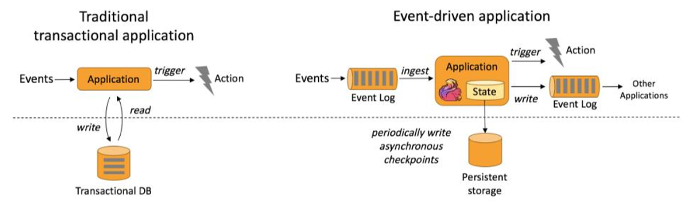
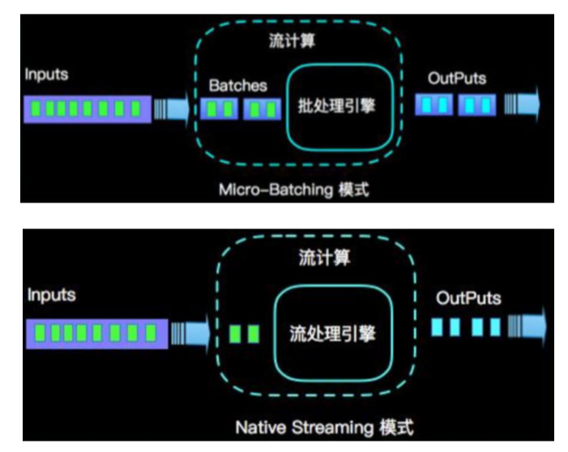
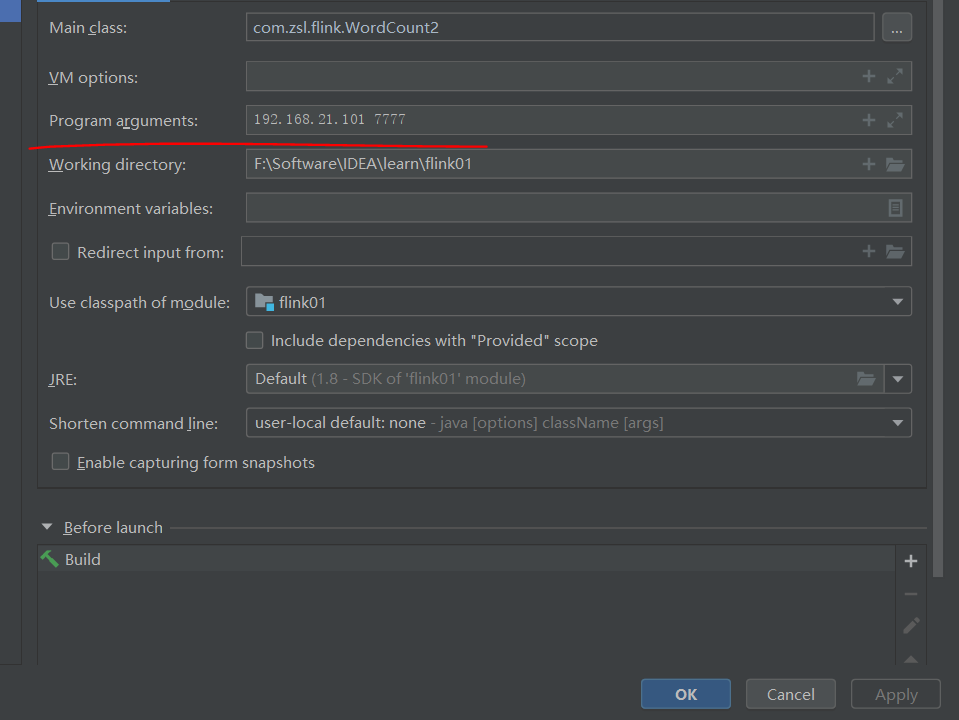
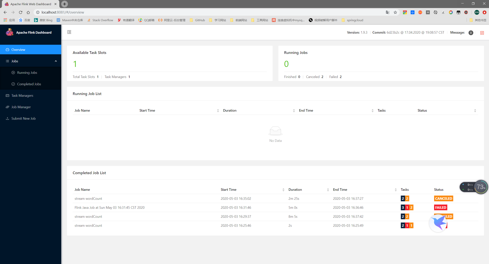
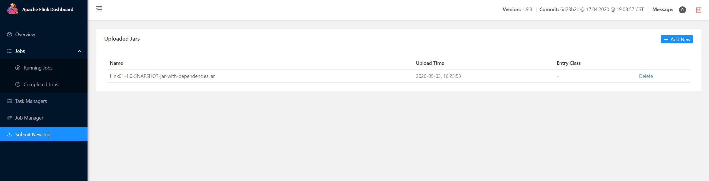
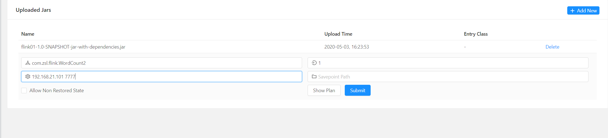

# Flink

## 一. 基础理论

### 1.1 概念

> - `Flink` 是一个框架和分布式处理引擎，用于对 **无界和有界数据流** 进行 **状态** 计算；
> - `Flink`采用的是纯流数据思想，实现了：
>   - 低延迟
>   - 高吞吐
>   - 结果的准确性和良好的容错性
> - `Flink`是以 **事件驱动(Event-Driven)** 为架构：
>
>  
>
> - `Flink`是 **基于流的世界观** 思想；
>   - 在`Flink`的世界观中，一切都是由流组成，离线数据是有界的流；实时数据是一个没有界限的流；对应着的就是 **有界流** 和 **无界流**；
>
> 
>
> - 分层的API：
>   - `Flink`提供的是分层次的API，越顶层越抽象，表达含义越明显，使用更方便；
> - 支持 **事件时间(event-time)** 和 **处理时间(processing-time)**语义；
> - **精确一次(exactly-once)**的状态一致性保证；
> - 低延迟，美妙处理数百万个事件，毫秒级别延迟；
> - 与众多常用存储系统连接；
> - 高可用、动态扩展；

### 1.2 Flink与Spark-Streaming

> - 数据处理方式：
>   - `Flink`是一个完全基于流的处理方式；
>   - `Spark Streaming`是一种微批次处理方式，整体上类似于流式处理，但并不是流式数据处理；
>
> 
>
> - 数据模型：
>   - `Spark`采用RDD模型，`Spark streaming`的`DStream`实际上也就是一组组小批数据RDD的集合；
>   - `Flink`基本数据模型是数据流，以及事件`Event`序列；
> - 运行时架构：
>   - `Spark`是批计算，将DAG划分为不同的stage，一个完成后才可以计算下一个；
>   - `Flink`是标准的流执行模式，一个事件在一个节点处理完毕之后可以直接发往下一个节点进行处理；

### 1.3 WordCount案例

#### 1.3.1 处理文件

- 创建项目，引入flink需要的jar；

```xml
   <dependencies>
        <!-- https://mvnrepository.com/artifact/org.apache.flink/flink-scala -->
<!--        <dependency>-->
<!--            <groupId>org.apache.flink</groupId>-->
<!--            <artifactId>flink-scala_2.11</artifactId>-->
<!--            <version>1.7.2</version>-->
<!--        </dependency>-->

<!--        &lt;!&ndash; https://mvnrepository.com/artifact/org.apache.flink/flink-streaming-scala &ndash;&gt;-->
<!--        <dependency>-->
<!--            <groupId>org.apache.flink</groupId>-->
<!--            <artifactId>flink-streaming-scala_2.11</artifactId>-->
<!--            <version>1.7.2</version>-->
<!--            <scope>provided</scope>-->
<!--        </dependency>-->

        <!-- https://mvnrepository.com/artifact/org.apache.flink/flink-streaming-java -->
        <dependency>
            <groupId>org.apache.flink</groupId>
            <artifactId>flink-streaming-java_2.12</artifactId>
            <version>1.7.2</version>
            <scope>provided</scope>
        </dependency>
        <!-- https://mvnrepository.com/artifact/org.apache.flink/flink-java -->
        <dependency>
            <groupId>org.apache.flink</groupId>
            <artifactId>flink-java</artifactId>
            <version>1.7.2</version>
        </dependency>

        <dependency>
            <groupId>org.apache.flink</groupId>
            <artifactId>flink-clients_2.12</artifactId>
            <version>1.7.2</version>
            <scope>compile</scope>
        </dependency>

        <dependency>
            <groupId>org.slf4j</groupId>
            <artifactId>slf4j-log4j12</artifactId>
            <version>1.7.7</version>
            <scope>runtime</scope>
        </dependency>
        <dependency>
            <groupId>log4j</groupId>
            <artifactId>log4j</artifactId>
            <version>1.2.17</version>
            <scope>runtime</scope>
        </dependency>
    </dependencies>

    <build>
        <plugins>
            <!--编译插件-->
<!--            <plugin>-->
<!--                <groupId>net.alchim31.maven</groupId>-->
<!--                <artifactId>scala-maven-plugin</artifactId>-->
<!--                <version>3.4.6</version>-->
<!--                <executions>-->
<!--                    <execution>-->
<!--                        <goals>-->
<!--                            <goal>testCompile</goal>-->
<!--                        </goals>-->
<!--                    </execution>-->
<!--                </executions>-->
<!--            </plugin>-->
            <!--打包插件-->
            <plugin>
                <groupId>org.apache.maven.plugins</groupId>
                <artifactId>maven-compiler-plugin</artifactId>
                <version>3.1</version>
                <configuration>
                    <source>1.8</source>
                    <target>1.8</target>
                </configuration>
            </plugin>
            <plugin>
                <groupId>org.apache.maven.plugins</groupId>
                <artifactId>maven-assembly-plugin</artifactId>
                <version>3.1.0</version>
                <configuration>
                    <descriptorRefs>
                        <descriptorRef>jar-with-dependencies</descriptorRef>
                    </descriptorRefs>
                </configuration>
                <executions>
                    <execution>
                        <id>make-assembly</id>
                        <phase>package</phase>
                        <goals>
                            <goal>single</goal>
                        </goals>
                    </execution>
                </executions>
            </plugin>
        </plugins>
    </build>
```

- 编写java文件

```java

import org.apache.flink.api.common.functions.FlatMapFunction;
import org.apache.flink.api.java.ExecutionEnvironment;
import org.apache.flink.api.java.operators.DataSource;
import org.apache.flink.api.java.operators.FlatMapOperator;
import org.apache.flink.api.java.operators.ReduceOperator;
import org.apache.flink.api.java.operators.UnsortedGrouping;
import org.apache.flink.api.java.tuple.Tuple2;
import org.apache.flink.util.Collector;

/**
 * @author ${张世林}
 * @date 2020/05/03
 * 作用：
 */
public class WordCount1 {

    public static void main(String[] args) throws Exception {
        ExecutionEnvironment environment = ExecutionEnvironment.getExecutionEnvironment();
        DataSource<String> dataSource = environment.readTextFile("F:\\Software\\IDEA\\learn\\flink01\\src\\main\\resources\\hello.txt");
        
        //flatMap将一个转换成多个
        FlatMapOperator<String, Tuple2<String, Integer>> stringTuple2FlatMapOperator = dataSource.flatMap(new FlatMapFunction<String, Tuple2<String, Integer>>() {
            @Override
            public void flatMap(String s, Collector<Tuple2<String, Integer>> collector) throws Exception {
                for (String s1 : s.split(" ")) {
                    collector.collect(new Tuple2<String, Integer>(s1, 1));
                }
            }
        });
        //根据字段进行分组
        UnsortedGrouping<Tuple2<String, Integer>> grouping = stringTuple2FlatMapOperator.groupBy(0);
        
        //根据字段进行累加
        ReduceOperator<Tuple2<String, Integer>> reduce = grouping.reduce((o1, o2) -> {
            return new Tuple2<String, Integer>(o1.f0, o1.f1 + o2.f1);
        });
        reduce.print();

    }
}
```

#### 1.3.2 处理网络数据

```java
package com.zsl.flink;

import org.apache.flink.api.common.functions.FlatMapFunction;
import org.apache.flink.api.java.ExecutionEnvironment;
import org.apache.flink.api.java.tuple.Tuple2;
import org.apache.flink.streaming.api.datastream.DataStreamSource;
import org.apache.flink.streaming.api.datastream.SingleOutputStreamOperator;
import org.apache.flink.streaming.api.environment.StreamExecutionEnvironment;
import org.apache.flink.util.Collector;

/**
 * @author ${张世林}
 * @date 2020/05/03
 * 作用：处理流式数据
 */
public class WordCount2 {

    public static void main(String[] args) throws Exception {
        //创建流处理环境
        StreamExecutionEnvironment executionEnvironment = StreamExecutionEnvironment.getExecutionEnvironment();

        //监听socket端口
        DataStreamSource<String> socketTextStream = executionEnvironment.socketTextStream("192.168.21.101", 7777);
        SingleOutputStreamOperator<Tuple2<String, Integer>> tuple2SingleOutputStreamOperator = socketTextStream.flatMap(new FlatMapFunction<String, Tuple2<String, Integer>>() {
            @Override
            public void flatMap(String str, Collector<Tuple2<String, Integer>> collector) throws Exception {
                for (String s : str.split("\\s")) {
                    collector.collect(new Tuple2<String, Integer>(s, 1));
                }
            }
        });

        //执行sum
        SingleOutputStreamOperator<Tuple2<String, Integer>> sum = tuple2SingleOutputStreamOperator.keyBy(0).sum(1);
        sum.print();

        //启动该任务
        executionEnvironment.execute("stream wordCount");
    }

}
```

#### 1.3.3 使用args方法传参



```java
public static void main(String[] args) throws Exception {
	ExecutionEnvironment environment = ExecutionEnvironment.getExecutionEnvironment();
	DataSource<String> dataSource = environment.readTextFile(args[0]);
}
```


## 二. Flink部署

### 2.1 standlone安装

> 单机版安装Flink，是将Flink部署到一台机器上即可；安装步骤：
>
> - 第一步：解压文件  flink-1.9.3-bin-scala_2.11.tgz.gz
> - 第二步：进入flink-1.9.3目录，进入bin目录；
> - 第三步：在windows中执行  start-cluster.bat ；在linux中执行 ./start-cluster.sh 
> - 第四步：进入浏览器，输入地址： http://localhost:8081   ，即可进入运维界面；

### 2.2 运维界面上传jar



> - 点击 `Submit New Job`，进入到提交jar的界面；
>
> 
>
> 点击`Add New`，上传需要的jar；
>
> 点击jar，输入参数：
>
> - 指定运行的类名，也就是main方法所在的类的全类名
> - 指定并行度，默认情况下不能超过`Overview`界面的数量；
> - 自动运行main方法需要传递的参数；
>
> 