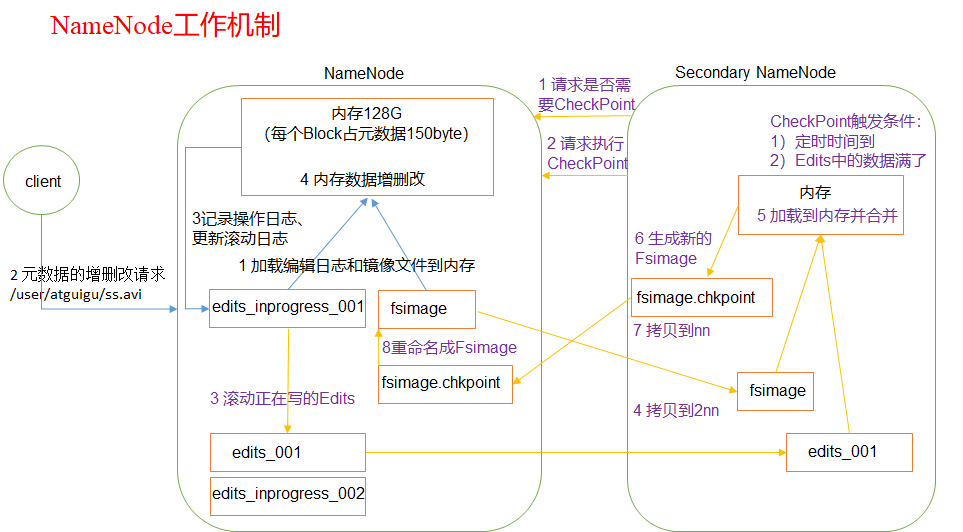

# Hadoop资料整理

官网地址：http://hadoop.apache.org/releases.html

下载地址：<https://archive.apache.org/dist/hadoop/common/>

## 启动集群

> 在hadoop101机器上：
>
> ```
> start-dfs.sh
> ```
>
> 在hadoop102机器上：
>
> ```
> start-yarn.sh
> ```
>
> 在Hadoop103机器上：
>
> ```
>  mr-jobhistory-daemon.sh start historyserver
> ```
>
> 

## 1. Hadoop基本介绍

### 1.1 Hadoop发行版本

> `Hadoop`三大发行版本：`Apache`、`Cloudera`、`Hortonworks`。
>
> - `Apache`版本最原始（最基础）的版本，对于入门学习最好。
>
> - `Cloudera`在大型互联网企业中用的较多。
>
> - `Hortonworks`文档较好。

### 1.2 Hadoop优势

> - **高可靠性**：Hadoop底层维护多个数据副本，所以即使Hadoop某个计算元素或存储出现故障，也不会导致数据的丢失。
> - **高扩展性**：在集群间分配任务数据，可方便的扩展数以千计的节点。
> - **高效性**：在MapReduce的思想下，Hadoop是并行工作的，以加快任务处理速度。
> - **高容错性**：能够自动将失败的任务重新分配。

### 1.3 Hadoop组成

> ​	`Hadoop2.x`版本中主要组成结构为：
>
> - `MapReduce`（计算）
>
> - `Yarn`（资源调度）
>
> - `HDFS`（数据存储）
>
> - `Common`（辅助工具）
>
>   `Hadoop2.x`版本中引入的`Yarn`，用于负责资源调度，`MapReduce`专注于计算；

### 1.4 HDFS概述

> ​	HDFS简称（Hadoop Distributed File System）；主要包含三大组件：
>
> - `NameNode（nn）`：存储文件的元数据，如文件名、文件目录结构、文件属性（时间、副本数、文件权限），以及每个文件的块列表和块所在的DataNode等；
> - `DataNode（dn）`：在本地文件系统存储文件块数据，以及块数据的校验和；
> - `Secondary NameNode（2nn）`：用于监控HDFS状态的辅助后台程序，每隔一段时间获取HDFS元数据的快照；

### 1.5 Yarn概述

> ​	Yarn是Hadoop中负责资源调度的一个模块，主要包含四大组件：
>
> - `ResourceManager（RM）`：
>   - 负责处理客户端请求；
>   - 负责监控`NodeManager`；
>   - 负责启动或者监控`ApplicationMaster`；
>   - 负责资源的分配与调度工作；
> - `NodeManager（NM）`：
>   - 管理单个节点上的资源；
>   - 处理来自`ResourceManager`的命令；
>   - 处理来自`ApplicationMaster`的命令；
> - `ApplicationMaster（AM）`：
>   - 负责数据的切分；
>   - 为应用程序申请资源并分配给内部的任务；
>   - 负责任务的监控与容错；
> - `Container`：
>   - 是Yarn中资源的抽象，它封装了某个节点上的多维度资源抽象，如：内存、CPU、磁盘、网络等；
>
> 

### 1.6 MapReduce概述

> ​	`MApReduce`将计算过程分为两个阶段，`Map`和`Reduce`；
>
> - `Map`阶段负责并行处理输入数据；
> - `Reduce`阶段负责对`Map`处理的数据进行计算汇总；

### 1.7 大数据技术生态体系

> 

> - `Sqoop`：Sqoop是一款开源的工具，主要用于Hadoop、Hive与传统的数据库（MySQL）间进行数据的传递，可以将一个关系型数据库中的数据导入到Hadoop的HDFS中，也可以将HDFS的数据导入到关系型数据库中；
> - `Flume`：Flume是Cloudera提供的一个高可用、高可靠的、分布式的海量日志采集、聚合和传输的系统，Flume支持在日志系统中定制各类数据发送方，用于手机数据；同时，Flume提供对数据进行简单处理，并写到各种数据接收方的能力；
> - `Kafka`：Kafka是一种高吞吐量的分布式发布订阅消息系统，具有如下特性：
>   - 通过O(1)的磁盘数据结构提供消息的持久化，支持大量消息保存保持长时间的稳定性能；
>   - 高吞吐量，支持海量消息的发送；
>   - 支持kafka服务器和消费机集群来分区消息；
>   - 支持Hadoop并行数据加载；
> - `Stream`：Stream用于连续计算，对数据流做连续查询，在计算时就将结果以流的形式输出给用户；
> - `Spark`：Spark是当前最流行的开源大数据内存计算框架，可以基于Hadoop上存储的大数据进行计算；
> - `Oozie`：Oozie是一个管理Hadoop作业（job）的工作流程调度管理系统；
> - `Hbase`：一个分布式的、列值存储的开源数据库；它适用于非结构化数据的村塾；
> - `Hive`：Hive是基于Hadoop的一个数据仓库工具，可以将结构化的数据文件映射为一张数据库表，并提供简单的SQL查询功能；可以将SQL语句转换为`MapReduce`任务进行运行；其优点是学习成本低，可以通过类SQL语句快速实现简单的MapReduce统计，不必开发专门的MapReduce应用，适用于数据仓库的统计分析；
> - `R语言`：R语言用于统计分析、绘图的语言和操作环境；R语言属于GNU系统中的一个自由、免费、开源的软件，是用于统计和计算的优秀工具；
> - `Mahout`：apache是一个可扩展的机器学习和数据挖掘库；
> - `Zookeeper`：是Google的Chubby的一个开源的实现；它是一个针对大型分布式系统的可靠协调系统，用于注册中心、配置维护、分布式同步、组服务等；

### 1.8 Hadoop目录结构

> - bin目录：存放对Hadoop相关服务（HDFS,YARN）进行操作的脚本
>
> - etc目录：Hadoop的配置文件目录，存放Hadoop的配置文件
>
> - lib目录：存放Hadoop的本地库（对数据进行压缩解压缩功能）
>
> - sbin目录：存放启动或停止Hadoop相关服务的脚本
>
> - share目录：存放Hadoop的依赖jar包、文档、和官方案例

## 2. Hadoop运行模式

### 2.1 本地运行模式

> 本地运行模式用于debug测试；

### 2.2 伪分布式运行模式

#### 2.2.1 使用HDFS并运行MapReduce程序

> 首先需要对集群进行配置；
>
> - 配置`hadoop-env.sh`文件：
>
>   - 修改`JAVA_HOME`路径：
>
>     ```java
>     export JAVA_HOME=/opt/module/jdk1.8.0_144
>     ```
>
> - 配置`core-site.xml`文件：
>
>   - 指定HDFS中NameNode的地址
>
>   ```xml
>   <property>
>   <name>fs.defaultFS</name>
>       <value>hdfs://hadoop101:9000</value>
>   </property>
>   ```
>
>   - 指定Hadoop运行时产生文件的存储目录
>
>   ```xml
>   <property>
>   	<name>hadoop.tmp.dir</name>
>   	<value>/opt/module/hadoop-2.7.2/data/tmp</value>
>   </property>
>   ```
>
> - 配置`hdfs-site.xml`文件：
>
>   - 指定HDFS副本的数量
>
>   ```xml
>   <property>
>   	<name>dfs.replication</name>
>   	<value>1</value>
>   </property>
>   ```

> 其次是启动集群：
>
> - 格式化`NameNode`（第一次启动时格式化，以后就不在需要总格式化）；
>
>   ```shell
>   bin/hdfs namenode -format
>   ```
>
> - 启动`NameNode`；
>
>   ```shell
>   sbin/hadoop-daemon.sh start namenode
>   ```
>
> - 启动`DataNode`；
>
>   ```shell
>   sbin/hadoop-daemon.sh start datanode
>   ```

> - 查看集群状态：jps     正常结果为：
>
> ```shell
> [atguigu@hadoop101 hadoop-2.7.2]$ jps
> 13586 NameNode
> 13668 DataNode
> 13786 Jps
> ```
>
> - 使用Web界面查看HDFS文件系统：
>
> ```http
> http://hadoop101:50070/dfshealth.html#tab-overview
> ```
>
> ​	注意：如果不能查看，看如下帖子处理  <http://www.cnblogs.com/zlslch/p/6604189.html>
>
> - 查看产生的Log日志，在 hadoop根目录下的 logs目录中；
>
> - 注意：格式化NameNode，会产生新的集群id,导致NameNode和DataNode的集群id不一致，集群找不到已往数据。所以，格式NameNode时，一定要先删除data数据和log日志，然后再格式化NameNode。

#### 2.2.2 使用Yarn并运行MapReduce程序

> 首先，需要对集群进行配置：
>
> - 配置`yarn-env.sh`文件；
>
> ```java
> export JAVA_HOME=/opt/module/jdk1.8.0_144
> ```
>
> - 配置`yarn-site.xml`文件；
>
>   - 配置reducer获取数据的方式
>
>   ```xml
>   <property>
>    		<name>yarn.nodemanager.aux-services</name>
>    		<value>mapreduce_shuffle</value>
>   </property>
>   ```
>
>   - 指定Yarn的ResourceManager地址
>
>   ```xml
>   <property>
>   <name>yarn.resourcemanager.hostname</name>
>   <value>hadoop101</value>
>   </property>
>   ```
>
> - 配置`mapred-env.sh`文件；
>
> ```shell
> export JAVA_HOME=/opt/module/jdk1.8.0_144
> ```
>
> - 重命名`mapred-site.xml.template`文件为`mapred-site.xml`文件，并修改; 
>
> ```xml
> <property>
> 		<name>mapreduce.framework.name</name>
> 		<value>yarn</value>
> </property>
> ```

> 其次是启动集群：
>
> - 启动前必须保证NameNode和DataNode已经启动；
> - 


### 2.3 分布式运行模式

> 集群部署规划：
>
> |      | hadoop102           | hadoop103                     | hadoop104                    |
> | ---- | ------------------- | ----------------------------- | ---------------------------- |
> | HDFS | NameNode   DataNode | DataNode                      | SecondaryNameNode   DataNode |
> | YARN | NodeManager         | ResourceManager   NodeManager | NodeManager                  |

> - 修改core-site.xml
>
> ```xml
> <!-- 指定HDFS中NameNode的地址 -->
> <property>
> 		<name>fs.defaultFS</name>
>       <value>hdfs://hadoop102:9000</value>
> </property>
> 
> <!-- 指定Hadoop运行时产生文件的存储目录 -->
> <property>
> 		<name>hadoop.tmp.dir</name>
> 		<value>/opt/module/hadoop-2.7.2/data/tmp</value>
> </property>
> 
> ```
>
> - 修改hadoop-env.sh
>
> ```
> export JAVA_HOME=/opt/module/jdk1.8.0_144
> ```
>
> - 修改hdfs-site.xml
>
> ```xml
> <property>
> 		<name>dfs.replication</name>
> 		<value>3</value>
> </property>
> 
> <!-- 指定Hadoop辅助名称节点主机配置 -->
> <property>
>       <name>dfs.namenode.secondary.http-address</name>
>       <value>hadoop104:50090</value>
> </property>
> 
> ```
>
> - 修改yarn-env.sh
>
> ```
> export JAVA_HOME=/opt/module/jdk1.8.0_144
> ```
>
> - 修改yarn-site.xml
>
> ```xml
> <!-- Reducer获取数据的方式 -->
> <property>
> 		<name>yarn.nodemanager.aux-services</name>
> 		<value>mapreduce_shuffle</value>
> </property>
> 
> <!-- 指定YARN的ResourceManager的地址 -->
> <property>
> 		<name>yarn.resourcemanager.hostname</name>
> 		<value>hadoop103</value>
> </property>
> 
> ```
>
> - 修改mapred-env.sh
>
> ```
> export JAVA_HOME=/opt/module/jdk1.8.0_144
> ```
>
> - 重命名文件 cp  mapred-site.xml.template   mapred-site.xml，并修改
>
> ```xml
> <!-- 指定MR运行在Yarn上 -->
> <property>
> 		<name>mapreduce.framework.name</name>
> 		<value>yarn</value>
> </property>
> 
> ```
>
> - xsync进行分发；

集群启动：

> 在hadoop101机器上：
>
> ```
> start-dfs.sh
> ```
>
> 在hadoop102机器上：
>
> ```
> start-yarn.sh
> ```
>
> 在Hadoop103机器上：
>
> ```
> mr-jobhistory-daemon.sh start historyserver
> ```
>
> 

## 3. HDFS

### 3.1 HDFS概述

> ​	随着数据量越来越大，在一个操作系统存不下所有的数据，那么就分配到更多的操作系统管理的磁盘中，但是不方便管理与维护，迫切 **需求一种系统来管理多态机器上的文件**，这就是 **分布式文件管理系统**；HDFS是分布式文件管理系统中的一种；
>
> ​	**HDFS (Hadoop Distributed File System)**，是一个文件系统，用于存储文件，通过目录树来定位文件；它是分布式的，由多态服务器联合在一起实现其功能，集群中的服务器各自存在自己的角色；
>
> ​	**HDFS适用于：一次写入，多次读出的场景，且不支持文件的修改**；适合用来做数据分析，不适合用来做网盘应用；

### 3.2 HDFS优缺点

#### 3.2.1 HDFS 优势

> - **高容错性**：数据自动保存多个副本，通过增加副本的方式，提高容错性；默认副本数量为3；
> - **适合处理大数据**：
>   - 数据规模：能哦故处理GB、TB机器以上数据量的数据；
>   - 文件规模：能够处理百万规模以上的文件数量；
> - **可以构建在廉价的服务器上**：通过多副本机制，提高可靠性；

#### 3.2.2 HDFS 缺点

> - **不适合低延迟数据访问**：对于毫秒级的存储数据，是无法实现的；
> - **无法高效的对大量小文件进行存储**：
>   - 存储大量小文件的话，会占用NameNode大量的内存来存储文件目录和块信息；但是NameNode内存是有限的；
>   - 小文件存储的寻址时间会超过读取时间，不符合HDFS设计规范；
> - **不支持并发写入，文件随机修改**“：
>   - 一个文件只能有一个写，不允许多线程同时写入；
>   - 仅支持数据append追加的方式，不支持文件的随机修改；

### 3.3 HDFS组成架构

> 
>
> - **NameNode（nn）**：就是Master，它是一个主管、管理者；
>   - 管理HDFS的名称空间；
>   - 配置副本策略；
>   - 管理数据块（Black）的映射信息；
>   - 处理客户端读写请求；
> - **DataNode（dn）**：就是slave，它是NameNode下达命令后执行实际的操作；
>   - 存储实际的数据块；
>   - 执行数据块的读/写操作；
> - **Client**：就是客户端；
>   - 文件切分；文件上传值HDFS的时候，Client将文件切分成一个一个的Block，然后进行上传；
>   - 与NameNode交互，获取文件的位置信息；
>   - 与DataNode交互，读取或者写入数据；
>   - Client提供了一些命令来管理HDFS，比如格式化NameNode；
>   - Client可以通过一些命令来访问HDFS，比如对HDFS增删改查的操作；
> - **Secondary NameNode**：并非NameNode的热备，当NameNode挂掉的时候，它并不能马上替换NameNode并提供服务；
>   - 辅助NameNode，分担其工作量，比如定期合并Fsimage与Edits，并推送给NameNode；
>   - 紧急情况下，可以辅助恢复NameNode ;

### 3.4 HDFS 文件块

> ​	HDFS中的文件在物理上是分块存储（Block），块的大小可以通过配置（`dfs.blocksize`）来规定，**默认大小在Hadoop2.x版本中为128M，老版本为64M**；
>
> - HDFS的块设置太小，会增加寻址时间，程序一直在找块的开始位置；
> - 如果块设置的太大，从磁盘传输数据的时间会明显大于定位这个块开始位置所需的时间。导致程序在处理这块数据时，会非常慢。

### 3.5 HDFS基本使用

> 使用hadoop提供的hdfs脚本文件，有两种使用方式：
>
> - `hadoop fs`   
>   - 例如：传文件到hdfs根目录：hdfs dfs -put /opt/software/hadoop/etc/ /
> - `hdfs dfs`    
>   - 例如：传文件到hdfs根目录：hadoop fs -put /opt/software/hadoop/etc/ /

### 3.6 HDFS命令分类

> - 从本地  ->  到HDFS
>
>   - put：上传文件
>   - copyFromLocal：与put一样，无区别；
>   - moveFromLocal：会将本地文件双穿，并删除本地文件；
>   - appendToFile
>   - 例如：hadoop fs -put /opt/software/hadoop/etc/ /  上传文件夹到根目录
>
> - 从HDFS  ->  到HDFS
>
>   - cp
>   - mv
>   - chown
>   - chgrp
>   - chmod
>   - mkdir
>   - du：查看hdfs的磁盘中文件的大小
>     - 例如：hadoop fs -du -h /etc/hadoop
>   - df ：查看hadoop的磁盘使用情况
>     - 例如：hadoop fs -df -h
>   - cat
>   - rm
>     - 例如：hadoop fs -rm -r  /etc   递归删除hdfs中的/etc文件夹
>
>   - 例如：hadoop fs -cp /etc /etc2   将hdfs上面的/etc文件夹复制到新的文件夹；
>
> - 从HDFS ->  到本地
>
>   - get
>   - getmerge
>   - copyToLocal

### 3.7 HDFS Java API

- 首先需要导入依赖：

```xml
    <dependencies>
        <dependency>
            <groupId>junit</groupId>
            <artifactId>junit</artifactId>
            <version>RELEASE</version>
        </dependency>
        <dependency>
            <groupId>org.apache.logging.log4j</groupId>
            <artifactId>log4j-core</artifactId>
            <version>2.8.2</version>
        </dependency>
        <dependency>
            <groupId>org.apache.hadoop</groupId>
            <artifactId>hadoop-common</artifactId>
            <version>2.7.2</version>
        </dependency>
        <dependency>
            <groupId>org.apache.hadoop</groupId>
            <artifactId>hadoop-client</artifactId>
            <version>2.7.2</version>
        </dependency>
        <dependency>
            <groupId>org.apache.hadoop</groupId>
            <artifactId>hadoop-hdfs</artifactId>
            <version>2.7.2</version>
        </dependency>
    </dependencies>
```

- 创建HDFS文件系统对象

```java
      private FileSystem fileSystem = null;
  /**
     * 获取HDFS文件系统对象
     */
    @Before
    public void getFileSystem() throws IOException, InterruptedException {
        /**
         * Configuration是kv键值对，对应着的是hadoop的 core-site.xml 文件
         */
        Configuration conf = new Configuration();

        /**
         * FileSystem就是HDFS文件系统
         */
        FileSystem fileSystem = FileSystem.get(URI.create("hdfs://hadoop101:9000"),conf, "zsl");

        this.fileSystem = fileSystem;
    }
```

- 使用HDFS文件系统对象，操作HDFS

```java
package com.zsl.hadoop.hdfs;

import org.apache.hadoop.conf.Configuration;
import org.apache.hadoop.fs.FSDataOutputStream;
import org.apache.hadoop.fs.FileStatus;
import org.apache.hadoop.fs.FileSystem;
import org.apache.hadoop.fs.Path;
import org.junit.After;
import org.junit.Before;
import org.junit.Test;

import java.io.IOException;
import java.net.URI;

/**
 * @author ${张世林}
 * @date 2020/02/28
 * 作用：
 */
public class HDFSClient {

    private FileSystem fileSystem = null;

    /**
     * 获取HDFS文件系统对象
     */
    @Before
    public void getFileSystem() throws IOException, InterruptedException {
        /**
         * Configuration是kv键值对，对应着的是hadoop的 core-site.xml 文件
         */
        Configuration conf = new Configuration();

        /**
         * FileSystem就是HDFS文件系统
         */
        FileSystem fileSystem = FileSystem.get(URI.create("hdfs://hadoop101:9000"),conf, "zsl");

        this.fileSystem = fileSystem;
    }

    /**
     * 关闭HDFS文件系统对象
     */
    @After
    public void closeFileSystem() {
        try {
            if (fileSystem != null) {
                fileSystem.close();
            }
        } catch (IOException e) {
            e.printStackTrace();
        }
    }


    @Test
    public void mkdirs() throws IOException {
        boolean mkdirs = fileSystem.mkdirs(new Path("/idea/test2"));
        System.out.println(mkdirs);
    }

    @Test
    public void delete() throws IOException {
        boolean delete = fileSystem.delete(new Path("/etc2"), true);
        System.out.println(delete);
    }

    @Test
    public void ls() throws IOException {
        FileStatus[] listStatus = fileSystem.listStatus(new Path("/"));
        for (FileStatus fileStatus : listStatus) {
            boolean directory = fileStatus.isDirectory();
            System.out.println(directory);
        }
    }

}

```

### 3.8 HDFS文件上传流程

> 
>
> - 客户端通过Distributed FileSystem模块向NameNode请求上传文件，NameNode检查目标文件是否已存在，父目录是否存在。
>
> - NameNode返回是否可以上传。
>
> - 客户端请求第一个 Block上传到哪几个DataNode服务器上。
>
> - NameNode返回3个DataNode节点，分别为dn1、dn2、dn3。
>
> - 客户端通过FSDataOutputStream模块请求dn1上传数据，dn1收到请求会继续调用dn2，然后dn2调用dn3，将这个通信管道建立完成。
>
> - dn1、dn2、dn3逐级应答客户端。
>
> - 客户端开始往dn1上传第一个Block（先从磁盘读取数据放到一个本地内存缓存），以Packet为单位，dn1收到一个Packet就会传给dn2，dn2传给dn3；dn1每传一个packet会放入一个应答队列等待应答。
>
> - 当一个Block传输完成之后，客户端再次请求NameNode上传第二个Block的服务器。（重复执行3-7步）

### 3.9 HDFS下载文件流程

> 
>
> - 客户端通过Distributed FileSystem向NameNode请求下载文件，NameNode通过查询元数据，找到文件块所在的DataNode地址。
>
> - 挑选一台DataNode（就近原则，然后随机）服务器，请求读取数据。
>
> - DataNode开始传输数据给客户端（从磁盘里面读取数据输入流，以Packet为单位来做校验）。
>
> - 客户端以Packet为单位接收，先在本地缓存，然后写入目标文件。

## 4. NameNode与SecondaryNameNode

> ​	在`Hadoop`的运行过程中，存储在`NameNode`节点中的元数据，因为需要经常进行访问，还有响应客户请求，如果操作磁盘，会导致效率太低；**元数据需要存放在内存中。**但是，**如果机器宕机，则所有的数据将会丢失，导致集群无法工作；所以提出了在磁盘中备份元数据的`FsImage`；**
>
> ​	当内存中的元数据信息更新时，如果同时更新`FsImage`，则会导致性能较低；所以，**引入了`Edits`文件，当元数据有更新或者添加元数据时，修改内存中的元数据并追加到`Edits`文件中；**这样子，即是`NameNode`节点异常，也可以通过合并`FsImage`与`Edits`文件合并，整理出完整的元数据；
>
> ​	当长时间添加数据到`Edits`文件中，会导致该文件数据量过大，效率较低；所以，**需要定期将`FsImage`与`Edits`文件进行合并，所以这里使用的是`SecondaryNameNode`对象进行合并；**

### 4.1 合并过程

> ​	主要涉及`NameNode`以及`secondaryNameNode`对象，`SecondaryNameNode`对象是专注于合并`Edits`文件以及`FsImage`文件的；
>
> 
>
> 合并步骤：
>
> - 第一步：第一次启动`NameNode`格式化之后，会创建`FsImage`与`Edits`文件；如果不是第一次启动，直接加载编辑日志和镜像文件到内存中；
> - 第二步：客户端发送元数据更改请求值`NameNode`；
> - 第三步：`NameNode`对元数据进行更改完成之后，记录操作日志到`edits_01`文件中；
> - 第四步：`SecondaryNameNode`发送`CheckPoint`请求至`NameNode`，请求是否需要对`edits_01`与`FsImage`文件进行合并；需要进行合并的条件为（二者存一即可）：
>   - Hadoop定时同步时间到了；
>   - Edits_01中的数据已经满了；
> - 第五步：`SecondaryNameNode`将`edits_01`文件与`FsImage`文件拷贝过来；统一时间段，在`NameNode`中创建了一个新得`edits_02`文件，继续记录新得更改请求日志；
> - 第六步：在`SecondaryNameNode`中对`edits_01`与`FsImage`文件进行合并，生成新的`FsImage.chkpoint`文件；
> - 第七步：将生成的`FsImage.chkpoint`文件，并拷贝到`NameNode`中；
> - 第八步：在`NameNode`中将`FsImage.chkpoint`文件更改名称为`FsImage`；
> - 第九步：`edits_02`与新的`FsImage`文件，等待下一回合的合并；

### 4.2 NN和2NN工作机制详解

> - `Fsimage`：`NameNode`内存中元数据序列化后形成的文件。
> - `Edits`：记录客户端更新元数据信息的每一步操作（可通过`Edits`运算出元数据）。
>
> ​      ` NameNode`启动时，先滚动Edits并生成一个空的`edits.inprogress`，然后加载`Edits`和`Fsimage`到内存中，此时`NameNode`内存就持有最新的元数据信息。`Client`开始对`NameNode`发送元数据的增删改的请求，这些请求的操作首先会被记录到`edits.inprogress`中（查询元数据的操作不会被记录在`Edits`中，因为查询操作不会更改元数据信息），如果此时`NameNode`挂掉，重启后会从Edits中读取元数据的信息。然后，`NameNode`会在内存中执行元数据的增删改的操作。
>
> ​        由于`Edits`中记录的操作会越来越多，`Edits`文件会越来越大，导致`NameNode`在启动加载`Edits`时会很慢，所以需要对`Edits`和`Fsimage`进行合并（所谓合并，就是将`Edits`和`Fsimage`加载到内存中，照着`Edits`中的操作一步步执行，最终形成新的`Fsimage`）。`SecondaryNameNode`的作用就是帮助`NameNode`进行`Edits`和`Fsimage`的合并工作。
>
> ​        `SecondaryNameNode`首先会询问`NameNode`是否需要`CheckPoint`（触发`CheckPoint`需要满足两个条件中的任意一个，定时时间到和`Edits`中数据写满了）。直接带回`NameNode`是否检查结果。
>
> ​	`SecondaryNameNode`执行`CheckPoint`操作，首先会让`NameNode`滚动`Edits`并生成一个空的`edits.inprogress`，滚动`Edits`的目的是给`Edits`打个标记，以后所有新的操作都写入`edits.inprogress`，其他未合并的`Edits`和`Fsimage`会拷贝到`SecondaryNameNode`的本地，然后将拷贝的`Edits`和`Fsimage`加载到内存中进行合并，生成`fsimage.chkpoint`，然后将`fsimage.chkpoint`拷贝给`NameNode`，重命名为`Fsimage`后替换掉原来的`Fsimage`。`NameNode`在启动时就只需要加载之前未合并的`Edits`和`Fsimage`即可，因为合并过的`Edits`中的元数据信息已经被记录在`Fsimage`中。

### 4.3 CheckPoint机制

> ​	`CheckPoint`是`SecondaryNameNode`向`NameNode`中发送是否需要合并的请求，其配置参数在`hdfs-default.xml`文件中；
>
> - 默认情况下是一小时执行一次同步操作；
>
> ```xml
> <property>
>   <name>dfs.namenode.checkpoint.period</name>
>   <value>3600</value>
> </property>
> ```
>
> - 一分钟检查一次操作次数，3当操作次数达到1百万时，SecondaryNameNode执行一次。
>
> ```xml
> <property>
>   <name>dfs.namenode.checkpoint.txns</name>
>   <value>1000000</value>
> <description>操作动作次数</description>
> </property>
> 
> <property>
>   <name>dfs.namenode.checkpoint.check.period</name>
>   <value>60</value>
> <description> 1分钟检查一次操作次数</description>
> </property >
> ```

### 4.4 FsImage与Edits解析

> ​	`NameNode`格式化之后，将在 根目录/data/tmp/dfs/name/current中产生对应的`FsImage`及其他文件；
>
> ```
> fsimage_0000000000000000000
> fsimage_0000000000000000000.md5
> seen_txid
> VERSION
> ```
>
> - `FsImage文件`：HDFS文件系统元数据的一个**永久性的检查点**，其中包含了HDFS文件系统的所有目录和文件node的序列化信息；
> - `Edits文件`：存放HDFS文件系统的所有更新操作的路径，文件系统给客户端执行的所有写操作首先会被记录到Edits文件中；
> - `seen_txid文件`：文件保存的是一个数字，就是最后一个edits_的数字
> - 每次`NameNode`启动的时候都会将FsImage文件读入到内存中，加载Edits里面的更新操作，保证内存中的元数据信息是最新的、同步的，可以看成NameNode启动的时候就将FsImage和Edits文件进行了合并；

### 4.5 oiv查看FsImage文件

> 基本语法：`hdfs oiv -p 文件类型 -i镜像文件 -o 转换后文件输出路径`
>
> 实例：
>
> ```shell
> hdfs oiv -p XML -i fsimage_0000000000000000025 -o /opt/module/hadoop-2.7.2/fsimage.xml
> ```

### 4.6 oev查看Edits文件

> 基本语法：`hdfs oev -p 文件类型 -i编辑日志 -o 转换后文件输出路径`
>
> 实例：
>
> ```shell
> hdfs oev -p XML -i edits_0000000000000000012-0000000000000000013 -o /opt/module/hadoop-2.7.2/edits.xml
> ```

### 4.7 NameNode故障处理

> ​	`NameNode`故障后，可以采用如下方式恢复数据：
>
> - 方式一：
>
>   - 第一步：将`SecondaryNameNode`中数据拷贝到`NameNode`存储数据的目录；
>   - 第二步：kill -9 NameNode进程
>   - 第三步：删除NameNode存储的数据（根目录/data/tmp/dfs/name）
>
>   ```
>   rm -rf /opt/module/hadoop-2.7.2/data/tmp/dfs/name/*
>   ```
>
>   - 第四步：拷贝`SecondaryNameNode`中数据到原`NameNode`存储数据的目录中；
>
>   ```
>   scp -r atguigu@hadoop104:/opt/module/hadoop-2.7.2/data/tmp/dfs/namesecondary/* ./name/
>   ```
>
>   - 第五步：重启`NameNode`；
>
>   ```
>   hadoop-daemon.sh start namenode
>   ```
>
> - 方式二：使用`-importCheckpoint`选项启动`NameNode`守护进程，从而将`SecondaryNameNode`中数据拷贝到`NameNode`中；
>
>   - 第一步：修改hdfs-site.xml文件：
>
>   ```xml
>   <property>
>     <name>dfs.namenode.checkpoint.period</name>
>     <value>120</value>
>   </property>
>   
>   <property>
>     <name>dfs.namenode.name.dir</name>
>     <value>/opt/module/hadoop-2.7.2/data/tmp/dfs/name</value>
>   </property>
>   ```
>
>   - 第二步：kill -9 NameNode进程；
>   - 第三步：删除NameNode存储的数据（根目录/data/tmp/dfs/name）
>
>   ```
>   rm -rf /opt/module/hadoop-2.7.2/data/tmp/dfs/name/*
>   ```
>
>   - 第四步：如果SecondaryNameNode不和NameNode在一个主机节点上，需要将SecondaryNameNode存储数据的目录拷贝到NameNode存储数据的平级目录，并删除in_use.lock文件；
>
>   ```
>   scp -r atguigu@hadoop104:/opt/module/hadoop-2.7.2/data/tmp/dfs/namesecondary ./
>   
>   rm -rf in_use.lock
>   ```
>
>   - 第五步：导入检查点数据（等待一会ctrl+c结束掉）；
>   - 第六步：重启NameNode；

## 5. DataNode

### 5.1 DataNode工作机制

> `DataNode`工作机制如下：
>
> 
>
> - 一个数据块在DataNode上以文件形式存储在磁盘上，包括两个文件，一个是数据本身，一个是元数据包括数据块的长度，块数据的校验和，以及时间戳。
>
> - DataNode启动后向NameNode注册，通过后，周期性（1小时）的向NameNode上报所有的块信息。
>
> - 心跳是每3秒一次，心跳返回结果带有NameNode给该DataNode的命令如复制块数据到另一台机器，或删除某个数据块。如果超过10分钟没有收到某个DataNode的心跳，则认为该节点不可用。
>
> - 集群运行中可以安全加入和退出一些机器。

### 5.2 DataNode数据完整性

> ​	DataNode计算数据完整性的方式：
>
> - `DataNode`在读取Block的时候，会计算CheckSum；
>
> - 如果计算后的CheckSum与Block创建时值不一样，则说明Block块已经损坏；
> - Client读取其他DataNode上面的Block；
> - DataNode在其创建文件后周期性验证CheckSum；

### 5.3 掉线时限参数设置

> 
>
> 修改超时时间的方式如下：
>
> - 修改hdfs-site.xml文件，加入内容：
>
> ```xml
> <property>
>     <name>dfs.namenode.heartbeat.recheck-interval</name>
>     <value>300000</value>
> </property>
> <property>
>     <name>dfs.heartbeat.interval</name>
>     <value>3</value>
> </property>
> ```
>
> - dfs.namenode.heartbeat.recheck-interval  单位为 毫秒；
> - dfs.heartbeat.interval  单位为秒；

### 5.4 服役新DataNode节点

> - 首先，准备一台linux操作系统，并确保了所有的ssh登录认证、防火墙关闭等；
> - 接着，安装jdk、同步/etc/profile文件；
> - 其次，一台DataNode服务器的hadoop文件夹发送至该linux服务器；
> - 接着，删除复制过来的hadoop文件，删除data文件夹以及logs文件夹；
> - 最后，执行启动命令：
>
> ```
> sbin/hadoop-daemon.sh start datanode
> 
> sbin/yarn-daemon.sh start nodemanager
> ```

### 5.5 退役旧DataNode节点

#### 5.5.1 白名单退役

> ​	**添加到白名单的主机节点，都允许访问NameNode，不在白名单的主机节点，都会被退出。**
>
> ​	添加白名单的操作方式：
>
> - 第一步：在`hadoop`文件夹的根目录下，创建一个 `dfs.hosts`文件；
>
> ```
> vim dfs.hosts
> ```
>
> - 第二步：添加主机名称，可以使用ip地址或者主机名；例如：
>
> ```
> hadoop102
> hadoop103
> hadoop104
> ```
>
> - 第三步：配置文件分发；
>
> ```
> xsync dfs.hosts
> ```
>
> - 第四步：刷新`NameNode`即可；
>
> ```
> hdfs dfsadmin -refreshNodes
> ```
>
> - 第五步：跟新`ResourceManager`节点；
>
> ```
> yarn rmadmin -refreshNodes
> ```
>
> - 第六步：如果数据负载不均衡，则可以使用数据平衡刷新的功能；
>
> ```
> sbin/start-balancer.sh
> ```

#### 5.5.2 黑名单退役

> **在黑名单上面的主机都会被强制退出。**
>
> ​	添加白名单的操作方式：
>
> - 第一步：在`hadoop`文件夹的根目录下，创建一个 `dfs.hosts.exclude`文件；
> - 第二步：添加主机名称，可以使用ip地址或者主机名；例如：
>
> ```
> hadoop105
> ```
>
> - 第三步：配置文件分发；
>
> ```
> xsync dfs.hosts
> ```
>
> - 第四步：刷新`NameNode`即可；
>
> ```
> hdfs dfsadmin -refreshNodes
> ```
>
> - 第五步：跟新`ResourceManager`节点；
>
> ```
> yarn rmadmin -refreshNodes
> ```
>
> - 第六步：如果数据负载不均衡，则可以使用数据平衡刷新的功能；
>
> ```
> sbin/start-balancer.sh
> ```

注意事项：黑名单与白名单不能够针对同一台机器进行设定；

## 6. MapReduce

### 6.1 MapReduce概述

> ​	`MapReduce`是一个**分布式运算程序的编程框架**，是用户开发“就要Hadoop的数据分析应用”的核心框架；
>
> ​	`MapReduce`的核心功能是将**用户编写的业务逻辑代码**和**自带默认组件**组合成一个完整的分布式运算程序，并发运行在一个Hadoop集群；

### 6.2 MapReduce优缺点

> 优势：
>
> - **MapReduce易于编程**：亚简单的实现一些借口，就可以完成一个分布式程序；这个分布式程序可以分布到大量链家的PC机器上运行；
> - **良好的扩展性**：当计算机计算资源不足，则可以通过增加机器的方式扩展计算能力；
> - **高容错性**：MapReduce设计的初衷就是使用程序能够部署在廉价的PC机器上，这就要求他有很高的的容错性；如果一台机器挂了，Hadoop会自动将计算转义到另外一个节点上运行，保证任务正常执行；
> - **适合PB级别以上海量数据存储**：可以实现上前台服务器集群并发工作，提供数据处理能力；

> 缺点：
>
> - **不擅长实时计算**：MapReduce无法再毫秒或者秒级内返回结果；
> - **不擅长流式计算**：流式计算的输入数据是动态的，而MapReduce的数据数据集是静态的，不能动态变化，所以MapReduce只接收静态的数据；
> - **不擅长DAG（有向图）计算**：多个应用程序存在依赖关系，后一个应用程序的数据为前一个的输出，这会导致MapReduce作业性能低下；因为每一次数据的输出->输入过程，都会进行大量数据的I/O操作；

### 6.3 MapReduce核心

> 
>
> - 分布式运算程序分为两个阶段：
>   - 第一个阶段是`MapTask`并发实例，完成并行运行，互不相干；
>   - 第二个阶段是`ReduceTask`并发实例互不相干，但是他们的数据依赖于上一个`MapTask`并发实例的输出；
> - `MapReduce`编程模型只能包含一个`Map`阶段与`Reduce`阶段，如果用户的业务逻辑非常复杂，那就只能多个EMapReduce程序，串行执行；

### 6.4 MapReduce进程

> - `MrAppMaster`：负责整个程序的过程调度以及状态协调；
> - `MapTask`：负责Map阶段的整个数据处理流程；
> - `ReduceTask`：负责Reduce阶段的整个数据处理流程；

### 6.5 序列化数据类型

| **Java**类型 | **Hadoop Writable**类型 |
| ------------ | ----------------------- |
| boolean      | BooleanWritable         |
| byte         | ByteWritable            |
| int          | IntWritable             |
| float        | FloatWritable           |
| long         | LongWritable            |
| double       | DoubleWritable          |
| String       | Text                    |
| map          | MapWritable             |
| array        | ArrayWritable           |

### 6.6 MapReduce编程规范

> - `Mapper`阶段：
>   - 用户自定义Mapper要继承自己的父类；
>   - Mapper的输入数据是K/V对的形式；
>   - Mapper中的业务逻辑写在map()方法中；
>   - Mapper的输出数据是K/V对的形式；
>   - map()方法对每个<K,V>调用一次；
> - `Reducer`阶段：
>   - 用户自定义的Reducer要继承自己的父类；
>   - Reducer的输入数据类型对应Mapper的输出数据类型；
>   - Reducer的业务逻辑写在reduce()方法中；
>   - ReduceTask进程对每一组相同K的<K,V>组调用一次reducer()方法；
> - `Driver`阶段：
>   - 相当于YARN集群的客户端，用于提交整个程序到YARN集群中，提交的是封装了MapReduce陈旭相关运行参数的job对象；

### 6.7 MapReduce案例

#### 6.7.1 编写Mapper

> Mapper阶段是将数据整理成K/V键值对形式，并将整理的结果传递给Reduce阶段；

```java
/**
 * map阶段
 * 四个泛型分别代表的含义：
 * LongWritable ：输入的数据的key
 * Text ：输入数据的value
 * Text ：输出的数据类型
 * IntWritable ：输出的数据的value类型
 */
class WordCountMapper extends Mapper<LongWritable, Text, Text, IntWritable> {

    /**
     * map阶段向下给reduce的数据结构
     */
    Text mapKey = new Text();
    IntWritable mapValue = new IntWritable();

    /**
     * 重写map方法
     *
     * @param key：key就是输入的key，是一行一行统计出来的偏移量
     * @param value：输入的值
     * @param context：上下文对象
     * @throws IOException
     * @throws InterruptedException
     */
    @Override
    protected void map(LongWritable key, Text value, Context context) throws IOException, InterruptedException {
        //第一步：获取一行数据，将text类型转换为 String类型
        String line = value.toString();

        //第二步：切分单词
        String[] words = line.split(" ");

        //第三步：遍历
        for (String word : words) {
            mapKey.set(word);
            mapValue.set(1);
            context.write(mapKey, mapValue);
        }
    }
}

```

#### 6.7.2 编写Reducer

> Reducer阶段是接收map阶段所生成的数据进行解析，并写入到对应文件中存储；

```java
/**
 * Reducer阶段
 * 四个泛型分别代表的含义：
 * Text：map阶段输入的key的类型
 * IntWritable：map阶段输入的value的类型
 * Text：Reducer阶段输出的key类型
 * IntWritable：Reducer阶段输出的value类型
 */
class WordCountReducer extends Reducer<Text, IntWritable, Text, IntWritable> {

    IntWritable reduceValue = new IntWritable();

    /**
     * 重写reduce方法
     *
     * @param key：map阶段产生的key
     * @param values：map阶段产生的相同的key对应的value的集合
     * @param context
     * @throws IOException
     * @throws InterruptedException
     */
    @Override
    protected void reduce(Text key, Iterable<IntWritable> values, Context context) throws IOException, InterruptedException {
        int sum = 0;
        for (IntWritable value : values) {
            sum += value.get();
        }
        reduceValue.set(sum);
        context.write(key, reduceValue);
    }
}
```

#### 6.7.3 Driver阶段

> Driver阶段主要是设置Job对象，包括数据的输入输出，参数等；

```java

import org.apache.hadoop.conf.Configuration;
import org.apache.hadoop.fs.Path;
import org.apache.hadoop.io.IntWritable;
import org.apache.hadoop.io.LongWritable;
import org.apache.hadoop.io.Text;
import org.apache.hadoop.mapreduce.Job;
import org.apache.hadoop.mapreduce.Mapper;
import org.apache.hadoop.mapreduce.Reducer;
import org.apache.hadoop.mapreduce.lib.input.FileInputFormat;
import org.apache.hadoop.mapreduce.lib.output.FileOutputFormat;

import java.io.IOException;

/**
 * @author ${张世林}
 * @date 2020/03/05
 * 作用：MapReduce进行WordCount
 */
public class WordCountDriver {

    public static void main(String[] args) throws IOException, ClassNotFoundException, InterruptedException {
        Configuration config = new Configuration();
        //第一步：获取job对象
        Job job = Job.getInstance();

        //第二步：设置jar存储位置
        job.setJarByClass(WordCountDriver.class);

        //第三步：关联Map与Reduce类
        job.setMapperClass(WordCountMapper.class);
        job.setReducerClass(WordCountReducer.class);

        //第四步：设置Mapper阶段输出数据的key与value类型
        job.setMapOutputKeyClass(Text.class);
        job.setMapOutputValueClass(IntWritable.class);

        //第五步：设置最终数据输出放入key与value类型
        job.setOutputKeyClass(Text.class);
        job.setOutputValueClass(IntWritable.class);

        //第六步：设置输入路径与输出路径
        FileInputFormat.setInputPaths(job, new Path(args[0]));
        FileOutputFormat.setOutputPath(job, new Path(args[1]));

        //第七步：提交job，waitForCompletion方法中包含了submit方法，并且会打印相关日志信息
//        job.submit();
        boolean result = job.waitForCompletion(true);
        System.exit(result ? 0 : 1);
    }

}
```

#### 6.7.4 打包运行

> 直接使用idea在本地运行：
>
> - 在configuration中添加 ，指定输入输出文件的参数；
>
> ```
> e:\hello.txt  e:\result
> ```
>
> - 在集群中运行：
>   - 首先，在pom中添加打包代码：
>
>   ```
>      <properties>
>           <project.build.sourceEncoding>UTF-8</project.build.sourceEncoding>
>       </properties>
>   
>       <build>
>           <plugins>
>               <plugin>
>                   <artifactId>maven-compiler-plugin</artifactId>
>                   <version>2.3.2</version>
>                   <configuration>
>                       <source>1.8</source>
>                       <target>1.8</target>
>                   </configuration>
>               </plugin>
>               <plugin>
>                   <artifactId>maven-assembly-plugin </artifactId>
>                   <configuration>
>                       <descriptorRefs>
>                           <descriptorRef>jar-with-dependencies</descriptorRef>
>                       </descriptorRefs>
>                       <archive>
>                           <manifest>
>                               <mainClass>com.zsl.hadoop.mapreduce.WordCountDriver</mainClass>
>                           </manifest>
>                       </archive>
>                   </configuration>
>                   <executions>
>                       <execution>
>                           <id>make-assembly</id>
>                           <phase>package</phase>
>                           <goals>
>                               <goal>single</goal>
>                           </goals>
>                       </execution>
>                   </executions>
>               </plugin>
>           </plugins>
>       </build>
>   ```
>
>   - 将生成的 map_reduce-1.0-SNAPSHOT.jar 文件传递至集群的hadoop根目录文件夹下；
>   - 将hello.txt文件上传至hdfs： 
>
>   ```
>   hadoop fs -put hello.txt /user/zsl/input/
>   ```
>
>   
>
>   - 运行map_reduce-1.0-SNAPSHOT.jar文件：
>
>   ```
>   hadoop jar map_reduce-1.0-SNAPSHOT.jar com.zsl.hadoop.mapreduce.WordCountDriver /user/zsl/input/ /user/zsl/output/
>   ```

### 6.8 Hadoop序列化

> ​	**序列化**是指：将内存中的对象，转换成字节序列（或者其他数据传输协议），以便于存储到磁盘（持久化）和网络传输；
>
> ​	**反序列化**就是将收到的字节序列（或者其他数据传输协议）或者是磁盘的持久化数据，转换成内存中的对象；
>
> ​	java的序列化机制是一个重量级序列化框架（Serializable），一个对象被序列化之后，会附带很多额外信息，不便于网络传输，所以**Hadoop自定义了一套序列化机制**；
>
> ​	Hadoop序列化特征：
>
> - **紧凑**：高效实用存储空间；
> - **快速**：读写数据的额外开销小；
> - **可扩展**：随着通信协议的升级而可升级；
> - **互操作**：支持多语言的交互；

#### 6.8.1 自定义Bean对象实现序列化接口

> ​	在开发过程中，hadoop提供的基本序列化数据类型不能满足所有需求，如果需要自定义Bean对象，则需要自定义实现序列化接口；
>
> ​	自定义Bean对象实现序列化接口步骤：
>
> - 第一步：实现Writeable接口；
> - 第二步：反序列化时，需要反射调用空参构造函数，所以必须有空参构造器；
> - 第三步：重写序列化方法write();
> - 第四步：重写反序列化方法readFields();
> - 第五步：反序列化与序列化的序列化顺序需保持一致；
> - 第六步：想要把结果显示在文件中，需要重写toString方法；
> - 第七步：如果需要将自定义Bean放置在key中进行传输，则需要实现Compareable接口，因为MapReduce框架中的shuffle过程要求对key能够进行排序；

#### 6.8.2 自定义Bean序列化案例

> 需求：统计每一个手机号耗费的总上行流量、下行流量、总流量
>
> - 输入数据格式：
>
> ```
> 7  13560436666  120.196.100.99    1116    954     200   
> id 手机号码      网络ip             上行流量 下行流量  网络状态码   
> ```
>
> - 期望输出数据格式
>
>   ```
>   13560436666     1116      954     2070    
>   手机号码         上行流量   下行流量  总流量   
>   ```

- 创建JavaBean对象

```java
package com.zsl.hadoop.mapreduce.serial;

import org.apache.hadoop.io.Writable;

import java.io.DataInput;
import java.io.DataOutput;
import java.io.IOException;

/**
 * @author ${张世林}
 * @date 2020/03/05
 * 作用：自定义Bean对象，在hadoop中进行序列化
 */
public class FlowBean implements Writable {
    
    private long upFlow;
    private long downFlow;
    private long sumFlow;

    /**
     * 必须添加无参构造器
     */
    public FlowBean() {
    }

    public FlowBean(long upFlow, long downFlow, long sumFlow) {
        this.upFlow = upFlow;
        this.downFlow = downFlow;
        this.sumFlow = sumFlow;
    }

    @Override
    public void write(DataOutput dataOutput) throws IOException {
        dataOutput.writeLong(upFlow);
        dataOutput.writeLong(downFlow);
        dataOutput.writeLong(sumFlow);
    }

    @Override
    public void readFields(DataInput dataInput) throws IOException {
        this.upFlow = dataInput.readLong();
        this.downFlow = dataInput.readLong();
        this.sumFlow = dataInput.readLong();
    }

    @Override
    public String toString() {
        return "upFlow=" + upFlow +"\t downFlow=" + downFlow + "\t sumFlow=" + sumFlow;
    }

    public long getUpFlow() {
        return upFlow;
    }

    public void setUpFlow(long upFlow) {
        this.upFlow = upFlow;
    }

    public long getDownFlow() {
        return downFlow;
    }

    public void setDownFlow(long downFlow) {
        this.downFlow = downFlow;
    }

    public long getSumFlow() {
        return sumFlow;
    }

    public void setSumFlow(long sumFlow) {
        this.sumFlow = sumFlow;
    }
}

```

- 实现自定义Bean传输

```java
package com.zsl.hadoop.mapreduce.serial;

import com.zsl.hadoop.mapreduce.WordCountDriver;
import org.apache.hadoop.conf.Configuration;
import org.apache.hadoop.fs.Path;
import org.apache.hadoop.io.LongWritable;
import org.apache.hadoop.io.Text;
import org.apache.hadoop.mapreduce.Job;
import org.apache.hadoop.mapreduce.Mapper;
import org.apache.hadoop.mapreduce.Reducer;
import org.apache.hadoop.mapreduce.lib.input.FileInputFormat;
import org.apache.hadoop.mapreduce.lib.output.FileOutputFormat;

import java.io.IOException;
import java.util.Arrays;

/**
 * @author ${张世林}
 * @date 2020/03/05
 * 作用：流量统计
 */
@SuppressWarnings("all")
public class SerialFlowCount {

    public static void main(String[] args) throws IOException, ClassNotFoundException, InterruptedException {
        Configuration config = new Configuration();
        //第一步：获取job对象
        Job job = Job.getInstance();

        //第二步：设置jar存储位置
        job.setJarByClass(SerialFlowCount.class);

        //第三步：关联Map与Reduce类
        job.setMapperClass(FlowCountMapper.class);
        job.setReducerClass(FlowCountReduce.class);

        //第四步：设置Mapper阶段输出数据的key与value类型
        job.setMapOutputKeyClass(Text.class);
        job.setMapOutputValueClass(FlowBean.class);

        //第五步：设置最终数据输出放入key与value类型
        job.setOutputKeyClass(Text.class);
        job.setOutputValueClass(FlowBean.class);

        //第六步：设置输入路径与输出路径
        FileInputFormat.setInputPaths(job, new Path(args[0]));
        FileOutputFormat.setOutputPath(job, new Path(args[1]));

        //第七步：提交job，waitForCompletion方法中包含了submit方法，并且会打印相关日志信息
//        job.submit();
        boolean result = job.waitForCompletion(true);
        System.exit(result ? 0 : 1);
    }

}

class FlowCountMapper extends Mapper<LongWritable, Text, Text, FlowBean> {
    FlowBean mapValue = new FlowBean();
    Text mapKey = new Text();
    @Override
    protected void map(LongWritable key, Text value, Context context) throws IOException, InterruptedException {
        String line = value.toString();
        String[] cell = line.split("\t");
        String phone = cell[1];
        Long upFlow = Long.valueOf(cell[cell.length - 3]);
        Long downFlow = Long.valueOf(cell[cell.length - 2]);
        mapValue.setUpFlow(upFlow);
        mapValue.setDownFlow(downFlow);
        mapKey.set(phone);
        context.write(mapKey,mapValue);
    }
}

class FlowCountReduce extends Reducer<Text, FlowBean, Text, FlowBean> {
    long sumDownFlow = 0;
    long sumUpFlow = 0;
    FlowBean reduceValue = new FlowBean();
    @Override
    protected void reduce(Text key, Iterable<FlowBean> values, Context context) throws IOException, InterruptedException {
        for (FlowBean bean : values) {
            sumDownFlow += bean.getDownFlow();
            sumUpFlow += bean.getUpFlow();
        }
        reduceValue.setUpFlow(sumUpFlow);
        reduceValue.setDownFlow(sumDownFlow);
        reduceValue.setSumFlow(sumDownFlow + sumUpFlow);
        context.write(key, reduceValue);
    }
}

```

## 7. MapReduce框架原理

### 7.1 InputFormat数据输入

#### 7.1.1 切片与MapTask并行度

> - **切片**：对数据进行map操作之前，需要对数据进行切片，将其分为设定的切片大小；
> - **MapTask**：MapTask是也就是启动map操作；**一个切片需要启动一个MapTask；**

> - **数据块：**Block是HDFS物理上把数据分成一块一块。
> - **数据切片：**数据切片只是在逻辑上对输入进行分片，并不会在磁盘上将其切分成片进行存储。
>
> 
>
> ​	相当于如果设置切片为100M，则会创建三个MapTAsk，分别分配100M的数据；如果设置切片大小为128M，则第一个与第二个为128M，剩下一个为44M；

#### 7.1.2 切片源码分析

> 

#### 7.1.3 FileInputFormat

> 

> 

> 

#### 7.1.4 CombineTextInputFormat

> ​	在TextInputFormat切片机制中是对任务按照文件规划切片，不管文件多大多小，都会产生一个单独的切片，交给一个单独的MapTask；着将产生大量的MapTask，导致效率低下；
>
> - **CombineTextInputFormat适用于小文件过多的场景，它可以将多个小文件从逻辑上规划到一个切片中，让多个文件被一个MapTask处理；**
> - 虚拟存储切片最大值设置：
>
> ```
> CombineTextInputFormat.setMaxInputSplitSize(job, 4194304);// 4m
> ```
>
> - 切片机制：生成切片的过程包括虚拟存储过程和切片过程两部分；
>   - 虚拟存储过程：将输入目录下的所有文件大小，依次和设置的setMaxInputSplitSize值比较，如果大于设置的最大值，逻辑上划分为一个块；如果输入文件大于设置的最大值且大于两倍，那么以最大值切割一块；当剩余数据大小超过设置的最大值且不大于最大值2倍，此时将文件均分成2个虚拟存储块（防止出现太小切片）。
>   - 切片过程：
>     - 判断虚拟存储的文件大小是否大于setMaxInputSplitSize值，大于等于则单独形成一个切片。
>     - 如果不大于则跟下一个虚拟存储文件进行合并，共同形成一个切片。
>     - 测试举例：有4个小文件大小分别为1.7M、5.1M、3.4M以及6.8M这四个小文件，则虚拟存储之后形成6个文件块，大小分别为：1.7M，（2.55M、2.55M），3.4M以及（3.4M、3.4M）
>
> 

#### 7.1.5 TextInputFormat

> `TextInputFormat`是默认的FileInputFormat实现类，**按行读取每行记录**；键是存储该行在整个文件中国的其实字节偏移量，LongWriteable类型，值是这一行的内容，不包括任何行终止符（换行与回车），Text类型；

#### 7.1.6 KeyValueTextInputFormat

> `KeyValueTextINputFormat`是每一行均为一条记录，被分割为key、value；可以通过在驱动类中设置`conf.set(KeyValueLineRecordReader.KEY_VALUE_SEPERATOR, "\t");`来设定分隔符。默认分隔符是tab（\t）；例如：输入是一个包含4条记录的分片。其中——>表示一个（水平方向的）制表符。
>
> ```
> 输入数据：
> line1 ——>Rich learning form
> line2 ——>Intelligent learning engine
> line3 ——>Learning more convenient
> line4 ——>From the real demand for more close to the enterprise
> 
> 输出数据：
> (line1,Rich learning form)
> (line2,Intelligent learning engine)
> (line3,Learning more convenient)
> (line4,From the real demand for more close to the enterprise)
> ```

#### 7.1.7 NLineInputFormat

> ​	使用`NlineInputFormat`，代表每个map进程处理的`InputSplit`不再按照`Block`块进行划分，而是按照`NlineInputFormat`指定的行数N来进行划分；即 输入文件的总行数/N = 切片数，如果不整除，切片数 = 商 + 1；

#### 7.1.8 自定义InputFormat

> ​	自定义`InputFormat`步骤如下：
>
> - 自定义一个类继承`FileInputFormat`；
> - 改写`RecordReader`，实现一次读取一个完整文件封装KV；
> - 在输出时使用`SequenceFileOutPutFormat`输出合并文件；

### 7.2 MapReduce工作流程

> 

> 

> 流程详述：
>
> - `MapTask`手机我们的map()方法输出的K/V键值对，放置到内存缓冲区中；
> - 从内存缓冲区不断溢出本地磁盘文件，可能会溢出多个文件；
> - 多个溢出文件会被合并成大的溢出文件；
> - 在溢出过程以及合并过程中，都要调用Partitioner进行分区和针对Key进行排序；
> - ReduceTask根据自己的分区好，去各自的MapTask机器上获取相应分区的结果数据；
> - ReduceTask会取得同一个分区的来自不同MapTask的结果文件，再对这些文件进行并归排序；
> - 合并成大文件之后，Shuffle过程结束，后面进入ReduceTask的逻辑运算过程；
>
> 注意事项：
>
> - 在Shuffle中的缓冲区大小会影响到MapReduce程序的执行效率，原则上是缓冲区越大，磁盘IO次数越小，执行速度越快；
> - 缓冲区的大小可以通过参数调整，参数：`io.sort.mb` 默认值为  100M ；

### 7.3 Shuffle机制

#### 7.3.1 Shuffle流程

> ​	Shffle是在map()方法执行之后，且reduce()方法执行之前的数据处理过程；
>
> 

#### 7.3.2 Partition分区

##### 7.3.2.1 Partition默认分区

> ​	**Partition默认分区是根据key的hashCode与ReduceTask个数取模得到的，用于控制生成的K/V值对存储在哪个分区中；**默认的Partition分区：
>
> ```java
> public class HashPartitioner<K, V> extends Partitioner<K, V> {
>   public int getPartition(K key, V value, int numReduceTasks) {
>     return (key.hashCode() & Integer.MAX_VALUE) % numReduceTasks;
>   }
> }
> ```

##### 7.3.2.2 自定义Partitioner

> - 自定义Partitioner，需要继承Partitioner，重写getPartition()方法；
>
> ```java
> public class CustomPartitioner extends Partitioner<Text, FlowBean> {
>  	@Override
> 	public int getPartition(Text key, FlowBean value, int numPartitions) {
>           // 控制分区代码逻辑
> 		return partition;
> 	}
> }
> ```
>
> - 在Job驱动中，设置自定义的Partitioner：
>
> ```java
> job.setPartitionerClass(CustomPartitioner.class);
> ```
>
> - 在自定义Partition后，需要根据Partition的逻辑设置响应的ReduceTask；
>
> ```java
> job.setNumReduceTasks(5);
> ```

##### 7.3.2.3 Partition分区总结

> - 如果ReduceTask的数量 > getPartition的结果数，则会产生几个空的输出文件；
> - 如果 ReduceTask的数量 < getPartition的结果数，则有一部分数据无法安放，出现Exception；
> - 如果ReduceTask的数量 = 1，则不管MapTask端输出多少个分区文件，最终结果都交给这一个ReduceTask；
> - 分区号必须从零开始，逐一累加；

##### 7.3.2.4 Partition分区案例

- 自定义Partitioner

```java
import org.apache.hadoop.io.Text;
import org.apache.hadoop.mapreduce.Partitioner;

/**
* 输入的数据类型
	Text：map产生的key的类型
	FlowBean：map产生的value类型
*/
public class ProvincePartitioner extends Partitioner<Text, FlowBean> {

	@Override
	public int getPartition(Text key, FlowBean value, int numPartitions) {

		// 1 获取电话号码的前三位
		String preNum = key.toString().substring(0, 3);
		
		int partition = 4;
		
		// 2 判断是哪个省
		if ("136".equals(preNum)) {
			partition = 0;
		}else if ("137".equals(preNum)) {
			partition = 1;
		}else if ("138".equals(preNum)) {
			partition = 2;
		}else if ("139".equals(preNum)) {
			partition = 3;
		}

		return partition;
	}
}

```

- 注册Partitioner

```java

    public static void main(String[] args) throws IOException, ClassNotFoundException, InterruptedException {
        args = new String[]{"D:\\hadoop\\input\\phone_data.txt", "D:\\hadoop\\output\\phone_data1"};
        Configuration config = new Configuration();
        //第一步：获取job对象
        Job job = Job.getInstance();

        //第二步：设置jar存储位置
        job.setJarByClass(SerialFlowCount.class);

        //第三步：关联Map与Reduce类
        job.setMapperClass(FlowCountMapper.class);
        job.setReducerClass(FlowCountReduce.class);

        //第四步：设置Mapper阶段输出数据的key与value类型
        job.setMapOutputKeyClass(Text.class);
        job.setMapOutputValueClass(FlowBean.class);

        //第五步：设置最终数据输出放入key与value类型
        job.setOutputKeyClass(Text.class);
        job.setOutputValueClass(FlowBean.class);

        //指定自定义分区的类
        job.setPartitionerClass(MyPartition.class);
        //同时指定reduceTask的数量
        job.setNumReduceTasks(5);

        //第六步：设置输入路径与输出路径
        FileInputFormat.setInputPaths(job, new Path(args[0]));
        FileOutputFormat.setOutputPath(job, new Path(args[1]));

        //第七步：提交job，waitForCompletion方法中包含了submit方法，并且会打印相关日志信息
//        job.submit();
        boolean result = job.waitForCompletion(true);
        System.exit(result ? 0 : 1);
    }

```

#### 7.3.3 MapReduce触发排序机制

> ​	**`MapTask`与`ReduceTask`均会对数据按照key进行排序，该操作属于Hadoop的默认行为；任何程序中的数据均会被排序，而不管逻辑上是否需要；**
>
> ​	**排序默认是按照字典顺序排序，并且该排序的方式采用的是`快速排序`；**
>
> ​	**`MapTask`首先会将处理过后的数据放置到环形缓冲池中，当环形缓冲池使用率达到一定阈值以后，再对缓冲区的数据进行一次快速排序，并将这些有序数据溢出写到磁盘；当数据处理完毕，会对磁盘上所有的文件进行`归并排序`；**
>
> ​	**对于`ReduceTask`，它从每个`MapTask`上远程拷贝相应的数据文件，如果文件大小超过一定阈值，则溢写磁盘上，否则存储在内存中。如果磁盘上文件数目达到一定阈值，则进行一次归并排序以生成一个更大文件；如果内存中文件大小或者数目超过一定阈值，则进行一次合并后将数据溢写到磁盘上。当所有数据拷贝完毕后，`ReduceTask`统一对内存和磁盘上的所有数据进行一次归并排序。**

#### 7.3.4 MapReduce排序分类

> - 部分排序：MapReduce根据输入记录的键对数据集排序，保证输出的每个文件内有序；
> - 全排序：最终输出结果只有一个文件，且文件内部有序；实现方式是只设置一个ReduceTask；但是该方法处理大型文件时效率低下，无法实现并行架构；
> - 辅助排序（GroupingComparator分组）：在Reduce端对key进行分组，应用与：在接收的key作为bean对象时，想让一个或者几个字段相同的key进入到同一个reduce方法中，可以采用分组排序；
> - 二次排序：在自定义排序过程中，如果compareTo中的判断条件为两个，即为二次排序；

#### 7.3.5 自定义WriteableComparable排序

> **原理分析**：bean对象做为key传输，需要实现`WritableComparable接口`重写`compareTo方法`，就可以实现排序。
>
> bean对象做为key传输，需要实现WritableComparable接口重写compareTo方法，就可以实现排序。

##### 7.3.5.1 案例

- 创建FlowBean对象；

```java
package com.zsl.hadoop.mapreduce.serial;

import org.apache.hadoop.io.Writable;

import java.io.DataInput;
import java.io.DataOutput;
import java.io.IOException;

/**
 * @author ${张世林}
 * @date 2020/03/05
 * 作用：自定义Bean对象，在hadoop中进行序列化
 */
public class FlowBean implements Writable {
    
    private long upFlow;
    private long downFlow;
    private long sumFlow;

    /**
     * 必须添加无参构造器
     */
    public FlowBean() {
    }

    public FlowBean(long upFlow, long downFlow, long sumFlow) {
        this.upFlow = upFlow;
        this.downFlow = downFlow;
        this.sumFlow = sumFlow;
    }

    @Override
    public void write(DataOutput dataOutput) throws IOException {
        dataOutput.writeLong(upFlow);
        dataOutput.writeLong(downFlow);
        dataOutput.writeLong(sumFlow);
    }

    @Override
    public void readFields(DataInput dataInput) throws IOException {
        this.upFlow = dataInput.readLong();
        this.downFlow = dataInput.readLong();
        this.sumFlow = dataInput.readLong();
    }

    @Override
    public String toString() {
        return "upFlow=" + upFlow +"\t downFlow=" + downFlow + "\t sumFlow=" + sumFlow;
    }

    public long getUpFlow() {
        return upFlow;
    }

    public void setUpFlow(long upFlow) {
        this.upFlow = upFlow;
    }

    public long getDownFlow() {
        return downFlow;
    }

    public void setDownFlow(long downFlow) {
        this.downFlow = downFlow;
    }

    public long getSumFlow() {
        return sumFlow;
    }

    public void setSumFlow(long sumFlow) {
        this.sumFlow = sumFlow;
    }
}

```

- 创建Mapper、Reducer以及Driver

```java
package com.zsl.hadoop.mapreduce.serial;

import com.zsl.hadoop.mapreduce.WordCountDriver;
import org.apache.hadoop.conf.Configuration;
import org.apache.hadoop.fs.Path;
import org.apache.hadoop.io.LongWritable;
import org.apache.hadoop.io.Text;
import org.apache.hadoop.mapreduce.Job;
import org.apache.hadoop.mapreduce.Mapper;
import org.apache.hadoop.mapreduce.Reducer;
import org.apache.hadoop.mapreduce.lib.input.FileInputFormat;
import org.apache.hadoop.mapreduce.lib.output.FileOutputFormat;

import java.io.IOException;
import java.util.Arrays;

/**
 * @author ${张世林}
 * @date 2020/03/05
 * 作用：流量统计
 */
@SuppressWarnings("all")
public class SerialFlowCount {

    public static void main(String[] args) throws IOException, ClassNotFoundException, InterruptedException {
        args = new String[]{"D:\\hadoop\\input\\phone_data.txt", "D:\\hadoop\\output\\phone_data"};
        Configuration config = new Configuration();
        //第一步：获取job对象
        Job job = Job.getInstance();

        //第二步：设置jar存储位置
        job.setJarByClass(SerialFlowCount.class);

        //第三步：关联Map与Reduce类
        job.setMapperClass(FlowCountMapper.class);
        job.setReducerClass(FlowCountReduce.class);

        //第四步：设置Mapper阶段输出数据的key与value类型
        job.setMapOutputKeyClass(Text.class);
        job.setMapOutputValueClass(FlowBean.class);

        //第五步：设置最终数据输出放入key与value类型
        job.setOutputKeyClass(Text.class);
        job.setOutputValueClass(FlowBean.class);

        //第六步：设置输入路径与输出路径
        FileInputFormat.setInputPaths(job, new Path(args[0]));
        FileOutputFormat.setOutputPath(job, new Path(args[1]));
        
        //指定自定义分区的类
        job.setPartitionerClass(MyPartition.class);
        //同时指定reduceTask的数量
        job.setNumReduceTasks(5);

        //第七步：提交job，waitForCompletion方法中包含了submit方法，并且会打印相关日志信息
//        job.submit();
        boolean result = job.waitForCompletion(true);
        System.exit(result ? 0 : 1);
    }

}

class FlowCountMapper extends Mapper<LongWritable, Text, Text, FlowBean> {
    FlowBean mapValue = new FlowBean();
    Text mapKey = new Text();
    @Override
    protected void map(LongWritable key, Text value, Context context) throws IOException, InterruptedException {
        String line = value.toString();
        String[] cell = line.split("\t");
        String phone = cell[1];
        Long upFlow = Long.valueOf(cell[cell.length - 3]);
        Long downFlow = Long.valueOf(cell[cell.length - 2]);
        mapValue.setUpFlow(upFlow);
        mapValue.setDownFlow(downFlow);
        mapKey.set(phone);
        context.write(mapKey,mapValue);
    }
}

class FlowCountReduce extends Reducer<Text, FlowBean, Text, FlowBean> {
    long sumDownFlow = 0;
    long sumUpFlow = 0;
    FlowBean reduceValue = new FlowBean();
    @Override
    protected void reduce(Text key, Iterable<FlowBean> values, Context context) throws IOException, InterruptedException {
        for (FlowBean bean : values) {
            sumDownFlow += bean.getDownFlow();
            sumUpFlow += bean.getUpFlow();
        }
        reduceValue.setUpFlow(sumUpFlow);
        reduceValue.setDownFlow(sumDownFlow);
        reduceValue.setSumFlow(sumDownFlow + sumUpFlow);
        context.write(key, reduceValue);
    }
}

```

- 如果需要指定分区：

```java
package com.zsl.hadoop.mapreduce.sort;

import com.zsl.hadoop.mapreduce.sort.FlowBean;
import org.apache.hadoop.io.Text;
import org.apache.hadoop.mapreduce.Partitioner;

/**
 * @author ${张世林}
 * @date 2020/03/06
 * 作用：
 */
public class MyPartition extends Partitioner<FlowBean, Text> {

    @Override
    public int getPartition(FlowBean flowBean, Text text, int numPartitions) {
        String phoneStart = text.toString().substring(0, 3);
        if (phoneStart.equals("136")) {
            return 0;
        } else if (phoneStart.equals("137")) {
            return 1;
        } else if (phoneStart.equals("138")) {
            return 2;
        } else if (phoneStart.equals("139")) {
            return 3;
        } else {
            return 4;
        }
    }
}

```

#### 7.3.6 Combiner合并

> - `Combiner`是MPAReduce程序中的Mapper与Reducer之外的一种组件；
> - `Combiner`组件的父类是Reducer；
> - `Combiner`和Reducer的区别在于运行的位置：
>   - Combiner是在每一个MapTask所在的节点运行；
>   - Reducer是接收全局所有Mapper的输出结果；
> - `Combiner`的意义在于对每个MapTask的输出进行局部汇总，以减少网络传输量；
> - `Combiner`**能够应用的前提是不能影响最终的业务逻辑**；而且，Combiner的输出K/V应该跟Reducer的输入K/V类型一致；
> - `Combiner`适用场景：对所有数据进行汇总，求和；不适用于求平均值；

##### 7.3.6.1 自定义Combiner案例

- 自定义一个Combiner类，用于在MapTask阶段进行一次统计单词；

```java
package com.zsl.hadoop.mapreduce.combiner;

import org.apache.hadoop.io.IntWritable;
import org.apache.hadoop.io.Text;
import org.apache.hadoop.mapreduce.Reducer;

import java.io.IOException;

/**
 * @author ${张世林}
 * @date 2020/03/07
 * 作用：使用Combiner在MapTask阶段进行Combiner
 */
public class WordCountCombiner extends Reducer<Text, IntWritable, Text, IntWritable> {
    IntWritable v = new IntWritable();

    @Override
    protected void reduce(Text key, Iterable<IntWritable> values, Context context) throws IOException, InterruptedException {
        int sum = 0;
        for (IntWritable value : values) {
            sum += 1;
        }
        v.set(sum);
        context.write(key, v);
    }
}
```

- 在Job中设置CombineClass；

```java
package com.zsl.hadoop.mapreduce.combiner;

import org.apache.hadoop.conf.Configuration;
import org.apache.hadoop.fs.Path;
import org.apache.hadoop.io.IntWritable;
import org.apache.hadoop.io.LongWritable;
import org.apache.hadoop.io.Text;
import org.apache.hadoop.mapreduce.Job;
import org.apache.hadoop.mapreduce.Mapper;
import org.apache.hadoop.mapreduce.Reducer;
import org.apache.hadoop.mapreduce.lib.input.FileInputFormat;
import org.apache.hadoop.mapreduce.lib.output.FileOutputFormat;

import java.io.IOException;

/**
 * @author ${张世林}
 * @date 2020/03/05
 * 作用：MapReduce进行WordCount
 */
@SuppressWarnings("all")
public class WordCountDriver {

    public static void main(String[] args) throws IOException, ClassNotFoundException, InterruptedException {
        args = new String[]{"D:\\hadoop\\input\\hello1.txt", "D:\\hadoop\\output\\hello111"};
        Configuration config = new Configuration();
        //第一步：获取job对象
        Job job = Job.getInstance();

        //第二步：设置jar存储位置
        job.setJarByClass(WordCountDriver.class);

        //第三步：关联Map与Reduce类
        job.setMapperClass(WordCountMapper.class);
        job.setReducerClass(WordCountReducer.class);

        //第四步：设置Mapper阶段输出数据的key与value类型
        job.setMapOutputKeyClass(Text.class);
        job.setMapOutputValueClass(IntWritable.class);

        //第五步：设置最终数据输出放入key与value类型
        job.setOutputKeyClass(Text.class);
        job.setOutputValueClass(IntWritable.class);

        //第六步：设置输入路径与输出路径
        FileInputFormat.setInputPaths(job, new Path(args[0]));
        FileOutputFormat.setOutputPath(job, new Path(args[1]));
		
		/**
		* 这里设置combiner
		*/
        //这是Combiner
        job.setCombinerClass(WordCountCombiner.class);

        //第七步：提交job，waitForCompletion方法中包含了submit方法，并且会打印相关日志信息
//        job.submit();
        boolean result = job.waitForCompletion(true);
        System.exit(result ? 0 : 1);
    }

}

/**
 * map阶段
 * 四个泛型分别代表的含义：
 * LongWritable ：输入的数据的key
 * Text ：输入数据的value
 * Text ：输出的数据类型
 * IntWritable ：输出的数据的value类型
 */
class WordCountMapper extends Mapper<LongWritable, Text, Text, IntWritable> {

    /**
     * map阶段向下给reduce的数据结构
     */
    Text mapKey = new Text();
    IntWritable mapValue = new IntWritable();

    /**
     * 重写map方法
     *
     * @param key：key就是输入的key，是一行一行统计出来的偏移量
     * @param value：输入的值
     * @param context：上下文对象
     * @throws IOException
     * @throws InterruptedException
     */
    @Override
    protected void map(LongWritable key, Text value, Context context) throws IOException, InterruptedException {
        //第一步：获取一行数据，将text类型转换为 String类型
        String line = value.toString();

        //第二步：切分单词
        String[] words = line.split(" ");

        //第三步：遍历
        for (String word : words) {
            mapKey.set(word);
            mapValue.set(1);
            context.write(mapKey, mapValue);
        }
    }
}


/**
 * Reducer阶段
 * 四个泛型分别代表的含义：
 * Text：map阶段输入的key的类型
 * IntWritable：map阶段输入的value的类型
 * Text：Reducer阶段输出的key类型
 * IntWritable：Reducer阶段输出的value类型
 */
class WordCountReducer extends Reducer<Text, IntWritable, Text, IntWritable> {

    IntWritable reduceValue = new IntWritable();

    /**
     * 重写reduce方法
     *
     * @param key：map阶段产生的key
     * @param values：map阶段产生的相同的key对应的value的集合
     * @param context
     * @throws IOException
     * @throws InterruptedException
     */
    @Override
    protected void reduce(Text key, Iterable<IntWritable> values, Context context) throws IOException, InterruptedException {
        int sum = 0;
        for (IntWritable value : values) {
            sum += value.get();
        }
        reduceValue.set(sum);
        context.write(key, reduceValue);
    }
}

```

#### 7.3.7 GroupingComparator分组（辅助排序）

> ​	**GroupingComparator分组排序，是将相同key的数据来进行分组排序，该分组操作执行在`Reducer`端；**
>
> 

##### 7.3.7.1 GroupingComparator分组案例

- 创建自定义Bean；

```java
package com.zsl.hadoop.mapreduce.order;

import org.apache.hadoop.io.WritableComparable;

import java.io.DataInput;
import java.io.DataOutput;
import java.io.IOException;

/**
 * @author ${张世林}
 * @date 2020/03/07
 * 作用：
 */
public class OrderBean implements WritableComparable<OrderBean> {

    private int orderId;
    private double price;

    public OrderBean() {
    }

    public OrderBean(int orderId, double price) {
        this.orderId = orderId;
        this.price = price;
    }

    @Override
    public String toString() {
        return "OrderBean{" +
                "orderId='" + orderId + '\'' +
                ", price=" + price +
                '}';
    }

    @Override
    public int compareTo(OrderBean o) {
        int result = 0;
        if (orderId > o.getOrderId()) {
            result = 1;
        } else if (orderId < o.getOrderId()) {
            result = -1;
        } else {
            result = price > o.getPrice() ? -1 : 1;
        }
        return result;
    }

    @Override
    public void write(DataOutput dataOutput) throws IOException {
        dataOutput.writeInt(orderId);
        dataOutput.writeDouble(price);
    }

    @Override
    public void readFields(DataInput dataInput) throws IOException {
        this.orderId = dataInput.readInt();
        this.price = dataInput.readDouble();
    }

    public int getOrderId() {
        return orderId;
    }

    public void setOrderId(int orderId) {
        this.orderId = orderId;
    }

    public double getPrice() {
        return price;
    }

    public void setPrice(double price) {
        this.price = price;
    }
}
```

- 创建一个实现了GroupingComparator接口的类，用于分组排序；

```java
/**
 * 在Reducer端分组
 */
class OrderSortGroupingComparator extends WritableComparator {
    protected OrderSortGroupingComparator() {
        super(OrderBean.class, true);
    }

    @Override
    public int compare(WritableComparable a, WritableComparable b) {
        OrderBean aBean = (OrderBean) a;
        OrderBean bBean = (OrderBean) b;
        int result;
        if (aBean.getOrderId() > bBean.getOrderId()) {
            result = 1;
        } else if (aBean.getOrderId() < bBean.getOrderId()) {
            result = -1;
        } else {
            result = 0;
        }

        return result;

    }
}
```

- 编写驱动与mapper

```java
package com.zsl.hadoop.mapreduce.order;

import org.apache.hadoop.conf.Configuration;
import org.apache.hadoop.fs.Path;
import org.apache.hadoop.io.*;
import org.apache.hadoop.mapreduce.Job;
import org.apache.hadoop.mapreduce.Mapper;
import org.apache.hadoop.mapreduce.Reducer;
import org.apache.hadoop.mapreduce.lib.input.FileInputFormat;
import org.apache.hadoop.mapreduce.lib.output.FileOutputFormat;

import java.io.IOException;

/**
 * @author ${张世林}
 * @date 2020/03/07
 * 作用：
 */
public class OrderSortDriver {

    public static void main(String[] args) throws Exception, IOException {

// 输入输出路径需要根据自己电脑上实际的输入输出路径设置
        args = new String[]{"D:\\hadoop\\input\\price.txt", "D:\\hadoop\\output\\hello15"};


        // 1 获取配置信息
        Configuration conf = new Configuration();
        Job job = Job.getInstance(conf);

        // 2 设置jar包加载路径
        job.setJarByClass(OrderSortDriver.class);

        // 3 加载map/reduce类
        job.setMapperClass(OrderSortMapper.class);
        job.setReducerClass(OrderSortReduce.class);

        // 4 设置map输出数据key和value类型
        job.setMapOutputKeyClass(OrderBean.class);
        job.setMapOutputValueClass(NullWritable.class);

        // 5 设置最终输出数据的key和value类型
        job.setOutputKeyClass(OrderBean.class);
        job.setOutputValueClass(NullWritable.class);

        // 6 设置输入数据和输出数据路径
        FileInputFormat.setInputPaths(job, new Path(args[0]));
        FileOutputFormat.setOutputPath(job, new Path(args[1]));

        // 8 设置reduce端的分组
        job.setGroupingComparatorClass(OrderSortGroupingComparator.class);

        // 7 提交
        boolean result = job.waitForCompletion(true);
        System.exit(result ? 0 : 1);
    }
}

class OrderSortMapper extends Mapper<LongWritable, Text, OrderBean, NullWritable> {
    @Override
    protected void map(LongWritable key, Text value, Context context) throws IOException, InterruptedException {
        String[] words = value.toString().split(" ");
        OrderBean bean = new OrderBean(Integer.parseInt(words[0]), Double.parseDouble(words[2]));
        context.write(bean, NullWritable.get());
    }
}

class OrderSortReduce extends Reducer<OrderBean, NullWritable, NullWritable, OrderBean> {
    @Override
    protected void reduce(OrderBean key, Iterable<NullWritable> values, Context context) throws IOException, InterruptedException {
        int numReduceTasks = context.getNumReduceTasks();
        System.out.println(numReduceTasks);
        context.write(NullWritable.get(), key);
    }
}
```

### 7.4 MapTask工作机制

> 
>
> ​	MapTask主要分为五个阶段：
>
> - **Read阶段**：`MapTask`通过用户编写的`RecordReader`，从输入`InputSplit`中解析出一个一个的`key/value`；
> - **Map阶段**：该节点主要是将解析出的`key/value`交给用户编写的`map()`函数处理，并产生一系列新的`key/value`；
> - **Collect收集阶段：**在用户编写`map()`函数中，当数据处理完成后，一般会调用`OutputCollector.collect()`输出结果；在该函数内部，将会对生成的`key/value`进行分区，并写入一个环形缓冲区中；
> - **Spill阶段**：`Spill`又称“溢写”，即当`Collect`阶段收集到环形缓冲区中的数据到达一定的阈值以后，会将对应的数据写入到一个新的临时文件中；且在对数据进行写入磁盘之前，先要对数据进行一次本地排序，必要时对数据进行合并、压缩等；
>   - 步骤一：利用快速排序算法对缓冲区内的数据进行排序，排序的方式是先按照分区编号Partition进行排序，再按照key进行排序，这样子就能够保证数据在Partition中key有序；
>   - 步骤二：按照分区编号由小到大一次将每个分区中的数据写入任务工作目录下的临时文件output/spillN.out（N表示当前溢写次数）中；如果用户设置了Combiner，则会在写入文件之前，对每个分区的数据进行一次聚集操作；
>   - 步骤三：将分区数据的原信息写到内存索引数据结构`SpillRecord`中，其中每个分区的原信息包括在临时文件中的偏移量、压缩前数据大小和压缩后的数据大小；如果当前内存索引大小超过1M，则将索引文件写入到output/spillN.index文件中；
>
> - **Combine阶段**：当所有数据处理完成之后，MapTask对所有临时文件进行一次合并，以确保最终生成一个数据文件；
>
>   ​	**当所有数据处理完后，MapTask会将所有临时文件合并成一个大文件，并保存到文件output/file.out中，同时生成相应的索引文件output/file.out.index。**

### 7.5 ReduceTask工作机制

> 
>
> - **Copy阶段**：ReduceTask从各个MapTask上远程拷贝一片数据，并针对某一片数据，如果其大小超过一定阈值，则会写到磁盘上，否则直接放到内存中；
> - **Merge阶段**：在远程拷贝数据的同时，ReduceTask启动了两个后台线程对 内存和磁盘上的文件进行合并，以防止内存使用过多或者磁盘上文件过多；
> - **Sort阶段**：用户编写的reduce()函数输入数据是按照key进行聚集的一组数据；为了将key相同的数据聚集自爱一起，Hadoop采用了基于排序的策略；由于各个MapTask已经实现了对自己的处理结果进行了局部排序，所以ReduceTask只需对所有数据进行一次归并排序即可；
> - **Reduce阶段**：reduce()函数将计算结果写到HDFS文件系统中；

#### 7.5.1 ReduceTask设置并行度

> ​	ReduceTask的并行度同样影响整个Job的执行并发度和执行效率，但与MapTask的并发数由切片数决定不同，ReduceTask数量的决定是可以直接手动设置：
>
> ```
> // 默认值是1，手动设置为4
> job.setNumReduceTasks(4);
> ```
>
> ​	注意事项：
>
> - ReduceTask=0，则表示没有Reduce阶段，输出文件个数和Map个数一致；
> - ReduceTask默认值为1，所以默认输出文件个数为1个；
> - 如果数据分布不均匀，就有可能在Reduce阶段产生数据倾斜；
> - ReduceTask数据并不是任意设置的，还需要考虑业务逻辑需求，如果是需要全局汇总，则只能设置一个ReduceTask；
> - **如果分区数不是1，但是ReduceTask为1，则不会执行分区过程；执行分区的条件是判断ReduceTask的格式是否大于1；**

### 7.6 OutputFormat数据输出

#### 7.6.1 基本介绍

> ​	**OutputFormat是MapReduce输出的基类，所有实现MapReduce输出都实现了OutputFormat接口；**
>
> ​	常见的OutputFormat包括：
>
> - `TextOutputFormat`：文本输出，是MapReduce中默认的输出格式；它将每条记录写成文本行；它的key与value可以是任意类型，因为`TextOutputFormat`会调用toString()方法转换为字符串；
> - `SequenceFileOutputFormat`：该输出类型，是一种格式紧凑、容易被压缩的输出数据格式；
> - `自定义OutputFormat`：根据用户需求，自定义实现输出格式；

#### 7.6.2 自定义OutputFormat

> 使用场景：为了实现控制最终文件的输出路径和输出格式，可以自定义OutputFormat；
>
> 使用步骤：
>
> - 第一步：自定义输出类，继承`FileOutputFormat`；
> - 第二步：自定义输出Record类，继承`RecordWriter`，重写输出数据的方法`write()`；

#### 7.6.3 自定义OutputFormat案例

> 需求：过滤输入的log日志，包含atguigu的网站输出到e:/atguigu.log，不包含atguigu的网站输出到e:/other.log。
>
> 案例分析：
>
> 

- 创建自定义FileOutputFormat类；

```java
package com.zsl.hadoop.mapreduce.output;

import org.apache.hadoop.io.NullWritable;
import org.apache.hadoop.io.Text;
import org.apache.hadoop.mapreduce.RecordWriter;
import org.apache.hadoop.mapreduce.TaskAttemptContext;
import org.apache.hadoop.mapreduce.lib.output.FileOutputFormat;

import java.io.IOException;

/**
 * @author ${张世林}
 * @date 2020/03/07
 * 作用：
 */
public class MyOutputFormat extends FileOutputFormat<Text, NullWritable> {

    @Override
    public RecordWriter<Text, NullWritable> getRecordWriter(TaskAttemptContext job) throws IOException, InterruptedException {
        return new MyRecordWriter(job);
    }
}
```

- 创建自定义RecordWriter类

```java
package com.zsl.hadoop.mapreduce.output;

import org.apache.hadoop.fs.FSDataOutputStream;
import org.apache.hadoop.fs.FileSystem;
import org.apache.hadoop.fs.Path;
import org.apache.hadoop.io.IOUtils;
import org.apache.hadoop.io.NullWritable;
import org.apache.hadoop.io.Text;
import org.apache.hadoop.mapreduce.RecordWriter;
import org.apache.hadoop.mapreduce.TaskAttemptContext;

import java.io.IOException;

/**
 * @author ${张世林}
 * @date 2020/03/07
 * 作用：
 */
public class MyRecordWriter extends RecordWriter<Text, NullWritable> {

    private FSDataOutputStream atguiguOut = null;
    private FSDataOutputStream ortherOut = null;

    public MyRecordWriter(TaskAttemptContext job) {
        FileSystem fs;
        try {
            fs = FileSystem.get(job.getConfiguration());
            Path atguiguPath = new Path("d:\\hadoop\\output\\atguigu\\atguigu");
            Path ortherPath = new Path("d:\\hadoop\\output\\orther\\orther");
            atguiguOut = fs.create(atguiguPath);
            ortherOut = fs.create(ortherPath);
        } catch (Exception e) {
            e.printStackTrace();
        }
    }

    /**
     * 重写数据写出该方法
     * @param key
     * @param value
     * @throws IOException
     * @throws InterruptedException
     */
    @Override
    public void write(Text key, NullWritable value) throws IOException, InterruptedException {
        if (key.toString().contains("atguigu")) {
            atguiguOut.write(key.toString().getBytes());
        } else {
            ortherOut.write(key.toString().getBytes());
        }
    }

    @Override
    public void close(TaskAttemptContext context) throws IOException, InterruptedException {
        IOUtils.closeStream(atguiguOut);
        IOUtils.closeStream(ortherOut);
    }
}

```

- 创建Driver类

```java
package com.zsl.hadoop.mapreduce.output;

import org.apache.hadoop.conf.Configuration;
import org.apache.hadoop.fs.Path;
import org.apache.hadoop.io.LongWritable;
import org.apache.hadoop.io.NullWritable;
import org.apache.hadoop.io.Text;
import org.apache.hadoop.mapreduce.Job;
import org.apache.hadoop.mapreduce.Mapper;
import org.apache.hadoop.mapreduce.Reducer;
import org.apache.hadoop.mapreduce.lib.input.FileInputFormat;
import org.apache.hadoop.mapreduce.lib.output.FileOutputFormat;

import java.io.IOException;

/**
 * @author ${张世林}
 * @date 2020/03/07
 * 作用：
 */
public class OutputFormatDriver {


    public static void main(String[] args) throws Exception {

// 输入输出路径需要根据自己电脑上实际的输入输出路径设置
        args = new String[]{"d:\\hadoop\\input\\www.txt", "d:\\hadoop\\output\\format2"};

        Configuration conf = new Configuration();
        Job job = Job.getInstance(conf);

        job.setJarByClass(OutputFormatDriver.class);
        job.setMapperClass(OutputFormatMapper.class);
        job.setReducerClass(OutputFormatReduce.class);

        job.setMapOutputKeyClass(Text.class);
        job.setMapOutputValueClass(NullWritable.class);

        job.setOutputKeyClass(Text.class);
        job.setOutputValueClass(NullWritable.class);

        // 要将自定义的输出格式组件设置到job中
        job.setOutputFormatClass(MyOutputFormat.class);

        FileInputFormat.setInputPaths(job, new Path(args[0]));

        // 虽然我们自定义了outputformat，但是因为我们的outputformat继承自fileoutputformat
        // 而fileoutputformat要输出一个_SUCCESS文件，所以，在这还得指定一个输出目录
        FileOutputFormat.setOutputPath(job, new Path(args[1]));

        boolean result = job.waitForCompletion(true);
        System.exit(result ? 0 : 1);
    }


}

class OutputFormatMapper extends Mapper<LongWritable, Text, Text, NullWritable> {
    Text mapKey = new Text();

    @Override
    protected void map(LongWritable key, Text value, Context context) throws IOException, InterruptedException {
        mapKey.set(value);
        context.write(mapKey, NullWritable.get());
    }
}

class OutputFormatReduce extends Reducer<Text, NullWritable, Text, NullWritable> {
    @Override
    protected void reduce(Text key, Iterable<NullWritable> values, Context context) throws IOException, InterruptedException {
        context.write(key, NullWritable.get());
    }
}

```

### 7.7 MapReduce多种Join应用

#### 7.7.1 Reduce join

> - Map端的主要工作：为来自不同表或者文件的key/value对，打标签以区分不同的来源记录；然后用连接字段作为key，其余部分和新加的标志作为value，最后进行输出；
> - Reduce端主要工作：在Reduce端以连接字段作为key的分组已经完成，我们只需要在每一个分组中将那些来源于不同文件的记录（在map阶段已经打标志）分开，最后进行合并就ok；
>
> 解释：多个文件，两个文件之内都会存在一个关联的字段，首先在Map阶段需要将每一行设置为一个bean对象，在reduce阶段对不同的关联的bean对象根据关联的id结合在一起；

#### 7.7.2 Reduce join使用案例

> 需求：
>
> ​                                                表4-4 订单数据表t_order
>
> | id   | pid  | amount |
> | ---- | ---- | ------ |
> | 1001 | 01   | 1      |
> | 1002 | 02   | 2      |
> | 1003 | 03   | 3      |
> | 1004 | 01   | 4      |
> | 1005 | 02   | 5      |
> | 1006 | 03   | 6      |
>
>    							 表4-5 商品信息表t_product
>
> | pid  | pname |
> | ---- | ----- |
> | 01   | 小米  |
> | 02   | 华为  |
> | 03   | 格力  |
>
> ​       将商品信息表中数据根据商品pid合并到订单数据表中。
>
> ​								表4-6 最终数据形式
>
> | id   | pname | amount |
> | ---- | ----- | ------ |
> | 1001 | 小米  | 1      |
> | 1004 | 小米  | 4      |
> | 1002 | 华为  | 2      |
> | 1005 | 华为  | 5      |
> | 1003 | 格力  | 3      |
> | 1006 | 格力  | 6      |

> 需求分析：
>
> 

- 先创建商品和订单合并之后的bean对象

```java
package com.zsl.hadoop.mapreduce.join.reduce;

import org.apache.hadoop.io.Writable;

import java.io.DataInput;
import java.io.DataOutput;
import java.io.IOException;

/**
 * @author ${张世林}
 * @date 2020/03/07
 * 作用：
 */
public class GoodBean implements Writable {

    private String goodId; //订单id
    private String goodPid; //产品id
    private double goodMount;
    private String goodName;

    /**
     * 标识来源于哪张表
     */
    private String tab;

    public GoodBean() {
    }

    public GoodBean(String goodId, String goodPid, double goodMount, String goodName, String tab) {
        this.goodId = goodId;
        this.goodPid = goodPid;
        this.goodMount = goodMount;
        this.goodName = goodName;
        this.tab = tab;
    }

    public String getGoodId() {
        return goodId;
    }

    public void setGoodId(String goodId) {
        this.goodId = goodId;
    }

    public String getGoodPid() {
        return goodPid;
    }

    public void setGoodPid(String goodPid) {
        this.goodPid = goodPid;
    }

    public double getGoodMount() {
        return goodMount;
    }

    public void setGoodMount(double goodMount) {
        this.goodMount = goodMount;
    }

    public String getGoodName() {
        return goodName;
    }

    public void setGoodName(String goodName) {
        this.goodName = goodName;
    }

    public String getTab() {
        return tab;
    }

    public void setTab(String tab) {
        this.tab = tab;
    }

    @Override
    public String toString() {
        return goodId + "\t" + goodName + "\t" + goodMount + "\t" ;
    }


    @Override
    public void write(DataOutput dataOutput) throws IOException {
        dataOutput.writeUTF(goodId);
        dataOutput.writeUTF(goodPid);
        dataOutput.writeDouble(goodMount);
        dataOutput.writeUTF(goodName);
        dataOutput.writeUTF(tab);
    }

    @Override
    public void readFields(DataInput dataInput) throws IOException {
        this.goodId = dataInput.readUTF();
        this.goodPid = dataInput.readUTF();
        this.goodMount = dataInput.readDouble();
        this.goodName = dataInput.readUTF();
        this.tab = dataInput.readUTF();
    }
}

```

- 编写mapper以及Reducer

```java
package com.zsl.hadoop.mapreduce.join.reduce;

import org.apache.commons.beanutils.BeanUtils;
import org.apache.hadoop.conf.Configuration;
import org.apache.hadoop.fs.Path;
import org.apache.hadoop.io.LongWritable;
import org.apache.hadoop.io.NullWritable;
import org.apache.hadoop.io.Text;
import org.apache.hadoop.mapreduce.Job;
import org.apache.hadoop.mapreduce.Mapper;
import org.apache.hadoop.mapreduce.Reducer;
import org.apache.hadoop.mapreduce.lib.input.FileInputFormat;
import org.apache.hadoop.mapreduce.lib.input.FileSplit;
import org.apache.hadoop.mapreduce.lib.output.FileOutputFormat;

import java.io.IOException;
import java.util.ArrayList;

/**
 * @author ${张世林}
 * @date 2020/03/07
 * 作用：
 */
public class ReduceJoinDriver {
    public static void main(String[] args) throws Exception {

// 0 根据自己电脑路径重新配置
        args = new String[]{"D:\\hadoop\\input\\join","D:\\hadoop\\output\\join"};

// 1 获取配置信息，或者job对象实例
        Configuration configuration = new Configuration();
        Job job = Job.getInstance(configuration);

        // 2 指定本程序的jar包所在的本地路径
        job.setJarByClass(ReduceJoinDriver.class);

        // 3 指定本业务job要使用的Mapper/Reducer业务类
        job.setMapperClass(ReduceJoinMapper.class);
        job.setReducerClass(ReduceJoinReduce.class);

        // 4 指定Mapper输出数据的kv类型
        job.setMapOutputKeyClass(Text.class);
        job.setMapOutputValueClass(GoodBean.class);

        // 5 指定最终输出的数据的kv类型
        job.setOutputKeyClass(GoodBean.class);
        job.setOutputValueClass(NullWritable.class);

        // 6 指定job的输入原始文件所在目录
        FileInputFormat.setInputPaths(job, new Path(args[0]));
        FileOutputFormat.setOutputPath(job, new Path(args[1]));

        // 7 将job中配置的相关参数，以及job所用的java类所在的jar包， 提交给yarn去运行
        boolean result = job.waitForCompletion(true);
        System.exit(result ? 0 : 1);
    }


}

class ReduceJoinMapper extends Mapper<LongWritable, Text, Text, GoodBean> {

    String name;
    GoodBean bean = new GoodBean();
    Text mapKey = new Text();

    /**
    * 该方法是每次重新读取一个文件，则会被调用一次
    */
    @Override
    protected void setup(Context context) throws IOException, InterruptedException {
        // 1 获取输入文件切片
        FileSplit split = (FileSplit) context.getInputSplit();
        // 2 获取输入文件名称
        name = split.getPath().getName();
    }


    @Override
    protected void map(LongWritable key, Text value, Context context) throws IOException, InterruptedException {
        String line = value.toString();

        /**
         * 在setup方法中会获取文件名称
         */
        if (name.startsWith("order")) {
            String[] words = line.split("\t");
            bean.setGoodId(words[0]);
            bean.setGoodPid(words[1]);
            bean.setGoodMount(Double.parseDouble(words[2]));
            bean.setGoodName("");
            bean.setTab(name);
            mapKey.set(words[1]);
        } else {
            String[] words = line.split("\t");
            bean.setGoodPid(words[0]);
            bean.setGoodName(words[1]);
            bean.setGoodId("");
            bean.setGoodMount(0.0);
            bean.setTab(name);
            mapKey.set(words[0]);
        }
        context.write(mapKey, bean);
    }
}

class ReduceJoinReduce extends Reducer<Text, GoodBean, GoodBean, NullWritable> {
    @Override
    protected void reduce(Text key, Iterable<GoodBean> values, Context context) throws IOException, InterruptedException {
        ArrayList<GoodBean> orderBeans = new ArrayList<>();
        GoodBean pdBean = new GoodBean();
        for (GoodBean value : values) {
            if (value.getTab().startsWith("order")) {
                GoodBean bean = new GoodBean();
                try {
                    BeanUtils.copyProperties(bean, value);
                    orderBeans.add(bean);
                } catch (Exception e) {
                    e.printStackTrace();
                }
            } else {
                try {
                    BeanUtils.copyProperties(pdBean, value);
                } catch (Exception e) {
                    e.printStackTrace();
                }
            }
        }

        for (GoodBean bean : orderBeans) {
            bean.setGoodName(pdBean.getGoodName());
            context.write(bean, NullWritable.get());
        }
    }
}

```

#### 7.7.3 Map join

> ​	**Map join适用于一张表十分小，一张表十分大的场景；**
>
> ​	在Map端对小表加入缓存中，然后将大表对小表进行整理成完整的对象；
>
> ​	优势：
>
> - 在Map段缓存多张表，提前处理业务逻辑，这样增加Map端业务，减少Reducer端数据的压力，尽可能的减少数据倾斜；
>
>   实现方式：
>
> - 第一步：采用`DistributedCache`
> - 第二步：在Mapper的setup阶段，将文件读取到缓存集合中；
> - 在驱动函数中加载缓存；
>
> ```
> job.addCacheFile(new URI("file://e:/cache/pd.txt"))
> ```

#### 7.7.4 Map join案例

> ​	Map join可以将商品id与商品名称表放入缓存中，然后在setup处读取缓存数据，并整理成一个java map对象；然后在读取订单表的时候，直接从java map中获取商品名称即可关联成功；并且该过程无需Reducer操作，所以可以设置ReduceTask的个数为0；

```java
package com.zsl.hadoop.mapreduce.join.map;

import org.apache.commons.lang.StringUtils;
import org.apache.hadoop.conf.Configuration;
import org.apache.hadoop.fs.Path;
import org.apache.hadoop.io.LongWritable;
import org.apache.hadoop.io.NullWritable;
import org.apache.hadoop.io.Text;
import org.apache.hadoop.mapreduce.Job;
import org.apache.hadoop.mapreduce.Mapper;
import org.apache.hadoop.mapreduce.lib.input.FileInputFormat;
import org.apache.hadoop.mapreduce.lib.output.FileOutputFormat;

import java.io.BufferedReader;
import java.io.FileInputStream;
import java.io.IOException;
import java.io.InputStreamReader;
import java.net.URI;
import java.util.HashMap;
import java.util.Map;

/**
 * @author ${张世林}
 * @date 2020/03/08
 * 作用：
 */
public class MapJoinDriver {
    public static void main(String[] args) throws Exception {

        // 0 根据自己电脑路径重新配置
        args = new String[]{"D:\\hadoop\\input\\join\\pd.txt", "D:\\hadoop\\input\\join\\order.txt","D:\\hadoop\\output\\join12"};

        // 1 获取job信息
        Configuration configuration = new Configuration();
        Job job = Job.getInstance(configuration);

        // 2 设置加载jar包路径
        job.setJarByClass(MapJoinDriver.class);

        // 3 关联map，该处可以不用设置Reducer，如果不适用Reduce的话
        job.setMapperClass(MapJoinMapper.class);

        // 4 设置最终输出数据类型
        job.setOutputKeyClass(Text.class);
        job.setOutputValueClass(NullWritable.class);

        // 5 设置输入输出路径
        FileInputFormat.setInputPaths(job, new Path(args[1]));
        FileOutputFormat.setOutputPath(job, new Path(args[2]));

        // 6 加载缓存数据
        job.addCacheFile(new URI("file:///d:/hadoop/input/join/pd.txt"));

        // 7 Map端Join的逻辑不需要Reduce阶段，设置reduceTask数量为0
        job.setNumReduceTasks(0);

        // 8 提交
        boolean result = job.waitForCompletion(true);
        System.exit(result ? 0 : 1);
    }

}

class MapJoinMapper extends Mapper<LongWritable, Text, Text, NullWritable> {
    /**
     * 读取一个新文件的时候调用
     *
     * @param context
     * @throws IOException
     * @throws InterruptedException
     */
    Map map = new HashMap<String, String>();

    @Override
    protected void setup(Context context) throws IOException, InterruptedException {
        URI[] cacheFiles = context.getCacheFiles();
        String path = cacheFiles[0].getPath().toString();
        BufferedReader reader = new BufferedReader(new InputStreamReader(new FileInputStream(path), "UTF-8"));
        String line;
        while (StringUtils.isNotEmpty(line = reader.readLine())) {
            String[] flieds = line.split("\t");
            map.put(flieds[0], flieds[1]);
        }
        reader.close();
    }

    Text mapVal = new Text();

    @Override
    protected void map(LongWritable key, Text value, Context context) throws IOException, InterruptedException {
        String[] flieds = value.toString().split("\t");
        String val = new StringBuilder().append(flieds[0])
                .append("\t")
                .append(flieds[1])
                .append("\t")
                .append(flieds[2])
                .append("\t")
                .append(map.get(flieds[1])).toString();
        mapVal.set(val);
        context.write(mapVal, NullWritable.get());
    }
}


```

### 7.8 计数器与数据清洗ETL

```java
package com.zsl.hadoop.mapreduce.counter;

import org.apache.hadoop.conf.Configuration;
import org.apache.hadoop.fs.Path;
import org.apache.hadoop.io.LongWritable;
import org.apache.hadoop.io.NullWritable;
import org.apache.hadoop.io.Text;
import org.apache.hadoop.mapreduce.Job;
import org.apache.hadoop.mapreduce.Mapper;
import org.apache.hadoop.mapreduce.lib.input.FileInputFormat;
import org.apache.hadoop.mapreduce.lib.output.FileOutputFormat;

import java.io.IOException;

/**
 * @author ${张世林}
 * @date 2020/03/08
 * 作用：
 */
@SuppressWarnings("all")
public class LogDriver {
    public static void main(String[] args) throws Exception {

// 输入输出路径需要根据自己电脑上实际的输入输出路径设置
        args = new String[] { "d:/hadoop/input/web.log", "d:/hadoop/output/web2" };

        // 1 获取job信息
        Configuration conf = new Configuration();
        Job job = Job.getInstance(conf);

        // 2 加载jar包
        job.setJarByClass(LogDriver.class);

        // 3 关联map
        job.setMapperClass(LogMapper.class);

        // 4 设置最终输出类型
        job.setOutputKeyClass(Text.class);
        job.setOutputValueClass(NullWritable.class);

        // 设置reducetask个数为0
        job.setNumReduceTasks(0);

        // 5 设置输入和输出路径
        FileInputFormat.setInputPaths(job, new Path(args[0]));
        FileOutputFormat.setOutputPath(job, new Path(args[1]));

        // 6 提交
        job.waitForCompletion(true);
    }

}

class LogMapper extends Mapper<LongWritable, Text, Text, NullWritable> {
    @Override
    protected void map(LongWritable key, Text value, Context context) throws IOException, InterruptedException {
        String line = value.toString();
        boolean result = parseLog(line,context);
        if (!result) {
            return;
        }
        context.write(value, NullWritable.get());
    }

    private boolean parseLog(String line,Context context) {
        String[] fields = line.split(" ");
        if (fields.length > 11) {
            context.getCounter("map", "true").increment(1);
            return true;
        }
        context.getCounter("map", "false").increment(1);
        return false;
    }
}

```

## 8. Hadoop数据压缩

### 8.1 基本介绍

> ​	压缩技术能够有效减少底层存储系统(HDFS)读写字节数；压缩提高了网络带宽和磁盘空间的效率；在运行MR程序时，I/O操作，网络数据传输、Shuffle和Merge需要花费大量的时间，由其是数据规模很大和工作负载秘籍的情况下， 使用数据压缩非常重要；
>
> ​	鉴于磁盘I/O和网络带宽是Hadoop的宝贵资源，数据压缩对于节省资源、最小化磁盘I/O和网络传输非常有帮助；可以在任意MapReduce阶段启用压缩；不过，尽管压缩和解压操作的CPU开销不高，其性能的提升和资源的节省并非没有代价；
>
> ​	压缩策略与原则：
>
> - 压缩时提高Hadoop运行效率的一种优化策略；
> - 通过对Mapper、Reducer运行过程数据进行压缩，以减少磁盘I/O；
> - 采用压缩技术减少了磁盘I/O，但是增加了CPU运算负担，所以压缩能够适当提高性能，但是不能全依赖于压缩；
> - 运算密集型的job，少用压缩；
> - I/O密集型job，多用压缩；

### 8.2  压缩格式

> | 压缩格式 | hadoop自带？ | 算法    | 文件扩展名 | 是否可切分 | 换成压缩格式后，原来的程序是否需要修改 |
> | -------- | ------------ | ------- | ---------- | ---------- | -------------------------------------- |
> | DEFLATE  | 是，直接使用 | DEFLATE | .deflate   | 否         | 和文本处理一样，不需要修改             |
> | Gzip     | 是，直接使用 | DEFLATE | .gz        | 否         | 和文本处理一样，不需要修改             |
> | bzip2    | 是，直接使用 | bzip2   | .bz2       | 是         | 和文本处理一样，不需要修改             |
> | LZO      | 否，需要安装 | LZO     | .lzo       | 是         | 需要建索引，还需要指定输入格式         |
> | Snappy   | 否，需要安装 | Snappy  | .snappy    | 否         | 和文本处理一样，不需要修改             |

> | 压缩格式 | 对应的编码/解码器                          |
> | -------- | ------------------------------------------ |
> | DEFLATE  | org.apache.hadoop.io.compress.DefaultCodec |
> | gzip     | org.apache.hadoop.io.compress.GzipCodec    |
> | bzip2    | org.apache.hadoop.io.compress.BZip2Codec   |
> | LZO      | com.hadoop.compression.lzo.LzopCodec       |
> | Snappy   | org.apache.hadoop.io.compress.SnappyCodec  |

### 8.3 压缩格式详述

#### 8.3.1 Gzip压缩

> **优势：**压缩效率较高，压缩/解压效率快，Hadoop本身支持，在应用中处理Gzip格式的文件就和直接处理文本一样，大部分Linux系统都自带Gzip命令，相对方便；
>
> **缺点：**不支持Split操作；
>
> **应用场景：**当每个文件压缩之后在130M以后，都可以考虑用Gzip压缩格式；例如每天或者一段时间的日志压缩成一个Gzip文件；

#### 8.3.2 Bzip2压缩

> **优势：**支持Split，具有很高的压缩率，比Gzip压缩效率高；Hadoop本身自带，使用方便；
>
> **缺点：**压缩/解压速度慢；
>
> **应用场景：**适合对速度要求不高，但需要较高的压缩率的时候；或者输出之后数据比较大，处理之后的数据需要压缩存档以减少磁盘空间使用率；或者对单个很大的文件进行压缩，并且需要支持split；

#### 8.3.3 Lzo压缩

> **优势：**压缩/解压缩毒快，合理的压缩率；支持Split；**是Hadoop流行的压缩格式**；、
>
> **缺点：**压缩率比Gzip低，Hadoop本身不支持，需要进行安装；在应用中对Lzo格式的文件需要做一些特殊处理
>
> **应用场景：**一个很大的文本文件， 压缩之后还大于200M以上的可以考虑，单个文件越大，效率越高；

#### 8.3.4 Snappy压缩

> **优势：**高速压缩速度和合理的压缩率；
>
> **缺点：**不支持Split；压缩率比Gzip低；Hadoop本身不支持，需要安装；
>
> **应用场景：**当MapReduce作业的Map输出的数据比较大的时候，来作为Map到Reduce中间数据的压缩格式；或者作为一个MapReduce作业的输出和另一个MapReduce作业的输入；

### 8.4 压缩位置选择

## 9. Yarn资源调度器

### 9.1 Yarn基本架构

> ​	`Yarn`主要由`ResourceMManager`、`NodeManager`、`ApplicationMaster`、`Continer`等组件构成；
>
> ​	**`Yarn`是一个资源调度平台， 负责为运算程序提供服务器运算资源，相当于一个分布式操作系统，而`MapReduce`等运算程序则相当于运行在操作系统之上的应用程序；**
>
> 

### 9.2 Yarn工作机制

> 
>
> 工作机制：
>
> - 第一步：MR程序提交到客户端所在的节点；
> - 第二步：`YarnRunner`向`ResourceManager`申请一个`Application`；
> - 第三步：RM将该应用程序的资源路径返回给`YarnRunner`；
> - 第四步：该程序将运行所需资源提交到`HDFS`中；
> - 第五步：程序资源提交完毕，申请运行`MRAppMaster`；
> - 第六步：RM将用户的请求初始化成一个`Task`；
> - 第七步：其中一个`NodeManager`领取到`Task`任务；
> - 第八步：该`NodeManager`创建容器`Container`，并产生`MRAppMaster`；
> - 第九步：`Container`从`HDFS`上拷贝资源到本地；
> - 第十步：`MRAPPMaster`向RM申请运行`MapTask`任务；
> - 第十一步：RM将运行`MapTask`任务分配给另外两个`NodeManager`，另外两个`NodeManager`分别领取任务并创建容器`Container`；
> - 第十二步：MR向两个接收到任务的`NodeManager`发送搞程序启动脚本，这两个`NodeManager`分别启动`MapTask`，`MapTask`对数据进行分区排序；
> - 第十三步：`MRAPPMaster`等待所有的`MapTask`运行完毕，向RM申请容器，运行`ReduceTask`；
> - 第十四步：`ReduceTask`向`MapTask`获取相应分区的数据；
> - 第十五步：程序运行完毕，MR会向`ResourceManager`申请注销；

### 9.3 Job提交全过程

#### 9.3.1 Yarn作业提交

> 
>
> 工作机制：
>
> - 第一步：作业提交
>   - 首先，`Client`调用`job.waitForCompletion`方法，向整个集群提交`MapReduce`作业；
>   - 其次，`Client`向`ResourceManager`申请一个`job_id`；
>   - 接着，`ResourceManager`给`Client`返回该`job`资源的提交路径和`job_id`；
>   - 然后，`Client`端提交`jar`包、切片信息和配置文件到指定的资源提交路径；
>   - 最终，`Client`提交完资源后，向`ResourceManager`申请运行`MRAPPMaster`；
> - 第二步：作业初始化
>   - 首先：当`ResourceManager`收到`Client`端的请求后，将该`job`添加到容量调度器中；
>   - 其次，调用一个空闲的`NodeManager`来领取该`job`；
>   - 接着，该`NodeManager`创建`Container`，并产生`MRAPPMaster`；
>   - 最后，下载`Client`提交的资源到本地；
> - 第三步：任务分配
>   - 首先，`MRAPPMaster`向`ResourceManager`申请运行多个`MapTask`；
>   - 然后，`ResouceManager`将运行`MapTask`任务分配给另外两个`NodeManager`，另外两个`NodeManager`分别领取任务并创建容器；
> - 第四步：任务运行
>   - 首先，`ResourceManager`向两个接收到任务的`NodeManager`发送程序启动脚本，这两个`NodeManager`分别启动`MapTask`，`MapTask`对数据分区排序；
>   - 其次，`MRAPPMaster`等待所有的`MapTask`运行完毕以后，向RM申请容器，运行`ReduceTask`；
>   - 然后，`ReduceTask`向`MapTask`获取对应的分区数据；
>   - 最后，程序运行完毕，`MapReduce`会向`ResourceManager`注销自己；
> - 第五步：进度和状态更新；
>   - `Yarn`中的任务将其进度的状态（包括`Container`）返回给应用管理器，客户端美妙向应用管理器请求进度更新，展示给用户；
> - 第六步：作业完成；
>   - 除了向应用管理器请求作业进度外, 客户端每5秒都会通过调用`waitForCompletion()`来检查作业是否完成。时间间隔可以通过`mapreduce.client.completion.pollinterval`来设置。作业完成之后, 应用管理器和`Container`会清理工作状态。作业的信息会被作业历史服务器存储以备之后用户核查。

#### 9.3.2 MapReduce作业提交

> 

### 9.4 资源调度器

> ​	目前，Hadoop作业调度器分为三种：
>
> - `FIFO`
> - `Capacity Scheduler` ：默认
> - `Fair Scheduler`

> 资源调度详细配置文件：`yarn-default.xml`
>
> ```xml
> <property>
>     <description>The class to use as the resource scheduler.</description>
>     <name>yarn.resourcemanager.scheduler.class</name>
> <value>org.apache.hadoop.yarn.server.resourcemanager.scheduler.capacity.CapacityScheduler</value>
> </property>
> ```

#### 9.4.1 FIFO-先进先出调度器

> 

#### 9.4.2 Capacity Scheduler-容量调度器

> 

#### 9.4.3 Fair Scheduler-公平调度器

> 

### 9.5 任务的推测执行

> ​	在任务的执行过程中，如果出现了99%的MapReduce已经完成，剩余1%长时间未完成；如果出现这种情况，虚为拖后腿的任务启动一个备份任务，同时运行，谁先完成，采用谁的结果；

#### 9.5.1 执行推测任务的前提

> - 每个Task只能有一个备份任务；
> - 当前Job已完成的TAsk必须小于5%；
> - 在`mapred-site.xml`中开启推送执行参数设置；默认是打开的；
>
> ```xml
> <property>
>   	<name>mapreduce.map.speculative</name>
>   	<value>true</value>
>   	<description>If true, then multiple instances of some map tasks may be executed in parallel.</description>
> </property>
> 
> <property>
>   	<name>mapreduce.reduce.speculative</name>
>   	<value>true</value>
>   	<description>If true, then multiple instances of some reduce tasks may be executed in parallel.</description>
> </property>
> ```

9.5.2 无法启动推测执行机制的情况

> - 任务间存在严重的负载倾斜；
> - 特殊任务，比如任务向数据库中写数据；

#### 9.5.3 推测执行算法原理

> 


## 10. MapReduce优化

### 10.1 MapReduce效率瓶颈

> - 计算机性能
>   - CPU
>   - 内存
>   - 磁盘健康
>   - 网络
> - I/O操作
>   - 数据倾斜
>   - Map与Reduce数设置不合理
>   - Map运行时间太长，导致Reduce等待过久
>   - 小文件过多
>   - 大量的不可分块的超大文件
>   - Spill次数过多
>   - Merge次数过多
>   - ......

### 10.2 MapReduce优化策略

> ​	`MapReduce`优化方式主要从六大方面入手：
>
> - 数据输入
> - Map阶段
> - Reduce阶段
> - I/O传输
> - 数据倾斜
> - 调优参数

#### 10.2.1 数据输入调优策略

> - 合并小文件：在执行MR任务之前将小文件进行合并，大量的小文件会产生大量的Map任务，增大Map任务装载次数，而任务的装载比较耗时，从而导致MR运行速度较慢；
> - 采用`CombineTextInputFormat`来作为输入、解决输入端大量小文件的场景；

#### 10.2.2 Map阶段调优策略

> - 减少Spill次数：通过调整`o.sort.mb`与`sort.spill.percent`参数值，增大Spill的内存上线，从而缩短MR的处理时间；
> - 减少Merge次数：通过调整`o.sort.factor`参数，增大Merge的文件数目，减少Merge合并次数，从而缩短MR处理时间；
> - 在Map之后，在不影响逻辑的前提下，先进行`Combine`操作，减少I/O；

#### 10.2.3 Reduce阶段调优策略

> - 合理设置Reduce与Map数量：Task太少，会延长处理时间；Task太多，会导致Task任务等待、任务间资源竞争；
> - 设置Map、Reduce共存：通过调整`slow.start.completedmaps`参数，是Map运行到一定程度以后，Reduce开始运行，减少Reduce的等待时间；
> - 规避使用Reduce：如果能够在不使用Reduce的情况下，就避免使用Reduce；
> - 合理设置Reduce端的Buffer：默认情况下，数据达到一个阈值的时候，`Buffer`中的数据就会写入磁盘，然后`Reduce`会从磁盘中获得所有的数据。也就是说，`Buffer`和`Reduce`是没有直接关联的，中间多次写磁盘->读磁盘的过程，既然有这个弊端，那么就可以通过参数来配置，使得`Buffer`中的一部分数据可以直接输送到`Reduce`，从而减少IO开销：`mapreduce.reduce.input.buffer.percent`，默认为0.0。当值大于0的时候，会保留指定比例的内存读Buffer中的数据直接拿给Reduce使用。这样一来，设置`Buffer`需要内存，读取数据需要内存，`Reduce`计算也要内存，所以要根据作业的运行情况进行调整。

#### 10.2.4 I/O传输调优策略

> - 采用数据压缩的方式，减少I/O的时间；
> - 使用`SequenceFile`文件；

#### 10.2.5 数据倾斜调优策略

> - 数据倾斜现象：
>   - 数据频率倾斜---某一个区域的数据量要远远大于起它区域；
>   - 数据大小倾斜---部分巨鹿的大小远远超过平均值；
> - 减少数据倾斜方式：
>   - 抽象和范围分区：可以对原始数据进行抽样得到的结果集来预设分区边界值；
>   - 自定义分区：基于输出键的背景知识进行自定义分区；
>   - 使用Combine：使用Combine能够减少数据倾斜，聚合数据；

#### 10.2.6 常用参数调优策略

##### 10.2.6.1 资源相关参数

> - 在用户自己的MR应用程序中配置就可以生效（mapred-default.xml）；
>
> | 配置参数                                      | 参数说明                                                     |
> | --------------------------------------------- | ------------------------------------------------------------ |
> | mapreduce.map.memory.mb                       | 一个MapTask可使用的资源上限（单位:MB），默认为1024。如果MapTask实际使用的资源量超过该值，则会被强制杀死。 |
> | mapreduce.reduce.memory.mb                    | 一个ReduceTask可使用的资源上限（单位:MB），默认为1024。如果ReduceTask实际使用的资源量超过该值，则会被强制杀死。 |
> | mapreduce.map.cpu.vcores                      | 每个MapTask可使用的最多cpu core数目，默认值: 1               |
> | mapreduce.reduce.cpu.vcores                   | 每个ReduceTask可使用的最多cpu core数目，默认值: 1            |
> | mapreduce.reduce.shuffle.parallelcopies       | 每个Reduce去Map中取数据的并行数。默认值是5                   |
> | mapreduce.reduce.shuffle.merge.percent        | Buffer中的数据达到多少比例开始写入磁盘。默认值0.66           |
> | mapreduce.reduce.shuffle.input.buffer.percent | Buffer大小占Reduce可用内存的比例。默认值0.7                  |
> | mapreduce.reduce.input.buffer.percent         | 指定多少比例的内存用来存放Buffer中的数据，默认值是0.0        |

> - 在YARN启动之前就配置在服务器的配置文件中才能生效（yarn-default.xml）；
>
> | 配置参数                                 | 参数说明                                        |
> | ---------------------------------------- | ----------------------------------------------- |
> | yarn.scheduler.minimum-allocation-mb     | 给应用程序Container分配的最小内存，默认值：1024 |
> | yarn.scheduler.maximum-allocation-mb     | 给应用程序Container分配的最大内存，默认值：8192 |
> | yarn.scheduler.minimum-allocation-vcores | 每个Container申请的最小CPU核数，默认值：1       |
> | yarn.scheduler.maximum-allocation-vcores | 每个Container申请的最大CPU核数，默认值：32      |
> | yarn.nodemanager.resource.memory-mb      | 给Containers分配的最大物理内存，默认值：8192    |

> - Shuffle性能优化的关键参数，应在YARN启动之前就配置好（mapred-default.xml）；
>
> | 配置参数                         | 参数说明                          |
> | -------------------------------- | --------------------------------- |
> | mapreduce.task.io.sort.mb        | Shuffle的环形缓冲区大小，默认100m |
> | mapreduce.map.sort.spill.percent | 环形缓冲区溢出的阈值，默认80%     |

##### 10.2.6.2 容错相关参数

> - 容错相关参数(MapReduce性能优化)
>
> | 配置参数                     | 参数说明                                                     |
> | ---------------------------- | ------------------------------------------------------------ |
> | mapreduce.map.maxattempts    | 每个Map Task最大重试次数，一旦重试参数超过该值，则认为Map Task运行失败，默认值：4。 |
> | mapreduce.reduce.maxattempts | 每个Reduce Task最大重试次数，一旦重试参数超过该值，则认为Map Task运行失败，默认值：4。 |
> | mapreduce.task.timeout       | Task超时时间，经常需要设置的一个参数，该参数表达的意思为：如果一个Task在一定时间内没有任何进入，即不会读取新的数据，也没有输出数据，则认为该Task处于Block状态，可能是卡住了，也许永远会卡住，为了防止因为用户程序永远Block住不退出，则强制设置了一个该超时时间（单位毫秒），默认是600000。如果你的程序对每条输入数据的处理时间过长（比如会访问数据库，通过网络拉取数据等），建议将该参数调大，该参数过小常出现的错误提示是“AttemptID:attempt_14267829456721_123456_m_000224_0   Timed out after 300 secsContainer killed by the ApplicationMaster.”。 |

#### 10.2.7 HDFS小文件优化

> - 在数据采集时，将小文件或削皮数据合成大文件再上传；
>
> - 在业务处理之前，在HDFS上使用MapReduce程序对小文件进行合并；
>
> - 在NapReduce处理时，可以采用`CombineTextInputFormat`提高效率；
>
>   具体解决方案：
>
> - **方案一：Hadoop Archive**    是一个高效地讲小文件放入HDFS块中的文件存档工具，它能够将多个小文件打包成一个HAR文件，减少NameNode的使用；
>
> - **方案二：Sequence File**    `Sequence File`是一系列的二进制K/V组成，效率快；
>
> - **方案三：CombineFileInoutFormat**    是一种InputFormat，能够将多文件合并成一个单独的Split块；
>
> - **方案四：开启JVM重用**    对于大量小文件Job，可以开启JVM重用，能够减少45%运行时间；原理：一个Map阶段运行在JVM上，如果开启重用机制，则该Map在JVM运行完毕之后，继续执行下一个Map；


