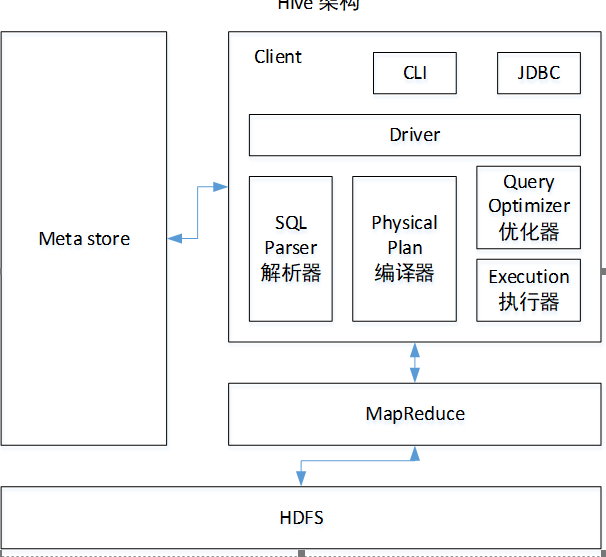
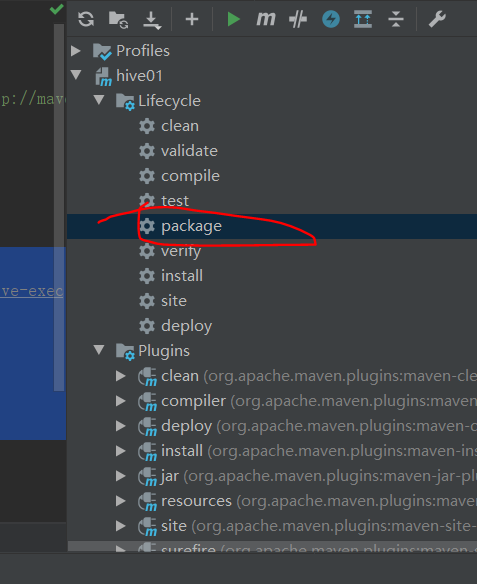

# `Hive

## 1. Hive入门

> - `Hive`是由`Facebook`开源用于解决海量结构化日志的数据统计；
> - `Hive`是基于`Hadoop`的数据仓库工具，可以将结构化的数据映射为一张表，并提供SQL查询功能；
> - `Hive`处理的数据存储在`HDFS`中；
> - `Hive`分析数据底层的实现是`MapReduce`；
> - `Hive`生成的执行程序最终会运行在`Yarn`中；
>

### 1.1 Hive优缺点

#### 1.1.1 Hive优势

> - 操作接口采用类SQL语法，提供快速开发的能力；
> - 避免了去写MapReduce，减少开发人员学习成本；
> - Hive的执行延迟比较高，因此Hive常用于数据分析，对实时性要求不高的场合；
> - Hive支持用户自定义函数，用户可以根据自己的需求来实现自己的函数。

#### 1.1.2 Hive缺点

> - Hive的HQL表达能力有限
>   - 迭代式算法无法表达
>   - 数据挖掘方面不擅长
>
> - Hive的效率比较低
>   - Hive自动生成的MapReduce作业，通常情况下不够智能化
>   - Hive调优比较困难，粒度较粗

### 1.2 Hive架构原理

> 
>
> - 用户接口：`Client`
>
>   - `CLI(hive shell)`、`JDBC/ODBC`、`WEBUI(浏览器访问hive)`；
>
> - 元数据：`Metastore`
>
>   - 元数据包括：表名、表所述的数据库(默认数据库是default)，标的拥有者、列/分区字段、标的类型(是否是外部表)、表的数据所在目录等；
>   - 默认存储在自带的derby数据库中，推荐使用MySQL存储Metastore；
>
> - Hadoop
>
>   - 使用HDFS进行存储，使用MapReduce进行计算；
>
> - 驱动器：Driver
>
>   - 解析器(SQL Parser)：将SQL字符串进行转换成抽象语法树AST，这一步一般都用第三方工具库完成，比如antlr；对AST进行语法分析，比如表是否存在，字段是否存在，SQL语义是否错误；
>   - 编译器(Physical Plan)：将AST编译生成逻辑执行计划；
>   - 优化器(Query Optimizer)：对逻辑执行计划进行优化；
>   - 执行器(Execution)：把逻辑执行计划转换成可以运行的物理计划，也就是转换为MR/Spark；
>
>   

> 流程总结：
>
> ​	**Hive通过给用户提供一系列交互接口，接收到用户的指令(SQL)，使用自己的Driver，结合元数据(MetaStore)，将这些执行翻译成MapReduce，提交到Hadoop中执行，最后，将执行返回的结果输出到用户交互接口中**；

### 1.3 Hive与数据库

> ​	Hive采用了类似SQL的查询语言`HQL(Hive Query Language)`，因此很容易将Hive理解为数据库；从结构上来看，Hive和数据库除了拥有类似的查询语言，再无类似之处；

#### 1.3.1 查询语言

> ​	由于SQL被广泛应用于数据仓库中，因此针对Hive的特性设计了类SQL的查询语言HQL；

#### 1.3.2 数据存储位置

> ​	Hive是建立在Hadoop之上的，所以Hive所有的数据都是存储在HDFS中进行保存的；数据库则可以将数据保存在块设备或者本地文件系统中；

####  1.3.3 数据更新

> ​	Hive是针对 **数据仓库** 应用设计的，而 **数据仓库的内容是读多写少**；因此，在 **Hive中不建议对数据的改写，所有的数据都是在加载的时候确定好的；**而数据库中的数据通常是需要经常进行修改的，因此可以使用 INSERT INTO …  VALUES 添加数据，使用 UPDATE … SET修改数据。

#### 1.3.4 索引

> ​	Hive在加载数据的过程中不会对数据进行任何处理，甚至不会对数据进行扫描；因此没有对数据的某些key建立索引；Hive访问数据库中特定值，需要暴力扫描整张表；但是Hive是基于MapReduce的，所以能够并行扫描所有表，实现高效特性；

#### 1.3.5 执行

> ​	Hive中大多数查询的执行是通过Hadoop提供的MapReduce来实现的；

#### 1.3.6 执行延迟

> ​	Hive 在查询数据的时候，由于没有索引，需要扫描整个表，因此延迟较高。另外一个导致 Hive 执行延迟高的因素是 MapReduce框架。由于MapReduce 本身具有较高的延迟，因此在利用MapReduce 执行Hive查询时，也会有较高的延迟。

#### 1.3.7 可扩展性

> ​	Hive与Hadoop的扩展性是一致的，扩展性高；

#### 1.3.8 数据规模

> 数据规模是基于MapReduce做的，所以能够实现大规模数据的支持；

## 2.Hive安装

### 2.1 文档地址

> 1．Hive官网地址
>
> http://hive.apache.org/
>
> 2．文档查看地址
>
> https://cwiki.apache.org/confluence/display/Hive/GettingStarted
>
> 3．下载地址
>
> http://archive.apache.org/dist/hive/
>
> 4．github地址
>
> https://github.com/apache/hive

### 2.2 Hive 安装部署

#### 2.2.1 单机版Hive

> - 一步：上传apache-hive-1.2.1-bin.tar.gz文件到linux服务器；
>
> - 二步：对该文件进行解压； 
>
> - 第三步：重命名apache-hive-1.2.1-bin文件夹为hive；
>
> - 第四步：配置`hive-env.sh`文件：
>
>   - 配置`Hadoop_home`路径地址：
>
>   ```
>   export HADOOP_HOME=/opt/software/hadoop
>   ```
>
>   - 配置`Hive_Conf_Dir`路径：
>
>   ```
>   export HIVE_CONF_DIR=/opt/module/hive/conf
>   ```
>
> - 启动Hive：进入bin目录，执行
>
>   ```
>   ./hive
>   ```

#### 2.2.2 使用方式

> - 创建表：
>
> ```sql
> create table student(id int, name string);
> ```
>
> - 插入一条数据：
>
> ```sql
> insert into student values(1,'zsl');
> ```
>
> - 加载文件中的数据：
>
> ```hql
> load data local inpath '/home/zsl/data.txt' into table student;
> ```
>
> - 查询一条数据：
>
> ```sql
> select * from student where id = 1;
> ```
>
> - 前往文件系统HDFS中查看数据；
>
>   - 在 /tmp目录中能够查看部分日志信息；如果进入该目录里权限报错，则：
>
>   ```shell
>   hdfs dfs -chmod 777 /tmp
>   ```
>
>   - 在 /user/hive/warehouse/student 能够看见存储的数据信息；

> 将外部文件加载到hive表中；
>
> - 创建表，指定分割符；
>
> ```sql
> create table stu(id int, name string) row format delimited fields terminated by '\t';
> ```
>
> - 加载本地文件数据到表中；
>
> ```sql
> load data local inpath '/home/zsl/data.txt' into table stu;
> ```
>
> 

> - 显示数据库：
>
> ```
> show databases;
> ```
>
> - 使用default数据库；
>
> ```
> use default;
> ```
>
> - 删除表；
>
> ```
> drop table student;
> ```

#### 2.2.3 集群版Hive

> - 必须启动hdfs和yarn
>   - sbin/start-dfs.sh
>
>   - sbin/start-yarn.sh
>
> - 在HDFS上创建/tmp和/user/hive/warehouse两个目录并修改他们的同组权限可写
>
>   - bin/hadoop fs -mkdir /tmp
>
>   - bin/hadoop fs -mkdir -p /user/hive/warehouse
>
>   - bin/hadoop fs -chmod g+w /tmp
>   - bin/hadoop fs -chmod g+w /user/hive/warehouse

#### 2.2.4 Hive连接MySQL

> ​	Hive默认数据库为derby数据库，效率低，单连接模式，所以需要切换为MySQL数据库；

> - 第一步：将`mysql-connector-java-5.1.44-bin.jar`文件拷贝到 hive/lib 文件夹中；
> - 第二步：在 hive/conf 目录添加配置文件`hive-site.xml`：
>
> ```xml
> <?xml version="1.0"?>
> <?xml-stylesheet type="text/xsl" href="configuration.xsl"?>
> <configuration>
> 	<property>
> 	  <name>javax.jdo.option.ConnectionURL</name>
> 	  <value>jdbc:mysql://hadoop102:3306/metastore?createDatabaseIfNotExist=true</value>
> 	  <description>JDBC connect string for a JDBC metastore</description>
> 	</property>
> 
> 	<property>
> 	  <name>javax.jdo.option.ConnectionDriverName</name>
> 	  <value>com.mysql.jdbc.Driver</value>
> 	  <description>Driver class name for a JDBC metastore</description>
> 	</property>
> 
> 	<property>
> 	  <name>javax.jdo.option.ConnectionUserName</name>
> 	  <value>root</value>
> 	  <description>username to use against metastore database</description>
> 	</property>
> 
> 	<property>
> 	  <name>javax.jdo.option.ConnectionPassword</name>
> 	  <value>123456</value>
> 	  <description>password to use against metastore database</description>
> 	</property>
> </configuration>
> 
> ```
>
> - 第三步：启动hive即可；
> - 如果启动失败，则重启虚拟机，并重启hadoop集群，即可；

## 3. HiveJDBC连接

### 3.1 连接方式

> - 第一步：打开一个窗口，启动hiveserver2；
>
> ```
> bin/hiveserver2
> ```
>
> - 第二步：打开另外一个窗口，启动beeline；
>
> ```
> bin/beeline
> ```
>
> - 第三步：在beeline窗口中连接hive；
>
> ```
> !connect jdbc:hive2://hadoop102:10000
> ```
>
> - 第四步：输入用户名，默认用户名是 创建hive的用户名；
>
> - 第五步：输入密码，默认是为空，直接回车即可；
>
> ```
> beeline> !connect jdbc:hive2://hadoop102:10000（回车）
> Connecting to jdbc:hive2://hadoop102:10000
> Enter username for jdbc:hive2://hadoop102:10000: atguigu（回车）
> Enter password for jdbc:hive2://hadoop102:10000: （直接回车）
> Connected to: Apache Hive (version 1.2.1)
> Driver: Hive JDBC (version 1.2.1)
> Transaction isolation: TRANSACTION_REPEATABLE_READ
> 0: jdbc:hive2://hadoop102:10000> show databases;
> +----------------+--+
> | database_name  |
> +----------------+--+
> | default        |
> | hive_db2       |
> +----------------+--+
> ```

### 3.2 Hive交互命令

> - `bin/hive --help`  查看hive后面参数；
>
>   - `-e`：在命令行里面执行SQL，不会进入交互模式；
>
>   ```
>   ./hive -e "select * from stu;"
>   ```
>
>   - `-f`：将SQL写在一个文件中，可以运行文件中的SQL，不会进入交互模式；
>
>   ```
>   ./hive -f /home/hive1.hql
>   ```

### 3.3 查看hive数据库与表头

> ​	修改`hive-site.xml`文件，添加如下内容：
>
> ```
> <property>
> 	<name>hive.cli.print.header</name>
> 	<value>true</value>
> </property>
> 
> <property>
> 	<name>hive.cli.print.current.db</name>
> 	<value>true</value>
> </property>
> 
> ```
>
> 将会显示数据库名，以及每次查询的表头；

### 3.4 Hive运行日志

> - Hive默认运行日志存放在`/tmp/zsl/hive.log`文件夹中；
> - 修改hive默认log日志存放路径：将conf/hive-log4j.properties.template文件从命名为conf/hive-log4j.properties文件，并修改：
>
> ```
> hive.log.dir=/opt/software/hive/logs
> ```

### 3.5 Hive参数配置

> - 默认配置文件：`hive-default.xml`文件；
> - 用户自定义配置文件：`hive-site.xml`文件，可用于覆盖默认配置文件属性；
> - 命令行参数方式设置属性：启动Hive时，可以在命令行添加`-hiveconf
>   param=value`来设定参数，例如：
>
> ```
> bin/hive -hiveconf mapred.reduce.tasks=10;
> ```
>
> - 在hive交互界面，查询hive运行时参数：`set mapred.reduce.tasks`；
>
> ```
> hive (default)> set mapred.reduce.tasks;
> ```
>
> - 在Hive交互界面，设置hive运行时参数：
>
> ```
> hive (default)> set mapred.reduce.tasks=100;
> ```

### 3.6 Hive数据类型

#### 3.6.1 基本数据类型

| Hive数据类型 | java数据类型 | 长度                     | 实例       |
| ------------ | ------------ | ------------------------ | ---------- |
| TINYINT      | byte         | 1byte有符号整数          | 20         |
| SMALINT      | short        | 2byte有符号整数          | 20         |
| INT          | int          | 4byte有符号整数          | 20         |
| BIGINT       | long         | 8byte有符号整数          | 20         |
| BOOLEAN      | boolean      | 布尔类型，true/false     | TRUE/FALSE |
| FLOAT        | float        | 单精度浮点数             | 3.14159    |
| DOUBLE       | double       | 双精度浮点数             | 3.14159    |
| STRING       | string       | 字符系列，可使用单双引号 |            |
| TIMESTAMP    |              | 时间类型                 |            |
| BINARY       |              | 字节类型                 |            |

> ​	Hive中的string类型，也就是数据库中的varchar类型，但是无法设置字符串长度，理论最多存放2GB字符数；

#### 3.6.2 集合数据类型

| 数据类型 | 描述                                                         | 语法示例 |
| -------- | ------------------------------------------------------------ | -------- |
| STRUCT   | 类似于c语言的struct都可以通过“点”符号访问元素内容。例如，如果某个列的数据类型是STRUCT{first STRING, last STRING},那么第1个元素可以通过字段.first来引用。 | struct() |
| MAP      | MAP是一组键-值对元组集合，使用数组表示法可以访问数据。例如，如果某个列的数据类型是MAP，其中键->值对是’first’->’John’和’last’->’Doe’，那么可以通过字段名[‘last’]获取最后一个元素 | map()    |
| ARRAY    | 数组是一组具有相同类型和名称的变量的集合。这些变量称为数组的元素，每个数组元素都有一个编号，编号从零开始。例如，数组值为[‘John’, ‘Doe’]，那么第2个元素可以通过数组名[1]进行引用。 | Array()  |

> ​	Hive存在三种复杂数据类型Array、Map和Struct。Array和Map与java中的Array和Map类似，而Struct与c语言中的Struct类似，封装了一个命名字的字段集合，复杂数据类型允许任意层次的嵌套；

使用实例：创建数据库表：

```hql
create table test(
	name string,
	friends array<string>,
	children map<string, int>,
	address struct<street:string, city:string>
)
row format delimited fields terminated by ','
collection items terminated by '_'
map keys terminated by ':'
lines terminated by '\n';

```

将数据加载到该表中，数据样例为：

```
songsong,bingbing_lili,xiao song:18_xiaoxiao song:19,hui long guan_beijing
yangyang,caicai_susu,xiao yang:18_xiaoxiao yang:19,chao yang_beijing
```

#### 3.6.3 数据类型转化

> ​	Hive的原子数据类型是可以进行隐式转换的，类似于Java的类型转换，转换规则：
>
> - 任何整数类型都可以隐式地转换为一个范围更广的类型，如将INT转换为BIGINT；
> - 所有整数类型、FLOAT和STRING类型都可以隐式地转换为DOUBLE；
> - TINYINT、SMALLINT、INT都可以转换为FLOAT；
> - BOOLEAN类型不可以转换为任何其他类型数据；

#### 3.6.4 CAST转换函数

> 表达式：`CAST(字段 AS 数据类型)`
>
> 实例：CAST('1' AS INT)    结果为  1；
>
> 错误处理：CAST('X' AS INT)    结果为  null；

##  4. DDL数据定义

### 4.1 创建数据库

> - 创建一个数据库，数据库在HDFS上的默认存储路径是`/user/hive/warehouse/*.db` 的数据库文件系统；
>
> ```
> create database db_hive;
> ```
>
> - 避免要创建的数据库已经存在，使用`if not exists`判断；
>
> ```
> create database if not exists db_hive;
> ```
>
> - 创建一个数据库，指定数据库在HDFS上存放的位置；
>
> ```
> create database db_hive2 location '/db_hive2.db'
> ```

### 4.2 查询数据库

> - 显示所有数据库列表；
>
> ```
> show databases;
> ```
>
> - 过滤显示查询的数据库列表；
>
> ```
> show databases like 'db_hive*';
> ```
>
> - 显示数据库信息；
>
> ```
> desc database db_hive;
> ```
>
> - 显示数据库详情信息；
>
> ```
> desc database extended db_hive;
> ```
>
> - 使用指定数据库；
>
> ```
> use db_hive
> ```

### 4.3 修改数据库

> ​	用户可以使用ALTER DATABASE命令为某个数据库的DBPROPERTIES设置键-值对属性值，来描述这个数据库的属性信息。**数据库的其他元数据信息都是不可更改的，包括数据库名和数据库所在的目录位置**。
>
> ```
> alter database db_hive set dbproperties('createtime'='20170830');
> ```

### 4.4 删除数据库

> - 删除空数据库；
>
> ```
> drop database db_hive2;
> ```
>
> - 如果删除的数据库不存在，可以使用if exists判断；
>
> ```
> drop database if exists db_hive2; 
> ```
>
> - 如果数据库不为空，可使用cascade强制删除；
>
> ```
> drop database db_hive cascade;
> ```

### 4.5 数据库表

#### 4.5.1 创建表

> ```
> CREATE [EXTERNAL] TABLE [IF NOT EXISTS] table_name 
> [(col_name data_type [COMMENT col_comment], ...)] 
> [COMMENT table_comment] 
> [PARTITIONED BY (col_name data_type [COMMENT col_comment], ...)] 
> [CLUSTERED BY (col_name, col_name, ...) 
> [SORTED BY (col_name [ASC|DESC], ...)] INTO num_buckets BUCKETS] 
> [ROW FORMAT row_format] 
> [STORED AS file_format] 
> [LOCATION hdfs_path]
> ```
>
> - CREATE TABLE 创建一个指定名字的表。如果相同名字的表已经存在，则抛出异常；用户可以用 IF NOT EXISTS 选项来忽略这个异常。
>
> - EXTERNAL关键字可以让用户创建一个外部表，在建表的同时指定一个指向实际数据的路径（LOCATION），Hive创建内部表时，会将数据移动到数据仓库指向的路径；若创建外部表，仅记录数据所在的路径，不对数据的位置做任何改变。在删除表的时候，内部表的元数据和数据会被一起删除，而外部表只删除元数据，不删除数据。
>
> - COMMENT：为表和列添加注释。
>
> - PARTITIONED BY创建分区表;
>
> - CLUSTERED BY创建分桶表;
>
> - SORTED BY不常用;
>
> - ROW FORMAT 
>
>   DELIMITED [FIELDS TERMINATED BY char] [COLLECTION ITEMS TERMINATED BY char]
>
>   ​        [MAP KEYS TERMINATED BY char] [LINES TERMINATED BY char] 
>
>      | SERDE serde_name [WITH SERDEPROPERTIES (property_name=property_value, property_name=property_value, ...)]
>
>   用户在建表的时候可以自定义SerDe或者使用自带的SerDe。如果没有指定ROW FORMAT 或者ROW FORMAT DELIMITED，将会使用自带的SerDe。在建表的时候，用户还需要为表指定列，用户在指定表的列的同时也会指定自定义的SerDe，Hive通过SerDe确定表的具体的列的数据。
>
> - STORED AS指定存储文件类型;
>
>   - 常用的存储文件类型：SEQUENCEFILE（二进制序列文件）、TEXTFILE（文本）、RCFILE（列式存储格式文件）
>   - 如果文件数据是纯文本，可以使用STORED AS TEXTFILE。如果数据需要压缩，使用 STORED AS SEQUENCEFILE。
>
> - LOCATION ：指定表在HDFS上的存储位置。
>
> - LIKE允许用户复制现有的表结构，但是不复制数据。

#### 4.5.2 管理表

> ​	默认创建的表都是所谓的管理表，也被称为 **内部表**；该表是被Hive控制着生命周期的；hive默认情况下是将这些表的数据存储在`/user/hive/warehouse/`路径下；

> - 创建表：
>
> ```sql
> create table if not exists student2(
> id int, name string
> )
> ```
>
> - 根据查询结果创建表；
>
> ```
> create table if not exists student3 as select id, name from student;
> ```
>
> - 根据已经存在的表结构创建表；
>
> ```
> create table if not exists student4 like student;
> ```
>
> - 查询表的类型；
>
> ```
> desc formatted student2;
> ```

#### 4.5.3 外部表

> ​	因为表是外部表，所以Hive并非认为其完全拥有这份数据。**删除该表并不会删除掉这份数据，不过描述表的元数据信息会被删除掉。**

> **管理表和外部表的使用场景**：每天将收集到的网站日志定期流入HDFS文本文件。在外部表（原始日志表）的基础上做大量的统计分析，用到的中间表、结果表使用内部表存储，数据通过SELECT+INSERT进入内部表。

> 创建外部表：
>
> ```
> create external table if not exists default.dept(
> deptno int,
> dname string,
> loc int
> )
> row format delimited fields terminated by '\t';
> 
> ```
>
> ```
> create external table if not exists default.emp(
> empno int,
> ename string,
> job string,
> mgr int,
> hiredate string, 
> sal double, 
> comm double,
> deptno int)
> row format delimited fields terminated by '\t';
> 
> ```

####  4.5.4 外部表与内部表切换

> - 外部表：`desc formatted dept;`
>
> ```
> Table Type:             EXTERNAL_TABLE
> ```
>
> - 内部表：`desc formatted test;`
>
> ```
> Table Type:             MANAGED_TABLE  
> ```
>
> - 外部表改换为内部表；
>
> ```
> alter table student2 set tblproperties('EXTERNAL'='FALSE');
> ```
>
> - 内部表改换为外部表；
>
> ```
> alter table student2 set tblproperties('EXTERNAL'='TRUE');
> ```

### 4.6 分区表

> ​	分区表实际上就是对饮一个HDFS文件系统上的独立的文件夹，该文件夹下是该分区所有的数据文件；Hive中的分区就是分目录；将一个大的数据集根据业务需要分割成小的数据集，在查询时通过WHERE字句中的表达式选择查询所需要的指定的分区，提高查询效率；

#### 4.6.1 创建分区表

> - 创建分区表；
>
> ```
> create table dept_partition(
> deptno int, dname string, loc string
> )
> partitioned by (month string)
> row format delimited fields terminated by '\t';
> ```
>
> - 根据分区加载数据；
>
> ```
> load data local inpath '/opt/module/datas/dept.txt' into table default.dept_partition partition(month='201709');
> ```

#### 4.6.2 查询分区表

> - 查询所有分区数据；
>
> ```
> select * from dedpt_partition;
> ```
>
> - 查询单个分区；
>
> ```
> select * from dept_partition where month='202003';
> ```
>
> - 查询多个分区；
>
> ```
> select * from dept_partition where month='202003' 
> union 
> select * from dept_partition where month='202004;
> ```
>
> - 查看分区表中存在多个分区；
>
> ```
> show partitions dept_partition;
> ```
>
> - 查看分区表结构；
>
> ```
> desc formatted dept_partition;
> ```

#### 4.6.3 增加分区

> - 创建单个分区；
>
> ```
> alter table dept_partition add partition(month='201706') ;
> ```
>
> - 同时创建多个分区；
>
> ```
> alter table dept_partition add partition(month='201705') partition(month='201704');
> ```

#### 4.6.4 删除分区

> - 删除单个分区；
>
> ```
> alter table dept_partition drop partition (month='201704');
> ```
>
> - 同时删除多个分区；
>
> ```
> alter table dept_partition drop partition (month='201705'), partition (month='201706');
> ```

#### 4.6.5 分区表注意事项

> - 创建二级分区表；
>
> ```
> create table dept_partition2(
>                deptno int, dname string, loc string
>                )
>                partitioned by (month string, day string)
>                row format delimited fields terminated by '\t';
> ```
>
> - 二级分区数据加载：
>
> ```
> load data local inpath '/opt/module/datas/dept.txt' into table
>  default.dept_partition2 partition(month='201709', day='13');
> ```
>
> - 查询二级分区中的数据；
>
> ```
> select * from dept_partition2 where month='201709' and day='13';
> ```

#### 4.6.6 加载数据到分区中

> - 方式一：上传数据后修复；
>
>   - 创建文件夹：`dfs -mkdir -p
>      /user/hive/warehouse/dept_partition2/month=201709/day=12;`
>   - 将数据加载进入到该目录中：`dfs -put /opt/module/datas/dept.txt  /user/hive/warehouse/dept_partition2/month=201709/day=12;`
>
>   - 执行数据修复命令：`msck repair table dept_partition2;`
>
>   - 查询数据：`select * from dept_partition2 where month='201709'   and day='12';`
>
> - 方式二：上传数据后添加分区；
>
>   - 创建文件夹：`dfs -mkdir -p  /user/hive/warehouse/dept_partition2/month=201709/day=11;`
>   - 执行添加分区：`alter table dept_partition2 add partition(month='201709',day='11');`
>   - 查询数据：`select * from dept_partition2 where month='201709' and day='11';`
>
> - 方式三：创建文件夹之后load数据到分区中；
>   - 创建文件夹：`dfs -mkdir -p /user/hive/warehouse/dept_partition2/month=201709/day=10;`
>   - 上传数据：`load data local inpath '/opt/module/datas/dept.txt' into table dept_partition2 partition(month='201709',day='10');`
>   - 查询数据：`select * from dept_partition2 where month='201709' and day='11';`

### 4.7 修改表

#### 4.7.1 重命名表

> `ALTER TABLE table_name RENAME TO new_table_name;`

#### 4.7.2 增加/修改/替换列信息

> - 更新列：
>
> ```
> ALTER TABLE table_name CHANGE [COLUMN] col_old_name col_new_name column_type [COMMENT col_comment] [FIRST|AFTER column_name]
> ```
>
> - 增加列；
>
> ```
> ALTER TABLE table_name ADD COLUMNS (col_name data_type [COMMENT col_comment], ...) 
> ```
>
> - 替换列；
>
> ```
> ALTER TABLE table_name REPLACE COLUMNS (col_name data_type [COMMENT col_comment], ...) 
> ```

> 实例：
>
> （1）查询表结构
>
> hive> desc dept_partition;
>
> （2）添加列
>
> hive (default)> alter table dept_partition add columns(deptdesc string);
>
> （3）查询表结构
>
> hive> desc dept_partition;
>
> （4）更新列
>
> hive (default)> alter table dept_partition change column deptdesc desc int;
>
> （5）查询表结构
>
> hive> desc dept_partition;
>
> （6）替换列
>
> hive (default)> alter table dept_partition replace columns(deptno string, dname
>
>  string, loc string);
>
> （7）查询表结构
>
> hive> desc dept_partition;

### 4.8 删除表

> drop table dept_partition;

## 5. DML数据操作

### 5.1 数据导入

#### 5.1.1 向表中装载数据(load)

> 语法：`load data [local] inpath '本地路径' overwrite | into table 表名 [partition(key1=v1,...)]`
>
> - load data:表示加载数据
>
> - local:表示从本地加载数据到hive表；否则从HDFS加载数据到hive表
>
> - inpath:表示加载数据的路径
>
> - overwrite:表示覆盖表中已有数据，否则表示追加
>
> - into table:表示加载到哪张表
>
> - partition:表示上传到指定分区

> 实例一：本地加载文件到表中；
>
> ```
> //创建表：
> create table student(id string, name string) row format delimited fields terminated by '\t';
> ```
>
> ```
> //加载本地中的文件
> load data local inpath '/home/zsl/data.txt' into table student ;
> ```
>
> 实例二：将hdfs中的文件加载到表中；
>
> ```
> //上传文件到hdfs
> hdfs dfs -put /home/zsl/data.txt /user
> ```
>
> ```
> //加载hdfs中的文件
> load data inpath '/user/data.txt' into table student ; 
> ```

#### 5.1.2查询并创建表

> ​	将查询的结果写入一张新的表中；
>
> ```
> create table if not exists student3 as select id, name from student;
> ```

#### 5.1.3 指定Location加载数据路径

>  create table if not exists student5( id int,  name string) row format delimited fields terminated by '\t'  location '/user/hive/warehouse/student5';

#### 5.1.4 Import数据到指定Hive表中

> import table student partition(month='202003') from '/user/hive/warehouse/export/student'；

### 5.2 数据导入

#### 5.2.1 Insert导出

> - 将查询的结果导出到本地；
>
> ```
> insert overwrite local directory '/opt/module/datas/export/student'
>             select * from student;
> ```
>
> - 将查询的结果格式化导出到本地；
>
> ```
> insert overwrite local directory '/opt/module/datas/export/student1'
>  ROW FORMAT DELIMITED FIELDS TERMINATED BY '\t' select * from student;
> ```
>
> - 将查询的结果导出到HDFS中；
>
> ```
> insert overwrite directory '/user/atguigu/student2' ROW FORMAT DELIMITED FIELDS TERMINATED BY '\t'  select * from student;
> ```

#### 5.2.2 Hadoop命令导出

> ```
> dfs -get /user/hive/warehouse/student/month=201709/000000_0
> /opt/module/datas/export/student3.txt;
> ```

#### 5.2.3 Export导出到HDFS中

> ```
> export table default.student to '/user/hive/warehouse/export/student';
> ```

#### 5.2.4 Hive Shell导出

> ```
> bin/hive -e 'select * from default.student;' > /opt/module/datas/export/student4.txt;
> ```

### 5.3 清空表

> `truncate table student;`

## 6. Hive查询

### 6.1 查询模板

```
[WITH CommonTableExpression (, CommonTableExpression)*]    (Note: Only available starting with Hive 0.13.0)
SELECT [ALL | DISTINCT] select_expr, select_expr, ...
  FROM table_reference
  [WHERE where_condition]
  [GROUP BY col_list]
  [ORDER BY col_list]
  [CLUSTER BY col_list
    | [DISTRIBUTE BY col_list] [SORT BY col_list]
  ]
 [LIMIT [offset,] rows]
```

### 6.2 基本查询

#### 6.2.1 基本查询示例

> - 全表查询：
>
> ```sql
> select * from emp;
> ```
>
> - 特定列查询；
>
> ```sql
> select emp_id, emp_name from emp;
> ```
>
> Hive查询特征：
>
> - SQL语言**不区分大小写**；
> - SQL可以卸载一行或者多行；
> - 关键字不能被缩写也不能被分行；
> - 各子句一般要分行写；
> - 使用缩进提高语句可读性；

#### 6.2.2 列别名定义

> Hive列别名特征：
>
> - 重命名一个列；
> - 便于计算；
> - **紧跟列名，也可以在列名和别名之间加入关键字 'AS'；**
> - 示例：
>
> ```sql
> select ename AS name, deptno no from emp;
> ```

#### 6.2.3 算术运算符

| 运算符 | 描述           |
| ------ | -------------- |
| A+B    | A与B相加       |
| A-B    | A减去B         |
| A*B    | A与B相乘       |
| A/B    | A除以B         |
| A%B    | A对B取余       |
| A&B    | A与B按位取与   |
| A\|B   | A与B按位取或   |
| A^B    | A与B按位取异或 |
| -A     | A按位取反      |

> 实战案例：
>
> ```
> select sal +1 from emp;
> ```

#### 6.2.4 Hive常用函数

> - 求总行数(`count`)
>
> ```
> select count(*) cnt from emp;
> ```
>
> - 求最大值(`max`)
>
> ```
> select max(sal) max_sal from emp;
> ```
>
> - 求最小值(`min`)
>
> ```
> select min(sal) min_sal from emp;
> ```
>
> - 求和(`sum`)
>
> ```
> select sum(sal) sum_sal from emp;
> ```
>
> - 求平均值(`svg`)
>
> ```
> select avg(sal) avg_sal from emp;
> ```

#### 6.2.5 Limit语句

> - 典型的查询会返回多行数据。LIMIT子句用于限制返回的行数。
>
> ```
> select * from emp limit 5;
> ```

### 6.3 Where语句

> - 使用`WHERE`语句，将不满足条件的行过滤掉；
> - `WHERE`子句紧随`FROM`子句之后；

#### 6.3.1 WHERE中比较运算符

| 操作符                  | 支持的数据类型 | 描述                                                         |
| ----------------------- | -------------- | ------------------------------------------------------------ |
| A=B                     | 基本数据类型   | 如果A等于B则返回TRUE，反之返回FALSE                          |
| A<=>B                   | 基本数据类型   | 如果A和B都为NULL，则返回TRUE，其他的和等号（=）操作符的结果一致，如果任一为NULL则结果为NULL |
| A<>B, A!=B              | 基本数据类型   | A或者B为NULL则返回NULL；如果A不等于B，则返回TRUE，反之返回FALSE |
| A<B                     | 基本数据类型   | A或者B为NULL，则返回NULL；如果A小于B，则返回TRUE，反之返回FALSE |
| A<=B                    | 基本数据类型   | A或者B为NULL，则返回NULL；如果A小于等于B，则返回TRUE，反之返回FALSE |
| A>B                     | 基本数据类型   | A或者B为NULL，则返回NULL；如果A大于B，则返回TRUE，反之返回FALSE |
| A>=B                    | 基本数据类型   | A或者B为NULL，则返回NULL；如果A大于等于B，则返回TRUE，反之返回FALSE |
| A [NOT] BETWEEN B AND C | 基本数据类型   | 如果A，B或者C任一为NULL，则结果为NULL。如果A的值大于等于B而且小于或等于C，则结果为TRUE，反之为FALSE。如果使用NOT关键字则可达到相反的效果。 |
| A IS NULL               | 所有数据类型   | 如果A等于NULL，则返回TRUE，反之返回FALSE                     |
| A IS NOT NULL           | 所有数据类型   | 如果A不等于NULL，则返回TRUE，反之返回FALSE                   |
| IN(数值1, 数值2)        | 所有数据类型   | 使用 IN运算显示列表中的值                                    |
| A [NOT] LIKE B          | STRING 类型    | B是一个SQL下的简单正则表达式，如果A与其匹配的话，则返回TRUE；反之返回FALSE。B的表达式说明如下：‘x%’表示A必须以字母‘x’开头，‘%x’表示A必须以字母’x’结尾，而‘%x%’表示A包含有字母’x’,可以位于开头，结尾或者字符串中间。如果使用NOT关键字则可达到相反的效果。 |
| A RLIKE B, A REGEXP B   | STRING 类型    | B是一个正则表达式，如果A与其匹配，则返回TRUE；反之返回FALSE。匹配使用的是JDK中的正则表达式接口实现的，因为正则也依据其中的规则。例如，正则表达式必须和整个字符串A相匹配，而不是只需与其字符串匹配。 |

#### 6.3.2 WHERE中的Like与RLike

> - 使用`LIKE`运算选择类似的值；
> - 选择条件可以包含字符或者数字：
>   - `%`：代表零个或者多个字符；
>   - `_`：代表一个字符；
> - `RLIKE`子句是Hive中这个功能的一个扩展，可以通过Java中的正则表达式实现匹配模式；
> - 实战案例：
>
> ```
> （1）查找以2开头薪水的员工信息
> hive (default)> select * from emp where sal LIKE '2%';
> （2）查找第二个数值为2的薪水的员工信息
> hive (default)> select * from emp where sal LIKE '_2%';
> （3）查找薪水中含有2的员工信息
> hive (default)> select * from emp where sal RLIKE '[2]';
> ```

#### 6.3.3 WHERE逻辑运算符

| 操作符 | 含义   |
| ------ | ------ |
| AND    | 逻辑与 |
| OR     | 逻辑或 |
| NOT    | 逻辑否 |

> 实战案例：
>
> ```
> （1）查询薪水大于1000，部门是30
> hive (default)> select * from emp where sal>1000 and deptno=30;
> （2）查询薪水大于1000，或者部门是30
> hive (default)> select * from emp where sal>1000 or deptno=30;
> （3）查询除了20部门和30部门以外的员工信息
> hive (default)> select * from emp where deptno not IN(30, 20);
> ```

### 6.4 分组

#### 6.4.1 Group by 分组

> ​	`GROUP BY`语句通常会和聚合函数一起使用，按照一个或者多个队列结果进行分组，然后对每个组执行聚合操作；
>
> 实战案例：
>
> ```
> （1）计算emp表每个部门的平均工资
> hive (default)> select t.deptno, avg(t.sal) avg_sal from emp t group by t.deptno;
> （2）计算emp每个部门中每个岗位的最高薪水
> hive (default)> select t.deptno, t.job, max(t.sal) max_sal from emp t group by t.deptno, t.job;
> ```

#### 6.4.2 Having语句

> - where针对表中的列发挥作用，查询数据；having针对查询结果中的列发挥作用，筛选数据。
>
> - where后面不能写分组函数，而having后面可以使用分组函数。
>
> - having只用于group by分组统计语句。
>
> 实战案例：
>
> ```
> //求每个部门的平均薪水大于2000的部门
> 求每个部门的平均工资
> hive (default)> select deptno, avg(sal) from emp group by deptno;
> //求每个部门的平均薪水大于2000的部门
> hive (default)> select deptno, avg(sal) avg_sal from emp group by deptno having avg_sal > 2000;
> ```

### 6.5 Join连接

#### 6.5.1 等值连接Join

> Hive支持通常的SQL JOIN语句，但是**只支持等值连接**，不支持非等值连接；
>
> 实例：
>
> ```sql
> select e.empno, e.empname,d.deptname from emp e join dept d on e.deptno = d.deptno;
> ```

#### 6.5.2 表别名

> - 使用表别名可以简化查询；
> - 使用表名前缀可以提高执行效率；

#### 6.5.3 内连接 - join

> 简介：**只有进行连接的两个表中都存在与链接条件相匹配的数据才会被保留；**
>
> ```
> select e.empno, e.ename, d.deptno from emp e join dept d on e.deptno
>  = d.deptno;
> ```

#### 6.5.4 左外连接 - left join

> 简介：**JOIN操作符左边表中符合WHERE子句的所有记录将会被返回；**
>
> ```
> select e.empno, e.ename, d.deptno from emp e left join dept d on e.deptno
>  = d.deptno;
> ```

#### 6.5.5 右外连接 - right join

> 简介：**JOIN操作符右边表中符合WHERE子句的所有记录将会被返回；**
>
> ```
> select e.empno, e.ename, d.deptno from emp e right join dept d on e.deptno
>  = d.deptno;
> ```

#### 6.5.6 满外连接 - full join

> 简介：将会返回所有表中符合WHERE语句条件的所有记录，如果任意一表的指定字段美哦与符合条件的值的话，就使用NULL进行代替；
>
> ```
>  select e.empno, e.ename, d.deptno from emp e full join dept d on e.deptno
>  = d.deptno;
> ```

#### 6.5.7 多表连接

> **连接 n个表，至少需要n-1个连接条件**。例如：连接三个表，至少需要两个连接条件。
>
> ```
> SELECT e.ename, d.deptno, l. loc_name
> FROM   emp e 
> JOIN   dept d
> ON     d.deptno = e.deptno 
> JOIN   location l
> ON     d.loc = l.loc;
> ```
>
> ​	大多数情况下，Hive会对每对JOIN连接对象启动一个MapReduce任务。本例中会首先启动一个MapReduce job对表e和表d进行连接操作，然后会再启动一个MapReduce job将第一个MapReduce job的输出和表l;进行连接操作。

#### 6.5.8 笛卡尔积

> 笛卡尔积产生的条件：
>
> - 省略连接条件；
> - 连接条件无效；
> - 所有表中的所有行相互连接；
>
> ```
> select empno,deptno from emp, dept;
> ```

### 6.6 Hive排序

#### 6.6.1 全局排序(Order by)

> **Order by：一个全局排序，相当于一个Reducer**；
>
> - `ASC(ascend)`：升序，默认值；
> - `DESC(descend)`：降序，默认值；
>
> 注意：
>
> - Order by子句写在Select语句的结尾；

#### 6.6.2 按照别名排序

> ```
> select ename, sal*2 twosal from emp order by twosal;
> ```

#### 6.6.3 多个列进行排序

> ```
> select ename, deptno, sal from emp order by deptno, sal ;
> ```

#### 6.6.4 每个MapReduce内部排序(Sort By)

> `Sort by`：每个Reducer内部进行排序，对全局结果集来说不是排序；
>
> 实现步骤：
>
> - 第一步：设置Reduce执行的个数；
>
> ```
> set napreduce.job.reduces=3;
> ```
>
> - 第二步：查看reduce执行个数是否设置成功；
>
> ```
>  set mapreduce.job.reduces;
> ```
>
> - 第三步：根据部门编号降序查看员工信息；
>
> ```
> select * from emp sort by empno desc;
> ```
>
> - 第四步：可以将查询结果导入到文件中；
>
> ```
> insert overwrite local directory '/opt/module/datas/sortby-result'
>  select * from emp sort by deptno desc;
> ```

#### 6.6.5 分区排序(Distribute by)

> - Distribute By：类似MR中partition，进行分区，结合sort by使用。
>
> - 注意，Hive要求DISTRIBUTE BY语句要写在SORT BY语句之前。
>
> - 对于distribute by进行测试，一定要分配多reduce进行处理，否则无法看到distribute by的效果。
>
> 使用案例：
>
> ```
> //第一步：设置reduce个数
> set mapreduce.job.reduces=3;
> //第二步：先按照部门编号分区，在根据员工编号排序；
> insert overwrite local directory '/opt/module/datas/distribute-result' select * from emp distribute by deptno sort by empno desc;
> ```

#### 6.6.6 Cluster by

> - 当distribute by和sorts by字段相同时，可以使用cluster by方式。
>
> - cluster by除了具有distribute by的功能外还兼具sort by的功能。但是排序只能是升序排序，不能指定排序规则为ASC或者DESC。
>
> 使用案例：
>
> ```
> //按照部门编号分区，再按照部门编号排序
> select * from emp cluster by deptno;
> ```

### 6.7 分桶及抽样查询

#### 6.7.1 分桶表数据存储

> - **分区针对的是数据的存储路径**，**分桶针对的是数据文件**；
> - 分区是将数据集分节成更加容易管理的若干部分的另一个技术；

#### 6.7.2 分桶表案例

> - 第一步：创建分桶表；
>
> ```
> create table stu_buck(id int, name string)
> clustered by(id) 
> into 4 buckets
> row format delimited fields terminated by '\t';
> 
> ```
>
> - 查看表结构，能够看到分桶数；
>
> ```
> desc formatted stu_buck;
> ```
>
> - 设置分桶表属性；
>
> ```
> set hive.enforce.bucketing=true;
> ```
>
> - 设置reduce属性；
>
> ```
> set mapreduce.job.reduces=-1;
> ```
>
> - 将数据加载到分桶表中；
>
> ```
> load data local inpath '/opt/module/datas/student.txt' into table stu;
> ```

#### 6.7.3 分桶抽样查询

> ​	对于非常大的数据集，用户需要使用的是一个具有代表性的查询结果而不是全部结果；那么就需要分桶抽样数据；
>
> ```
> select * from stu_buck tablesample(bucket 1 out of 4 on id);
> ```
>
> 注：tablesample是抽样语句，语法：TABLESAMPLE(BUCKET x OUT OF y) 。
>
> ​	y必须是table总bucket数的倍数或者因子。hive根据y的大小，决定抽样的比例。例如，table总共分了4份，当y=2时，抽取(4/2=)2个bucket的数据，当y=8时，抽取(4/8=)1/2个bucket的数据。
>
> ​	x表示从哪个bucket开始抽取，如果需要取多个分区，以后的分区号为当前分区号加上y。例如，table总bucket数为4，tablesample(bucket 1 out of 2)，表示总共抽取（4/2=）2个bucket的数据，抽取第1(x)个和第3(x+y)个bucket的数据。
>
> 注意：x的值必须小于等于y的值，否则

### 6.8 其他查询函数

#### 6.8.1 空字段赋值

> 语法：`NVL( string1, replace_with)`
>
> 简介：如果string1为NULL，则NVL函数返回replace_with的值，否则返回string1的值，如果两个参数都为NULL ，则返回NULL；
>
> 实例一：查询员工的comm，如果为null，则使用-1代替；
>
> ```
> select nvl(comm, -1) from emp;
> ```
>
> 实例二：查询员工的comm，如果为NULL，则使用mgr字段代替；
>
> ```
> select nvl(comm, mgr) from emp;
> ```

#### 6.8.2 CASE WHEN

> ```
> select 
>   dept_id,
>   sum(case sex when '男' then 1 else 0 end) male_count,
>   sum(case sex when '女' then 1 else 0 end) female_count
> from 
>   emp_sex
> group by
>   dept_id;
> 
> ```

#### 6.8.3 行转列

> - `CONCAT(string A/col, string B/col…)`：返回输入字符串连接后的结果，支持任意个输入字符串;
>
> - `CONCAT_WS(separator, str1, str2,...)`：它是一个特殊形式的 CONCAT()。第一个参数剩余参数间的分隔符。分隔符可以是与剩余参数一样的字符串。如果分隔符是 NULL，返回值也将为 NULL。这个函数会跳过分隔符参数后的任何 NULL 和空字符串。分隔符将被加到被连接的字符串之间;
>
> - `COLLECT_SET(col)`：函数只接受基本数据类型，它的主要作用是将某字段的值进行去重汇总，产生array类型字段。

> 案例分享：
>
> - 需求：把星座和血型一样的人归类到一起。结果如下：
>
> ```
> 射手座,A            大海|凤姐
> 白羊座,A            孙悟空|猪八戒
> 白羊座,B            宋宋
> ```
>
> - 创建本地constellation.txt，导入数据：`vi constellation.txt`
>
> ```
> 孙悟空    白羊座    A
> 大海      射手座    A
> 宋宋      白羊座    B
> 猪八戒    白羊座    A
> 凤姐      射手座    A
> ```
>
> - 创建hive表并导入数据
>
> ```
> create table person_info(
> name string, 
> constellation string, 
> blood_type string) 
> row format delimited fields terminated by "\t";
> 
> load data local inpath “/opt/module/datas/person_info.txt” into table person_info;
> ```
>
> - 按需求查询数据;
>
> ```
> select t1.base, concat_ws('|', collect_set(t1.name)) name from       (select name, concat(constellation, ",", blood_type) base from             person_info) t1 group by t1.base;   
> ```

#### 6.8.4 列转行

> - `EXPLODE(col)`：将hive一列中复杂的array或者map结构拆分成多行。
>
> - `LATERAL VIEW`
>   - 用法：LATERAL VIEW udtf(expression) tableAlias AS columnAlias
>
>   - 解释：用于和split, explode等UDTF一起使用，它能够将一列数据拆成多行数据，在此基础上可以对拆分后的数据进行聚合。

> 案例分享：
>
> - 需求将电影分类中的数组数据展开。结果如下：
>
> ```
> 《疑犯追踪》      悬疑
> 《疑犯追踪》      动作
> 《疑犯追踪》      科幻
> 《疑犯追踪》      剧情
> 《Lie to me》   悬疑
> 《Lie to me》   警匪
> 《Lie to me》   动作
> 《Lie to me》   心理
> 《Lie to me》   剧情
> 《战狼2》        战争
> 《战狼2》        动作
> 《战狼2》        灾难
> ```
>
> - 创建本地movie.txt，导入数据：`vi movie.txt`
>
> ```
> 《疑犯追踪》    悬疑,动作,科幻,剧情
> 《Lie to me》  悬疑,警匪,动作,心理,剧情
> 《战狼2》  战争,动作,灾难
> ```
>
> - 创建hive表并导入数据
>
> ```
> create table movie_info(       movie   string,        category   array<string>)    row format delimited fields terminated by   "\t"   collection items terminated by ",";       
>    
> load data local inpath   "/opt/module/datas/movie.txt" into table movie_info;   
> ```
>
> - 按需求查询数据
>
> ```
>  select       movie,         category_name   from          movie_info lateral view explode(category) table_tmp as category_name;   
> ```

#### 6.8.5 窗口函数

> 原理：跟当前窗口的数据集做分析；

> - `OVER()`：指定分析函数工作的数据窗口大小，这个数据窗口大小可能会随着行的变而变化；也就是使用over()函数获取对应的窗口数据集；
>
> - `CURRENT ROW`：当前行
>
> - `n PRECEDING`：往前n行数据
>
> - `n FOLLOWING`：往后n行数据
>
> - `UNBOUNDED`：起点，UNBOUNDED PRECEDING 表示从前面的起点， UNBOUNDED FOLLOWING表示到后面的终点
>
> - `LAG(col,n)`：往前第n行数据
>
> - `LEAD(col,n)`：往后第n行数据
>
> - `NTILE(n)`：把有序分区中的行分发到指定数据的组中，各个组有编号，编号从1开始，对于每一行，NTILE返回此行所属的组的编号。注意：n必须为int类型。

#### 6.8.6 Rank函数

> Rank函数，主要是作用于相同数据的一个统计计数，是否计算重复行；
>
> Rank函数，需要结合over窗口函数进行使用，无法单独使用；
>
> `RANK()`：排序相同时，总数不会变；
>
> `DENSE_RANK()`：排序相同时会重复，总数会减少；
>
> `ROW_NUMBER()`：会根据顺序计算；

> 实例：
>
> ```sql
> select name,
> subject,
> score,
> rank() over(partition by subject order by score desc) rp,
> dense_rank() over(partition by subject order by score desc) drp,
> row_number() over(partition by subject order by score desc) rmp
> from score;
> ```

## 7. Hive函数

### 7.1 系统内置函数

> - `show functions;`   查看系统自带的函数；
> - `desc function upper;` 显示自带函数的用法；
> - `desc function extended upper;` 详细显示自带的函数的用法；

### 7.2 自定义Hive函数

> - Hive自带了一部分函数，包括max/min函数等，也能够通过自定义UDF来方便扩展；
> - 当Hive提供的内置函数无法满足业务需求时，可以考虑使用自定义函数`UDF(user-defined function)`；
> - 用户自定义函数分类：
>   - `UDF(User Defined Function)`：一进一出函数；
>   - `UDAF(User Defined Aggregation Function)`：聚集函数，多进一出；
>   - `UDTF(User Defined Table Generating Function)`：一进多出；
> - 官方文档地址：
>   - https://cwiki.apache.org/confluence/display/Hive/HivePlugins

> 编程步骤：
>
> - 继承`org.apache.hadoop.hive.ql.UDF`；
> - 需要实现`evaluate`函数，`evaluate`函数支持重载；
> - 在`hive`的命令行窗口创建函数；
> - 添加jar；
> - 创建函数；
> - UDF必须要有返回类型，可以返回null，但是返回类型不能为void；

### 7.3 创建UDF函数

- 创建Maven工程；

```xml
    <dependencies>
        <!-- https://mvnrepository.com/artifact/org.apache.hive/hive-exec -->
        <dependency>
            <groupId>org.apache.hive</groupId>
            <artifactId>hive-exec</artifactId>
            <version>1.2.1</version>
        </dependency>
    </dependencies>
```

- 创建类，继承UDF类；

```java
public class Lower extends UDF {

    public int evaluate(int data) {
        return data + 10;
    }

}
```

- 将项目打包成jar；



- 将jar放在服务器/opt/software/hive/lib文件夹中；
- 进入hive/bin目录，输入命令：

```
//进入hive窗口
./hive

//将jar加入到hive中
add jar /opt/software/hive/lib/hive01.jar

//将全类名作为函数加入到hive中
create function addFive as 'com.zsl.hive.Lower'

//
select addFive(score) from student;
```


